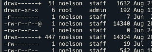
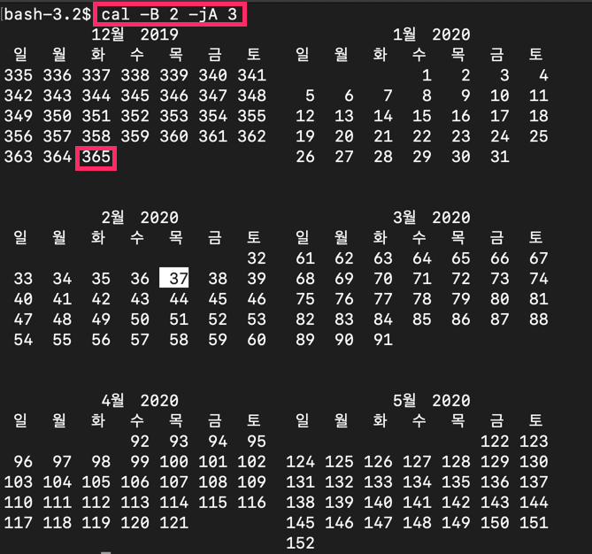
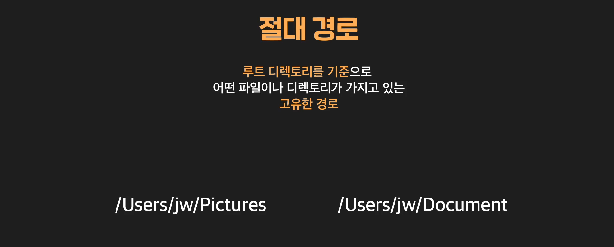
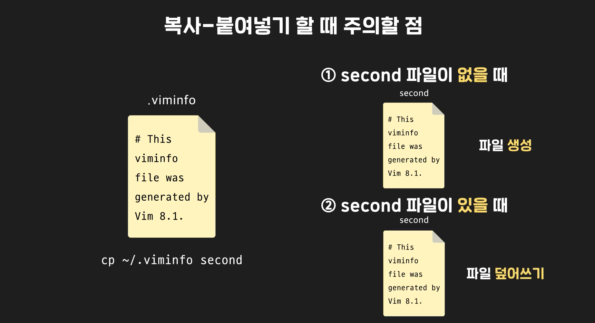
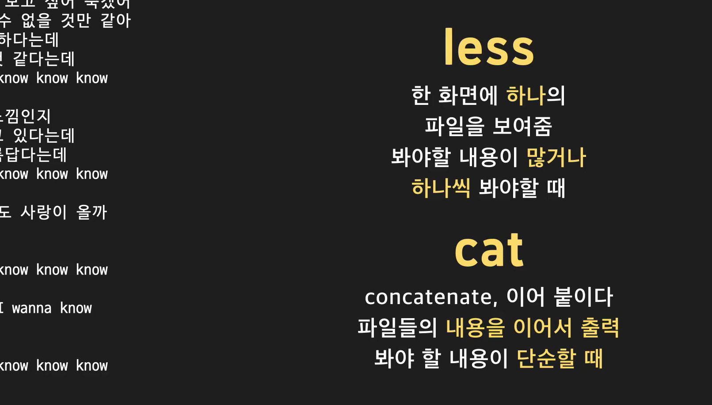

# Unix Command Line


우리는 위에서 주로 `Synopsis`를 보면 된다. 대괄호라면 optional 인 것. 꼭 필요한 argument면 대괄호가 없다. 


| command              | 기능                                            | 비고                                                         |
| -------------------- | ----------------------------------------------- | ------------------------------------------------------------ |
| clear                | 화면 깨끗하게                                   |                                                              |
| date                 | 시간 보여준다.                                  |                                                              |
| cal                  | 달력을 보여준다.                                | `cal 2030` 2030년 달력 출력<br>`cal 3 2030` 2030년 3월 <br>` cal - y`  - 올해 달력 출력(사실 이거 그냥 `cal 2022`해도 동일함)<br>`cal -j 10 2022` 10월의 각 날을 1월 1일 기준으로 몇번째 날인지 보여준다. |
| pwd                  | **P**rint the name of **w**orking **d**irectory |                                                              |
| cd                   | Change Directory                                | `cd /` : root, `cd ~` : Home으로, `cd -`:  직전 경로로<br> cd 하고 아무것도 안쓰면, home(`~`)으로 간다. |
| ls                   | list                                            | 현재 디렉토리 내부 자식디렉토리와 파일들을 보여준다.<br> `ls -a`(all - 숨겨진 파일까지 보여준다)<br/> `ls -l`(long list - 파일, 디렉토리에 대한 자세한 정보) 이 두개만 기억하면 된다. <br>ls 하고 디렉토리명 쓰면 해당 디렉토리의 자식들을 보여주며,  디렉토리 자체의 내용 보고 싶으면, `-d` 옵션이 필요하다. |
| mkdir                | `mkdir 경로/name_of_directory`                  | 디렉토리 만들기, 절대경로 상대경로 모두 가능. 심지어 여러개 한번에 만들 수도 있다. `mkdir aug june` 하면, aug와 june이 모두 생긴다. <br> |
| touch                | `touch name_of_file`                            | 파일 만들기 `touch finances.txt performance.txt`             |
| mv                   | mv 옮기고싶은파일이름 새로운경로                | 파일 위치 옮기기<br>mv .gitignore ../sample_directory<br>mv -i file ../alreadyExists 이렇게 i옵션을 줘야, 같은 이름이 있을 때 덮어쓰지 않고 사용자의 의견을 물어본다. |
| mv                   | mv 구이름 신이름                                | 파일이름 변경                                                |
| cp                   | cp 구파일 신파일                                | 복사붙여넣기. 여기서도 덮어씌워지는 것을 조심해야 한다. **-i**를 써야 한다. `cp -i 구파일 신파일` |
|                      | cp -r 디렉토리이름 신디렉토리이름               | 디렉토리 복사는 파일과 다르게 -r을 옵션을 줘야 복사가 가능하다. |
| rm                   | rm 삭제할파일                                   | 디렉토리는 삭제하려면 -r(reculsive)를 해줘야 한다. <br> -i(interactive)옵션을 쓰면 삭제하는거 하나씩 나한테 물어봐가면서 지울 수 있다. |
| cat                  | cat 파일명1 파일명2 파일명3                     | 보고 싶은 파일을 이어서 보여준다. cat은 파일 내용 간단히 보여준다. |
| less                 | less 파일명1 파일명2                            | **cat의 조금 더 깔끔한 버전**<br> - `q`로 종료할 수 있다. <br>아래화살표(아래로 한줄씩 이동), 위화살표(위로 한줄 이동), space(아래로 한페이지 이동), b(위로 한페이지 이동), 내용의 맨 마지막으로 가는 것은 대문자  `G`, 맨 처음으로 가는 것은 소문자 `g` |
| head                 | head 파일명                                     | default로 위의 10줄 출력<br>`head -n 20 파일명`, 처음 20줄 출력 |
| tail                 | tail 파일명                                     | default로 위의 10줄 출력<br/>`tail -n 30 파일명, 하단에서 30줄 출력 |
| history              |                                                 | 이전 커맨드들을 한눈에 볼 수 있음. 여기서 중요한건, 이전 커맨드들의 번호가 붙어 있는데, **!쓰고 해당 번호** 쓰면 그 명령어를 그대로 다시 사용할 수 있음. |
| ctrl + a<br>ctrl + e |                                                 | 터미널에서 커서 맨 앞으로 ctrl + a<br>커서 맨 뒤로 ctrl + e  |
|                      |                                                 |                                                              |
|                      |                                                 |                                                              |
|                      |                                                 |                                                              |


**꿀팁**

- 페이지 단위로 내려갈때,` space` or `f` 올라갈 땐, `b` 

  - G: 마지막 페이지로
  - g: 처음 페이지로

- 커서 이동할 때

  - ctrl + A, ctrl + E, 
  - option + 왼쪽 방향키, option + 오른쪽 방향키

- ctrl + C : 취소

- `clear` 

- `tab` 자동완성

- option + del = 단어 단위로 지우기

- 이름에 공백이 있는 경우, `''`, `""` , or `\  - ex) cd hello\ world` 사용

- 첫번째 컬럼 이 앞에 써있는거, `d`는 디렉토리, `-`는 파일을 의미. 나머지는 권한을 의미한다. 

  - 세번째 컬럼은 파일의 소유자, 네번째 컬럼은 소유자가 속한 그룹 
  - 다섯번째는, 파일이 몇 바이트 인지. 디렉토리의 경우 용량이 아니다. 디렉토리이면 여기에 의미를 두지 마라. 
  - 다음 컬럼들은 마지막 수정 날짜와 시간. 

  


- #### CLI환경이란?

  세상에는 수 많은 운영체제들이 있다. Window 제외한, 모든 OS는 Unix 출발. 

  

  운영체제들의 내부까지 다 알필요는 없지만, 적어도 command를 알아야 운영체제들을 동작시킬 수 있다. 

  아래 운영체제들은 모두 단 하나의 운영체제로부터 발전됬다. 때문에 기본 커맨드가 거의 동일하다. 유닉스 커맨드만 배우면 된다. 

  

  보통 운영체제에는 대략 1000개의 명령어가 있지만, 여기서 대충 2~30개만 알아도 업무에 전혀 지장이 없다. 


- #### Unix(Unix-Certified)와 유사Unix(Unix-Like)

  수 많은 운영체제들이 Unix라는 동일한 뿌리를 가지고 있음. 유닉스의 인기 덕분에, C언어까지 덩달아 인기를 얻음. 

  

  Unix가 하도 많이 변형되어 사용되니깐, 어느정도 제한을 두기 위해, Posix라는 규격을 만들기도 하였다. 

  

  그런데 당시 유닉스라는것이 벨 연구소꺼였는데 벨 연구소가 AT&T소속이다 보니, 유닉스를 사용하거나 변형할때 AT&T에 라이센스비를 내야 했음. 

  이걸 반대하는 사람들이 있었음. 공유의 문화를 옹호하던 사람들이 유닉스 코드를 하나도 사용 안하고, 유닉스와 유사한 운영체제를 만들었다. 

  

  이렇게 만들어지기 시작한 운영체제가 GNU. 

  

  그런데 그 중에 커널이라고 하는 운영체제의 핵심부분이 잘 완성되지 않고 있었음. 그때 핀란드에 있던 리누스 토발즈라는 사람이 새로운 커널 하나를 만들었고 그것을 Linux라는 이름으로 공개했음. 

  

  GNU프로젝트에서는 이것을 쓰기로 했고, 그 결과 드디어 GNU운영체제가 완성되었다. GNU운영체제에 Linux커널을 더해서 만들었기 때문에, 이 운영체제를 GNU/Linux라고 부른다. **우리가 흔히 말하는 리눅스는 이처럼 커널에 해당한다. 운영체제를 말할때는, GNU/Linux라고 말하는게 맞긴 한데 그냥 리눅스라고 부름. **

  

  Unix도 인기가 많았는데, 그것을 자유롭게 만들어서 배포해버리니 파급효과가 엄청 컸지. 

  

  이 수 많은 배포판 들 중에서도, POSIX인증을 받으면 Unix-Certified가 되고, 인증받지 못했지만 사용하기에 기능적으로 차이가 없는 정도랴면, Unix-Like라고 부른다. 근데 사실 Unix-Like에는 그냥 비용이 부담되서 인증 안받는 애들이 많음. 

  

  이 모든 애들이 사실 Command는 싹다 똑같아. 그래서 배우면 엄청 효율적인 것. 

  

  

- #### GUI와 CLI

  컴퓨터를 사용하는 환경은 크게 두가지. 그래픽화면에서 마우스 사용하는 것. GUI. 

  

  키보드로 커맨드 입력

  

  

  왜 CLI를 사용하는 걸까? 원래 CLI밖에 없긴 했는데, 지금은 사실 컴퓨터의 대중화와 함께 GUI가 대부분. 이런데도 CLI를 쓰는 거는 특히 CLI의 장점을 부각시키고 싶은 상황. 

  1. **성능**: GUI에서 예쁜거 보여준다는 거는, 그만큼 뭐가 많다는 거야. 그런거 다 빠지고 글자만 보여주는게 성능이 당연히 훨씬 빠르겠지. 
  2.  **명확성**: 실행 자체가 더 명확해. GUI는 실수로 뭐 잘못하고 복잡할 확률이 높아. CLI 에서는 여러 단계에 걸친 실행도  한줄로 가능함. 


- #### MAC OS의 역사 

  이전 영상에서 macOS는 유닉스 계열에 속하고, 유닉스 관련 표준을 준수하는 Unix-certified 운영 체제라고 했는데요. 그래서 유닉스 커맨드를 macOS에서도 사용할 수 있다고 했구요. macOS와 유닉스가 역사적으로 어떤 관계가 있는지 좀더 자세히 설명해드릴게요. 리눅스가 유닉스를 기반으로 만들어진 운영 체제라고 했었죠? 그런데 사실 유닉스를 기반으로 만들어졌던 운영 체제에는 리눅스뿐만 아니라 다른 것도 있었습니다. 바로 **BSD(Berkerly Software Distribution)**라고 하는 운영 체제입니다. BSD는 리눅스보다도 더 이전에 탄생한 운영 체제인데요. 유닉스가 여러 곳에서 사용되고 있던 1978년, 미국 UC 버클리(Berkerly, BSD의 첫 글자) 대학의 대학원생이었던 빌 조이(Bill joy)와 척 핼리(Chuck Haley)는 기존의 유닉스를 개량하여 BSD라는 운영체제를 개발했습니다. 이 BSD는 계속 버전이 올라가면서 널리 쓰이기 시작했고 버전이 올라가서 4.3BSD까지도 개발이 되었습니다.

  그리고 NeXT라는 컴퓨터 회사에서 이 4

  .3BSD를 기반으로 NeXTStep이라는 운영 체제를 개발했는데요. NeXT는 사실 스티브 잡스가 그 당시 Apple 내에서 여러 갈등을 겪고 쫓겨난 후에 세운 회사입니다. Apple에서 쫓겨난 잡스가 자신만의 통찰력을 가지고 새로운 시도 혹은 재기를 하기 위해 만든 회사였죠. NeXT에서 만든 운영 체제, NeXTStep은 그 안에 구현된 진보적인 기술들로 인해 많은 주목을 받았는데요. 이 즈음에 잡스가 빠진 Apple은 기존에 가지고 있던 운영 체제의 한계를 극복할 차세대 운영 체제를 만들기 위해 노력하던 중이었습니다. 이를 위해 여러 내부 프로젝트를 시작했지만 매번 실패했고, 결국 외부에서 개발된 좋은 운영 체제를 가져와야겠다는 결심을 하게 됩니다. 이때 NeXTStep이 그 후보 중 하나였는데요. Apple은 결국 당시 존재하던 운영 체제 중에서 NeXTStep을 가져오자는 결정을 내립니다. 그리고 이를 위해 NeXT를 인수하였고 동시에 스티브 잡스는 다시 Apple로 돌아오게 되었습니다.

  그 뒤로 Apple에서는 이 NeXTStep을 Apple의 기기에 이식하기 위한 프로젝트를 시작했고, NeXTStep은 오늘날 Apple에 존재하는 다양한 운영 체제인 iOS, macOS, watchOS 등의 기초가 되었습니다. 뭔가 이야기가 길어졌죠? 결국 정리하자면 오늘날의 macOS는 `Unix - BSD - NeXTStep - macOS` 순의 역사를 거쳐 탄생한 것입니다. 물론, 그 사이에 기술적으로 더 설명해야할 부분도 있고 다른 운영 체제 이름들도 들어가야 하지만 큰 흐름은 이렇습니다. 왜 macOS도 역사적으로 그 뿌리가 결국 Unix인지 이제 알겠죠?


- #### CLI 첫걸음 - 터미널 켜보기

  ```
  clear
  ```

- #### 커맨드를 내 입맛에 맞게 사용해보기

  1. **인자 사용**

     `cal 2030` - 2030년 전체 달력이 출력된다. 

     `cal 3 2030` - 2030년 3월

  2. **옵션 사용**

     `cal - y` 올해의 전체 달력

     

     

  인자와 옵션은 정해진 방식대로 사용해야 한다. 

  `cal 2030` `cal 3 2030` ` cal - y` 


- #### 인자와 옵션의 차이점

  이전 영상에서는 인자와 옵션을 사용해봤는데요. 

  그런데 인자와 옵션은 정확히 어떤 차이가 있는 걸까요?

  1. 인자는 커맨드가 작동할 대상을 지정하기 위해 사용되고, 
  2. 옵션은 커맨드가 구체적으로 어떤 방식으로 동작할지를 지시하기 위해 

  사용된다고 했는데요. 아래 커맨드를 볼까요? 

  ```
  cal -y 
  ```

  여기서 `-y`는 옵션이라고 배웠죠?

  이렇게 하이픈이 붙은 게 옵션입니다. 

  그리고 

  ```
  cal 2020
  ```

  여기서 2020은 인자입니다. 인자의 경우에는 하이픈이 없습니다. 이렇게 옵션과 인자는 

  1. 형식적인 측면과(하이픈이 있는지, 없는지) 
  2. 의미적인 측면(커맨드에서 보통 어떤 성격의 지시를 나타내는지)

  둘 다에서 차이가 납니다. 사실 옵션도 넓은 의미에서 인자라고 하는 경우도 있지만 구별해서 말하는 경우가 보통 더 많습니다.

  앞으로 누군가가 써놓은 커맨드를 볼 때 커맨드 이름 뒤에 옵션과 인자가 섞여 있다면 하이픈을 기준으로 뭐가 옵션이고, 뭐가 인자인지 구분할 수 있겠죠?


- #### 옵션에 관해 알아야 할 내용

  이전 영상에서는 커맨드에 인자와 옵션을 줄 수 있다는 것을 배웠습니다. 이번 노트에서는 옵션에 대해서 좀 더 자세히 알아볼게요. 옵션 중에는 그 뒤에 어떤 값을 한 칸 띄우고 이어서 적어야 하는 것들이 있습니다. 예를 들어 `cal` 커맨드의 옵션 중에는 현재 날짜가 있는 달로부터 그 이전 달들의 달력도 함께 출력해주는 `-B` 옵션이 있는데요. `-B` 옵션은 before의 줄임말입니다. 아래 그림과 같이 `-B` 옵션에 값으로 2를 주면, 현재 달로부터 그 이전의 2개 달의 달력도 함께 출력합니다.

  

  신기하죠? 이렇게 옵션에 주는 값을 옵션의 값(value)이라고 하거나 옵션의 인자(argument)라고 합니다. `cal` 커맨드의 옵션 중 이렇게 값을 줘야 하는 옵션에는 `-A` 옵션도 있는데요. `-A` 옵션은 after의 줄임말입니다. `-A` 옵션을 주면 현재 달로부터 그 이후에 있는 달들의 달력도 출력할 수 있습니다. 아래 그림과 같이 `-A` 옵션에 값으로 3을 주면 현재 달부터 그 뒤의 3개 달의 달력까지 함께 출력할 수 있습니다. 

  

  만약 값을 줘야 하는 옵션에 값을 주지 않는다면 어떻게 될까요? `-A` 옵션에 값을 주지 않고 실행했더니 아래 그림처럼 커맨드가 실행되지 않네요. 

  

  지금 위 그림에서 `option requires an argument -- 'A'` 라고 쓰여진 부분 보이시나요? `-A` 옵션에 값(여기서는 옵션의 인자를 나타내기 위해 value 대신 argument라는 단어가 쓰였습니다)이 없다는 뜻입니다. 그리고 그 밑에는 `cal` 커맨드의 일반적인 사용법들이 출력되어 있습니다. 이런 사용법 중에 하나로 써야 한다는 뜻인데요. 값을 줘야 하는 옵션은 꼭 값을 주고 써야 한다는 사실을 기억하세요.

  그리고 옵션은 여러 개를 쓰는 것도 가능합니다. 아래 그림처럼 `-B` 옵션과 `-A` 옵션을 함께 쓸 수도 있습니다. 

  

  위 그림의 결과를 보면 지금 현재 달로부터 2달 전까지의 달들, 현재 달로부터 3달 후까지의 달들의 달력이 모두 출력됩니다. 이렇게 옵션은 여러 개를 동시에 쓸 수도 있습니다. 

  그리고 값을 줘야 하는 옵션이든 값을 주지 않는 옵션이든 자유롭게 섞어 쓸 수 있는데요. `cal` 커맨드의 옵션 중에서 값을 주지 않는 옵션으로는 `-j` 옵션이 있습니다. `-j` 옵션을 쓰면 모든 날짜를 1월 1일을 기준으로 몇 번째 날짜인지 표시하는 방식으로 달력을 출력하는데요. 방금 전 썼던 옵션들과 함께 써보면 

  

  아까와 같이 6개 달의 달력이 출력되지만 각 날짜를 자세히 보면 차이가 있습니다. 지금 12월의 마지막 날짜를 보면 365라고 적혀있죠? 1월 1일을 기준으로 365번째 날이라는 뜻입니다. `-j` 옵션이 적용되었기 때문에 그런 겁니다. 

  이렇게 값을 줘야 하는 옵션이든, 값을 주지 않는 옵션이든 섞어 쓸 수 있습니다.

  마지막으로 한 가지 더 알려드릴게요. 여러 옵션을 동시에 쓸 때는 하이픈(`-`) 하나 뒤에 여러 옵션의 이름을 써도 됩니다. 예를 들어 바로 위에 입력한 내용은 아래와 같이 입력해도 같은 결과가 나옵니다. 

  

  지금 옵션 `-j`와 옵션 `-A`를 `-jA`로 함께 쓴 거 보이시나요? 이렇게 써도 같은 결과가 나옵니다.

  아래 그림처럼 옵션 `-B`에 붙여서 `-jB`라고 써도 잘 나옵니다.

  

  그런데 이렇게 여러 옵션을 함께 쓸 때는 주의할 점이 있습니다. 예를 들어 위 그림의 커맨드에서 `-B` 옵션과 `-j` 옵션의 순서를 바꿔서 `cal -Bj 2 -A 3` 로 적었다고 해봅시다. 

  

  그럼 에러가 출력됩니다. `-Bj 2`, 이 부분에 문제가 있기 때문에 그런 겁니다. 이렇게 쓰면 `-B` 옵션에는 아무런 값을 안 주고 `-j` 옵션에 2라는 값을 준다는 뜻이 되어버립니다. 하지만 정작 값을 줘야 하는 건 `-B` 옵션이고, `-j` 옵션은 값을 주면 안 되는 옵션입니다. 지금 거꾸로 된 겁니다. 그래서 `cal -Bj 2 -A 3` 가 이상하게 해석되어서 에러가 출력된 것입니다. 값을 줘야 하는 옵션과 값을 주지않는 옵션을 하이픈 하나에 합쳐서 나타내려면 **값을 줘야 하는 옵션을 더 뒤에 써야 합니다.** 그래야 그 다음에 쓰는, 지금 `2`와 같은 값이, 값을 줘야 하는 옵션의 값으로 인식될 수 있습니다. 

  정리하면

  1. 옵션에는 값을 줘야 하는 옵션과, 값을 주지 않아야 하는 옵션이 있고,

  2. 옵션 여러 개를 동시에 쓸 때는 하이픈(`-`) 하나 뒤에 옵션들의 이름을 이어서 쓰는 방식이 있는데

  3. 이때 값을 줘야 하는 옵션이 있다면 값을 줘야 하는 옵션을 가장 뒤에 써야 커맨드가 정상적으로 동작합니다.


- #### 커맨드의 사용법을 알고 싶다면?

  커맨드를 사용하다가 알고 싶다면?

  해당 커맨드에 관한 공식 메뉴얼을 보자. 

  

  

- #### 공식 메뉴얼 설명을 읽는 방법

  모르는 커맨드가 있을 때는 

  ```
  man [모르는 커맨드]
  ```

  를 실행하면 된다고 했죠? 

  `date`이라는 커맨드에 대해 더 자세히 알고 싶어서 `man date`라고 실행했을 때의 결과를 한번 볼까요?

  

  색깔별로 구분한 영역들은 순서대로 다음과 같습니다.

  > 1. 섹션, 매뉴얼 이름 : DATE(1)에서 1은 공식 매뉴얼의 전체 내용 중 몇 번째 섹션에 해당하는 곳인지를 말합니다. 대부분의 유닉스 계열의 운영체제는 아래와 같은 여러 섹션으로 구성된 공식 메뉴얼을 갖고 있습니다. 

  | Section |                Description                 |
  | :-----: | :----------------------------------------: |
  |    1    |              General commands              |
  |    2    |                System calls                |
  |    3    |             Library functions              |
  |    4    |         Special files and drivers          |
  |    5    |        File formats and conventions        |
  |    6    |           Games and screensavers           |
  |    7    |                Miscellanea                 |
  |    8    | System administration commands and daemons |

  지금 당장 이 표의 단어들의 의미를 다 알 필요는 없습니다. 다만, 우리가 사용하는 대부분의 커맨드들이 섹션 `1. General commands`에 속한다는 사실만 알고 있으면 됩니다. 

  > 2. NAME : 커맨드의 이름과 커맨드에 대한 간단한 설명입니다. 

  > 3. SYNOPSIS : 어떻게 커맨드를 실행할 수 있는지, 사용 가능한 형식(인자, 옵션들의 조합)을 보여줍니다. 지금 보면 대괄호 안에 있는 것들(`-jRu`)이 사용 가능한 옵션을 나타냅니다. 그리고 대괄호 없는 `new_date` 같은 것이 인자입니다. 

  > 4. DESCRIPTION : 커맨드에 대한 좀더 자세한 설명과 각 옵션에 대한 설명입니다.

  여러 항목들이 있는데 따로 설명이 필요하지 않을 정도로 이해하기에 직관적입니다. 사실 공식 메뉴얼에서 커맨드 하나의 설명을 다 보는 것은 쉬운 일이 아닙니다. 커맨드 하나에 대한 설명도 그 양이 많기 때문인데요. 커맨드에 대한 전반적인 설명 부분이나 특정 옵션에 대해서 정확하게 알고 싶을 때 이 `man` 커맨드를 사용하면 좋습니다. 


- #### 디렉토리와 파일

  현재위치 확인 후 변경. 폴더라는 것을 유닉스에서 디렉토리라고 한다. 틸드라는 것은 현재 사용자의 **홈 디렉토리**를 의미한다. 

  

  처음 컴퓨터 킬 때 로그인 한 그 사용자를 말한다. 

  홈디렉토리란 뭘까? 유닉스에서 사용자는 자신만의 디렉토리를 갖는다. 자신이 사용한 파일들은 거기에 기록된다. 각 사용자 입장에서 홈 디렉토리는 이것을 의미한다. 

  

  

  

  / -> 가장 상위에 있는 디렉토리(**루트 디렉토리**)

  

  

- #### 절대경로와 상대경로

- 

  

  

  


- #### 상대경로의 유용함

    이전 영상에서 절대 경로와 상대 경로에 대한 설명을 했습니다. 언뜻 보기에 상대 경로는 매번 현 위치가 어딘지를 보고 판단해야한다는 점 때문에 절대 경로보다 복잡해보일 수도 있습니다. 하지만 이런 상대 경로가 절대 경로보다 더 유용할 때가 있습니다. 

    첫째, 만약 현재 경로가 루트 디렉토리에서 멀리 있는 상황에서 그 주변의 경로를 나타내야할 때는 상대 경로를 쓰면 더 쉽게 나타낼 수 있습니다.

  예를 들어 저의 현재 디렉토리가

  > `/Users/codeit/Programming/Java` 라고 해봅시다. 

  그런데 이때 `/Users/codeit/Programming/Python`이라는 디렉토리로 이동하려면 절대 경로와 상대 경로 중 어느 것이 더 편할까요? 당연히 상대 경로겠죠? 

  절대 경로를 쓰려면, 이렇게 써야 하지만

  ```
  cd /Users/codeit/Programming/Java
  ```

  상대 경로로는 

  ```
  cd ../Python
  ```

  이라고만 쓰면 되니까요.

    둘째, 어떤 프로그램의 호환성을 좋게 하려면, 그 프로그램의 소스 코드 내에서는 상대 경로를 써야합니다. 예를 들어 이런 상황을 가정해볼게요.

  (1) 사용자 **codeit**의 홈 디렉토리 안에 '포켓몬 게임'을 위해 `Poketmon`이라는 디렉토리가 있다고 합시다.

  (2) 그리고 그 안에는 게임 실행 프로그램인 `start_game`, 

  (3) `start_game` 파일이 실행될 때 필요로 하는 설정 파일들이 들어있는 `settings`라는 디렉토리가 있습니다. 

  (4) 그리고 `setti ngs` 디렉토리 안에 있는 것들 중에는 캐릭터에 관한 설정을 할 수 있는 `character_setting` 파일이 들어있습니다.

  정리하면 이런 경로의 디렉토리와 파일들이 있는 건데요.

  (1) `/Users/codeit/Poketmon` 디렉토리

  (2) `/Users/codeit/Poketmon/start_game` 파일

  (3) `/Users/codeit/Poketmon/settings` 디렉토리

  (4) `/Users/codeit/Poketmon/settings/character_setting` 파일

  그리고 (2)의 `start_game` 의 **소스 코드** 중에는 **(4)**를 가리키기 위해 절대 경로를 사용한 부분이 있다고 합시다. 이런 식으로요. 

  ```
  def setUp():
   my_setting = load("/Users/codeit/Poketmon/settings/character_setting")
   ~~~
  ```

  사실 이 게임은 **codeit** 사용자가 자기 컴퓨터로 만든 게임이라서 `character_setting` 파일의 경로를 그냥 절대 경로로 표현했습니다. 그래도 **codeit** 사용자가 이 컴퓨터에서 게임을 하는 데는 아무런 문제가 없죠. 

    하지만 이 포켓몬 게임이 정말 재밌어서 **Tom**이라는 다른 사용자에게도 해보라고 `Poketmon` 디렉토리를 줬다고 해볼게요. 그런데 문제는 이때부터 생깁니다. **Tom**은 자신의 홈 디렉토리에 `Poketmon` 디렉토리를 그대로 두었는데요. 이 때 `character_setting` 파일의 절대 경로는

  `/Users/Tom/Poketmon/settings/character_setting` 입니다.

  그런데 이렇게 되면 바로 위의 코드 블록 중

  ```
  load("/Users/codeit/Poketmon/settings/character_setting")
  ```

  이 부분에서 에러가 나게 됩니다. 왜냐하면 **Tom**의 컴퓨터에 **codeit**이라는 디렉토리는 없기 때문입니다. 

  이럴 땐 어떻게 해야할까요? 방법은 쉽습니다. 지금 이 파일은 `start_game`이죠?

  그럼 `start_game`을 기준으로 한 상대 경로로 나타내면 됩니다. 이렇게요. 

  ```
  load("../settings/character_setting")
  ```

  이렇게 나타내면 `Poketmon` 디렉토리를 어느 컴퓨터로 옮기더라도 에러가 생길 일이 없습니다. 왜냐하면 어느 상황이더라도 `start_game`

  의 입장에서 `character_setting` 파일의 상대적인 위치는 똑같기 때문입니다.

    이런 이유 때문에 프로그램의 **소스 코드** 내에서 경로를 표시할 때는 상대 경로로 써주는 게 좋습니다. 그래야 그 프로그램이 완성되고 나서 다른 환경으로 옮겨졌을 때에도 아무런 문제 없이 실행될 수 있기 때문입니다. 이런 걸 프로그램의 호환성이 좋다고 표현합니다. 프로그램의 호환성이 좋은지를 결정짓는 요소에는 많은 것들이 있지만 그 중 한 가지는 바로 이렇게 경로를 상대 경로로 나타내는 겁니다. 

  상대 경로가 어느 경우에 특히 유용한지, 이제 아시겠죠? 

  

#### 

- #### 디렉토리 내부 살펴보기

  Ls  : list

  **ls -l** : long list format

  

  

  `ls -a` : all 숨겨져있는 파일을 볼 수 있다. 사실 Unix에서는 디렉토리나 파일 이름 앞에 .을 붙이면 Ls를 썼을때 나타나지 않는다. ls썻을 때 나타나지 않는 것을 숨겨져 있다고 말한다. 보통 설정할 일이 거의 없는애들을 이런식으로 놓는다.  

  

  

  **ls -al**을 하면, 숨겨져있던 것들도 보이면서, 자세한 정보도 보이겠지. 


- #### ls에 인자 주기 

  ls는 인자를 주고 사용할 수도 있다. 

  특정 파일만 자세히 보고 싶으면, `ls -l .ipython` 이런식으로 뒤에 해당 파일을 인자로 써주면 된다. 

  디렉토리 이름을 인자로 주면? 디렉토리에 들어있는 것들의 정보가 나온다. 

  `ls directory`

  

  근데 들어있는 내용이 아니라, 그 디렉토리 자체의 내용을 보고 싶으면? -d 옵션

  

  


- #### ls -l의 결과 중에서 알아야 할 내용

  이전 영상에서 `ls -l` 을 실행하니까 이런 결과가 출력되었습니다. 

  

  여기서 빨간색 강조 박스 2개를 보세요. 어떤 건 **d**가 써있고 어떤 건 그냥 하이픈(**-**)이 써있죠? 이 부분에 **d**가 써있으면 디렉토리이고, 하이픈**(-)**이 써있으면 파일을 나타냅니다. 

  유닉스에는 다양한 종류의 파일이 있습니다. 그리고 사실 디렉토리도 넓은 의미에서는 파일의 종류 중 하나인데요. 그 이유를 알기 위해서는 파일 시스템(file system)이라고 하는 부분을 따로 공부해야 합니다. 일단은, 디렉토리도 파일의 종류 중 하나라는 걸 기억하고 넘어가시면 됩니다. 

  사실 이 부분에는 **d**나 하이픈(**-**)만 들어갈 수 있는 게 아닙니다. 파일의 종류를 나타내는 다른 문자가 들어갈 수도 있는데요. 또다른 파일의 종류에 어떤 것들이 있는지 보여드릴게요. 아래 표를 보세요. 

  

  |    파일 종류     | 문자 |
  | :--------------: | :--: |
  |    일반 파일     |  -   |
  |     디렉토리     |  d   |
  | 캐릭터 장치 파일 |  c   |
  |  블록 장치 파일  |  b   |
  |       소켓       |  s   |
  |      파이프      |  p   |
  |   심볼릭 링크    |  l   |

  

  그런데 표에 나온 파일 종류에 뭔가 처음 보고 어려운 말들이 많죠? 이것들을 지금 당장 알 필요는 없습니다. 각각의 파일 종류가 무엇인지 알려면 유닉스에 대해서 좀더 깊게 공부해야 가능합니다. 그리고 지금 이 파일의 종류를 나타내는 부분 이외 부분의 의미도 유닉스를 좀더 깊게 공부해야 설명할 수 있습니다. 일단 이 토픽에서는 **d**와 하이픈(**-**)의 의미만 기억하고 넘어가세요.


- #### 디렉토리와 파일 만들기 

  `mkdir name_of_directory` : 디렉토리 만들기

  `mkdir 경로/name_of_directory` 이런식으로 써도 된다. 

  새로운 파일 만드는건 touch 

  `touch test`

  

- #### 디렉토리와 파일 옮기기, 이름변경

  `mv 옮기고싶은파일이름 새로운경로`

  근데 Mv는 파일 변경 기능도 있음. 

  `mv 원래파일이름 새이름`

  


- #### 커맨드의 동작방식

  이전 영상에서 mv 커맨드는

  **1. 파일 / 디렉토리의 이름 변경**

  **2. 파일 / 디렉토리의 위치 이동** 

  이라는 두 가지 기능을 한다고 했는데요. 

  언제 **1**로 작동하고, 언제 **2**로 작동하는 걸까요? 

  다음과 같은 2가지 경우로 나누어 생각해봅시다. 

  **1. 파일을 옮기는 경우**

  ```
  mv file DEST 
  ```

  (1) **DEST가 나타내는 경로가 이미 존재하는 디렉토리**라면 그 디렉토리 안으로 file이 이동합니다.

  (2) **DEST가 나타내는 경로가 아직 존재하지 않는 경로**라면 그 경로명대로 이름 변경 혹은 위치 이동 혹은 둘 다를 할 수도 있습니다. 예를 들면 DEST가 file2면 이름만 file2로 바뀌겠죠? 하지만 DEST가 ../file이라면 위치 이동만 할 겁니다. 마지막으로 DEST가 ../file2라면 이름 변경도 되고 위치 이동도 되겠죠?

  이때 주의해야할 점이 하나 있는데요. 이동하게 되는 디렉토리 안에 DEST와 이미 같은 이름의 파일이 있으면 그 파일을 덮어쓰게 됩니다. 이런 일을 방지하려면 mv 커맨드를 쓸 때 **-i** 옵션을 주면 됩니다. i는 interactive의 줄임말로 혹시 덮어쓰게 될 상황이 생기면 바로 덮어쓰지는 않고 사용자의 의견을 물어보겠다는 뜻인데요. 그러니까 나도 모르게 파일을 덮어쓰는 일을 방지하려면

  ```
  mv -i file ../alreadyExists
  ```

  이런 식으로 적어줘야 한다는 거죠. 그럼 터미널에서 "**overwrites ../alreadyExists?"** 가 출력되면서 정말 덮어쓸 건지를 물어볼 겁니다. 이때 y(yes)를 입력하면 덮어써지게 되고, n(no)를 누르면 아무 일도 일어나지 않습니다. -i 옵션을 주지 않으면 우리도 모르는 사이에 덮어써버릴 수도 있으니까 조심하세요.

  **2. 디렉토리를 옮기는 경우**

  ```
  mv dir DEST
  ```

  (1) DEST가 나타내는 경로가 이미 존재하는 디렉토리라면 그 디렉토리 안으로 dir가 이동합니다.

  (2) DEST가 나타내는 경로가 아직 존재하지 않는 경로라면 그 경로명대로 이름 변경 혹은 위치 이동을 혹은 둘 다를 할 수도 있습니다. 예를 들면 DEST가 dir2면 이름만 dir2로 바뀌겠죠? 하지만 DEST가 ../dir라면 위치 이동만 할 겁니다. 마지막으로 DEST가 ../dir2라면 이름 변경도 되고 위치 이동도 되겠죠?

  그럼 여기서 잠깐 어려운 퀴즈를 하나 내볼게요. DEST가 이미 존재하는 파일의 이름이라면 어떻게 될까요? 이렇게 되면 에러 메시지가 출력되면서 아무 동작도 일어나지 않습니다. 왜냐하면 하나의 디렉토리 안에는 같은 이름의 것들이 존재할 수 없기 때문입니다. 직접 확인해보세요.

  mv 커맨드가 어떻게 동작하는지 살펴봤는데요. 직접 여기 나온 설명대로 디렉토리와 파일을 만들어서 환경을 조성해보고 연습해보세요. 디렉토리와 파일을 다루는 데 더 능숙해질 수 있을 겁니다.


- #### 디렉토리와 파일 복사-붙여넣기

  

  `cp 복사할파일이름 붙여넣을파일이름`

  복사 붙여넣기 할때는 항상 덮어씌워지는 상황을 조심해야 함. 

  

  그래서 복사 붙여넣기 할때는 붙여넣을 파일과 같은 이름의 파일이 있는지 확인해야 한다. 

  

  -i옵션 사용하면 된다. -i는 Interactive라는 뜻으로 사용자와 상호작용하면서 확인한다는 뜻이다. 

  

  

  그런데 파일과 디렉토리 복사붙여넣기는 다르다. 디렉토리를 복붙하려면 옵션이 필요하다. 

  

  


- #### 디렉토리와 파일 삭제하기

  rm 커맨드

  

  `rm 삭제할파일이름` 

  그런데 디렉토리를 삭제할때는 여기서도 -r옵션이 필요하다. 복사랑 똑같이 **reculsive라는 옵션이 필요**함. 

  `rm -r 삭제할디렉토리`

  **i** 옵션도 여기서도 사용할 수 있음. 삭제하기 전에 나한테 물어본다. 

  i옵션을 쓰면 아래처럼 하나씩 물어보면서 갈 수 있다. 

  

  근데 이와중에서도 디렉토리 안에 파일이 하나라도 있으면, 삭제하려고 해도 오류가 뜬다. 또 들어가서 -r을 해줘야함. 

  


- #### 파일 내용 출력하기

  인자를 여러개 줄 수 있다. 

  

  cat Twice Zico 이렇게 두개를 쓰면, 두개가 붙어서 나간다. 

  less Twice : 아래화살표(아래로 한줄씩 이동), 위화살표(위로 한줄 이동), space(아래로 한페이지 이동), b(위로 한페이지 이동), 내용의 맨 마지막으로 가는 것은 대문자  `G`, 맨 처음으로 가는 것은 소문자 `g`

  less도 파일 두개 인자로 줄 수 있다. 이때는 하나의 화면에 한 파일만 보여준다. :n으로 가야 다음 파일을 보여준다. :p를 누르면 이전으로 간다. 

  

  

   이전 영상에서 파일 내용을 출력해주는 `less` 커맨드를 배웠습니다. 그런데 왜 커맨드 이름이 `less` 일까요? 사실 `less` 라는 커맨드가 생기기 이전에 파일의 내용을 출력해주는 `more` ('더 많은')이라는 커맨드가 있었습니다. 그 당시 `more` 도 `less` 처럼 파일의 많은 내용을 편리하게 볼 수 있게 해줬는데요. 하지만 지금의 `less` 보다는 기능이 좀 부족했습니다. 예를 들어, 파일의 내용을 보다가 다시 역방향으로 올라갈 수 있는 기능이 없었습니다. 그래서 이런 단점을 보완한 `less` 커맨드가 만들어졌고, 이 `less` 가 기존의 `more` 커맨드보다 더 낫다는 의미로 관용구였던 ‘**less is more**’에서 그 이름을 따온 것입니다. 

    이름의 유래가 흥미롭죠?

  

- #### 파일 내용 간단히 파악하기

  항상 파일내용이 전부 다 필요한게 아님. 일부분만 간단히 볼수는 없을까?

  

  `head Zico` 처음 10줄 출력

  `head -n 20 Zico` 20줄 출력

  `tail Zico`

  `tail -n 20 Zico`

  


- #### 이전 커맨드 확인하기 

  위 아래 방향키

  

  그 외에도 `History`라는 명령어가 있음. 

  여기서 진짜 재밋는건 !쓰고 아래 해당되는 그 번호 쓰면 그게 그대로 실행됨. 

  


- #### Tab으로 이름 자동 완성

  tab 을 누르면, 자동으로 완성됨. 

- #### 터미널 사용 꿀팁

  커맨드에서 커서 가장 왼쪽으로 옮기려면? ctrl + a

  맨 뒤로 옮기려면? ctrl + e

- #### 디렉토리나 파일 이름에 공백이 있다면? 

  많은 함수들의 인자들 구분 기준이 공백이라서

  두개가 따로 만들어짐. 

  

  굳이 공백 써서 만들어야겠다 싶으면, 작은 따옴표를 사용할 것. 

  


- #### 외부 파일 설치하기

  https://brew.sh/index_ko

  `brew help`

  하나 설치해보자. 

  