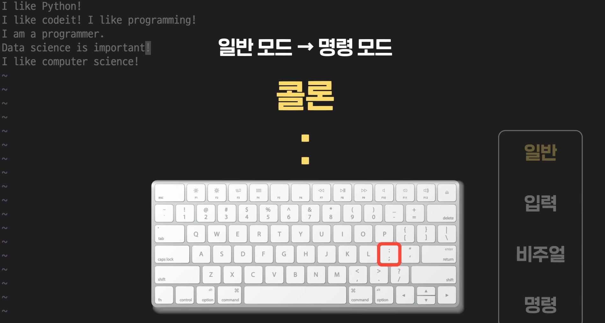

# VIM EDITOR

- 정리

  이번 챕터에서는 유닉스 계열 운영체제의 CLI 환경에서 사용하는 대표적인 텍스트 에디터, Vim을 배웠습니다. 사실 Vim에는 이번 챕터에서 배운 것보다 훨씬 더 다양한 기능들이 있습니다. 하지만 이런 기능들을 모두 외우고 완벽히 쓰는 것은 쉽지 않습니다. 따라서 자주 쓰게 되는 기능들만 익히고 필요한 기능이 있다면 따로 검색해서 그 방법을 찾는 것이 효율적입니다. 수업에서 배우지 못한 다른 Vim 사용법이 궁금하시다면 아래 링크들을 참조하세요. 

  - Vim 공식 사용 설명서(https://vimhelp.org/#help.txt)
  - Vim을 게임처럼 재미있게 배울 수 있는 사이트(https://vim-adventures.com/)

  아래는 이번 챕터에서 배운 내용을 정리한 겁니다. 

  # 1. 사용 모드 전환

    각 사용 모드로 이동하는 방법입니다. 실제로는 이것보다 더 다양한 방식으로 이동이 가능하지만 이 그림에 있는 키들만큼은 꼭 기억하세요. 

  

  # 2. 각 모드에서 할 수 있는 작업

  ## 1. 기본 모드(Normal mode)

  

  |                   기능                   |              키              |
  | :--------------------------------------: | :--------------------------: |
  |              왼쪽으로 이동               |              h               |
  |             오른쪽으로 이동              |              l               |
  |             아래쪽으로 이동              |              j               |
  |              위쪽으로 이동               |              k               |
  | 5칸(왼쪽, 오른쪽, 아래쪽, 위쪽)으로 이동 |          5(h/l/j/k)          |
  |   커서가 있는 줄의 첫 번째 칸으로 이동   |              0               |
  |   커서가 있는 줄의 마지막 칸으로 이동    |              $               |
  |         파일의 첫 번째 줄로 이동         |              gg              |
  |         파일의 마지막 줄로 이동          |              G               |
  |               한 글자 삭제               |              x               |
  |                5글자 삭제                |              5x              |
  |                한 줄 삭제                |              dd              |
  |                 5줄 삭제                 |             5dd              |
  |                작업 취소                 |              u               |
  |             텍스트 붙여넣기              | p(커서 다음 칸 혹은 다음 줄) |
  |             텍스트 붙여넣기              | P(커서 이전 칸 혹은 이전 줄) |

  

  ## 2. 입력 모드(Insert mode)

  

  |                           기능                           |  키  |
  | :------------------------------------------------------: | :--: |
  |            커서 위치부터 바로 입력 모드 시작             |  i   |
  |    커서 위치를 바로 다음 칸으로 옮기고 입력 모드 시작    |  a   |
  | 커서 위치를 그 줄의 첫 번째 칸으로 옮기고 입력 모드 시작 |  I   |
  | 커서 위치를 그 줄의 마지막 칸으로 옮기고 입력 모드 시작  |  A   |
  |     커서 위치를 바로 다음 줄로 옮기고 입력 모드 시작     |  o   |
  |     커서 위치를 바로 이전 줄로 옮기고 입력 모드 시작     |  O   |

  

  ## 3. 명령 모드(Command mode)

  

  |                           기능                            |       키       |
  | :-------------------------------------------------------: | :------------: |
  |                    입력 내용 저장하기                     |       :w       |
  |                       vim 종료하기                        |       :q       |
  |           입력 내용 저장하고 바로 vim 종료하기            |      :wq       |
  |        수정사항 반영하지 않고 그대로 vim 종료하기         |      :q!       |
  |                     특정 텍스트 검색                      |    /keyword    |
  |          특정 텍스트 검색 시 다음 텍스트로 이동           |     **n**      |
  |          특정 텍스트 검색 시 이전 텍스트로 이동           |     **N**      |
  |       커서가 있는 줄의 첫 번째 해당 텍스트 교체하기       |   :s/old/new   |
  |        커서가 있는 줄의 모든 해당 텍스트 교체하기         |  :s/old/new/g  |
  |            모든 줄의 모든 해당 텍스트 교체하기            | :%s/old/new/g  |
  | 모든 줄에서 모든 해당 텍스트를 하나씩 확인하면서 교체하기 | :%s/old/new/gc |

  

  # 4. 비주얼 모드(Visual mode)

  

  |                            기능                            |   키   |
  | :--------------------------------------------------------: | :----: |
  |                       일반 블록 지정                       |   v    |
  |                     줄 단위 블록 지정                      |   V    |
  |                        텍스트 복사                         |   y    |
  |                      텍스트 잘라내기                       |   d    |
  |                   커서 아랫줄에 붙여넣기                   |   p    |
  | 텍스트 한줄씩 복사하거나 잘라내기(Visual mode 아니여도 됨) | Yy, dd |
  |                                                            |        |

  

- #### 텍스트 에디터, Vim

  우리가 그동안 사용하던 텍스트 에디터들은 다 GUI환경에서 사용하던 에디터들. 

  

  CLI에서 사용하는게 **VIM**

  

  원래는 VI라는게 있었음. 이것을, 추가해서 VIM를 만든 것. 

  

- #### Vim의 4가지 사용모드

  4가지 사용모드가 있음. VINC(Visual, Insert, Normal, Command)

  

  

  사실 더 다양하긴 하나, 기본적인 작업만 알면 돼. 

  다만, 모드에 따라서 같은 키를 눌러도 다른 결과가 나온다는 것이 사람들이 어려워하는 이유. 

  

  일반모드에서, A키 누르면 입력모드/v키누르면 비쥬얼모드, :누르면 명령모드. 

  그리고 각 3가지 모드에서 ESC를 누르면 다시 일반모드로 돌아감. 

  그런데, 항상 입력/비주얼/명령 사이에서 왔다 갔다 할 때에는 언제나 일반모드를 거쳐서 가야 한다. 

  

​	

- #### 입력모드 1

  빔 실행하고 맨 처음은 일반모드. 

  

  i 를 눌러서 문장을 친다. i는 그냥 입력모드로 보내주는 거고, a는 커서를 한칸 뒤로 옮기고 입력모드로 보내주는 것. 그냥 똑같다고 생각하면 된다. 

  

  만약 지금 글을 쓰다가, 가장 첫번째 글자로 커서를 옮기고 입력모드로 가고 싶다면? 

  

  커서를 가장 마지막 칸으로 가면서 입력모드로 가려면? 대문자 A. 

  

  o를 누르면, 커서를 다음 줄로 옮기고 입력 모드로 전환. 

  O를 누르면, 커서가 있던 줄 위에 빈줄이 생긴다. 

  

- #### 명령모드

  

  `:w excercise`

  

  

  수정 후에는 ESC : 후에 **:w**하면 된다. 

  저장하면서 동시에 끄려면? 

  

  저장 안하면 날려버리려면? 그냥 :q하면, 저장이 안됨. 

  

  이럴 때 강제로 하려면, **:q!**를 치면 된다. 

  

  

  텍스트 검색:

  **검색을 하려면, 슬래시로 명령모드로 전환해야 한다.**

  /누르고 찾고싶은거 검색하면, 찾는 첫번째 글자가 나온다. 그리고, 그 다음으로 가고 싶으면 **n**을 누른다. 

  **텍스트 검색을 할 때 순방향(위에서 아래로, 왼쪽에서 오른쪽으로) 검색은 소문자 n, 역방향(아래에서 위로, 오른쪽으로 왼쪽으로) 검색은 대문자 N을 눌러야 합니다.**

   

  그리고 명령모드에는 텍스트 치환 기능도 있다. 

  

  :s/like/love

  

  모든 줄에 있는 like 를 Love로 바꾸고 싶다면, ?

  

  사실 그런데 이 명령문은 각 줄의 첫번째 Like만 love로 바뀐다. 

  각 줄에서 모든 단어를 바꾸려면? 옵션이 필요하다. 

  

  딱 몇개만 바꾸려면?

  c옵션을 주면 하나씩 확인해 가면서 하는 것. 이렇게 하면 하나씩 활성화 되는데 y를 누르면 삭제되는 것. 

  

  

- #### 일반모드

  커서 이동하는 방법. 

  빔 열면 첫 모드는 일반모드. 

  

  방향키 이동은 그냥 내가 하던 것. 

  알파벳이동은. 

  

  

  내가 어디 있는지 보이는 것. 

  

  

  

  

  

- **일반모드에서 텍스트 삭제하기.**  

  

  

  

  

- #### 비쥬얼 모드 

  

  방향키 누르면 하얀색 블록이 지정된다. 

  블록 지정된 상태에서 아래의 세가지를 할 수 있다. 

  

  1. 삭제는 그냥 블록 지정된 상태에서 X. 

  2. 복사- 붙여넣기는

     

     

     줄단위 블록지정. 

     

     **잘라내기.**

     

      