# Summary

[브라우저/DOM](###DOM)

[이벤트 핸들러](##이벤트 핸들러)

[다양한 이벤트](###다양한 이벤트)

### 1. window 객체

`window` 객체는 브라우저 창을 대변하면서 자바스크립트에서 최상단에 존재하는 객체입니다. 자바스크립트 코드 어느 곳에서나 항상 접근할 수 있는 객체이기 때문에 전역 객체, 영어로는 **Global Object**라고 부릅니다. 어떤 프로퍼티나 메소드를 사용하든 결국 전역 객체 내부의 것이기 때문에 앞에 `window.`을 생략할 수도 있습니다.

### 2. DOM

DOM이란 **Document Object Model**의 약자로, 한국어로는 **문서 객체 모델**입니다. 간단하게 표현하면 웹 페이지에 나타나는 HTML 문서 전체를 객체로 표현한 것으로 생각하면 됩니다. 이때 각 객체를 노드(Node)라는 용어로 표현하고, 태그는 요소 노드, 문자는 텍스트 노드로 구분됩니다.

### 3. DOM 트리

HTML의 계층 구조는 DOM에서도 반영되는데 이러한 계층구조를 나무에 비유해서 DOM 트리라고 부릅니다. 각 노드 간의 관계는 부모, 자식, 형제라는 용어로 표현합니다.

### 4. DOM 이동 시 활용 가능한 프로퍼티

| 프로퍼티                       | 유형           | 결과                                                      |
| ------------------------------ | -------------- | --------------------------------------------------------- |
| element.children               | 자식 요소 노드 | element의 자식 요소 모음(HTMLCollection)                  |
| element.firstElementChild      | 자식 요소 노드 | element의 첫 번째 자식 요소 하나                          |
| element.lastElementChild       | 자식 요소 노드 | element의 마지막 자식 요소 하나                           |
| element.parentElement          | 부모 요소 노드 | element의 부모 요소 하나                                  |
| element.previousElementSibling | 형제 요소 노드 | element의 이전(previous) 혹은 좌측(left)에 있는 요소 하나 |
| element.nextElementSibling     | 형제 요소 노드 | element의 다음(next) 혹은 우측(right)에 있는 요소 하나    |
| node.childNodes                | 자식 노드      | node의 자식 노드 모음(NodeList)                           |
| node.firstChild                | 자식 노드      | node의 첫 번째 자식 노드 하나                             |
| node.lastChild                 | 자식 노드      | node의 마지막 자식 노드 하나                              |
| node.parentNode                | 부모 노드      | node의 부모 요소 하나                                     |
| node.previousSibling           | 형제 노드      | node의 이전(previous) 혹은 좌측(left)에 있는 노드 하나    |
| node.nextSibling               | 형제 노드      | node의 다음(next) 혹은 우측(right)에 있는 노드 하나       |

### 5. 주요 요소 노드 프로퍼티

| 프로퍼티            | 내용                                                         | 참고사항                                                     |
| ------------------- | ------------------------------------------------------------ | ------------------------------------------------------------ |
| element.innerHTML   | 요소 노드 내부의 HTML코드 문자열로 리턴                      | 요소 안의 정보를 확인할 수도 있지만, 내부의 HTML 자체를 수정할 때 좀 더 자주 활용 |
| element.outerHTML   | 요소 노드 자체의 전체적인 HTML 코드를 문자열로 리턴          | outerHTML은 새로운 값을 할당하면 요소 자체가 교체되어 버리기 때문에 주의 |
| element.textContent | 요소 노드 내부의 내용들 중에서 HTML을 제외하고 텍스트만 리턴 | textContent는 말그대로 텍스트만 다루기 때문에 HTML태그를 쓰더라도 모두 텍스트로 처리됨 |

### 6. 요소 노드 다루기

1. 요소 노드 만들기: `document.createElement('태그이름')`
2. 요소 노드 꾸미기: `element.textContent, element.innerHTML, ...`
3. 요소 노드 추가 혹은 이동하기: `element.prepend, element.append, element.after, element.before`
4. 요소 노드 삭제하기: `element.remove()`

### 7. HTML 속성 다루기

대부분의 HTML 속성은 DOM 객체의 프로퍼티로 변환이 됩니다. 하지만, 표준 속성이 아닌 경우에는 프로퍼티로 변환이 안 되는데요. 아래 메소드를 활용하면 표준이 아닌 HTML 속성들도 다룰 수 있습니다.

1. 속성에 접근하기: `element.getAttribute('속성')`
2. 속성 추가(수정)하기: `element.setAttribute('속성', '값')`
3. 속성 제거하기: `element.removeAttribute('속성')`

### 8. 스타일 다루기

자바스크립트로 태그의 스타일을 다루는 방법에는 크게 두 가지가 있습니다.

1. style 프로퍼티 활용하기: `element.style.styleName = 'value';`
2. class 변경을 통해 간접적으로 스타일 적용하기: `element.className`, `element.classList`

#### 8-1. classList의 유용한 메소드

| 메소드           | 내용                                | 참고사항                                                     |
| ---------------- | ----------------------------------- | ------------------------------------------------------------ |
| classList.add    | 클래스 추가하기                     | 여러 개의 값을 전달하면 여러 클래스 추가 가능                |
| classList.remove | 클래스 삭제하기                     | 여러 개의 값을 전달하면 여러 클래스 삭제 가능                |
| classList.toggle | 클래스 없으면 추가, 있으면 삭제하기 | 하나의 값만 적용 가능하고, 두 번째 파라미터로 추가 또는 삭제 기능을 강제할 수 있음 |


### 자바스크립트로 태그 선택하기

| 메소드                                   | 의미                             | 결과                                                |
| ---------------------------------------- | -------------------------------- | --------------------------------------------------- |
| document.getElementById('id')            | HTML id속성으로 태그 선택하기    | id에 해당하는 태그 하나                             |
| document.getElementsByClassName('class') | HTML class속성으로 태그 선택하기 | class에 해당하는 태그 모음(HTMLCollection)          |
| document.getElementsByTagName('tag')     | HTML 태그 이름으로 태그 선택하기 | tag에 해당하는 태그 모음(HTMLCollection)            |
| document.querySelector('css')            | css 선택자로 태그 선택하기       | css 선택자에 해당하는 태그 중 가장 첫번째 태그 하나 |
| document.querySelectorAll('css')         | css 선택자로 태그 선택하기       | css 선택자에 해당하는 태그 모음(NodeList)           |

### 유사 배열이란?

- 배열과 유사한 객체 ex) HTMLCollection, NodeList, DOMTokenList, ...

##### 특징

1. 숫자 형태의 indexing이 가능하다.
2. `length` 프로퍼티가 있다.
3. 배열의 기본 메소드를 사용할 수 없다.
4. `Array.isArray(유사배열)`의 리턴값은 `false`다.

#### 이벤트와 이벤트 핸들링, 그리고 이벤트 핸들러

- 이벤트 : 웹 페이지에서 발생하는 대부분의 일(사건)들  ex) 버튼 클릭, 스크롤, 키보드 입력, ...
- 이벤트 핸들링 : 자바스크립트를 통해 이벤트를 다루는 일
- 이벤트 핸들러 : 이벤트가 발생했을 때 일어나야하는 구체적인 동작들을 표현한 코드. **이벤트 리스너(Event Listener)**라고도 부른다.

#### 이벤트 핸들러를 등록하는 2가지 방법

##### 4-1. 자바스크립트로 해당 DOM 객체의 onclick 프로퍼티에 등록하기

```js
const btn = document.querySelector('#myBtn');

btn.onclick = function() {
  console.log('Hello Codeit!');
};
```

##### 4-2. HTML 태그의 onclick 속성에 바로 표시하기

```html
<button id="myBtn" onclick="console.log('Hello Codeit!')">클릭!</button>
```


#### 1. 이벤트 핸들러 등록하기

HTML의 속성이나 DOM 프로퍼티를 활용해 이벤트를 등록하는 방법 외에 `Element.addEventListener('type', 'handler')`를 통해서 이벤트 핸들러를 등록할 수 있습니다.

#### 2. 이벤트 핸들러 삭제하기

`addEventListener` 메소드를 활용해서 이벤트 핸들러를 등록했다면, `Element.removeEventListner('type', 'handler')`를 통해서 이벤트 핸들러를 삭제할 수 있습니다.

#### 3. 이벤트 객체 (Event Object)

이벤트가 발생하면 이벤트 핸들러의 첫 번째 파라미터에는 자동으로 이벤트 객체가 전달됩니다.

이벤트 객체는 이벤트 종류마다 가지고 있는 프로퍼티가 다르며, 이벤트에 대한 유용한 정보들을 프로퍼티로 가지고 있습니다.

#### 4. 이벤트 버블링 (Event Bubbling)

이벤트는 전파가 됩니다.  어떤 요소에서 이벤트가 발생하면 해당 요소에 등록된 이벤트 핸들러가 동작하는 것뿐만 아니라 부모 요소로 이벤트가 계속해서 전파되면서 각 요소에도 등록된 이벤트 핸들러가 있다면 차례로 이벤트 핸들러가 동작하는데요.

자식 요소에서 부모 요소로 이벤트가 전파되는 것을 **이벤트 버블링(Event Bubbling)**이라고 부릅니다.

참고로 이벤트 버블링은 **이벤트 객체**의 `stopPropagation` 메소드로 전파를 막을 수 있습니다.

#### 5. 이벤트 위임 (Event Delegation)

버블링 개념을 활용하면 훨씬 효과적인 이벤트 관리를 할 수 있습니다. 예를 들어 자식 요소 각각에 이벤트 핸들러를 하나씩 등록할 필요 없이 부모 요소에서 한 번에 자식 요소들에 발생한 이벤트를 관리할 수도 있는데요.

이렇게 이벤트를 다루는 방식을 자식 요소의 이벤트를 부모 요소에 위임한다고 해서 **이벤트 위임(Event Delegation)**이라고 부릅니다.

이벤트 위임을 잘 활용하면 훨씬 더 효율적으로 이벤트를 다룰 수 있습니다.

#### 6. 브라우저의 기본 동작

브라우저에는 각 태그별 혹은 상황별로 기본적으로 약속된 동작들이 있습니다.

예를 들어 마우스 오른쪽 버튼을 클릭하면 상황에 맞는 메뉴 창이 뜬다거나, `input` 태그에 커서를 두고 키보드 키를 누르면 해당 값이 입력된다거나..

그런데 만약 이러한 동작들을 막고 싶다면 **이벤트 객체**의 `preventDefault` 메소드를 통해 막을 수가 있습니다.

하지만 각 HTML 태그들이 가지고 있는 고유한 역할과 의미를 훼손하게 될 수도 있기 때문에 꼭 필요한 경우에만 주의해서 사용해야 한다는 점. 꼭 기억해 주세요 :)


# 1. MouseEvent.button

마우스 이벤트 객체의 버튼 프로퍼티를 활용하면, 마우스 버튼을 눌렀을 때 일어난 이벤트에 대해서 어떤 버튼을 눌러서 일어난 이벤트인지를 정확하게 알아낼 수 있습니다.

| 값   | 내용                                      |
| :--- | :---------------------------------------- |
| 0    | 마우스 왼쪽 버튼                          |
| 1    | 마우스 휠                                 |
| 2    | 마우스 오른쪽 버튼                        |
| 3    | X1 (일반적으로 브라우저 뒤로 가기 버튼)   |
| 4    | X2 (일반적으로 브라우저 앞으로 가기 버튼) |

참고로 `mouseenter, mouseleave, mouseover, mouseout, mousemove` 처럼 **마우스 이동과 관련된 이벤트**에서는 이 값이 `null`이나 `undefined`가 아니라 `0`이라는 점. 꼭 기억해 주세요!

# 2. MouseEvent.type

마우스 이벤트의 타입에는 아래와 같은 타입들이 있습니다.

| 이벤트 타입   | 설명                                                         |
| :------------ | :----------------------------------------------------------- |
| `mousedown`   | 마우스 버튼을 누르는 순간                                    |
| `mouseup`     | 마우스 버튼을 눌렀다 떼는 순간                               |
| `click`       | 왼쪽 버튼을 클릭한 순간                                      |
| `dblclick`    | 왼쪽 버튼을 빠르게 두 번 클릭한 순간                         |
| `contextmenu` | 오른쪽 버튼을 클릭한 순간                                    |
| `mousemove`   | 마우스를 움직이는 순간                                       |
| `mouseover`   | 마우스 포인터가 요소 위로 올라온 순간                        |
| `mouseout`    | 마우스 포인터가 요소에서 벗어나는 순간                       |
| `mouseenter`  | 마우스 포인터가 요소 위로 올라온 순간 (버블링이 일어나지 않음) |
| `mouseleave`  | 마우스 포인터가 요소에서 벗어나는 순간 (버블링이 일어나지 않음) |

# 3. MouseEvent.위치프로퍼티

마우스 이벤트 객체에는 마우스 포인터의 위치와 관련된 다양한 프로퍼티들이 있는데요. 주로 아래와 같은 프로퍼티들이 자주 사용됩니다.

| 프로퍼티           | 설명                                          |
| :----------------- | :-------------------------------------------- |
| `clientX, clientY` | 마우스 포인터의 브라우저 표시 영역에서의 위치 |
| `pageX, pageY`     | 마우스 커서의 문서 영역에서의 위치            |
| `offsetX, offsetY` | 마우스 포인터의 이벤트 발생한 요소에서의 위치 |
| `screenX, screenY` | 마우스 포인터의 모니터 화면 영역에서의 위치   |

# 4. MouseEvent.relatedTarget

`mouseenter, mouseleave, mouseover, mouseout` 이벤트에는 `relatedTarget`이라는 프로퍼티가 존재하는데요.

`target` 프로퍼티가 **이벤트가 발생한 요소**를 담고 있다면, `relatedTarget` 프로퍼티는 **이벤트가 발생하기 직전(또는 직후)에 마우스가 위치해 있던 요소**를 담고 있습니다.

비슷하지만 서로 다른 두 프로퍼티를 잘 구분해서 기억해 두시면 좋을 것 같습니다 :)

# 5. KeyboardEvent.type

키보드 이벤트의 타입에는 아래와 같은 타입들이 있습니다.

| 이벤트 타입 | 설명                                                         |
| :---------- | :----------------------------------------------------------- |
| `keydown`   | 키보드의 버튼을 누르는 순간                                  |
| `keypress`  | 키보드의 버튼을 누르는 순간 ('a', '5' 등 출력이 가능한 키에서만 동작하며, Shift, Esc 등의 키에는 반응하지 않음) |
| `keyup`     | 키보드의 버튼을 눌렀다 떼는 순간                             |

# 6. KeyboardEvent.key vs KeyboardEvent.code

키보드 이벤트 객체에는 `key`와 `code` 프로퍼티가 자주 사용되는데요.

`key`는 **사용자가 누른 키가 가지고 있는 값**을 나타내고 `code`는 **누른 키의 물리적인 위치**를 나타낸다는 점! 잘 구분해서 기억해 두시면 좋을 것 같습니다.

# 7. input태그 다루기

`input` 태그는 말 그대로 입력의 역할을 하는 태그입니다. 타입에 따라 조금씩 차이가 있을 수 있지만, `input` 태그를 다룰 때는 아래와 같은 이벤트 타입들이 활용될 수 있습니다.

| 이벤트 타입 | 설명                                                     |
| :---------- | :------------------------------------------------------- |
| `focusin`   | 요소에 포커스가 되는 순간                                |
| `focusout`  | 요소에 포커스가 빠져나가는 순간                          |
| `focus`     | 요소에 포커스가 되는 순간 (버블링이 일어나지 않음)       |
| `blur`      | 요소에 포커스가 빠져나가는 순간 (버블링이 일어나지 않음) |
| `change`    | 입력된 값이 바뀌는 순간                                  |
| `input`     | 값이 입력되는 순간                                       |
| `select`    | 입력 양식의 하나가 선택되는 순간                         |
| `submit`    | 폼을 전송하는 순간                                       |

# 8. 스크롤 이벤트

`scroll` 이벤트는 보통 `window` 객체에 이벤트 핸들러를 등록하고 `window` 객체의 프로퍼티와 함께 자주 활용되는데요.

특히 `scrollY` 프로퍼티를 활용하면 스크롤된 특정한 위치를 기준으로 이벤트 핸들러가 동작하게 하거나 혹은 스크롤 방향(위로 스크롤 중인지/아래로 스크롤 중인지)을 기준으로 이벤트 핸들러가 동작하게끔 활용할 수도 있습니다.


- `document.getElementById('id');` : 해당 테그가 선택되는 방식

- `document.getElementsByTagName('태그이름')`

- `document.getElementsByClassName('클래스이름')`

  - 깊이와 상관없이 무조건 위에서 부터 유사배열로 선택됨

  - 유사배열이란, 배열의 메소드는 선택할 수 없지만, length 등은 사용이 가능. 

    이전 시간에 잠깐 등장했던 **HTMLCollection** 기억나시나요? **배열과 모양은 같지만, 완벽히 배열은 아닌** 이런 형태를 **유사 배열**이라고 부른다고 했었는데요. 당장은 직접 유사 배열을 만들어서 사용하게 될 일은 없겠지만, 지난 시간처럼 자바스크립트로 HTML 태그를 다룰 때 종종 마주치게 되니깐 간단하게나마 개념적인 부분은 정리하고 넘어갑시다!

    #### 유사 배열(Array-Like Object)이란?

    앞에서도 설명한 것처럼 이름 그대로 **배열과 유사(類似)한 객체**를 **유사 배열**, 영어로는 **Array-Like Object**라고 부릅니다. 하지만 마냥 모양만 비슷하다고 해서 모두 유사 배열이라고 부르진 않는데요. 유사 배열에도 최소한 갖춰야 할 조건과 특징들이 있습니다.

    ##### 1. 숫자 형태의 indexing이 가능하다.

    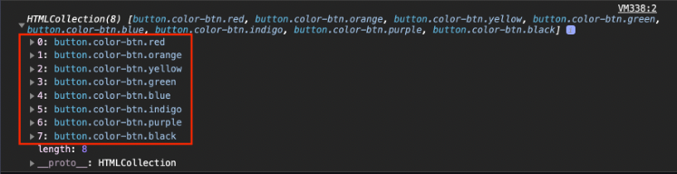

    배열은 각 요소에 0부터 순서대로 매겨진 index를 통해 요소끼리의 관계도 파악할 수 있고 그 index를 통해 요소에 접근할 수도 있다는 특징이 있죠? 유사 배열도 마찬가지로 배열이라는 이름에 걸맞게 각 요소에 **0부터 시작하는 숫자 형태의 index가 있어야** 합니다.

    ##### 2. length 프로퍼티가 있다.

    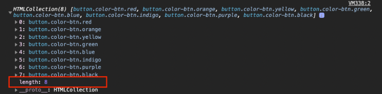

    객체가 가지고 있는 요소의 갯수를 저장하는 `length` 프로퍼티도 역시 배열의 특징이라고 할 수 있는데요. 유사 배열 역시 `length` 프로퍼티가 있어야 비로소 유사 배열이라고 할 수 있습니다. 숫자 형태의 index가 있더라도 `length` 프로퍼티가 없다면 유사 배열이라기보단 그냥 숫자 형태의 key로 구성된 일반적인 객체라고 볼 수 있습니다.

    ##### 3. 배열의 기본 메소드를 사용할 수 없다. 

    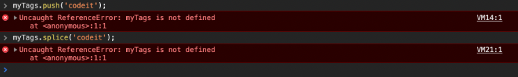

    상황에 따라서 직접 구현할 수도 있겠지만, 유사 배열이 완전한 배열이 아닌 가장 큰 이유는 바로 **기본적인 배열의 메소드를 사용할 수 없다**는 점 때문입니다. 배열의 메소드를 활용할 수 없다는 특징이 유사 배열을 활용하는 목적이 되기도 하는데요. indexing을 통해 유사 배열의 요소에 접근하는 건 쉽지만 수정하거나 삭제하는 작업이 까다롭습니다. 그래서 내부의 요소들은 배열처럼 다룰 수 있게 하면서 배열의 메소드 사용을 막고 싶거나, 혹은 일반 배열에는 없는 특별한 메소드를 제공하고 싶을 때 유사 배열을 만들어 활용하기도 합니다!

    ##### 4. Array.isArray(유사배열)은 false다.

    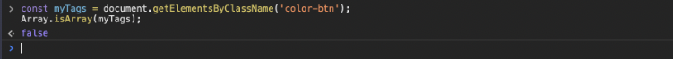

    `Array` 객체의 `isArray` 메소드는 파라미터로 전달한 값이 배열인지 아닌지를 평가해서 그 결과를 불린 형태의 값으로 리턴해주는 메소드입니다. 유사 배열은 배열과 비슷하지만 배열은 아니기 때문에 결괏값이 `false` 입니다.

    ##### 주의사항: 유사 배열은 다양하다!

    유사 배열은 위의 특징들을 가진 대부분의 형태를 가리키는 포괄적인 개념이기 때문에 정말 다양한 형태로 존재할 수 있습니다. 예를 들어 지난 시간에 봤던 HTMLCollection의 경우 for..of 문을 활용하는 데 문제는 없었지만 어떤 유사 배열의 경우에는 for..of문을 활용할 수 없는 경우도 있습니다. 배열의 기본 메소드를 사용할 수 없다고 했지만, 직접 구현해서 마치 배열처럼 사용할 수 있도록 만들 수도 있습니다. 하지만 직접 유사 배열을 만드는 게 아니라 이미 만들어진 유사 배열에 접근하는 경우에는 대부분 위 4가지 특징을 모두 가지고 있으니깐 잘 기억해 두시면 좋을 것 같습니다 :)


- CSS 선택자로 태그 선택하기 

  `document.querySelector('#myNumber')` 

  `document.querySelector('.myNumber') ` - 가장 첫번째 요소가 선택된다. 

  `document.querySelectorAll('.myNumber')` - 여러 요소 유사배열로 선택된다. 

  

#### 이벤트와 버튼 클릭

- ```
  const btn = document.querySelector('#myBtn')
  
  btn.onClick = function(){
  	console.log('Hello Codeit!')
  }
  ```


### DOM

[window 객체 링크](https://developer.mozilla.org/ko/docs/Web/API/Window)

- window 객체. 모든 내장 객체, 내장 함수는 이 window객체 안에 있다. 
  - 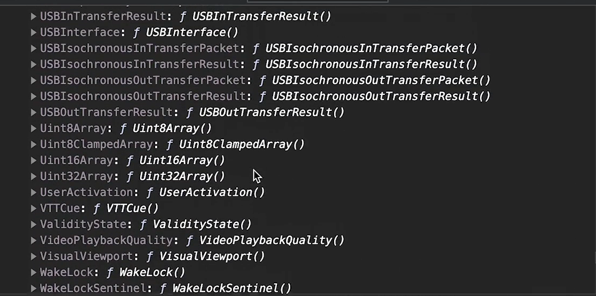


- DOM(Document Object Model)

  웹페이지에 나타나는 HTML문서 전체를 객체로 표현한 것. Document 객체가 이 웹문서의 최상단 객체로 진입점의 역할을 한다. 그래서, Document 객체를 활용하면 뭔가 수정이나 새로운 거 만드는게 다 되는 것. 

  `console.log(document)`. 직접 접근하면 해당되는 HTML이 출력된다. 

  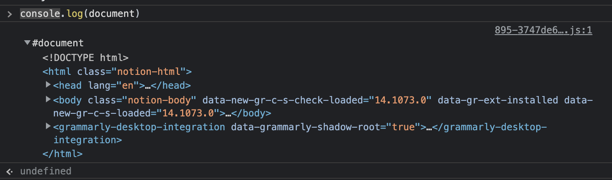

  태그가 아니라 객체로 보고 싶다면, 

  `console.dir(document)`

  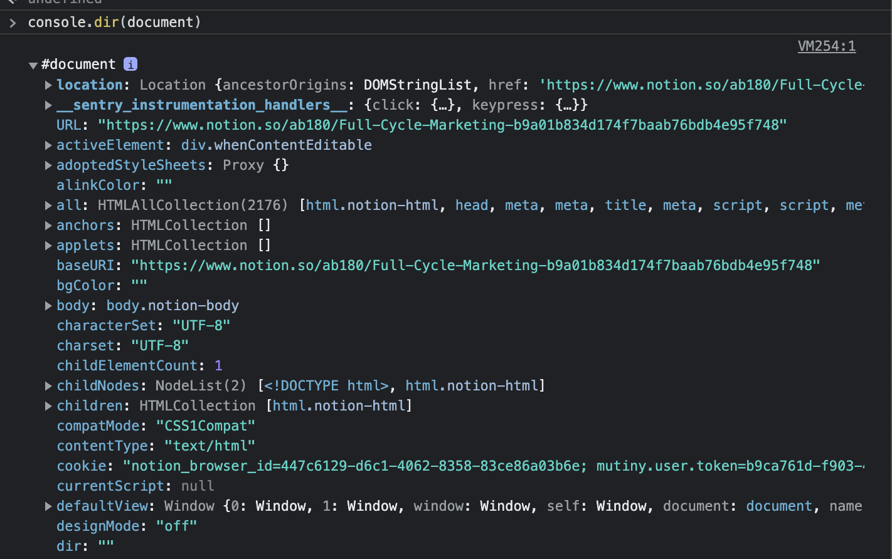

  DOM개념에 따르면, 문서 내 모든 테그들은 각각의 객체라는 뜻. 실제로 아래처럼, 태그를 넣고 .을 찍으니깐, 쓸 수 있는 값들이 나오잖아. `title.style.color = "red"`.  어쨋든, DOM을 활용하면, html테그를 객체처럼 자유롭게 다룰 수 있다는 점을 기억하자. 

  유튜브 링크

  [설명 잘 되있음](https://www.youtube.com/watch?v=zyz1eJJjsNE)

  [유튜브 링크2](https://www.youtube.com/watch?v=mFawNZz_Uu0)

  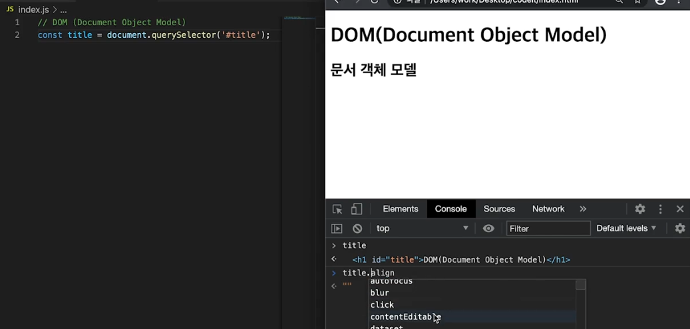


### console.log vs console.dir

대부분의 브라우저에 있는 개발자 도구는 `console.log`와 `console.dir`메소드를 지원합니다. 두 메소드 모두 파라미터로 전달받은 값을 콘솔에 출력하는 역할을 합니다. 과연 이 둘은 어떤 차이가 있을까요?

```js
const str = 'Codeit';
const num = 123;
const bool = true;
const arr = [1, 2, 3];
const obj = {
  name: 'Codeit',
  email: 'codeit@codeit.kr',
};

function func() {
  console.log('I love Codeit!');
}

console.log('--- str ---');
console.log(str);
console.dir(str);
console.log('--- num ---');
console.log(num);
console.dir(num);
console.log('--- bool ---');
console.log(bool);
console.dir(bool);
console.log('--- arr ---');
console.log(arr);
console.dir(arr);
console.log('--- obj ---');
console.log(obj);
console.dir(obj);
console.log('--- func ---');
console.log(func);
console.dir(func);
```


이렇게 다양한 유형의 값들을 만들어서 출력 결과를 놓고서 천천히 비교해봅시다.

##### 1. 출력하는 자료형이 다르다.


먼저 문자열, 숫자, 불린 부분을 봅시다. 각 값을 출력할 때 두 번째 `dir` 부분에서 출력되는 값의 색이 다른 게 보이시나요? **dir 메소드는 문자열 표시 형식으로 콘솔에 출력**합니다.

##### 2. log는 값 자체에, dir은 객체의 속성에!


`log` 메소드는 **파라미터로 전달받은 값**을 위주로 출력하는 반면, `dir` 메소드는 **객체의 속성**을 좀 더 자세하게 출력합니다.

`dir` 메소드가 출력한 부분을 자세히 보면 객체의 유형이 먼저 출력되고, 특히 함수 부분에서는 클릭해서 펼쳤을 때 함수가 가진 속성들을 더 보여주는 모습을 확인할 수 있습니다. (`log` 메소드는 펼쳐지지 않음)

##### 3. log는 여러 개, dir은 하나만!

```js
console.log(str, num, bool, arr, obj, func);
console.dir(str, num, bool, arr, obj, func);
```


둘 사이의 차이는 파라미터로 전달할 수 있는 값의 개수에도 있는데요. `log` 메소드는 여러 값을 쉼표로 구분해서 전달하면 전달받은 **모든 값을 출력**하는 반면, `dir` 메소드는 여러 값을 전달하더라도 **첫 번째 값만 출력**합니다.

##### 4. DOM 객체를 다룰 때..

```js
const myDOM = document.body;

console.log(myDOM);
console.dir(myDOM);
```


지난 시간에도 확인했듯 `log`와 `dir` 메소드의 가장 큰 차이는 DOM 객체를 다룰 때 나타납니다. 값에 좀 더 중점을 둔 **log 메소드는 대상을 HTML 형태로 출력**하고, 객체의 속성에 좀 더 중점을 둔 **dir 메소드는 대상을 객체 형태로 출력**합니다.

##### 마무리

지금까지 `console` 객체의 `log` 메소드와 `dir` 메소드의 차이점에 대해 살펴봤는데요. **콘솔에서 값 자체를 확인하고 싶다면** `log`메소드를, **객체의 속성들을 살펴보고 싶다면** `dir` 메소드를 활용하면 좋을 것 같습니다.


#### [DOM트리](https://dom.spec.whatwg.org/#node)

- DOM Tree

  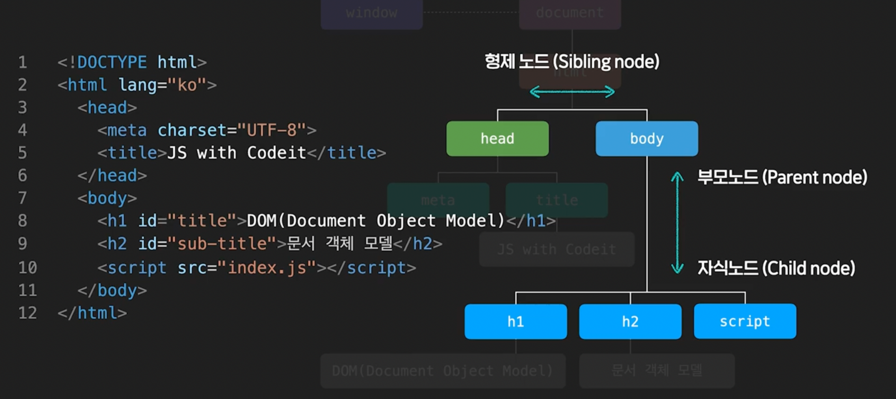

  Dom-tree에 표현되는 노드도 다양한 종류가 있다. 대표적으로 테그틑 표현하는 노드는 요소노드(Element Node), 문자 표현하는 노드를 Text Node라고 부른다. 일반적으로 텍스트노드는 요소노드의 자식노드가 되고, 따로 자식 노드를 가질 수 없다. 그래서 `leaf node`라고도 한다. 

  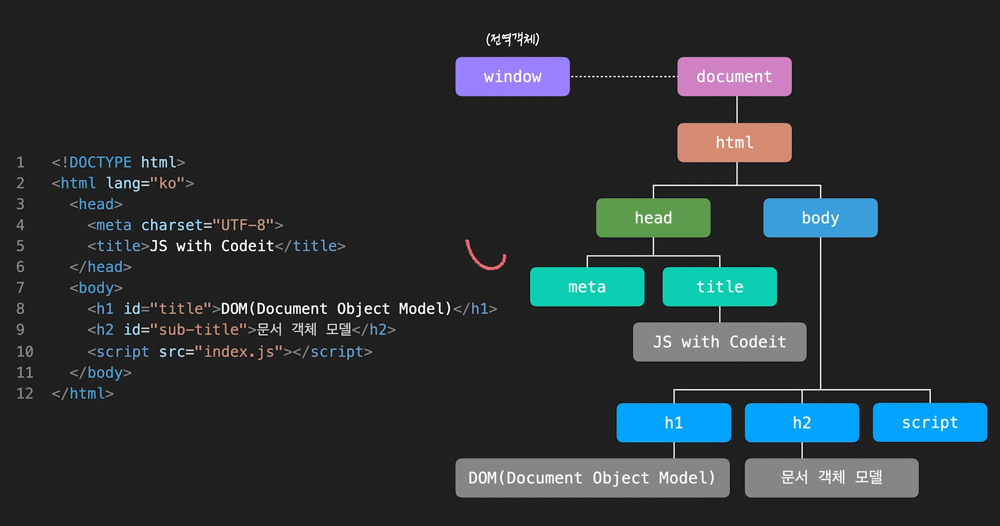

  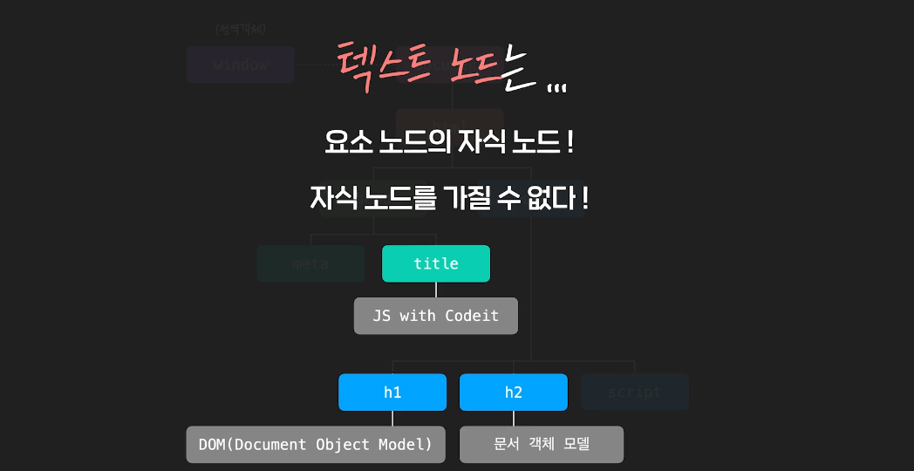

  그 외에도 텍스트노드, 코멘트노드, 문서노드 등 여러가지의 노드가 있다. 단, 대부분은 **요소노드**와 **텍스트노드** 두 노드로 구성된다. 

  **DOM을 이용하면, 자바스크립트로 웹문서를 자유롭게 다룰 수 있다.** 

  ```js
  const myTag = document.querySelector("#content");
  console.log(myTag)
  ```

  DOM 트리를 통해, 부모 자식 형제까지 선택할 수 있다. 

  ```js
  자식요소를 다 가져온다. 
  
  console.log(myTag.children)
  console.log(myTag.firstElementChild)
  console.log(myTag.lastElementChild)
  ```

  부모요소 접근

  ```javascript
  myTag.parentElement
  ```

  형제요소 접근

  ```javascript
  이전 형제
  myTag.previousElementSibling
  
  다음 형제
  myTag.nextElementSibling
  ```

  계속 연결도 가능하다. 

  ```javascript
  myTag.parentElement.previousElement Sibling
  ```

**정리**

##### 요소 노드에 대한 이동 프로퍼티

| 프로퍼티                       | 유형           | 결과                                                      |
| ------------------------------ | -------------- | --------------------------------------------------------- |
| element.children               | 자식 요소 노드 | element의 자식 요소 모음(HTMLCollection)                  |
| element.firstElementChild      | 자식 요소 노드 | element의 첫 번째 자식 요소 하나                          |
| element.lastElementChild       | 자식 요소 노드 | element의 마지막 자식 요소 하나                           |
| element.parentElement          | 부모 요소 노드 | element의 부모 요소 하나                                  |
| element.previousElementSibling | 형제 요소 노드 | element의 이전(previous) 혹은 좌측(left)에 있는 요소 하나 |
| element.nextElementSibling     | 형제 요소 노드 | element의 다음(next) 혹은 우측(right)에 있는 요소 하나    |

배웠던 그대로 이 프로퍼티들은 노드 중에서도 '요소 노드'인 경우에만 존재하는 프로퍼티들입니다. 그럼 요소 노드 말고 텍스트 노드에 접근하고 싶을 땐 어떻게 해야 할까요?

##### 모든 노드에 대한 이동 프로퍼티

만약 요소 노드가 아닌 다른 노드들을 이동하고 싶은 경우에는 아래와 같은 프로퍼티를 활용할 수도 있습니다.

| 프로퍼티             | 유형      | 결과                                                   |
| -------------------- | --------- | ------------------------------------------------------ |
| node.childNodes      | 자식 노드 | node의 자식 노드 모음(NodeList)                        |
| node.firstChild      | 자식 노드 | node의 첫 번째 자식 노드 하나                          |
| node.lastChild       | 자식 노드 | node의 마지막 자식 노드 하나                           |
| node.parentNode      | 부모 노드 | node의 부모 요소 하나                                  |
| node.previousSibling | 형제 노드 | node의 이전(previous) 혹은 좌측(left)에 있는 노드 하나 |
| node.nextSibling     | 형제 노드 | node의 다음(next) 혹은 우측(right)에 있는 노드 하나    |

대부분 요소 노드의 프로퍼티 이름에서 Element라는 단어만 빠진 것 같은데요. 사실 모든 노드가 공통적으로 갖고있는 이 프로퍼티들은 특별한 경우를 제외하면 자주 사용되진 않습니다.

그 이유는 DOM 트리가 만들어질 때 생겨나는 노드들을 좀 더 자세히 살펴보면 알 수 있는데요.

##### DOM 트리를 구성할 때..

브라우저가 HTML 코드를 해석할 때 각 코드들은 상황에 맞게 node를 생성하고 DOM 트리를 구성하는데,

**HTML 태그**는 **요소 노드**가 되고,  **문자들**은 **텍스트 노드**, 그리고 **주석**도 **주석 노드**로 DOM 트리에 반영됩니다.

```html
<!DOCTYPE HTML>
<html>
<head>
  <title>JavaScript</title>
</head>
<body>
  I Love JavaScript
  <!-- I Love Codeit -->
</body>
</html>
```

예를 들어 이런 코드는 아래와 같이 DOM 트리를 구성하게 되는데요.


그런데 텍스트 노드 중에서 붉은 테두리가 있는 부분을 통해 알 수 있듯 태그와 태그사이에 줄 바꿈과 들여쓰기로 인한 띄어쓰기도 텍스트 노드(Text라고 표시된 부분)로 생성된 모습을 확인할 수 있습니다.

지금 예시는 간단하기 때문에 어느 정도 DOM 트리를 예상할 수 있지만, 조금만 더 코드가 복잡하거나 혹은 코드의 스타일이 일정하지 않은 경우에는 이런 줄 바꿈과 들여쓰기로 인해 생성된 텍스트 노드의 존재를 파악하기가 쉽지 않을 수 있습니다.

그래서 방금 본, 모든 노드가 공통으로 갖고 있는 프로퍼티를 활용한다면, 예상치 못한 텍스트 노드를 선택하게 되어 의도하지 않은 결과를 만들어 낼 가능성이 커지게 됩니다.

##### 일반적으로 우리가 다루고자 하는 대상은 태그!

자바스크립트로 웹 문서를 다룰 때는 아무래도 텍스트 노드보다는 요소  노드를 다룰 경우가 더 많을 겁니다. 만약 여러분이 의도하는 대상이 HTML 태그라면 요소 노드에 대한 이동 프로퍼티를 활용하는 것이 훨씬 더 안전하겠죠?

그래도 상황에 따라서는 요소 노드가 아닌 노드들을 이동시켜야할 수도 있으니 모든 노드가 공통으로 갖고 있는 속성들도 잘 기억해주세요.

잘 기억해 두시면 충분히 도움이 될겁니다! :)

```html
<!DOCTYPE html>
<html lang="ko">
<head>
  <meta charset="UTF-8">
  <title>새로운 코딩 교육의 시작</title>
</head>
<body>
  <h2>진행 중인 토픽</h2>
  <ul id="doing-list">
    <li>인터랙티브 자바스크립트</li>
    <li>프로그래밍 언어 이해하기</li>
    <li>프로그래머의 세계 이해하기</li>
    <li>소프트웨어 이해하기</li>
  </ul>
  <h2>완료 한 토픽</h2>
  <ul id="done-list">
    <li>프로그래밍 시작하기 in JavaScript</li>
    <li>프로그래밍 핵심 개념 in JavaScript</li>
    <li>프로그래밍과 데이터 in JavaScript</li>2번 보기
    <li>HTML/CSS 시작하기</li>
    <li>HTML/CSS 핵심 개념</li>
    <li>반응형 웹 퍼블리싱</li>
  </ul>
  <script src="index.js"></script>
</body>
</html>
```


#### 요소 노드의 주요 Property

- innerHTML : 요소 안의 HTML을 텍스트로 리턴해줌. 

  ```
  myTag.innerHTML += '<li></li>'
  ```

- outerHTML : 해당 요소를 포함해서 내부까지 리턴해 준다. 
  - 새로운 HTML을 할당할 수 있음. 여기에 값을 할당하면, 처음 선택한 요소 자체가 사라진다. 
- textContent: 요소 중 html제외한 내부 텍스트만 리턴해준다. 

- 지난 시간에 살펴본 요소 노드의 프로퍼티들을 한 번 더 복습하고 넘어갑시다!

  ```html
  <!DOCTYPE html>
  <html lang="ko">
  <head>
    <meta charset="UTF-8">
    <title>JS with Codeit</title>
  </head>
  <body>
    <div id="content">
      <h2 id="title-1">Cat-1</h1>
      <ul id="list-1">
        <li>Ragdoll</li>
        <li>British Shorthair</li>
        <li>Scottish Fold</li>
        <li>Bengal</li>
        <li>Siamese</li>
        <li>Maine Coon</li>
        <li>American Shorthair</li>
        <li>Russian Blue</li>
      </ul>
      <h2 id="title-2">Cat-2</h1>
      <ul id="list-2">
        <li>Sphynx</li>
        <li>Munchkin</li>
        <li>Persian</li>
        <li>Norwegian Forset</li>
        <li>Turkish Angora</li>
        <li>Bombay</li>
        <li>Selkirk Rex</li>
        <li>Munchkin</li>
      </ul>
    </div>
    <script src="index.js"></script>
  </body>
  </html>
  ```

  ##### 1. element.innerHTML

  - 요소 노드 내부의 HTML 코드를 문자열로 리턴해 줍니다. (내부에 있는 줄 바꿈이나 들여쓰기 모두 포함합니다.)

  ```js
  const myTag = document.querySelector('#list-1');
  
  // innerHTML
  console.log(myTag.innerHTML);
  ```

  

  - 요소 안의 정보를 확인할 수도 있지만, 내부의 HTML 자체를 수정할 때 좀 더 자주 활용됩니다. (내부에 있던 값을 완전히 새로운 값으로 교체하기 때문에 주의해서 사용해야해요!)

  ```js
  const myTag = document.querySelector('#list-1');
  
  // innerHTML
  console.log(myTag.innerHTML);
  myTag.innerHTML = '<li>Exotic</li>';
  console.log(myTag.innerHTML);
  ```

  

  ##### 2. element.outerHTML

  - 요소 노드 자체의 전체적인 HTML 코드를 문자열로 리턴해줍니다. (내부에 있는 줄 바꿈이나 들여쓰기 모두 포함합니다.)

  ```js
  const myTag = document.querySelector('#list-1');
  
  // outerHTML
  console.log(myTag.outerHTML);
  ```

  

  - `outerHTML`은 새로운 값을 할당할 경우 요소 자체가 교체되어 버리기 때문에 주의해야 합니다.

  ```js
  const myTag = document.querySelector('#list-1');
  
  // outerHTML
  console.log(myTag.outerHTML);
  myTag.outerHTML = '<ul id="new-list"><li>Exotic</li></ul>';
  ```

  

  ##### 3. element.textContent

  - 요소 안의 내용들 중에서 HTML 태그 부분은 제외하고 텍스트만 가져옵니다. (내부에 있는 줄 바꿈이나 들여쓰기 모두 포함합니다.)

  ```js
  const myTag = document.querySelector('#list-1');
  
  // textContext
  console.log(myTag.textContent);
  ```

  

  - 새로운 값을 할당하면 `innerHTML`과 마찬가지로 내부의 값을 완전히 새로운 값으로 교체 합니다.

  ```js
  const myTag = document.querySelector('#list-1');
  
  // textContext
  console.log(myTag.textContent);
  myTag.textContent = 'new text!';
  ```

  

  - 하지만 `textContent`는 말그대로 텍스트만 다루기 때문에, 특수문자도 그냥 텍스트로 처리한다는 점, 꼭 기억해주세요!

  ```js
  const myTag = document.querySelector('#list-1');
  
  // textContext
  console.log(myTag.textContent);
  myTag.textContent = '<li>new text!</li>';
  ```

  


- 요소 노드 추가하기

  - 요소 노드 만들기: **document.createElement('태그이름')**
    - `const first = document.createElement('li'); `

  - 요소 노드 꾸미기 : **textContent**, **innerHTML**
    - `first.textContent= '처음'`
  - 요소 노드 추가하기: NODE.`prepend`, `append`, `after`, `before` -> [link](https://baessi.tistory.com/87)
    - `tomorrow.prepend('first')`

- 요소 이동 및 삭제 

  - 삭제 

    `const tomorrow = document.querySelector('#tomorrow')`

    `tomorrow.remove()`

    - if 오늘 할일의 3번째 자식 요소를 삭제하고 싶다면?

      `today.children[2].remove()`

  - 노드 이동하기

    - `today.append(tomorrow.children[1])`

    - `tomorrow.children[1].after(today.children[1])`

- ```javascript
  const toDoList = document.querySelector('#to-do-list');
  
  function addNewTodo(text) {
    const li = document.createElement("li");
    li.textContent = text;
    toDoList.append(li);
  }
  ```

- HTML속성 다루기 

  [link](https://html.spec.whatwg.org/#attributes-3)

  대부분의 html속성들은 요소노드의 프로퍼티로 표현될 수 있음. 

  한가지 주의할 점은, 모든 html 속성이 요소노드의 property로 생성되지는 않는다는 점. 

  예를 들어, `<ol> 테그 안에 href를 넣는 것은 html의 표준이 아니다. 고로, 이거 해보면 undefined가 된다. 

  - 속성에 직접 접근하는, `link.href` 같은 방식으로는 비표준 속성에는 접근할 수 없지만, 그런 경우에도 메소드를 통해 접근할 수 있다. 
  - `getAttribute`를 활용하면, 표준/비표준에 관계없이 모든 것에 접근할 수 있다. 
    - `item.getAttribute('class')` 
  - `setAttribute`를 사용하면, 속성을 추가할 수 있다. 
    - `Elem.setAttribute('속성', '값')` -> 기존에 없었던 속성이면 추가되고 있었던 속성이면, 수정되는 방식으로 작동한다. 
  - `removeAttribute('href')` -> 삭제하는 방법
    - `tomorrow.removeAttribute('href')` 속성을 삭제

- Style 다루기

  - style 프로퍼티 

    ```javascript
    
    today.children[0].style.text-decoration = 'line-through'
    
    이거 오류남. why? 여러단어 연결하는 경우, camel 표기법을 이용해야 한다. 
    today.children[0].style.textDecoration = 'line-through'  
    today.children[0].style.backgroundColor = '#DDDDDD'  
    ```

    - 근데 이렇게 접근하면 문제가, html에 직접 적용되버려서 우선순위가 높아지는 문제도 있고, 여러 테그에 적용해야 할때는 일일이 다 해줘야함. 

      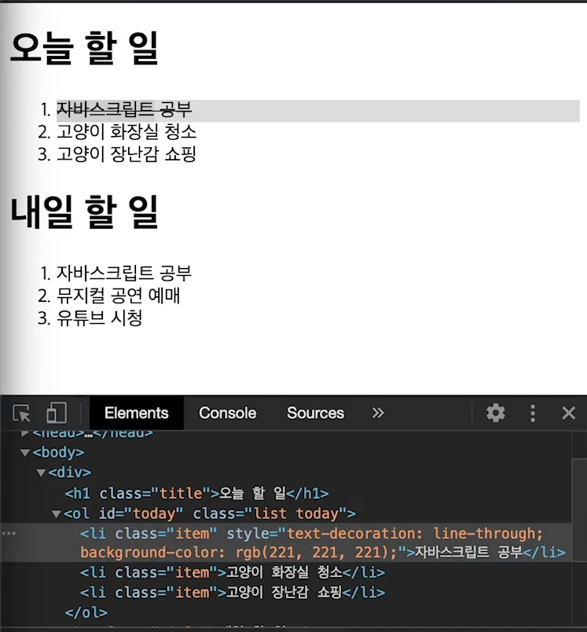

    - **그래서 보통은, 테그의 class를 변경하는 방식이 더욱 권장되는 방식이다.** 2가지 방법이 있다. 

      - today.children[1].className = 'done'; 근데 이렇게 하면, 기존 클래스는 사라진다. 

      - `today.children[1].classList`에 접근해서 수정하는게 좋다. 

        - add: `today.children[1].classList.add('done')`

          여러개 넣고 싶으면, 쉼표로 구분해서 넣으면 된다. `today.children[1].classList.add('done', 'other', 'hi')`

        - Remove: `today.children[1].classList.add('done')` 

          `today.children[1].classList.remove('done', 'hi')`

        - toggle은 있으면 추가하고 없으면 제거하는 방식 

          - `today.children[1].classList.toggle('done') ` 근데 이 경우는 여러개의 클래스를 쓰지는 않는다.
          - 두번째에 특별한 기능이 있다. 
            - `today.children[1].classList.toggle('done', true) ` -> add의 기능만 한다. 
            - `today.children[1].classList.toggle('done', false) ` -> remove의 기능만 한다. 

### 비표준 속성 다루기 

이전까지는 HTML 태그의 속성을 다룰 때, 대부분 [표준 속성](https://html.spec.whatwg.org/#attributes-3)들을 사용했을 겁니다. 하지만 자바스크립트로 HTML 태그를 다루다 보면 때로는 표준이 아닌 속성을 사용하게 될 때도 있는데요.

아래 코드를 한 번 살펴봅시다.

- HTML
- CSS

```html
<!DOCTYPE html>
<html lang="ko">

<head>
  <meta charset="UTF-8">
  <title>JS with Codeit</title>
</head>

<body>
  <p>할 일 : <b field="title"></b></p>
  <p>담당자 : <b field="manager"></b></p>
  <p>상태 : <b field="status"></b></p>
  <div>
    상태 변경: 
    <button class="btn" status="대기중">대기중</button>
    <button class="btn" status="진행중">진행중</button>
    <button class="btn" status="완료">완료</button>
  </div>
  <script src="index.js"></script>
</body>

</html>
```

```css
[status] {
  padding: 5px 10px;
}

[status="대기중"] {
  background-color: #FF6767;
  color: #FFFFFF;
}

[status="진행중"] {
  background-color: #5f62ff;
  color: #FFFFFF;
}

[status="완료"] {
  background-color: #07c456;
  color: #FFFFFF;
}
```


위 코드를 보시면 `b` 태그들의 `field` 속성과 `button` 태그들의 `status` 라는 속성이 보이는데요. 이 두 속성은 해당 태그의 표준 속성이 아닙니다.

그리고 혹시, 위 코드의 css 부분에서 대괄호('[')를 이용한 css 선택자를 처음 보시는 분들도 있을 것 같은데요. `[속성이름]`처럼 대괄호를 이용하면 대괄호 안에 있는 **속성이름**을 가진 태그들을 선택할 수 있고 `[속성이름="값"]`처럼 작성하면, 좀 더 구체적으로 **속성이름**에 해당 **값**을 가진 태그들을 선택할 수도 있습니다.

아무튼, 이런 상황에서 비표준 속성은 어떤 식으로 다룰 수 있는지 한 번 살펴봅시다.

#### 비표준 속성 활용하기

#### 1. 선택자로 활용

가장 간단하게는 아래와 같이 `querySelector`로 태그를 선택할 때 css 선택자를 활용해서 태그를 선택하는 데에 활용할 수도 있습니다.

```js
const fields = document.querySelectorAll('[field]');
console.log(fields);
```


## 2. 값을 표시할 태그를 구분할 때 활용

비표준 속성은 객체 형태의 데이터가 있을 때, 각 프로퍼티 값들이 들어갈 태그를 구분하는데 활용할 수도 있습니다.

```js
const fields = document.querySelectorAll('[field]');
const task = {
  title: '코드 에디터 개발',
  manager: 'CastleRing, Raccoon Lee',
  status: '',
};

for (let tag of fields) {
  const field = tag.getAttribute('field');
  tag.textContent = task[field];
}
```


## 3. 스타일이나 데이터 변경에 활용

`getAttribute` 메소드를 활용해서 속성값을 가져오고, `setAttribute` 메소드를 활용해서 속성값을 설정해주는 원리로 이벤트를 통해 실시간으로 스타일을 변경하거나 데이터를 변경하는데 활용할 수 있습니다.

때로는 `class`를 다루는 것보다 `setAttribute`로 비표준 속성을 변경하는게 스타일을 다루기에 오히려 편리한 경우도 있습니다.

```js
const fields = document.querySelectorAll('[field]');
const task = {
  title: '코드 에디터 개발',
  manager: 'CastleRing, Raccoon Lee',
  status: '',
};

for (let tag of fields) {
  const field = tag.getAttribute('field');
  tag.textContent = task[field];
}

const btns = document.querySelectorAll('.btn');
for (let btn of btns) {
  const status = btn.getAttribute('status');
  btn.onclick = function () {
    fields[2].textContent = status;
    fields[2].setAttribute('status', status);
  };
}
```


# 좀 더 안전하게, dataset 프로퍼티

다양한 방식으로 활용되는 비표준 속성에는 한 가지 문제가 있습니다. 비표준 속성을 사용해 코드를 작성했을 때 시간이 지나서 나중에 그 속성이 표준으로 등록되면 문제가 발생할 수 있다는 건데요. HTML은 아직까지도 개발자들의 요구를 반영하기 위해 계속해서 발전하는 언어입니다. 그래서 이런 경우 예기치 못한 부작용이 발생할 수 있는 것이죠.

예를 들어서, 만약 `glitter`라는 비표준 속성을 만들어서 `glitter` 속성값이 `true`면 마우스를 올렸을 때 주변에 별이 반짝이는 애니메이션이 동작하도록 프로그램를 설계했다고 가정해봅시다. 그런데 갑자기 `glitter`라는 속성이 `true`일 때 태그가 계속 깜빡거리는 기능을 하는 표준으로 생겨나버리면 우리가 처음에 설계한 방식대로 동작하지 않을 수 있겠죠?

그래서 비표준 속성을 사용하기 위해 미리 약속된 방식이 존재하는데요. 바로 `data-*` 속성입니다.

`data-`로 시작하는 속성은 모두 dataset이라는 프로퍼티에 저장되는데요. 예를 들어서 `data-status`라는 속성이 있다면, `element.dataset.status`라는 프로퍼티에 접근해서 그 값을 가져올 수 있는 것이죠.

그래서 본문의 코드도 아래와 같이 고치고,

- HTML
- CSS

```html
<!DOCTYPE html>
<html lang="ko">

<head>
  <meta charset="UTF-8">
  <title>JS with Codeit</title>
</head>

<body>
  <p>할 일 : <b data-field="title"></b></p>
  <p>담당자 : <b data-field="manager"></b></p>
  <p>상태 : <b data-field="status"></b></p>
  <div>
    상태 변경: 
    <button class="btn" data-status="대기중">대기중</button>
    <button class="btn" data-status="진행중">진행중</button>
    <button class="btn" data-status="완료">완료</button>
  </div>
  <script src="index.js"></script>
</body>

</html>
```

결과 확인

자바스크립트 코드도 다음과 같이 고쳐주면,

```js
const fields = document.querySelectorAll('[data-field]');
const task = {
  title: '코드 에디터 개발',
  manager: 'CastleRing, Raccoon Lee',
  status: '',
};

for (let tag of fields) {
  const field = tag.dataset.field;
  tag.textContent = task[field];
}

const btns = document.querySelectorAll('.btn');
for (let btn of btns) {
  const status = btn.dataset.status;
  btn.onclick = function () {
    fields[2].textContent = status;
    fields[2].dataset.status = status;
  };
}
```

조금 더 안전하게 비표준 속성을 활용할 수 있습니다.

# 동작확인하기

아래 코드를 실행해서 상태변경 버튼을 클릭해 보세요! :)

- HTML
- CSS

```html
<!DOCTYPE html>
<html lang="ko">

<head>
  <meta charset="UTF-8">
  <title>JS with Codeit</title>
</head>

<body>
  <p>할 일 : <b data-field="title"></b></p>
  <p>담당자 : <b data-field="manager"></b></p>
  <p>상태 : <b data-field="status"></b></p>
  <div>
    상태 변경: 
    <button class="btn" data-status="대기중">대기중</button>
    <button class="btn" data-status="진행중">진행중</button>
    <button class="btn" data-status="완료">완료</button>
  </div>
  <script>
    const fields = document.querySelectorAll('[data-field]');
    const task = {
      title: '코드 에디터 개발',
      manager: 'CastleRing, Raccoon Lee',
      status: '',
    };

    for (let tag of fields) {
      const field = tag.dataset.field;
      tag.textContent = task[field];
    }

    const btns = document.querySelectorAll('.btn');
    for (let btn of btns) {
      const status = btn.dataset.status;
      btn.onclick = function () {
        fields[2].textContent = status;
        fields[2].dataset.status = status;
      };
    }
  </script>
</body>

</html>
```

결과 확인

##### 마무리

사실 비표준 속성을 활용하는 것은 개발자의 선택적인 부분입니다. 반드시 비표준 속성을 활용해야만 하는 상황은 아마 없을지도 모릅니다.  하지만 상황에 따라서 비표준 속성이 필요할 수도 있고 혹은 비표준 속성을 활용하는 것이 조금 더 효율적일 수도 있으니 다양한 상황들을 고려해서, 만약 비표준 속성을 활용해야 한다면 `data-*`형태와 `dataset`프로퍼티를 사용하는 것이 조금 더 안전하다는 점도 꼭 잊지 말고 기억해두시면 좋을 것 같습니다.


## 이벤트 핸들러

- onClick의 경우는 딱 하나만 가능해서, 덮어씌워 버릴 수 있는 문제가 있다. 

- `btn.addEventListner(eventType, eventHandler)`

  `btn.addEventListner(eventType, eventHandler)`

- `btn.removeEventListner('click', event2)`를 통해 개별적으로 제거도 가능하다. 

- 다만, 참고로

  참고로 `removeEventListener` 메소드는 파라미터로 전달하는 **타입**과 **이벤트 핸들러**가 `addEventListener` 메소드로 **등록할 때와 동일 할 때만 이벤트 핸들러를 삭제할 수 있습니다.**

- 다양한 이벤트

  아직까진 `click` 이벤트 하나만에 대해서만 배웠는데요, 이 외에도 사용자의 동작에 따라 반응할 수 있는 다양한 이벤트들이 있습니다.

  이후에도 천천히 살펴볼 예정이지만 어떤 종류의 이벤트들이 있는지 미리 알아두면 필요할 때 알맞은 이벤트 핸들러를 설정할 수 있겠죠?

  처음에는 가볍게 참고만 해뒀다가, 나중에 다양한 이벤트들을 살펴본 다음 다시 돌아와 복습한다면 훨씬 더 도움이 될거예요! :)

  ##### 마우스 이벤트

  | 이벤트 타입   | 설명                                                         |
  | :------------ | :----------------------------------------------------------- |
  | `mousedown`   | 마우스 버튼을 누르는 순간                                    |
  | `mouseup`     | 마우스 버튼을 눌렀다 떼는 순간                               |
  | `click`       | 왼쪽 버튼을 클릭한 순간                                      |
  | `dblclick`    | 왼쪽 버튼을 빠르게 두 번 클릭한 순간                         |
  | `contextmenu` | 오른쪽 버튼을 클릭한 순간                                    |
  | `mousemove`   | 마우스를 움직이는 순간                                       |
  | `mouseover`   | 마우스 포인터가 요소 위로 올라온 순간                        |
  | `mouseout`    | 마우스 포인터가 요소에서 벗어나는 순간                       |
  | `mouseenter`  | 마우스 포인터가 요소 위로 올라온 순간 (버블링이 일어나지 않음) |
  | `mouseleave`  | 마우스 포인터가 요소에서 벗어나는 순간 (버블링이 일어나지 않음) |

  ##### 키보드 이벤트

  | 이벤트 타입 | 설명                                                         |
  | :---------- | :----------------------------------------------------------- |
  | `keydown`   | 키보드의 버튼을 누르는 순간                                  |
  | `keypress`  | 키보드의 버튼을 누르는 순간 ('a', '5' 등 출력이 가능한 키에서만 동작하며, Shift, Esc 등의 키에는 반응하지 않음) |
  | `keyup`     | 키보드의 버튼을 눌렀다 떼는 순간                             |

  ##### 포커스 이벤트

  | 이벤트 타입 | 설명                                                         |
  | :---------- | :----------------------------------------------------------- |
  | `focusin`   | 요소에 포커스가 되는 순간                                    |
  | `focusout`  | 요소로부터 포커스가 빠져나가는 순간                          |
  | `focus`     | 요소에 포커스가 되는 순간 (버블링이 일어나지 않음)           |
  | `blur`      | 요소로부터 포커스가 빠져나가는 순간 (버블링이 일어나지 않음) |

  ##### 입력 이벤트

  | 이벤트 타입 | 설명                             |
  | :---------- | :------------------------------- |
  | `change`    | 입력된 값이 바뀌는 순간          |
  | `input`     | 값이 입력되는 순간               |
  | `select`    | 입력 양식의 하나가 선택되는 순간 |
  | `submit`    | 폼을 전송하는 순간               |

  ##### 스크롤 이벤트

  | 이벤트 타입 | 설명                  |
  | :---------- | :-------------------- |
  | `scroll`    | 스크롤 바가 움직일 때 |

  ##### 윈도우 창 이벤트

  | 이벤트 타입 | 설명                           |
  | :---------- | :----------------------------- |
  | `resize`    | 윈도우 사이즈를 움직일 때 발생 |


### 이벤트 객체

- 예를 들어, 어디를 클릭했는지, 어떤 타이핑을 했는지 등을 알려면, event 객체에 접근해야 한다. 

  - 이벤트 핸들러가 되는 함수의 첫번째 파라미터로는 이벤트 객체가 전달된다. 

    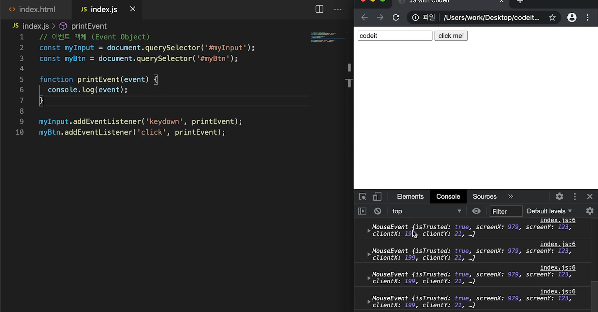

  - 이 중 공통적으로 많이 사용되는 프로퍼티는, type과 target. 

    - type은 발생한 이벤트의 타입

    - target은 요소를 담고 있다. 그 돔 요소를 담고 있어서, 이벤트 발생한 상황에서 그 객체에 뭔가 해야할때 유용하게 사용된다. 

      ```
      function printEvent(event){
      	event.target.style.color = "red"
      }
      ```

  - 지난 시간에 이벤트 핸들러의 첫번째 파라미터에는 자동으로 이벤트 객체가 전달된다는 걸 배웠습니다. 그리고 그 이벤트 객체는 이벤트 타입에 따라서 갖고 있는 프로퍼티들이 조금씩 다른데요.

    이번 시간에는 자주 사용되는 이벤트 객체의 프로퍼티들을 한 번 정리해 봅시다.

    ##### 1. 공통 프로퍼티

    아래의 프로퍼티들은 이벤트 타입과 상관없이 모든 이벤트 객체들이 공통적으로 가지고 있는 프로퍼티입니다.

    | 프로퍼티        | 설명                                                     |
    | :-------------- | :------------------------------------------------------- |
    | `type`          | 이벤트 이름 ('click', 'mouseup', 'keydown' 등)           |
    | `target`        | 이벤트가 발생한 요소                                     |
    | `currentTarget` | 이벤트 핸들러가 등록된 요소                              |
    | `timeStamp`     | 이벤트 발생 시각(페이지가 로드된 이후부터 경과한 밀리초) |
    | `bubbles`       | 버블링 단계인지를 판단하는 값                            |

    ##### 2. 마우스 이벤트

    마우스와 관련된 이벤트의 경우에는 아래와 같은 이벤트 객체의 프로퍼티들을 가지고 있습니다.

    | 프로퍼티           | 설명                                                         |
    | :----------------- | :----------------------------------------------------------- |
    | `button`           | 누른 마우스의 버튼 (0: 왼쪽, 1: 가운데(휠), 2: 오른쪽)       |
    | `clientX, clientY` | 마우스 커서의 브라우저 표시 영역에서의 위치                  |
    | `pageX, pageY`     | 마우스 커서의 문서 영역에서의 위치                           |
    | `offsetX, offsetY` | 마우스 커서의 이벤트 발생한 요소에서의 위치                  |
    | `screenX, screenY` | 마우스 커서의 모니터 화면 영역에서의 위치                    |
    | `altKey`           | 이벤트가 발생할 때 alt키를 눌렀는지                          |
    | `ctrlKey`          | 이벤트가 발생할 때 ctrl키를 눌렀는지                         |
    | `shiftKey`         | 이벤트가 발생할 때 shift키를 눌렀는지                        |
    | `metaKey`          | 이벤트가 발생할 때 meta키를 눌렀는지 (window는 window키, mac은 cmd키) |

    ##### 3. 키보드 이벤트

    키보드와 관련된 이벤트의 경우에는 아래와 같은 이벤트 객체의 프로퍼티들을 가지고 있습니다.

    | 프로퍼티   | 설명                                                         |
    | :--------- | :----------------------------------------------------------- |
    | `key`      | 누른 키가 가지고 있는 값                                     |
    | `code`     | 누른 키의 물리적인 위치                                      |
    | `altKey`   | 이벤트가 발생할 때 alt키를 눌렀는지                          |
    | `ctrlKey`  | 이벤트가 발생할 때 ctrl키를 눌렀는지                         |
    | `shiftKey` | 이벤트가 발생할 때 shift키를 눌렀는지                        |
    | `metaKey`  | 이벤트가 발생할 때 meta키를 눌렀는지 (window는 window키, mac은 cmd키) |

    이 프로퍼티들은 자주 사용되는 프로퍼티일 뿐 이벤트 객체의 모든 프로퍼티가 아닙니다. 혹시 이벤트 객체의 더 많은 프로퍼티들이 궁금하시다면 아래 링크를 참고해 보세요! :)

    - [이벤트](https://developer.mozilla.org/en-US/docs/Web/API/Event)
    - [마우스 이벤트](https://developer.mozilla.org/en-US/docs/Web/API/MouseEvent)
    - [키보드 이벤트](https://developer.mozilla.org/en-US/docs/Web/API/KeyboardEvent)


#### 이벤트 버블링 

- `자바스크립트 공부`에 할당된 이벤트를 발생시켰더니, 거기에 할당된 이벤트핸들러가 동작하고, 같은 타입의 이벤트(e.g. click 등)에 한해서 부모요소의 이벤트까지 동작하는 것. 그런 원리로, `자바스크립트 공부` 를 클릭했더니, 그 위의 부모에 걸려있는 모든 click 이벤트가 window만날 때까지 쭉 다 동작한다. 아래에서는, list, content의 이벤트까지 쫙 다 발생한 것. 

  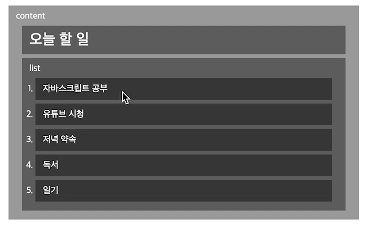

  근데 재밌는 점은, 타겟(이벤트 발생하는 돔)은 변하지 않음. 타겟 다 console.log했는데, 아래처럼 window로 올라갈때 까지, 아래처럼만 출력함. 즉, 이벤트 버블링이 일어나도, 이벤트 객체의 타겟 프로퍼티는 변하지 않는다. **시작점을 계속 담고 있다.** 

  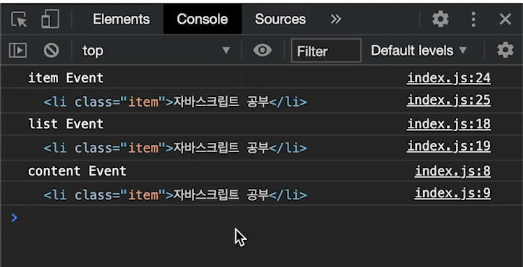

  만약 현재 딱 그 요소에 접근하고 싶다면? `currentTarget`을 활용하면 된다. 

  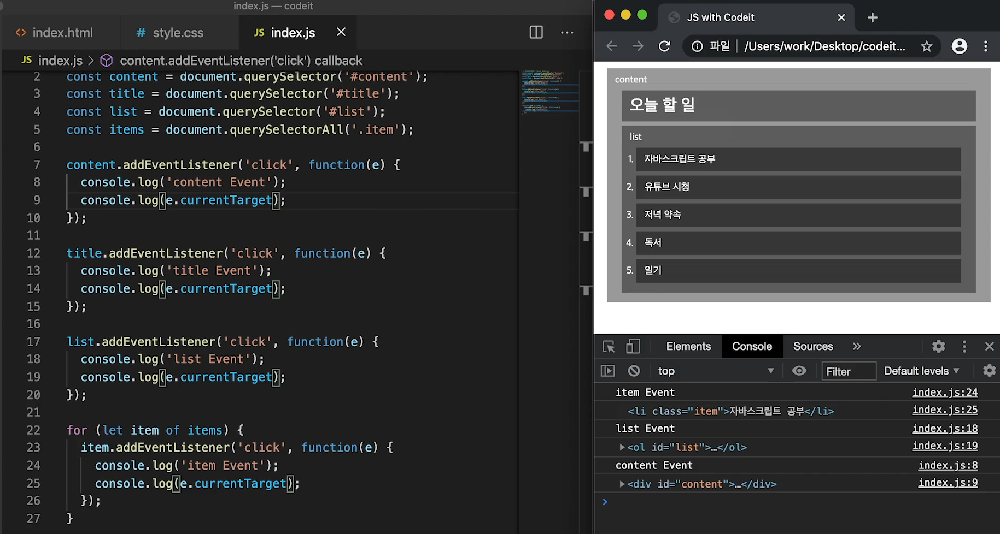

  단, 이벤트 객체의 `stopPropagation` 을 활용하면, 간단하게 이벤트를 멈출 수 있다. 

  그러나, 권장하지 않는다. 그거때문에 상위 이벤트에서 이벤트 발생할 때 꼬일 수 있다. 

  [Capturing Video - 필수시청](https://www.youtube.com/watch?v=7gKtNC3b_S8)

  이벤트엔 버블링 이외에도 **‘캡처링(capturing)’** 이라는 흐름이 존재합니다.  실제 코드에서 자주 쓰이진 않지만, 상황에 따라 필요할 수도 있으니 간단하게 살펴봅시다.

  먼저, 표준 [DOM 이벤트](https://www.w3.org/TR/DOM-Level-3-Events/)에서 정의한 이벤트 흐름에는 3가지 단계가 있습니다.

  1. 캡처링 단계: 이벤트가 하위 요소로 전파되는 단계
  2. 타깃 단계: 이벤트가 실제 타깃 요소에 전달되는 단계
  3. 버블링 단계: 이벤트가 상위 요소로 전파되는 단계

  **버블링 단계**는 이미 지난 시간에 배웠죠? **타깃 단계**는 이벤트 객체의 `target` 프로퍼티가 되는 요소에 등록되어있던 이벤트 핸들러가 동작하는 단계인데, 쉽게 생각해서 **가장 처음 이벤트 핸들러가 동작하게 되는 순간**이라고 생각하시면 됩니다.

  자, 그럼 이제 **캡쳐링**에 대해서 좀 더 알아볼까요?

  #### 캡쳐링

  ```html
  <!DOCTYPE html>
  <html lang="ko">
    <head>
      <meta charset="UTF-8">
      <title>JS with Codeit</title>
    </head>
    <body>
      <div id="content">
        <h1 id="title">오늘 할 일</h1>
        <ol id="list">
          <li class="item">자바스크립트 공부</li>
          <li class="item">독서</li>
        </ol>
      </div>
      <script src="index.js"></script>
    </body>
  </html>
  ```

  만약 위 코드에서 **자바스크립트 공부**를 클릭한다면, 버블링은 `li`태그 부터, `ol`태그, `div`태그, `body`태그, `html`태그, `document`, `window` 객체로 이벤트가 전파가 된다는 거 알고 계시죠? **캡쳐링**은 **이벤트가 발생하면 가장 먼저, 그리고 버블링의 반대 방향으로 진행되는 이벤트 전파 방식**입니다.

  아래 이미지를 한번 보세요.

  

  이벤트가 발생하면 가장 먼저 `window` 객체에서부터 `target` 까지 이벤트 전파가 일어납니다. (캡쳐링 단계) 그리고 나서 타깃에 도달하면 타깃에 등록된 이벤트 핸들러가 동작하고, (타깃 단계) 이후 다시 `window` 객체로 이벤트가 전파됩니다. (버블링 단계)

  이런 과정을 통해 각 요소에 할당된 이벤트 핸들러가 호출되는데요.

  캡쳐링 단계에서 이벤트를 발생시켜야 하는 일은 매우 드문 경우입니다. 보통 타깃 단계에서 `target`에 등록된 이벤트 핸들러가 있으면 해당 이벤트 핸들러가 먼저 동작한 이 후에 버블링 단계에서 각 부모 요소에 등록된 이벤트 핸들러가 있으면 그 때 해당 이벤트 핸들러가 동작하는 것이 일반적인데요.

  하지만 상황에 따라서는 캡쳐링 단계에서 부모 요소의 이벤트 핸들러를 동작시켜야 할 수도 있겠죠? 캡쳐링 단계에서 이벤트 핸들러를 동작시키려면, `addEventListener`에 세번째 프로퍼티에 `true` 또는 `{ capture:true }`를 전달하면 됩니다. 아래 코드를 실행해서 각 태그들을 클릭해 보세요.

  - HTML
  - CSS

  ```html
  <!DOCTYPE html>
  <html lang="ko">
  <head>
    <meta charset="UTF-8">
    <title>Codeit Acid Rain</title>
    <link rel="stylesheet" href="style.css">
  </head>
  <body>
    <div>DIV
      <ul>UL
        <li>LI</li>
      </div>
    </form>
    
    <script>
      for (let elem of document.querySelectorAll('*')) {
        elem.addEventListener("click", e => alert(`캡쳐링 단계: ${elem.tagName}`), true);
        elem.addEventListener("click", e => alert(`버블링 단계: ${elem.tagName}`));
      }
    </script>
  </body>
  </html>
  ```

  결과 확인

  앞서 언급한 것처럼 캡쳐링은 흔하게 접할 만한 상황이 아니기 때문에 일부러 간략하게만 다뤘습니다.

  혹시나 캡쳐링과 함께 자바스크립트의 이벤트에 더 궁금한 부분이 있다면 아래 링크를 참고해 주세요! :)

  - [표준 DOM 이벤트](https://www.w3.org/TR/DOM-Level-3-Events/)
  - [자바스크립트의 이벤트 순서](https://www.quirksmode.org/js/events_order.html#link4)
  - [addEventListner에 캡쳐링 단계 적용하기](https://developer.mozilla.org/ko/docs/Web/API/EventTarget/addEventListener)

  

#### 이벤트 위임 

- 아래는 단순하게, for loop 돌면서 이벤트 등록했음. 그런데, 문제는 아래처럼 새롭게 등록했을때 거기에는 이벤트가 등록이 안됨. 이러면, 또 새롭게 이벤트를 넣어야돼. **이벤트 버블링을 활용하면 된다.** 

  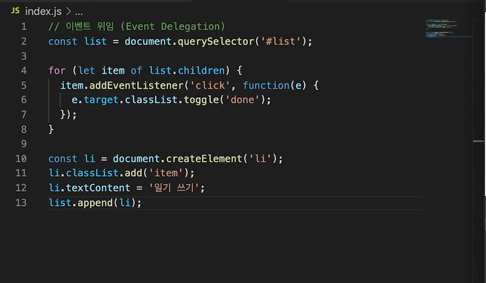

  **부모요소**에만 이벤트를 등록하면 된다. 이렇게 자식요소에서 발생하는 이벤트를 부모요소에서 다루는 방식을 이벤트 위임, event delegation이라고 부른다. [설명 영상](https://www.youtube.com/watch?v=oSUchyz_UiM)

  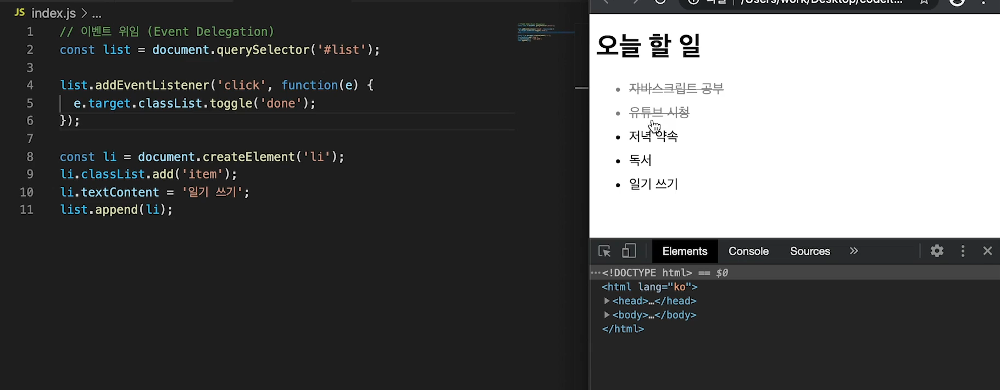

  근데, 여기서 문제가 부모 요소에 등록된 이벤트라서 자식 요소 말고 말 그대로 부모 요소를 클릭해도 똑같이 이벤트가 실행되버려. 

  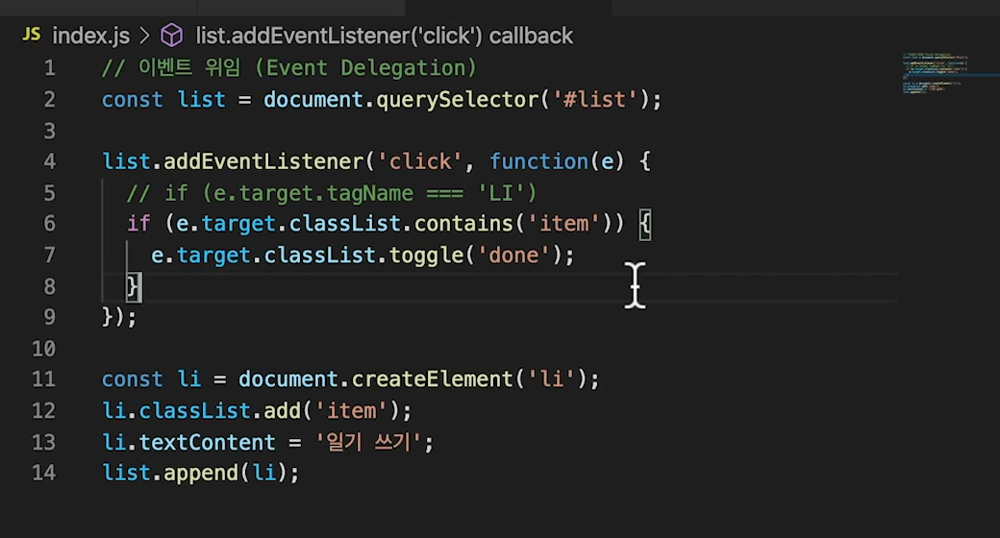


### 브라우저 기본동작

- 대부분은 기본 동작을 다 포함하고 있음

  - 예를 들어, a를 눌렀을때 링크로 가고 checkbox를 눌렀을 때 체크가 되고 그런 것. 우리가 설정한 적이 없잖아. 
  - input은 커서에서 우리가 입력을 할 수 있고 그런 것. 

- 상황에 따라서 우리가 이것을 원하지 않는다면?

  - 예를 들어, a테그의 href를 원하지 않으면?

    ```javascript
    link.addEventListner('click', function(e){
    	e.preventDefault();
    	alert('지금은 이동할 수 없습니다.');
    })
    ```

  - 마우스 우클릭 방지

    ```javascript
    text.addEventListner('contextmenu', function(e){
    	e.preventDefault()
    	alert('마우스 오른쪽 클릭은 사용할 수 없습니다.')
    })
    ```

    - 문서 전체의 마우스 오른쪽 클릭을 막고 싶다면, 

      ```javascript
      document.addEventListner('contextmenu', function(e){
      	e.preventDefault()
      	alert('마우스 오른쪽 클릭은 사용할 수 없습니다.')
      })
      ```

      


### 다양한 이벤트

- 마우스 버튼 이벤트

  > MouseEvent.button
  >
  > 0. 마우스 왼쪽 버튼
  > 1. 마우스 휠
  > 2. 마우스 오른쪽 버튼

  > MouseEvent.type
  >
  > click: 마우스 왼쪽 버튼을 눌렀을 때
  >
  > contextmemu: 마우스 오른쪽 버튼을 눌렀을 때
  >
  > dbclick: 동일한 위치에서 빠르게 두번 click 할 때. 
  >
  > mousedown: 마우스 버튼을 누른 순간
  >
  > mouseup: 마우스 버튼을 눌렀다 뗀 순간

- 이게 순서도 꽤 중요하다 

  - 예를 들어 마우스를 클릭하면,

    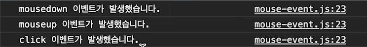

  - 더블클릭은? 클릭이 두번 발생하고 더블클릭이 발생하네

    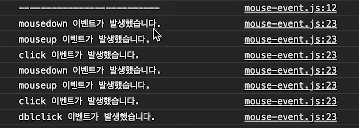

  - 심지어 마우스 오른쪽버튼은 순서가 운영체제마다 다를 수 있음. 

    ```javascript
    const flagBlue = document.querySelector('.flag-blue');
    const flagWhite = document.querySelector('.flag-white');
    
    function reset() {
      document.querySelector('.up').classList.remove('up');
    }
    
    // 1. flagUp 함수를 완성해 주세요.
    function flagUp(e) {
      if (e.button === 0) {
        flagBlue.classList.add('up');
      } else if (e.button === 2) {
        flagWhite.classList.add('up');
      }
    
      // 500 밀리초 뒤에 reset함수를 실행
      setTimeout(reset, 500);
    }
    
    
    // contextmenu일때의 이벤트는 막은거네
    // 2. 마우스 오른쪽 버튼 클릭시 나타나는 메뉴창을 막아주세요. 
    document.addEventListener('contextmenu', function (event) {
      event.preventDefault();
    });
    
    // 테스트 코드
    document.addEventListener('mousedown', flagUp);
    ```

    

  > MouseEvent.type
  >
  > - mousemove: 마우스 포인터가 이동할 때
  > - mouseover: 마우스 포인터가 요소 밖에서 안으로 이동할 때
  > - mouseout: 마우스 포인터가 요소 안에서 밖으로 이동할 때

  - ```javascript
    const box1 = document.querySelector('#box1')
    function onMouseMove(){
    	console.log('mouse is moving!')
    }
    
    box1.addEventListenr('mousemove', onMouseMove);
    ```

    위 마우스 동작들은 아래 마우스 프로퍼티들이 자주 같이 활용되곤 함 

    - MouseEvent.clientX, clientY: 화면에 표시되는 창 기준 마우스 포인터의 위치

    - MouseEvent.pageX, pageY: 웹 문서 전체 기준 마우스 포인터 위치

    - MouseEvent.offsetX, offsetY: 이벤트가 발생한 요소 기준 마우스 포인터 위치

      ```javascript
      function onMouseMove(e){
      	console.log(e.clientX, e.clientY)
        console.log(e.pageX, e.pageY)
        console.log(e.offsetX, e.offsetY)
      }
      ```

      마우스 이벤트를 다룰 때 자주 사용되는 이벤트 객체의 프로퍼티인 `clientXY, pageXY, offsetXY`에 대해서 한 번 더 짚고 넘어갑시다!

      #### 1. clientX, clientY

      `client` 프로퍼티는 말 그대로 **클라이언트 영역 내에서 마우스의 좌표 정보**를 담고있는데요. **클라이언트 영역이란 이벤트가 발생한 순간에 브라우저가 콘텐츠를 표시할 수 있는 영역**을 뜻합니다.

      clientX : 브라우저가 표시하는 화면 내에서 마우스의 X좌표 위치를 담고 있습니다. clientY : 브라우저가 표시하는 화면 내에서 마우스의 Y좌표 위치를 담고 있습니다.

      `client` 값은 **그 순간 보여지는 화면을 기준으로 계산**하기 때문에 스크롤 위치와는 무관하게 **항상 보여지는 화면의 좌측 상단의 모서리 위치를 (0, 0)으로 계산**합니다.

      #### 2. offsetX, offsetY

      `offset` 프로퍼티는 **이벤트가 발생한 target이 기준**이 됩니다.

      offsetX : 이벤트가 발생한 `target` 내에서 마우스의 X좌표 위치를 담고 있습니다. offsetY : 이벤트가 발생한 `target` 내에서 마우스의 Y좌표 위치를 담고 있습니다.

      `offset` 값도 **이벤트가 발생한 대상을 기준으로 계산**하기 때문에 스크롤 위치와는 무관하게 **항상 대상의 좌측 상단의 모서리 위치를 (0, 0)으로 계산**합니다.

      #### s3. pageX, pageY

      page 프로퍼티는 **전체 문서를 기준**으로 마우스 좌표 정보를 담고 있습니다. 그렇기 때문에 스크롤로 인해서 보이지 않게된 화면의 영역까지 포함해서 측정한다는 점이 앞의 두 프로퍼티와의 차이점 입니다.

      pageX : 전체 문서 내에서 마우스의 X좌표 위치를 담고 있습니다. pageY : 전체 문서 내에서 마우스의 Y좌표 위치를 담고 있습니다.

      자칫 `client` 값과 혼동하기 쉬우니 잘 구분해 두시는 것이 좋습니다.

      # 그림으로 정리하기

      그림으로 정리하면 좀 더 이해하기 쉬울테니 참고해 두시면 좋을 것 같아요! :)

      

- 마우스 오버와 마우스 타입

  ```javascript
  
  /** 
   * [마우스 이동 이벤트]
   * 
   * > MouseEvent.type
   * mousemove: 마우스 포인터가 움직일 때
   * mouseover: 마우스 포인터가 요소 밖에서 안으로 움직일 때
   * mouseout: 마우스 포인터가 요소 안에서 밖으로 움직일 때 
   * 
   * > MouseEvent.target
   * : 이벤트가 발생한 요소
   * 
   * > MouseEvent.relatedTarget
   * : 이벤트가 발생하기 직전(또는 직후)에 마우스가 위치해 있던 요소
   */
   
   
   
  const box2 = document.querySelector('#box2');
  
  function printEventData(e) {
    console.log('event:', e.type);
    console.log('target:', e.target);
    console.log('relatedTarget:', e.relatedTarget);
    console.log('------------------------------------');
    if (e.target.classList.contains('cell')) {
      e.target.classList.toggle('on');
    }
  }
  
  box2.addEventListener('mouseover', printEventData);
  box2.addEventListener('mouseout', printEventData);
  
  ```

- #### mouseenter, mouseleave

  마우스 이벤트 타입에는 `mouseover, mouseout`과 비슷한 `mouseenter`와 `mouseleave`라는 타입이 있습니다.

  이름에서도 알 수 있듯이  `mouseenter`는 `mouseover`처럼 **마우스 포인터가 요소 바깥에서 안쪽으로 들어갈 때**, `mouseleave`는 `mouseout`처럼 **마우스 포인터가 요소 안쪽에서 바깥으로 나갈 때** 발생하는데요.

  그럼 `mouseover, mouseout`과 어떤 차이가 있을까요?

  일단 아래의 결과보기 버튼을 눌러서 코드를 한 번 실행해 봅시다.

  - HTML

  ```html
  <!DOCTYPE html>
  <html lang="ko">
    <head>
      <meta charset="UTF-8">
      <link rel="stylesheet" href="style.css">
      <title>JS with Codeit</title>
    </head>
    <body>
      <div id="box1" class="box">
        <b class="title">mouseover event count: 0</b>
      </div>
  
      <div id="box2" class="box">
        <b class="title">mouseenter event count: 0</b>
      </div>
      <script>
        const box1 = document.querySelector('#box1');
        const box2 = document.querySelector('#box2');
  
        let mouseenterCount = 0;
        let mouseoverCount = 0;
  
        box1.addEventListener('mouseover', function () {
          mouseenterCount++;
          const msg = `mouseover event count: ${mouseenterCount}`;
          box1.lastElementChild.textContent = msg;
        });
  
        box2.addEventListener('mouseenter', function () {
          mouseoverCount++;
          const msg = `mouseenter event count: ${mouseoverCount}`;
          box2.lastElementChild.textContent = msg;
        });
      </script>
    </body>
  </html>
  ```

  

  위 코드에서는 `mouseover`와 `mouseenter`를 비교했지만, `mouseout`과 `mouseleave`의 관계도 동일하다는 점 참고해주세요! :)

  아무튼, 이 둘의 차이를 살펴봅시다.

  ##### 1. 버블링이 일어나지 않는다.

  `mouseenter`와 `mouseleave`는 **버블링이 일어나지 않습니다.**

  위 코드 결과에서 `mouseover` 타입으로 이벤트 핸들러가 등록된 `div#box1`요소(왼쪽)에서 마우스를 움직여 보세요.

  당연히 해당 요소 바깥에서 안쪽으로 마우스 커서가 이동할 때도 이벤트가 발생하지만, **버블링과 이벤트 위임**의 원리로 자식요소인 `b.title` 부분으로 마우스 커서가 이동할 때도 이벤트가 발생합니다.

  하지만 `mouseenter` 타입으로 이벤트 핸들러가 등록된 `div#box2`요소(오른쪽)에서는 해당 요소 바깥에서 안쪽으로 마우스 커서가 이동할 때만 이벤트 핸들러가 동작하는 모습을 확인할 수 있습니다.

  #### 2. 자식 요소의 영역을 계산하지 않는다.

  `mouseenter`와 `mouseleave`는 **자식 요소의 영역을 계산하지 않습니다.**

  다시 `mouseover` 타입으로 이벤트 핸들러가 등록된 `div#box1`요소(왼쪽)에서 마우스를 움직여 봅시다.

  버블링에 의해 자식 요소로 마우스 커서가 이동할 때도 이벤트 핸들러가 동작하지만, 자식 요소에서 다시 `div#box1`요소로 마우스 커서가 이동할 때도 이벤트 핸들러가 동작하죠? `mouseover`는 자식 요소의 영역을 구분하기 때문입니다.

  반면, `mouseenter`는 자식 요소의 영역을 구분하지 않기 때문에 `mouseenter` 타입으로 이벤트 핸들러가 등록된 `div#box2`요소(오른쪽)에서는 자식 요소에서 이벤트 핸들러가 동작하지 않는 것뿐만 아니라 자식 요소의 영역에 들어갔다 나올 때도 이벤트 핸들러가 동작하지 않는 모습을 볼 수 있습니다.

  #### 정리

  `mouseover/mouseout`과 비교하면서 `mouseenter/mouseleave`에 대해 살펴봤는데요. 간단하게 정리하면, **이벤트가 자식 요소에 영향끼치는지**가 둘의 가장 큰 차이라고 할 수 있습니다.

  그래서 이벤트 핸들러가 자식 요소에까지 영향을 끼치게 하고싶은 경우에는 `mouseover/mouseout`을, 자식 요소에는 영향을 끼치지 않고 해당 요소에만 이벤트 핸들러를 다루고자 한다면 `mouseenter/mouseleave`를 활용하면 좋겠죠?

  ```javascript
  // showTitle 함수를 완성해 주세요.
  function showTitle(e) {
  	// 여기에 코드를 작성해 주세요.
    if (e.target.dataset.title){
      const span = document.createElement('span');
      span.classList.add('title')
      span.textContent = e.target.dataset.title
      e.target.append(span)
    }
  }
  
  // removeTitle 함수를 완성해 주세요.
  function removeTitle(e) {
    if (e.target.dataset.title) {
      e.target.lastElementChild.remove();
    }
  }
  
  // '대상'과 '타입'을 수정해 주세요.
  map = document.querySelector('.map')
  map.addEventListener('mouseover', showTitle);
  map.addEventListener('mouseout', removeTitle);
  
  // 대상.addEventListener('타입', showTitle);
  // 대상.addEventListener('타입', removeTitle);
  ```

  


- 키보드 이벤트 

  - ```javascript
    /** 
     * [키보드 이벤트]
     * 
     * > KeyboardEvent.type
     * keydown: 키보드 버튼을 누른 순간
     * keypress: 키보드 버튼을 누른 순간 - 출력과 같이 이벤트가 변화하는 곳에서만 발생함. esc, shift같은 기능적 키에서는 발생하지 않는다. 영어가 아닐 때, 반응 안하기도 함. 권장 안함. 
     * keyup: 키보드 버튼을 눌렀다 뗀 순간
     *
     
     * > KeyboardEvent.key
     * : 이벤트가 발생한 버튼의 값
     * 
     * > KeyboardEvent.code
     * : 이벤트가 발생한 버튼의 키보드에서 물리적인 위치
     */
    ```

- 테그 다루기

  - ```javascript
    /**
     * [input 태그 다루기]
     *  
     * > 포커스 이벤트
     * focusin: 요소에 포커스가 되었을 때
     * focusout: 요소에 포커스가 빠져나갈 때
     * focus: 요소에 포커스가 되었을 때 (버블링 x)
     * blur: 요소에 포커스가 빠져나갈 때 (버블링 x)
     * 
     * > 입력 이벤트
     * input: 사용자가 입력을 할 때 - 말 그대로 입력될때 이기 때문에, esc, shift 등에서는 발생하지 않음. 
     * change: 요소의 값이 변했을 때 - 입력이 시작되기 전과, 최종적으로 완료되었을 때(포커스 빠져나갈때) 값이 다르면 change 이벤트가 발생하는 것. focusout직전에 발생. 값이 변했을때만 발생. 
     */
    
    const el = document.querySelector('#form');
    
    function printEventType(e) {
      console.log('type:', e.type);
      console.log('target:', e.target);
      console.log('---------');
    }
    
    el.addEventListener('focusin', printEventType);
    el.addEventListener('focusout', printEventType);
    el.addEventListener('input', printEventType);
    el.addEventListener('change', printEventType);
    ```

  - ```javascript
    
    const input = document.querySelector('#input');
    
    function checker() {
      const words = document.querySelectorAll('.word');
      if (words.length === 0) {
        alert('Success!👏🏻');
        if(confirm('retry?')) {
          window.location.reload();
        }
      }
    }
    
    function removeWord() {
      const word = document.querySelector(`[data-word="${input.value}"]`);
      if (word) {
        word.remove();
        checker();
      }
    
      input.value = '';
    }
    
    input.addEventListener('change', removeWord);
    ```

  - 스크롤 이벤트

    ```js
    // Scroll 이벤트
    let lastScrollY = 0;
    
    function onSroll() {
      const nav = document.querySelector('#nav');
      const toTop = document.querySelector('#to-top');
      const STANDARD = 30;
      
      if (window.scrollY > STANDARD) { // 스크롤이 30px을 넘었을 때
        nav.classList.add('shadow');
        toTop.classList.add('show');
      } else { // 스크롤이 30px을 넘지 않을 때
        nav.classList.remove('shadow');
        toTop.classList.remove('show');
      } 
    
    	if (window.scrollY > lastScrollY) { // 스크롤 방향이 아랫쪽 일 때
        nav.classList.add('lift-up');
      } else { // 스크롤 방향이 윗쪽 일 때
        nav.classList.remove('lift-up');
      }
    
      lastScrollY = window.scrollY;
    }
    
    window.addEventListener('scroll', onSroll);
    ```

    

