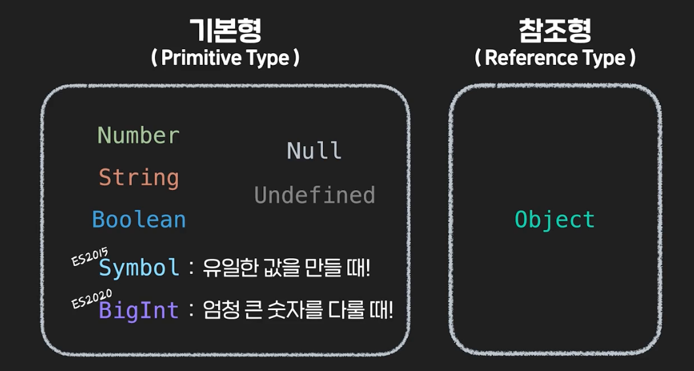
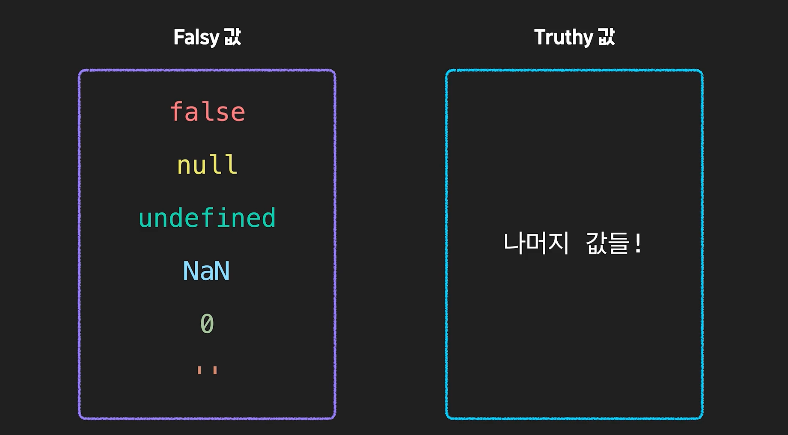
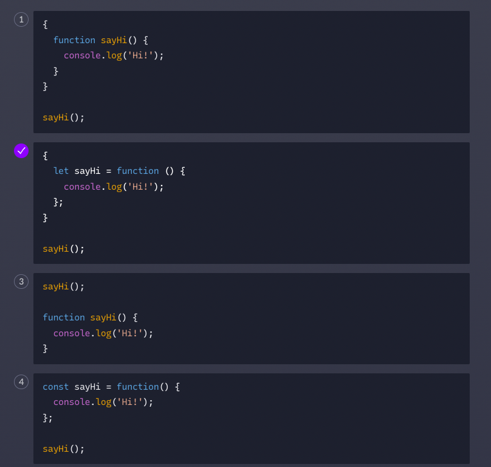
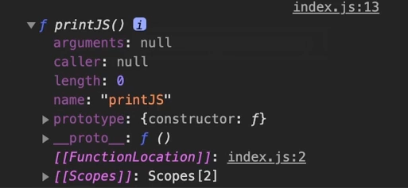
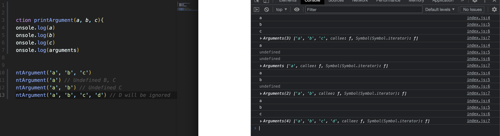

# Summary


#### 자바스크립트의 데이터 타입

자바스크립트에는 8가지 데이터 타입이 있습니다.

1. number
2. string
3. boolean
4. undefined
5. null
6. object
7. symbol
8. bigint

#### 자바스크립트의 유연한 데이터 타입

자바스크립트는 데이터 타입이 유연한 프로그래밍 언어입니다. 맥락에 유연하게 변하는 데이터 타입의 특징은 처음엔 생소하고 혼란스러울 수 있지만, 잘 이해하고 활용한다면 좀 더 간결한 코드를 작성하고 빠르게 개발할 수 있는 장점이 될 수 있습니다!

#### Truthy 값과 Falsy 값

if, for, while 등 불린 타입의 값이 요구되는 맥락에서는 조건식이나 불린 타입의 값 뿐만아니라 다른 타입의 값도 불린 값처럼 평가될 수 있는데요. 이 때, false 처럼 평가되는 값을 falsy 값, true 처럼 평가되는 값을 truthy값이라고 부릅니다. falsy값에는 false, null, undefined, 0, NaN, ''(빈 문자열)이 있고, falsy값을 제외한 값들은 모두 truthy값이 됩니다.

만약 falsy와 truthy값을 명확하게 확인하고 싶다면 `Boolean` 함수를 사용해서 직접 boolean 타입으로 형 변환 해볼 수도 있습니다.

```js
// falsy
Boolean(false);
Boolean(null);
Boolean(undefined);
Boolean(0);
Boolean(NaN);
Boolean('');

// truthy
Boolean(true);
Boolean('codeit');
Boolean(123);
Boolean(-123);
Boolean({});
Boolean([]);
```

truthy와 falsy의 개념은 자바스크립트에서 불린 타입으로의 형 변환을 이해할 때 핵심이되는 개념이 잘 기억해 주세요.

#### 독특한 방식으로 동작하는 논리 연산자

자바스크립트에서 AND와 OR연산자는 무조건 불린 값을 리턴하는게 아니라, 왼쪽 피연산자 값의 유형에 따라서 두 피연산자 중 하나를 리턴하는 방식으로 동작합니다. AND 연산자는 왼쪽 피연산자가 falsy값일 때 왼쪽 피연산자를, 왼쪽 피연산자가 truthy값일 때 오른쪽 피연산자를 리턴하고 반대로, OR 연산자는 왼쪽 피연산자가 falsy 일 때 오른쪽 피연산자를, 왼쪽 피연산자가 truthy 일 때 왼쪽 피연산자를 리턴합니다.

```js
console.log(null && undefined); // null
console.log(0 || true); // true
console.log('0' && NaN); // NaN
console.log({} || 123); // {}
```

#### 자바스크립트의 다양한 변수 선언 방식

자바스크립트에는 다양한 변수 선언 키워드가 있습니다. 자바스크립트가 처음 등장할 때부터 사용되던 var와, 그리고 var의 부족함을 채우기위해 ES2015에서 새롭게 등장한 let과 const가 있는데요.

var 변수는 아래와 같은 특징이 있었습니다.

1. 변수 이름 중복선언 가능,
2. 변수 선언 전에 사용 가능(호이스팅),
3. 함수 스코프

특히나 중복된 이름으로 선언이 가능했던 특징은 여러 사람이 협업할 때 생각보다 자주 문제가 되곤 했었는데요.  이런 문제를 개선하기 위해 ES2015에서 let과 const가 등장했고, 다음과 같은 특징이 있습니다.

1. 변수 이름 중복선언 불가 (SyntaxError 발생)
2. 변수 선언 전에 사용 불가 (ReferenceError 발생)
3. 블록 스코프

덧붙여 const 키워드는 let 키워드와 다르게 값을 재할당할 수 없다는 특징도 있습니다. 그래서 ES2015 이후부터는 var보다 let과 const 키워드 사용이 권장된다는 사실도 참고해 두시면 좋을 것 같습니다.

#### 함수 스코프(function scope)와 블록 스코프(block scope)

var 키워드로 선언한 변수는 함수 스코프 let과 const 키워드로 선언한 변수는 블록 스코프를 가집니다.

함수 스코프란 말 그대로 함수를 기준으로 스코프를 구분한다는 뜻인데요. 그렇기 때문에 아래 코드처럼 함수 안에서 선언한 변수는 함수 안에서만 유효하게 됩니다.

```js
function sayHi() {
  var userName = 'codeit';
  console.log(`Hi ${userName}!`);
}

console.log(userName); // ReferenceError
```

하지만 함수를 제외한 for, if, while 등과 같은 문법 안에서 선언한 변수는 그 문법 밖에서도 계속 유효했었기 때문에 때로는 중복선언등의 문제가 생겨나기도 했는데요. 이런 문제를 해결하기 위해 let과 const 키워드와 함께 블록 스코프가 등장하게 된 겁니다.

```js
for (var i = 0; i < 5; i++) {
  console.log(i);
}

console.log(i); // 5
```

블록 스코프는 중괄호로 감싸진 코드 블록에 따라 유효 범위를 구분하게 되는데요. 아래 코드에서 볼 수 있듯이 함수와 다른 문법들 뿐만아니라, 그냥 중괄호로 감싸진 코드 블록으로도 유효 범위가 구분되는 모습을 확인할 수 있습니다.

```js
function sayHi() {
  const userName = 'codeit';
  console.log(`Hi ${userName}!`);
}

for (let i = 0; i < 5; i++) {
  console.log(i);
}

{
  let language = 'JavaScript';
}

console.log(userName); // ReferenceError
console.log(i); // ReferenceError
console.log(language); // ReferenceError
```


# 함수 선언

자바스크립트에서 함수는 다양한 방식으로 선언할 수 있습니다. 가장 일반적인 방법은 `function` 키워드를 통해 함수를 선언하는 방식인데요.

```js
// 함수 선언
function sayHi() {
  console.log('Hi!');
}
```

이렇게 작성하는 방식을 함수 선언(function declaration)이라고 합니다.

# 함수 표현식

그리고 자바스크립트에서 함수는 값으로 취급될 수도 있기 때문에 변수에 할당해서 함수를 선언할 수도 있습니다.

```jsx
// 함수 표현식
const sayHi = function () {
  console.log('Hi!');
};
```

이렇게 함수를 값으로 다루는 방식을 함수 표현식 (function expression)이라고 합니다.

# 다양한 함수의 형태

자바스크립트에서 함수는 값으로 취급되는데요. 이런 특징은 코드를 작성할 때 다양한 형태로 활용될 수 있습니다.

```js
// 변수에 할당해서 활용
const printJS = function () {
  console.log('JavaScript');
};

// 객체의 메소드로 활용
const codeit = {
  printTitle: function () {
    console.log('Codeit');
  }
}

// 콜백 함수로 활용
myBtn.addEventListener('click', function () {
  console.log('button is clicked!');
});

// 고차 함수로 활용
function myFunction() {
  return function () {
    console.log('Hi!?');
  };
};
```

# 파라미터의 기본값

자바스립트에서 함수의 파라미터는 기본값을 가질 수가 있는데요. 기본값이 있는 파라미터는 함수를 호출할 때 아규먼트를 전달하지 않으면, 함수 내부의 동작은 이 파라미터의 기본값을 가지고 동작하게 됩니다.

```js
function sayHi(name = 'Codeit') {
  console.log(`Hi! ${name}`);
}

sayHi('JavaScript'); // Hi! JavaScript
sayHi(); // Hi! Codeit
```

# arguments 객체

자바스크립트 함수 안에는 `arguments`라는 독특한 객체가 존재합니다. `arguments` 객체는 함수를 호출할 때 전달한 아규먼트들을 배열의 형태로 모아둔 유사 배열 객체인데요. 특히, 함수를 호출할 때 전달되는 아규먼트의 개수가 불규칙적일 때 유용하게 활용될 수 있습니다.

```js
function printArguments() {
  // arguments 객체의 요소들을 하나씩 출력
  for (const arg of arguments) {
    console.log(arg); 
  }
}

printArguments('Young', 'Mark', 'Koby');
```

참고로 `arguments`라는 객체를 활용하고자 한다면 함수 안에서 사용할 파라미터나 변수, 함수의 이름을 `arguments`라고 짓는 것은 피하는게 좋겠죠?

# Rest Parameter

`arguments` 객체를 이용하는 것 말고도 불규칙적으로 전달되는 아규먼트를 다루는 방법이 있는데요. 파라미터 앞에 마침표 세 개를 붙여주면, 여러 개로 전달되는 아규먼트들을 배열로 다룰 수가 있게 됩니다. 그리고 `arguments`객체는 유사 배열이기 때문에 배열의 메소드를 활용할 수 없는 반면, rest parameter는 배열이기 때문에 배열의 메소드를 자유롭게 사용할 수 있다는 장점이 있습니다.

```js
function printArguments(...args) {
  // args 객체의 요소들을 하나씩 출력
  for (const arg of args) {
    console.log(arg); 
  }
}

printArguments('Young', 'Mark', 'Koby');
```

rest parameter는 다른 일반 파라미터들과 함께 사용될 수도 있는데요.

```js
function printRankingList(first, second, ...others) {
  console.log('코드잇 레이스 최종 결과');
  console.log(`우승: ${first}`);
  console.log(`준우승: ${second}`);
  for (const arg of others) {
    console.log(`참가자: ${arg}`);
  }
}

printRankingList('Tommy', 'Jerry', 'Suri', 'Sunny', 'Jack');
```

이름 그대로 앞에 정의된 이름 그대로 앞에 정의된 파라미터에 argument를 먼저 할당하고 나머지 argument를 배열로 묶는 역할을 하기 때문에 일반 파라미터와 함께 사용할 때는 반드시 가장 마지막에 작성해야 한다는 점을 꼭 기억해 주세요!

# Arrow Function

arrow function은 익명 함수를 좀 더 간결하게 표현할 수 있도록 ES2015에서 새롭게 등장한 함수 선언 방식입니다. 아래 코드와 같이 표현식으로 함수를 정의할 때 활용될 수도 있고 콜백 함수로 전달할 때 활용할 수도 있습니다.

```js
// 화살표 함수 정의
const getTwice = (number) => {
  return number * 2;
};

// 콜백 함수로 활용
myBtn.addEventListener('click', () => {
  console.log('button is clicked!');
});
```

화살표 함수는 다양한 상황에 따라 축약형으로 작성될 수 있는데요. 아래 코드와 주석을 한 번 참고해 주세요!

```js
// 1. 함수의 파라미터가 하나 뿐일 때
const getTwice = (number) => {
  return number * 2;
};

// 파라미터를 감싸는 소괄호 생략 가능
const getTwice = number => {
  return number * 2;
};

// 2. 함수 동작 부분이 return문만 있을 때
const sum = (a, b) => {
  return a + b;
};

// return문과 중괄호 생략 가능
const sum = (a, b) => a + b;
```

그리고 Arrow function이 일반 함수와 몇 가지 차이점이 있는데요. 가장 대표적인 차이점은 **arguments 객체가 없고, this가 가리키는 값이 일반 함수와 다르다**는 점입니다. arrow function을 사용할 땐 이런 부분을 잘 고려해야 된다는 점을 잊지 마세요!

# this

자바스크립트에는 this라는 조금 특별한 키워드가 있습니다. 웹 브라우저에서 this가 사용될 때는 전역 객체, Window 객체를 가지게 됩니다. 하지만 객체의 메소드를 정의하기 위한 함수 안에선 **메소드를 호출한 객체**를 가리키게 됩니다.

```js
const user = {
  firstName: 'Tess',
  lastName: 'Jang',
  getFullName: function () {
    return `${this.firstName} ${this.lastName}`;
  },
};

console.log(user.getFullName()); // getFullName 안에서의 this는 getFullName을 호출한 user객체가 담긴다!
```


#### 1. 공식 문서

ECMAScript의 공식 문서가 궁금하다면 아래 링크를 참고해 보세요.

- [ECMA-International 공식 ECMA-262문서](https://www.ecma-international.org/publications/standards/Ecma-262.htm)

#### 2. 진행 현황

지금까지 제정된 ECMAScript 표준 사항이나 과거 역사가 궁금하다면 아래 링크들을 참고해 보세요.

- [위키백과 - ECMA스크립트](https://ko.wikipedia.org/wiki/ECMA스크립트)
- [MDN 문서](https://developer.mozilla.org/ko/docs/Web/JavaScript/언어_리소스)

#### 3. 브라우저 지원 현황

각각의 문법별로 브라우저의 지원 여부를 확인하고 싶다면 아래 링크들을 참고해 보세요.

- [한눈에 확인하는 호환성 테이블](http://kangax.github.io/compat-table/es6/)
- [문법 검색으로 확인하는 호환성 테이블](https://caniuse.com/)

#### 4. 버전의 정식 표기

ES6부터는 연호를 사용해서 ES2015, ES2016이라고도 부른다는 점 배웠었죠? 개발자들 사이에서는 짧고 빠르게 소통하기 위해서 ES6, ES7이라는 용어를 사용하지만, 실제로 ECMA International에서 버전을 발표할 때 표기하는 정식 명칭은 연호를 사용해서 **ECMAScript 2015**라고 표기한다는 점! 참고해 두시면 좋을 것 같습니다.

#### 5. JavaScript vs ECMAScript

간혹 JavaScript와 ECMAScript가 똑같다고 오해하는 경우가 있는데요. 둘 사이에는 명확한 차이가 있습니다!

일단 첫 번째 차이점은, JavaScript는 **프로그래밍 언어**이고, ECMAScript는 **프로그래밍 언어의 표준**입니다.  쉽게 생각하면 ECMAScript는 JavaScript가 갖추어야 할 내용을 정리해둔 **'설명서'**이고, JavaScript는 ECMAScript를 준수해서 만들어낸 **'결과물'** 이라고 생각할 수 있는데요. 참고로 ECMAScript가 JavaScript화 하기 위해 등장하긴 했지만, ECMAScript는 JavaScript 뿐만아니라 모든 스크립트 언어(scripting languages)가 지켜야 하는 표준입니다. 만약 여러분이 자바스크립트와 같은 언어를 직접 만들고자 한다면, 이 ECMAScript를 준수해야 한다는 것이죠!

그리도 두 번째 차이점은 **JavaScript는** ECMAScript를 기반으로 하지만 ECMAScript에 정의된 내용뿐만 아니라, **다른 부가적인 기능도 있다**는 겁니다.  특히, 우리가 자바스크립트로 HTML 코드를 제어하기 위해 사용하는 DOM(Document Object Model)을 다루는 문법들은 ECMAScript에 표준화된 문법이 아니라 **WebIDL**에서 표준화된 기술이라고 할 수 있습니다.

JavaScript와 ECMAScript의 차이. 이제는 잘 구분할 수 있겠죠?


- 데이터 타입 

  엄청 유연하다. `2*"3" = 6` 이런식으로 가능. 리턴하는 값이 어떤건지 확실히 알고 있어야 한다. 

  

  - Symbol과 Bright

    지난 영상에서 Symbol과 BigInt라는 새로운 데이터 타입을 잠깐 살펴봤는데요. 특별한 경우에만 사용되기 때문에 활용 빈도가 높진 않지만, 그래도 어떤 값인지 가볍게 한 번 살펴봅시다.

    #### Symbol

    심볼(symbol)은 기본형 데이터 타입(primitive data type) 중 하나입니다. *심볼은 코드 내에서 유일한 값을 가진 변수 이름을 만들 때 사용하는데요.*

    ```js
    const user = Symbol();
    ```

    일단, 이렇게 Symbol이라는 함수를 통해서 심볼 값을 만들어 낼 수 있습니다.

    ```js
    const user = Symbol('this is a user');
    ```

    그리고 괄호 안에 심볼에 대한 설명을 붙일 수도 있습니다. 이렇게 Symbol 값을 담게 된 user라는 이름의 변수는 **다른 어떤 값과 비교해도 true가 될 수 없는 고유한 변수**가 되는데요.

    ```js
    const user = Symbol('this is a user');
    
    user === 'this is user'; // false
    user === 'user'; // false
    user === 'Symbol'; // false
    user === true; // false
    user === false; // false
    user === 123; // false
    user === 0; // false
    user === null; // false
    user === undefined; // false
    ...
    ```

    심지어는 똑같은 설명을 붙인 심볼을 만들더라도 두 값을 비교하면 false가 반환됩니다.

    ```js
    const symbolA = Symbol('this is Symbol');
    const symbolB = Symbol('this is Symbol');
    
    console.log(symbolA === symbolB); // false
    ```

    #### BigInt

    BigInt는 자바스크립트에서 아주 큰 정수(Integer)를 표현하기 위해 등장한 데이터 타입입니다. 사실 자바스크립트의 숫자에는 안전한 정수 표현의 한계가 있는데요. 안전한 정수 표현이라는 게 조금 이상하죠? 자바스크립트에서 안전한 최대 정수는 `2**53 - 1`, 안전한 최소 정수는 `-(2**53 - 1)` 입니다. `2**53 - 1`은 구체적으로 9007199254740991이라는 숫자로 약 9,000조 정도의 숫자인데요. 안전한 정수 표현이라는 의미는 자바스크립트에서 이 숫자 범위를 초과하는 정숫값을 사용하려고 하면 연산에 미세한 오류가 발생한다는 뜻입니다.

    예를 들면, `9007199254740991 + 1`과 `9007199254740991 + 2`를 비교하면 true라는 결과가 리턴됩니다. 실제로 콘솔에 9007199254740991 + 2과 심지어 9007199254740993을 출력해봐도 9007199254740993이 아니라 9007199254740992가 출력되는 모습을 확인할 수 있는데요.

    ```js
    console.log(9007199254740991 + 1 === 9007199254740991 + 2); // true
    console.log(9007199254740991 + 2); /// 9007199254740992
    console.log(9007199254740993); /// 9007199254740992
    ```

    이 숫자 범위는 JavaScript가 [IEEE 754](https://ko.wikipedia.org/wiki/IEEE_754)에 기술된 [배정밀도 부동소수점 형식 숫자체계](https://ko.wikipedia.org/wiki/부동소수점)를 사용하기 때문입니다. 혹시 용어가 너무 어색하다거나 개념이 조금 어렵다면, 일단은 **자바스크립트의 숫자형(number type) 값에는 9000조 정도의 정수 표현의 한계가 존재한다.** 정도만 이해해 주세요! 사실 9,000조라는 숫자도 꽤 큰 숫자기 때문에 대부분 상황에서는 큰 문제가 되지 않는데요. 그래도 암호 관련 작업이나 계산기 관련 작업을 할 때, 아주 큰 숫자를 다루거나 혹은 굉장히 정확한 연산이 필요한 상황에서 이보다 더 큰 숫자가 필요할 수도 있겠죠?

    그럴 때 바로 BigInt라는 데이터 타입의 값을 사용하면 됩니다. BigInt 타입의 값은 일반 정수 마지막에 알파벳 n을 붙이거나 BinInt라는 함수를 사용하면 되는데요.

    ```js
    console.log(9007199254740993n); // 9007199254740993n
    console.log(BigInt(9007199254740993)); // 9007199254740993
    ```

    이렇게 BigInt 타입을 사용하면 `2**53 - 1` 보다 큰 정숫값도 안전하게 표현할 수가 있습니다. 단, BigInt 타입에는 몇 가지 주의사항이 있는데요. 일단 BigInt 타입은 말 그대로 큰 정수를 표현하기 위한 데이터 타입이기 때문에 소수 표현에는 사용할 수가 없습니다.

    ```js
    1.5n; // SyntaxError
    ```

    그래서 소수 형태의 결과가 리턴되는 연산은 소수점 아랫부분은 버려지고 정수 형태로 리턴됩니다.

    ```js
    10n / 6n; // 1n
    5n / 2n; // 2n
    ```

    그리고 BigInt 타입끼리만 연산할 수 있고, 서로 다른 타입끼리의 연산은 명시적으로 타입 변환을 해야 합니다.

    ```js
    3n * 2; // TypeError
    3n * 2n; // 6n
    Number(3n) * 2; // 6
    ```

    큰 범위의 정수를 안전하게 사용할 수 있다는 장점이 있지만, 이런 제한사항들 때문에 실제로 BigInt 타입의 값을 활용할 상황들이 그리 흔하진 않습니다. 그래도 이런 타입이 있다는 사실을 잘 기억해 두셨다가 언젠가 필요한 상황이 생겼을 때 적절히 활용하시면 좋을 것 같습니다! :)

# typeof 연산자

지금까지 계속해서 자바스크립트의 데이터 타입에 대해서 살펴보고 있는데요. 우리가 사용하는 값이 어떤 데이터 타입을 가지고 있는지 확인하려면 `typeof` 연산자를 사용해야 합니다. `typeof` 연산자는 키워드 다음에 공백(띄어쓰기)을 두고 값을 작성해도 되고, 함수를 사용하듯 괄호로 감싸서 사용할 수도 있는데요.

```js
typeof 'Codeit'; // string
typeof Symbol(); // symbol
typeof {}; // object
typeof []; // object
typeof true; // boolean
typeof(false); // boolean
typeof(123); // number
typeof(NaN); // number
typeof(456n); // bigint
typeof(undefined); // undefined
```

하지만 한 가지 주의해야 할 점은 `typeof` 연산자의 결과가 모든 타입과 1:1로 매칭되지 않는다는 점입니다.

## null이 object라고?

일단, `typeof null`을 하면 문자열 `null`이 리턴되는 게 아니라 문자열 **object**가 리턴되는데요.

```js
typeof null; // object
```

이건 자바스크립트가 처음 구현될 때의 [특별한 문법 설계](https://developer.mozilla.org/ko/docs/Web/JavaScript/Reference/Operators/typeof#null) 때문입니다. 나중에 ECMAScript에서 수정이 제안되었었지만, 이미 개발된 많은 프로젝트에 버그가 생기는 우려로 인해 반영되지 않고 있습니다.

## function?

그리고 함수에 `typeof` 연산자를 사용하면 **function**이라는 값을 리턴하는데요.

```js
function sayHi() {
  console.log('Hi!?');
}

typeof sayHi; // function
```

자바스크립트에서 함수는 객체로 취급됩니다. 그래서 간혹 object를 리턴할거라 예상하는 실수를 하기도 하는데요. `typeof` 연산자를 함수에 사용하면 **function**이 리턴된다는 점도 꼭 기억해 두시면 좋을 것 같습니다.


### Boolean

- 어떤 값이 true가 되고, 어떤 값이 false가 될까? 아래 Falsy 제외하고, 싹다 Truthy값. [], {} 이런것도 다 True. 모르겠으면, Boolean()으로 변환해서 확인해보면 되잖아. 

  


### AND, OR

- ```
  console.log('Codeit' && 'Javascript')
  
  이거는 true/false가 나와야 될 것 같은데, 해보니깐 Javascript가 나온다. 
  한쪽을 선택하네?
  ```

- Why? **AND는 왼쪽이 Truthy하면 오른쪽값을 리턴하고, Falsy하면 그대로 왼쪽값을 리턴하는 방식으로 작동한다.**

  -  그래서 위에서는 Javascipt가 나왔던 것. 

- **OR**는?  **AND와 반대로, 왼쪽값이 Truthy하면 왼쪽값을 리턴하고, Falsy하면 오른쪽 값을 리턴하는 형태로 작동한다.** 

  **추가** 

  #### AND 와 OR 연산자의 연산 우선순위

  지난 시간에는 자바스크립트에서 AND와 OR 연산자의 독특한 연산 방식에 대해 알아봤는데요. 아래 코드를 봅시다.

  ```js
  function checkAnswer(value) {
    if (value < 10 && value > 0 && value !== 3) {
      return '정답입니다!';
    } 
  
    return '틀렸습니다!';
  }
  
  console.log(checkAnswer(4)); // 정답입니다!
  ```

  파라미터 value로 전달되는 값이 10보다 작으면서 0보다는 크고, 그러면서도 3은 아닐 때 '정답입니다!' 라는 문자열을 콘솔에 출력하는 함수를 정의했는데요. 코드를 작성하다 보면 다양한 상황을 고려하기 위해서 이렇게 AND나 OR 연산자를 여러 번 사용해야 할 수도 있습니다.

  그런데 한 가지 조심해야 할 부분이 있는데요. 위에 있는 코드처럼 AND 연산자나 OR 연산자 중 하나만 계속해서 사용할 때는 문제 없지만, 만약 AND 연산자와 OR 연산자를 섞어서 사용할 때는 연산의 우선순위가 존재한다는 겁니다. 쉽게 설명해서 1 + 2 + 3 처럼 계속해서 더하기 연산자만 사용한다면 왼쪽부터 차례대로 더하면 되지만, 1 + 2 * 3 처럼 더하기와 곱하기 연산자가 섞여 있다면 연산자 우선순위를 고려해야 한다는 것이죠. 곱하기 연산자가 더하기 연산자보다 연산 우선순위가 높다는 사실 모두 알고 계시죠? AND 와 OR 연산자 사이에서는 **AND 연산자의 우선순위가 더 높습니다.**

  ```js
  console.log(true || false && false); // true
  console.log((true || false) && false); // false
  
  console.log('Codeit' || NaN && false); // Codeit
  console.log(('Codeit' || NaN) && false); // false
  ```

  위 코드처럼 OR 연산자 뒤에 AND 연산자를 사용한다면, 소괄호로 OR 연산을 감쌀 때와 감싸지 않았을 때 서로 다른 결과를 보여주는 걸 확인할 수 있는데요. 프로그래밍을 하다 보면 AND와 OR 연산자뿐만 아니라 다양한 연산자들을 복합적으로 사용하게 될 텐데, 연산의 우선순위를 명확하게 하지 않으면 예상치 못한 결과를 얻을 수 있으니 잘 구분해두는 것이 중요합니다. 대부분은 코드를 작성하고 테스트도 해보면서 자연스럽게 이해되기 때문에 하나하나 시험공부 하듯 외울 필요는 없지만 간혹 우리가 의도하지 않은 연산 결과가 나타날 땐, 이 연산자 우선순위를 의심해 보시고 아래 링크의 도움을 받는 것도 좋을 것 같습니다.

  [연산자 우선순위](https://developer.mozilla.org/ko/docs/Web/JavaScript/Reference/Operators/연산자_우선순위)

  하지만 여러분이 코드를 작성할 때, 특히 여러 사람과 함께 협업하는 상황에서 다양한 연산자들을 복합적으로 사용해야 한다면 소괄호를 활용해서 의도에 맞는 연산 우선순위를 명확하게 표기하는 것이 좋은 습관이라는 점도 잘 기억해 두시면 좋을 것 같습니다.

  ```js
  console.log(true || (false && false)); // true
  console.log((true || false) && false); // false
  
  console.log('Codeit' || (NaN && false)); // Codeit
  console.log(('Codeit' || NaN) && false); // false
  ```

ES2020에서 새롭게 추가된 null 병합 연산자에 대해 살펴보겠습니다. 영어로는 'Nullish coalescing operator' 라고 하는데요.


### null 병합 연산자 ??

물음표 두 개(??)를 사용해서 null 혹은 undefined 값을 가려내는 연산자 입니다. 아래 코드를 보세요.

```js
const example1 = null ?? 'I';
const example2 = undefined ?? 'love';
const example3 = 'Codeit' ?? 'JavaScript';

console.log(example1, example2, example3); // ?
```

example1과 2를 보시면, 지금 null 병합 연산자 왼편에 각각 null과 undefined가 있죠? 이렇게 **연산자 왼편의 값이 null 이나 undefined라면 연산자 오른편의 값이 리턴**되고, example3처럼 **연산자 왼편의 값이 null 이나 undefined가 아니라면 연산자 왼편의 값이 리턴**되는 원리로 동작합니다. 결과적으로 마지막 줄에서 콘솔에 출력되는 값은 I love Codeit이 되겠죠?

```js
const example1 = null ?? 'I'; // I
const example2 = undefined ?? 'love'; // love
const example3 = 'Codeit' ?? 'JavaScript'; // Codeit

console.log(example1, example2, example3); // I love Codeit
```

## OR 연산자(||)와 비교

그런데 이렇게 보니깐 이전에 앞서 OR 연산자 (||)와 동작하는 방식이 비슷해 보입니다. 실제로도 다음과 같은 상황이라면 똑같이 동작을 하게 되는데요.

```js
const title1 = null || 'codeit';
const title2 = null ?? 'codeit';

console.log(title1); // codeit
console.log(title2); // codeit
```

하지만 null 병합 연산자(??)는 왼편의 값이 null이나 undefined인지 확인하고 OR 연산자(||)는 왼편의 값이 falsy인지를 확인하기 때문에 아래 코드와 같이 null이나 undefined가 아닌 falsy 값을 활용할 때 결과가 서로 다르니깐, 이 부분은 꼭 기억해 두세요!

```js
const title1 = false || 'codeit';
const title2 = false ?? 'codeit';

console.log(title1); // codeit
console.log(title2); // false

const width1 = 0 || 150;
const width2 = 0 ?? 150;

console.log(width1); // 150
console.log(width2); // 0
```


### 변수와 스코프

ES2015이전에서는 var을 썻는데, 요즘은 

let, const등이 요즘으 더 권장됨. 

```javascript
var는 선언 전에 사용이 가능했음. 
선언이 위로 올라간 듯한 느낌을 줌. 이것을 호이스팅 이라고 했음. 

console.log(title) # 에러가 아니라, undefined가 떳음.
var title;

단, 할당된 값까지 올라가지는 않음. 
console.log(title) => undefined
var title = "hi"
```

**let**이나, const는 변수 선언 이전에 접근 자체가 불가능. 

var는 중복 선언도 가능했음. 

```
var title = "Hi"
var title = "Bye"

의도치않게 위를 덮어씌울 수가 있음. 
```

let, const는 중복 선언이 불가능해서, 뒤에서 다시 선언하면 에러가 난다. 


변수의 scope의 차이가 있음. 

```
var x = 3
function myFunc(){
	var y = 4;
	console.log(x)
  console.log(y)
}
myFunc();
console.log(x) # 전역변수니깐 3이 나오지. 
console.log(y) # 함수 내부에서만 사용 가능. ERROR
```

var는 변수의 scope가 함수 단위로만 구분된다. 

그런데, `함수`단위로만 구분이 된다는 것은, 조건문/반복문에서 만들어도 다 전역변수로 나온다는 것. 

조건문/반복문에서 고유하게 사용하는 변수를 만들수가 없었음. 

**let/const는 중괄호(code block)가 기준이 된다.** 

심지어 뭐 문법 없이 아래처럼만 해도, 중괄호 기준 지역변수가 된다. **block scope**라고 한다. 

```
{

	let title ="Hi"

}
```


### 함수를 만드는 방법

```
function 함수이름 (파라미터){
	
}
```

그런데, 특이한게 함수를 변수에 할당할 수가 있음. 

```javascript
# 함수 표현식

const printCodeit = function(){
	console.log("Hi")
}
```

함수 선언을 값처럼 사용하고 있는 것. 

```javascript
이것도 두번째 파라미터로 함수 넣어주는 거라서, 함수표현식의 일종

addEventListner('click', function(){
	console.log("button is clicked")
})
```

그냥 함수와 함수 표현식은 무슨 차이가 있을까?

그냥 함수는, 사실 아래처럼 선언 전에 콜을 해도 동작을 함(호이스팅). 

```
greeting()

function greeting (파라미터){
	
}
```

그러나 함수 표현식은 선언 이전에 접근이 불가능

```javascript
printHi()

const printHi = function (){
	console.log("Hi")
}
```

scope의 차이도 있음. 

```javascript
다른 함수 안에서 선언되면 사용 불가. 

function printit(){
	function printJS(){
			console.log('Javascript')
	}
	
	console.log("it")
	print(JS)
}

printit()
printJS(); # => Reference Error
```

함수 표현식의 경우는 

```javascript
var printJS = function(){}
let printJS = function(){}
const printJS = function(){}
```


퀴즈 해설


답: 2

함수 선언과 함수 표현식의 가장 큰 차이는 호이스팅과, 스코프인데요.

**함수 선언 방식(function sayHi(){})**은 호이스팅으로 인해서 함수를 선언하기 이전에 함수를 호출해도 정상적으로 동작하는 특징이 있고, **함수 표현식(변수에 함수 넣기)**은 반드시 변수가 선언된 이후에 함수를 호출해야 정상적으로 동작하는 차이가 있습니다. `var` 키워드 변수가 호이스팅이 된다고는 하지만 선언문 자체만 호이스팅되고, 할당된 값은 변수 선언 이후에 사용할 수 있다고도 배웠었죠? 그리고 **함수 선언 방식은 함수 스코프를 가지고, 함수 표현식은 변수에 할당하는 경우에는 할당된 변수의 특성에 따라 스코프가 결정됩니다.** `var` 키워드 변수에 할당하면 함수 스코프, `let`이나 `const` 키워드 변수에 할당하면 블록 스코프를 가지겠죠?

보기 1번은 코드 블록 안에서 함수 선언 방식으로 함수를 만들었습니다. 함수 선언은 함수 스코프를 가지기 때문에 코드 블록 안에서 함수를 선언하더라도 코드 블록 밖에서 아무런 문제 없이 사용할 수가 있겠죠? 보기 2번은 코드 블록 안에서 함수 표현식으로 함수를 만들었습니다. 그런데 `let` 키워드 변수를 활용했기 때문에 블록 스코프를 가지게 되는데요. 블록 스코프를 가진 `sayHi` 함수는 코드 블록 밖에서 사용할 수 없으므로 이 코드는 **에러가 발생**합니다. 보기 3번은 함수 선언 방식으로 함수를 만들었는데요. 함수 선언 방식은 호이스팅이 되기 때문에 함수 선언 이전에 호출해도 코드가 정상적으로 동작한다는 사실, 잊지 않으셨죠? 보기 4번은 함수 표현식으로 함수를 만들었는데요. 함수를 선언한 다음 호출했으니 아무런 문제 없이 코드가 잘 동작하겠죠?

주어진 중에서 에러가 발생하는 코드는 **2번** 입니다.




# Named Function Expression (기명 함수 표현식)

함수 표현식으로 함수를 만들 때는 선언하는 함수에 이름을 붙여줄 수도 있는데요. 이름이 있는 함수 표현식, 즉 **기명 함수 표현식**이라고 부릅니다. 함수 표현식으로 함수가 할당된 변수에는 자동으로 name이라는 프로퍼티를 가지게 되는데요.

```js
const sayHi = function () {
  console.log('Hi');
};

console.log(sayHi.name); // sayHi
```

이렇게 이름이 없는 함수를 변수에 할당할 때는 변수의 name 프로퍼티는 변수 이름 그 자체를 문자열로 가지게 됩니다. 하지만 함수에 이름을 붙여주게 되면, name 속성은 함수 이름을 문자열로 갖게 되는데요.

```js
const sayHi = function printHiInConsole() {
  console.log('Hi');
};

console.log(sayHi.name); // printHiInConsole
```

이 함수 이름은 함수 내부에서 함수 자체를 가리킬 때 사용할 수 있고 함수를 외부에서 함수를 호출할 때 사용할 수는 없습니다.

```js
const sayHi = function printHiInConsole() {
  console.log('Hi');
};

printHiInConsole(); // ReferenceError
```

기명 함수 표현식은 일반적으로 함수 내부에서 함수 자체를 가리킬 때 사용되는데요. 아래 코드를 살펴봅시다.

```js
let countdown = function(n) {
  console.log(n);

  if (n === 0) {
    console.log('End!');
  } else {
    countdown(n - 1);
  }
};

countdown(5);
```

아규먼트로 숫자 값을 전달하고 전달받은 그 값이 0이 될 때까지 하나씩 값을 줄이면서 자기 자신을 호출하는 countdown이라는 함수를 함수 표현식으로 작성해봤는데요. 이런 식으로 자기 자신을 부르는 함수를 재귀 함수(**Recursive function**)라고 부릅니다. 그런데 만약 이 함수를 복사하려고 다른 변수에 똑같이 담았다가, countdown 변수에 담긴 값이 변하게 되면 문제가 발생하는데요.

```js
let countdown = function(n) {
  console.log(n);
  if (n === 0) {
    console.log('End!');
  } else {
    countdown(n - 1);
  }
};

let myFunction = countdown;

countdown = null;

myFunction(5); // TypeError
```


마지막 줄에서 myFunction 함수를 호출했을 때, 함수가 실행되긴 하지만, 6번줄 동작을 수행할 때 호출하려는 countdown 함수가 이미 12번에서 null 값으로 변경되었기 때문에 함수가 아니라는 TypeError가 발생한 것이죠! **이런 상황을 방지하기 위해서 함수 내부에서 함수 자신을 사용하려고 하면 함수표현식에서는 반드시 기명 함수 표현식을 사용하는 것이 좋습니다.**

```js
let countdown = function printCountdown(n) {
  console.log(n);
  if (n === 0) {
    console.log('End!');
  } else {
    printCountdown(n - 1);
  }
};

let myFunction = countdown;

countdown = null;

myFunction(5); // 정상적으로 동작
```


함수 표현식을 작성할 때, 함수에 이름을 지정할 수 있다는 점과 특히 이렇게 함수 내에서 함수를 가리켜야 할 때는 꼭 함수 이름을 작성해주는 것이 안전하다는 점. 잘 기억해 두시면 좋을 것 같습니다. :)


지금까지 함수를 **선언**하는 다양한 방법에 대해 살펴봤는데요. 함수를 선언하는 것은 함수를 실행하는 것과 다르다는 사실, 모두 알고 계시죠?

```js
function sayHi() {
  console.log('Hi!');
}
  
sayHi();
```

일반적으로는 이렇게 함수를 먼저 선언한 다음,선언된 함수 이름 뒤에 소괄호를 붙여서 함수를 실행하는데요. 그런데 때로는 함수가 선언된 순간에 바로 실행을 할 수도 있습니다.


#### 즉시 실행 함수

```js
(function () {
  console.log('Hi!');
})();
```

보시는 것처럼 함수선언 부분을 소괄호로 감싼 다음에 바로 뒤에 함수를 실행하는 소괄호를 한 번 더 붙여주는 방식인데요. 이렇게 하면 함수가 선언된 순간 바로 실행이 되는 겁니다.

이렇게 함수 선언과 동시에 즉시 실행되는 함수를 가리켜 **즉시 실행 함수 (표현)**이라고 부르는데요. 영어로는 **Immediately Invoked Function Expression**, 줄여서 **IIFE**라고 부릅니다.

```js
(function (x, y) {
  consoel.log(x + y);
})(3, 5);
```

그리고 즉시 실행 함수도 일반 함수처럼 파라미터를 작성하고, 함수를 호출할 때 아규먼트를 전달할 수도 있는데요. 한 가지 주의할 점은 즉시 실행 함수는 함수에 이름을 지어주더라도 외부에서 재사용할 수 없다는 겁니다.

```jsx
(function sayHi() {
  console.log('Hi!');
})();

sayHi(); // ReferenceError
```

그래서 일반적으로는 이름이 없는 익명 함수를 사용하는데요. 다만, [이름이 있는 함수 표현식](https://www.codeit.kr/learn/4493) 레슨에서도 살펴봤던 것처럼 함수 내부에서 자기 자신을 호출하는 재귀적인 구조를 만들고자 할 땐 이름이 필요할 수도 있으니까 이 부분은 참고해 주세요! :)

```jsx
(function countdown(n) {
  console.log(n);
  if (n === 0) {
    console.log('End!');
  } else {
    countdown(n - 1);
  }
})(5);
```

#### 즉시 실행 함수의 활용

즉시 실행 함수는 말 그대로 선언과 동시에 실행이 이뤄지기 때문에 일반적으로 프로그램 **초기화 기능**에 많이 활용됩니다.

```js
(function init() {
  // 프로그램이 실행 될 때 기본적으로 동작할 코드들..
})();
```

혹은 재사용이 필요 없는, 일회성 동작을 구성할 때 활용하기도 하는데요.

```jsx
const firstName = Young;
const lastName = Kang;

const greetingMessage = (function () {
  const fullName = `${firstName} ${lastName} `;

  return `Hi! My name is ${fullName}`;
})();
```

이렇게 **함수의 리턴값을 바로 변수에 할당하고 싶을 때** 활용할 수 있습니다.

그리고, 전역변수와 지역변수의 개념 알고 계시죠? 즉시 실행 함수에서 사용하는 변수들은 함수 내에서만 유효하기 때문에 이런 점을 활용하면, 일시적으로 사용할 변수의 이름들을 조금 자유롭게 작성할 수도 있다는 점. 잘 기억해 두세요! :)


#### 값으로서의 함수(First Class Function)

**함수를 출력을 해보면**, `console.dir(printJS)` 여러개의 프로퍼티를 가지는 객체의 모습을 하고 있다. 



그래서, 객체나 배열의 요소로도 함수가 들어갈 수 있는 것. 심지어 다른 함수의 파라미터로 전달 할 수 있는 것. addEventListner에서 했던 것이 이것. 참고로 다른 함수의 파라미터로 전달된 함수를 **콜백함수**라고 부른다. 

반대로, 어떤 함수의 리턴값이 함수가 될 수 있다는 것. 이런 것은 고차함수라고 부른다. 


#### 파라미터

```javascript
function greeting(name) {
	console.log(`Hi! My name is ${name}!`)
}

greeting('Javascript') 
```

정확히는 위 Javascript처럼 전달하는 문자는 `Argument`라고 한다. 

```javascript
greeting()

이렇게 아무것도 전달하지 않는다면, Undefined가 된다. 

function greeting(name="기본값") {
	console.log(`Hi! My name is ${name}!`)
}

기본값을 줄 수 있다. 또한, Undefined를 전달해도 default 값이 사용된다. 
```

```javascript
신기한 건, 
function defaultTest(x, y=x+3){
 console.log(x)
 console.log(y)
}
```

```
function introduce(name = '홍길동', birth = 1443) {
  console.log(`안녕하세요 저는 ${name}입니다.`);
  console.log(`${birth}년에 태어났습니다.`);
}

introduce('장동건'); // 장동건, 1443
introduce('Joy', null);  // Joy, null 
introduce(undefined, 2090); // 홍길동, 2090

```


#### Argument

```java


function printArgument(a, b, c){
  console.log(a)
  console.log(b)
  console.log(c)
}

printArgument('a', 'b', 'c')
printArgument('a') // Undefined B, C
printArgument('a', 'b') // Undefined C
printArgument('a', 'b', 'c', 'd') // D will be ignored
```

Argument를 유연하게 사용할 수는 없을까? 파라미터와 `arguments`를 사용하니깐 상관없이 전달된 요소들을 다 []안에 출력해 준다. This is 유사배열. 그래도, 갯수 확인, 인덱싱, for 등을 통해 사용이 가능하다. 



```javascript
function firstWords() {
  let word = '';
  for (let arg of arguments){
    console.log(arg)
    
  }
  
  // 여기에 코드를 작성해 주세요.

  console.log(word);
}

firstWords('나만', '없어', '고양이');
firstWords('아니', '바나나말고', '라면먹어');
firstWords('만두', '반으로', '잘라먹네', '부지런하다');
firstWords('결국', '자바스크립트가', '해피한', '지름길');
firstWords('빨간색', '주황색', '노란색', '초록색', '파란색', '남색', '보라색');
```


#### Rest parameter

```js
rest parameter는 배열이라서, 배열의 메서드를 사용할 수 있다. 

// Rest parameter 
function printArgument(...args){
  for (const arg of args){
    console.log(arg);
  }
  console.log("-----------")
}

printArgument('나만', '없어', '고양이');
printArgument('아니', '바나나말고', '라면먹어');
printArgument('만두', '반으로', '잘라먹네', '부지런하다');
printArgument('결국', '자바스크립트가', '해피한', '지름길');
printArgument('빨간색', '주황색', '노란색', '초록색', '파란색', '남색', '보라색');
```

또한, 일반 파라미터와 같이 사용이 가능하다. 

```js
앞 두개를 argument로 사용하고 나머지를 묶는다. 
function printArgument(first, second, ...args){
  for (const arg of args){
    console.log(arg);

  }
  console.log("-----------")
}
```


#### Arrow Function 

간단하다, function 키워드 지워주고 화살표를 쓰면 됨. 

```js

const getTwice = function(number){
  return number*2
}

const getTwice = (number) => {
  return number*2
}
```

```js
myBtn.addEventListner('click', ()=>{
    console.log('button is clicked!')
  })
```

심지어 더 짧게 표현도 가능함. 

```js

const getTwice = function(number){
  return number*2
}

const getTwice = (number) => {
  return number*2
}

const getTwice = number => return number*2; 

규칙은?
1. 파라미터가 하나인 경우, 소괄호를 생략 가능
const getTwice = number => {
  return number*2
}
파라미터가 두개 이상이거나 없을 때는 소괄호 반드시 써야 한다. 
const getTwice = (a, b) => {
  return a*b
}
const getTwice = () => {
  return 2*2
}

2. 내부 동작부분이 리턴문 하나로만 이루어 져 있다면, 중괄호 생략 가능. 
const getTwice = number => return number*2;
리턴문 이외에 다른 표현들도 있으면, 생략 불가. 
리턴값이 객체인 경우도 생략 불가
const getTwice = number => {name: "Hi"};
이런 경우는 소괄호 한번 더 감싸면 되긴 함. 
const getTwice = number => ({name: "Hi"});
```

단, arrow function에서는 위 `arguments` 객체를 사용할 수 없다. 

#### this

함수 내부에서 주로 사용된다. 

```
console.log(this)

const user = {
  firstName : 'Tess', 
  lastName: 'Jang', 
  getFullName: function(){
    return `${user.firstName} ${user.lastName}`
  }
}

console.log(user.getFullName())
```

근데, 이거를 분리하고 싶다면?

```js
function getFullName(){
    return `${user.firstName} ${user.lastName}`
}

const user = {
  firstName : 'Noel', 
  lastName: 'Son', 
  getFullName: getFullName
}

const admin = {
  firstName : 'Mei', 
  lastName: 'Lee', 
  getFullName: getFullName
}

console.log(user.getFullName())
console.log(admin.getFullName())
```

결과가 이상해. 아래처럼 나온다. 사실 당연한게, getFullName은 user만 보고 있잖아. 

```
Noel Son
Noel Son
```

이런 경우가 this를 써야 되는 거네. 

```js
function getFullName(){
    return `${this.firstName} ${this.lastName}`
}

const user = {
  firstName : 'Noel', 
  lastName: 'Son', 
  getFullName: getFullName
}

const admin = {
  firstName : 'Mei', 
  lastName: 'Lee', 
  getFullName: getFullName
}

console.log(user.getFullName())
console.log(admin.getFullName())
```

즉, 자바스크립트에서 this는 함수를 호출한 객체를 가리킨다. 즉, 객체의 메서드로 호출하는 경우 매우 중요하지. 

근데 여기서 진짜 중요한게, arrow function이면, this를 어떻게 써도 그 객체를 가리키는게 아니라 window객체를 가리키게 된다. 

정확히는 window가 선언되기 직전 this와 똑같이 되는 것. 

