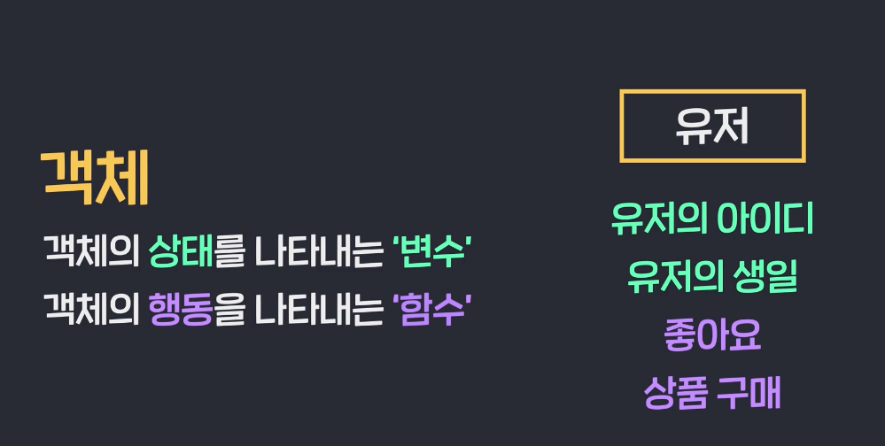

# OOP

#### '객체'간의 상호작용을 중심으로 하는 프로그래밍

이때까지 우리는 자바스크립트에서 객체를 생성하는 총 3가지 방법을 배웠습니다. 배운 내용을 정리해볼까요?

# 1. Object literal과 Factory function 사용하기

```jsx
function createUser(email, birthdate) {
  const user = {
    email,
    birthdate,
    buy(item) {
      console.log(`${this.email} buys ${item.name}`);
    },
  };
  return user;
}

const user1 = createUser('chris123@google.com', '19920321');
const user2 = createUser('jerry99@google.com', '19950719');
const user3 = createUser('alice@google.com', '19931224');
```

객체를 생성하는 Factory function을 만들고, 그 안에서 Object literal로 객체를 생성하여 리턴하는 방법입니다.

# 2. Constructor function 사용하기

```jsx
function User(email, birthdate) {
  this.email = email;
  this.birthdate = birthdate;
  this.buy = function (item) {
    console.log(`${this.email} buys ${item.name}`);
  };
}

const user1 = new User('chris123@google.com', '1992-03-21');
const user2 = new User('jerry99@google.com', '1995-07-19');
const user3 = new User('alice@google.com', '1993-12-24');
```

객체를 생성하는 용도로 사용하는 Constructor function을 정의하고, 그 안에서 this 키워드를 사용하여 생성될 객체의 프로퍼티와 메소드를 설정하는 방법입니다. Constructor function으로 객체를 생성하려면 그 앞에 new를 붙여서 실행해야 한다는 사실, 반드시 기억하세요.

# 3. class 키워드 사용하기

```jsx
class User {
  constructor(email, birthdate) {
    this.email = email;
    this.birthdate = birthdate;
  }

  buy(item) {
    console.log(`${this.email} buys ${item.name}`);
  }
}

const user1 = new User('chris123@google.com', '1992-03-21');
const user2 = new User('jerry99@google.com', '1995-07-19');
const user3 = new User('alice@google.com', '1993-12-24');
```

class 키워드를 사용해서 객체의 틀을 정의하고, 마찬가지로 그 앞에 new를 붙여서 객체를 생성하는 방법입니다. class를 사용할 때는 보통 프로퍼티의 경우 constructor 안에 정의하고, 메소드의 경우 constructor 밖에 정의합니다.

이 밖에도 자바스크립트로 객체를 만들 수 있는 방법에는 여러 가지가 있지만 일단은 이 정도만 아셔도 충분합니다.

이제 다음 챕터에서는 객체 지향 프로그래밍을 할 때 알아야 하는 기본 개념들을 배울 건데요. 이때 위의 세 가지 방법 중에서 **class 키워드를 사용하는 방법**을 쓸 겁니다. Factory function이나 Constructor function을 사용해도 문제는 없지만, class는 자바스크립트 뿐만 아니라 Java 등의 다른 언어에서도 등장하는 보편적인 용어이고, 그 자체로 객체 지향의 원리를 나타내기에 적절해서 React 등의 유명 프레임워크에서도 사용하던 방식이기 때문입니다.

다음 챕터에서는 class 키워드만 사용할 테니까 class 안에 어떤 식으로 코드들이 들어가는지 미리 잘 봐두고 넘어가세요.


객체 안에는 상태(프로퍼티)와 행동(메소드)이 있을 수 있다. 프로퍼티와 메소드로 이루어진 각 객체들의 상호작용을 중심으로 코드를 작성하는 것. 



> 절차지향 프로그래밍이란 
>
> 변수와 함수를 가지고, 작업의 순서에 맞게 코드를 작성하는 것.

```js
const user = {
  email : "saanghyuk@gmail.com", 
  birthDate: "1993-03-07", 
  buy (item) {
    console.log(`${this.email} buys ${item.name}`)
  }
}
```

객체를 나타내는 문자열, object literal. 

위에서 유저가 수십개라면?

#### Factory Function

```js
const user1 = {
  email : "saanghyuk@gmail.com", 
  birthDate: "1993-03-07", 
  buy (item) {
    console.log(`${this.email} buys ${item.name}`)
  }
}

const user2 = {
  email : "saanghyuk@gmail.com", 
  birthDate: "1993-03-07", 
  buy (item) {
    console.log(`${this.email} buys ${item.name}`)
  }
}

```

아래처럼 함수로 만들면 된다. 

```js

function createUser(email, birthDate){
  const user = {
    email : email,
    birthDate: birthDate,
    buy (item) {
      console.log(`${this.email} buys ${item.name}`)
    }
  }
  return user
}
```

이러면, 아래처럼 생성하면 된다. 이런 함수를 factory function이라고 한다. 

```js
const user1 = createUser('saanghyuk@gmail.com', '19930307')
```

#### Constructor function: 생성자 함수

너무 직관적인 객체지향. 

```js

function User(email, birthDate){
  this.email = email; 
  this.birthDate = birthDate
  this.buy = function (item){
    console.log(`${this.email} bought ${item.name}`)
  }
}

const item1 = {
  name : '스웨터', 
  price : 30000
}

const user1 = new User('saanghyuk@gmail.com', '1993-03-07')
user1.buy(item1)
```

`this`라는것은 생성된 그 객체를 의미한다

1.  `new`를 붙어야 객체를 생성할 수 있다. 
2. 관행적으로 constructor function의 이름은 첫글자를 대문자로 쓴다. 


#### Class

ES6에서 한가지 더 추가되었다. Contructor 메소드는 객체가 생성될 때 실행된다. constructor 안에 프로퍼티, 메서드는 분리해서 한다. 

```js

class User1{
  constructor(email, birthDate){
    this.email = email; 
    this.birthDate = birthDate;
  }

  buy (item){
    console.log(`${this.email} bought ${item.name}`)
  }
}
```

생성은 똑같이 `new`로 하면 된다. 

```js]
class Car {
  constructor(color, speed) {
    this.color = color;
    this.speed = speed;
  }

  run() {
    console.log(`Runs at ${this.speed}`);
  }
}

const car1 = new Car('blue', '100km/h');

car1.run();
```


# 4가지 핵심개념

- **추상화**

  어떤 구체적인 존재를 우리가 원하는 방향으로 간략화해서 나타낸 것. 

  User객체를 만든다고 하면, 꼭 필요한 유저 객체의 속성과 행동을 찾아서, 프로퍼티와 메소드로 정의한다. 

  

- **캡슐화**

  객체의 특정 프로퍼티에 직접 접근하지 못하도록 막는 것. 

  ```js
  
  class User1{
    constructor(email, birthDate){
      this.email = email; 
      this.birthDate = birthDate;
    }
  
    buy (item){
      console.log(`${this.email} bought ${item.name}`)
    }
  }
  const user1 = new User1('saanghyuk@gmail.com', '1993-03-07')
  ```

  근데 여기서 이렇게 수정해버리면?

  ```js
  user1.email = "noel@ab180.co"
  ```

  그럼 어떻게 막지? setter 메소드

  ```js
  set email(address){
      // 이 안에서 검증한다 [
      if (address.includes('@'){
        this._email = address;
      } else{
        throw new Error('invalid email address')
      }
    }
  ```

  이렇게 해놓으면, 이제 user1.email 이런식으로 접근할때마다, set함수가 자동으로 실행되도록 설계되어 있다. 

  프로그래밍 세계에서 `_`를 붙인다는 것은 뭔가 숨기고 싶다는 것. 

  예시) 아래처럼 하니깐, 에러를 던지게 된다. 

  ```js
  
  class User1{
    constructor(email, birthDate){
      this.email = email; 
      this.birthDate = birthDate;
    }
    buy (item){
      console.log(`${this.email} bought ${item.name}`)
    }
    
    set email(address){
      // 이 안에서 검증한다 
      if (address.includes('@')){
        this._email = address;
      } else{
        throw new Error('invalid email address')
      }
    }
  }
  
  const user1 = new User1('saanghyuk@gmail.com', '1993-03-07')
  
  user1.email = "abcde"
  console.log(user1)
  ```

  그럼 당연히 `getter` 메소드 나와야지. 읽게 해 주는 것. 

  `user1.email`을 하면, `getter`메소드가 실행되는 것. 

  **보니깐, _email은 숨겨놓은 변수 이름이고, 실제 밖에서 접근하는 변수 이름은 email이 되는 거네. 혹시라도 _email로 입력을 안했어도 알아서 그렇게 설정되는거고.** 

  ```js
  
  class User1{
    constructor(email, birthDate){
      this.email = email; 
      this.birthDate = birthDate;
    }
    buy (item){
      console.log(`${this.email} bought ${item.name}`)
    }
    
    set email(address){
      // 이 안에서 검증한다 
      if (address.includes('@')){
        this._email = address;
      } else{
        throw new Error('invalid email address')
      }
    }
  
    get email(){
      return this._email; 
    }
  }
  ```

  이번 노트에서는 캡슐화에 대해 더 알아둬야 할 내용들을 살펴보겠습니다.

  # 1. 완벽한 캡슐화를 하는 법

  이전 영상에서는 다음 코드로 캡슐화를 배웠습니다.

  ```jsx
  class User {
    constructor(email, birthdate) {
      this.email = email;
      this.birthdate = birthdate;
    }
  
    buy(item) {
      console.log(`${this.email} buys ${item.name}`);
    }
  
    get email() {
      return this._email;
    }
  
    set email(address) {
      if (address.includes('@')) {
        this._email = address;
      } else {
        throw new Error('invalid email address');
      }
    }
  }
  
  const user1 = new User('chris123@google.com', '1992-03-21');
  user1.email = 'newChris123@google.com';
  console.log(user1.email);
  ```

  이제 이 코드를 보면 `_email` 프로퍼티에 직접 접근하지 말고, `email`이라는 getter/setter 메소드로만 접근해야 한다는 것이 눈에 잘 보입니다. 하지만 사실 완벽한 캡슐화가 된 상태는 아닙니다. 왜냐하면 보호하려는 프로퍼티 `_email`에

  ```jsx
  console.log(user1._email);
  user1._email = 'chris robert';
  ```

  **이런 식으로 여전히 직접 접근할 수는 있기 때문입니다.**

  사실 자바스크립트에는 캡슐화를 자체적으로 지원하는 문법이 아직 없습니다.(Java는 private이라는 키워드가 있어서 언어의 문법 차원에서 캡슐화를 지원합니다.)

  하지만 JavaScript에서도 다른 방식으로 우회해서 완벽한 캡슐화를 할 수는 있는데요. 클로저(Closure)라고 하는 개념을 응용해서 적용하면 됩니다. 잠깐 아래 코드를 보세요.

  ```js
  function createUser(email, birthdate) {
    let _email = email;
  
    const user = {
      birthdate,
  
      get email() {
        return _email;
      },
  
      set email(address) {
        if (address.includes('@')) {
          _email = address;
        } else {
          throw new Error('invalid email address');
        }
      },
    };
  
    return user;
  }
  
  const user1 = createUser('chris123@google.com', '19920321');
  console.log(user1.email);
  ```

  지금 이 코드를 보면 createUser라고 하는 Factory function이 보입니다. 그런데 생성하려는 user 객체 안에 `_email` 프로퍼티가 있는 게 **아니라**,

  (1) createUser 함수 안에,  (2) 그리고 user 객체 바깥에 `_email`이라는 변수가 있죠?

  대신에 user 객체 안에는 `_email` 변수의 값을 읽고 쓸 수 있는 `email`이라는 getter/setter 메소드가 있습니다.

  지금 마지막 부분에서 `createUser`라는 Factory function으로 `user1`이라는 객체를 생성하고, `user1` 객체의 `email` getter 메소드를 호출했는데요. 이 코드의 실행 결과를 확인해보면,

  

  이렇게 `_email` 변수의 값이 잘 출력됩니다. 함수 안의 변수의 값을 이미 리턴된 객체에서 읽은 건데요. 어떻게 이게 가능한 걸까요? 이것은 자바스크립트의 클로저(Closure)라고 하는 것 덕분에 가능합니다.

  (근데, 여기서도 `user1._email`해보면, 생긴다. 근데 그거는 우리가 앞에서 사용하던 user1.email과 다르게 새롭게 만들어버린거야 직접)

  클로저란 자바스크립트에서 **어떤 함수와 그 함수가 참조할 수 있는 값들로 이루어진 환경을 하나로 묶은 것**을 의미하는데요. 예를 들어, 지금 `createUser` 함수가 실행되는 시점에 `email`이라는 getter/setter 메소드는 `_email` 이라는 변수의 값에 접근할 수 있는 상태입니다. 그리고 여기서 핵심은 이 `email` getter/setter 메소드들은 **메소드를 갖고 있는 객체가 리턴된 이후더라도 여전히 `_email`에 접근하는 것이 가능하다는 점입니다.** 바로 **이렇게 함수가 정의된 당시에 참조할 수 있었던 변수들을 계속 참조할 수 있는 상태의 함수를 클로저라고 합니다.** 이 클로저는 다른 프로그래밍 언어에서는 쉽게 찾아보기 힘든 자바스크립트만의 특징인데요.(물론 클로저 개념이 있는 다른 언어들도 있습니다)

  보통 다른 프로그래밍 언어였다면 createUser 함수 내부가 실행될 때만 `email` getter/setter 메소드가 `_email` 변수에 접근할 수 있었겠지만, 자바스크립트에서는 클로저라는 개념으로 **해당 환경을 함수와 함께 그대로 유지시켜주는 것입니다.**

  만약 클로저가 아닌 경우에는 `_email` 변수에 접근할 수 없습니다. 만약 이런 식으로

  ```jsx
  function createUser(email, birthdate) {
    let _email = email;
  
    const user = {
      birthdate,
  
      get email() {
        return _email;
      },
  
      set email(address) {
        if (address.includes('@')) {
          _email = address;
        } else {
          throw new Error('invalid email address');
        }
      },
    };
  
    return user;
  }
  
  const user1 = createUser('chris123@google.com', '19920321');
  console.log(user1._email); // _ 추가
  ```

  user1 객체의 `_email` 프로퍼티에 접근하려고 하면, `user1` 객체 자체 내에는 `_email`이라고 하는 프로퍼티가 없고, 바깥의 `_email` 변수에 현재 접근할 수도 없기 때문에

  

  undefined가 출력됩니다.

  이런 식으로 자바스크립트에서는 클로저를 사용해서 완벽한 캡슐화를 할 수 있습니다. 신기하죠? 사실 자바스크립트로 프로그래밍을 할 때 캡슐화가 얼마나 중요한지, 꼭 해야하는지에 관해서는 논란이 많습니다. 하지만 어떤 상황이든 이런 식으로 완벽하게 캡슐화를 할 수 있다 정도는 알아두는 게 좋습니다.

  # 2. 메소드도 캡슐화할 수 있어요

  이때까지 우리는 프로퍼티를 보호하기 위해 getter/setter 메소드를 활용하거나, 좀더 완벽한 캡슐화를 위해 클로저를 사용할 수 있다는 것을 배웠습니다. 그런데 사실 프로퍼티 뿐만 아니라 메소드를 캡슐화하는 것도 가능합니다. 잠깐 이 코드를 볼까요?

  ```jsx
  function createUser(email, birthdate) {
    const _email = email;
    let _point = 0;
  
    function increasePoint() {
      _point += 1;
    }
  
    const user = {
      birthdate,
  
      get email() {
        return _email;
      },
  
      get point() {
        return _point;
      },
  
      buy(item) {
        console.log(`${this.email} buys ${item.name}`);
        increasePoint();
      },
    };
  
    return user;
  }
  
  const item = {
    name: '스웨터',
    price: 30000,
  };
  
  const user1 = createUser('chris123@google.com', '19920321');
  user1.buy(item);
  user1.buy(item);
  user1.buy(item);
  console.log(user1.point);
  ```

  저는 `_point`라는 변수를 추가했는데요. 사용자가 물건을 살 때마다 1포인트씩 적립해 줄 목적으로 만든 변수입니다. 그리고 `point` getter 메소드도 지금 정의해둔 상태입니다. `_point` 변수를 1씩 늘려주는 함수는 바로 밑에 보이는 `increasePoint`라는 함수입니다.

  이 `increasePoint` 라는 함수는 유저 객체의 `buy` 메소드 안에서 쓰이고 있는데요. `buy` 메소드를 실행할 때 그 안에서 `increasePoint` 함수도 호출을 해주는 겁니다. 맨 마지막 부분의 코드들을 보면 `user1` 객체의 `buy` 메소드를 호출하고 `point` getter 메소드를 호출하고 있는데요. 이 코드를 실행해보면

  

  이렇게 스웨터를 3번 구매했을 때, 포인트는 총 3점이 쌓이게 됩니다.

  자, 여기서 중요한 점은 지금 `increasePoint`라는 함수가 보호받고 있는 함수라는 점입니다. 지금 `user1` 객체로 바로 `increasePoint` 함수를 호출할 수는 없습니다. 호출하려고 하면

  ```jsx
  function createUser(email, birthdate) {
    const _email = email;
    let _point = 0;
  
    function increasePoint() {
      _point += 1;
    }
  
    const user = {
      birthdate,
  
      get email() {
        return _email;
      },
  
      get point() {
        return _point;
      },
  
      buy(item) {
        console.log(`${this.email} buys ${item.name}`);
        increasePoint();
      },
    };
  
    return user;
  }
  
  const item = {
    name: '스웨터',
    price: 30000,
  };
  
  const user1 = createUser('chris123@google.com', '19920321');
  user1.buy(item);
  user1.buy(item);
  user1.buy(item);
  console.log(user1.point);
  user1.increasePoint(); // user1 객체로 increasePoint 직접 호출
  ```

  

  이렇게 그런 함수가 없다는 에러가 출력됩니다. 왜냐하면 `user1` 객체에는 `increasePoint`라는 메소드가 없기 때문입니다. 지금 저는 `increasePoint`가 유저 객체 안에서 적절한 곳에 사용되어야 하고, 아무렇게나 함부로 호출해서는 안 되는 메소드라고 가정하고 이렇게 캡슐화를 한 것입니다. 이런 식으로 메소드(정확하게 말하자면 increasePoint가 메소드는 아니니까 함수라고 할 수 있겠죠?)도 프로퍼티와 마찬가지로 클로저를 통해 캡슐화를 해서 보호할 수 있다는 사실, 잘 기억하세요.

  예시)

  ```js
  class BankAccount {
    constructor(name, money) {
      this.holder = name;
      this._balance = money;
    }
  
    get balance() {
      return this._balance;
    }
  
    set balance(money) {
      if (money >= 0) {
        this._balance = money;
      } else {
        console.log('You cannot set negative number for balance');
      }
    }
  
    deposit(money) {
      this.balance += money;
    }
  
    withdraw(money) {
      if (this.balance - money < 0) {
        console.log('Insufficient balance');
      } else {
        this.balance -= money;
      }
    }
  
    transfer(money, anotherAccount) {
      const account = anotherAccount;
      if (this.balance - money < 0) {
        console.log('Insufficient balance');
      } else {
        this.balance -= money;
        account.balance += money;
      }
    }
  }
  
  const account1 = new BankAccount('Michael', 10000);
  account1.balance = 20000;
  account1.balance = -5000;
  ```

  두가지 케이스 모두 알아놓자. 

  ```js
  function createBankAccount(name, money) {
    const holder = name;
    let _balance = money;
  
    const account = {
      get balance() {
        return _balance;
      },
  
      set balance(money) {
        if (money >= 0) {
          _balance = money;
        } else {
          console.log('You cannot set negative number for balance');
        }
      },
  
      deposit(money) {
        this.balance += money;
      },
  
      withdraw(money) {
        if (this.balance - money < 0) {
          console.log('Insufficient balance');
        } else {
          this.balance -= money;
        }
      },
  
      transfer(money, anotherAccount) {
        const account = anotherAccount;
        if (this.balance - money < 0) {
          console.log('Insufficient balance');
        } else {
          this.balance -= money;
          account.balance += money;
        }
      },
    };
    return account;
  }
  
  const account1 = createBankAccount('Michael', 10000);
  console.log(account1._balance); // undefined 출력
  account1.balance = 20000;
  account1.balance = -5000; // 'You cannot set negative number for balance' 출력
  ```

  
