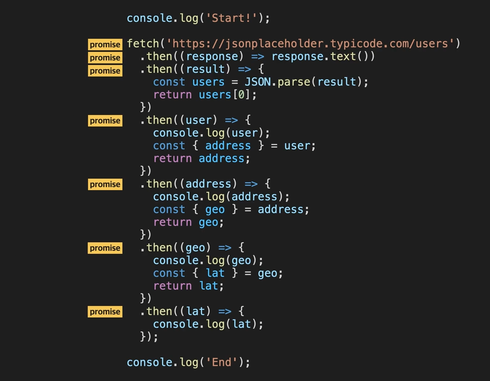
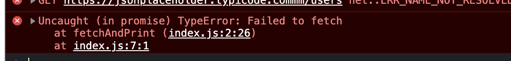

# Javscript Web

웹 브라우져와 서버 사이 일어나는 통신에 대한 토픽

[비동기 실행과 Promise 객체](#비동기 실행과 Promise 객체)

[Catch Method](#Catch Method) 

[Finally Method](#Finally) 

[Axios](#Axios )

[Async/Await](# Async/Await)

### Fetch 사용해보기

`개발자도구 - console`에서 아래 요청 보내보기

```js
fetch('https://www.google.com')
  .then((response) => response.text())
  .then((result) => {console.log(result)})
```

여기서 오는 result를 웹 브라우져가 잘 해석해서 우리한테 멀쩡한 화면을 보여주는 것. 웹 브라우져가 서버로 부터 받는 것은 결국 코드 덩어리이고, 그걸 웹 브라우져가 해석하는 것. 

위 코드를 살펴보자. 

요청 - `request`, 응답 - `response`

```js
fetch('https://www.google.com') // fetch : 가져오다. 
  .then((response) => response.text()) // response가 오면, 파라미터와 함께 함수를 실행시키는 것. 
  .then((result) => {console.log(result)}) // 
```

그런데, 잘 보면, response가 온 후에 `(response) => response.text()` 가 실행된다. 이렇게 어떤 조건이 만족했을 때 실행되는 것을 **콜백**이라고 한다. 이 콜백이 핵심이다. 

**then**이 콜백을 등록해 주는 어떤 객체의 메소드. 이 객체가 `Promise`라는 객체인데 다음 토픽에서 자세히 배울 것. 

그 다음 `then`도 다음 콜백을 등록해 주는 것. 이전 콜백의 리턴값을 다음 콜백이 또 넘겨받는 것. 

### Response 객체 

```jsx
fetch('https://www.google.com')
  .then((response) => response.text())
  .then((result) => { console.log(result); });
```

이전 영상에서는 fetch 함수로 리퀘스트를 보내고, 리스폰스를 받아서 그 내용을 출력해봤습니다. fetch 함수의 실행 원리를 다시 정리하자면,

1. fetch 함수는 어떤 객체를 리턴하는데(**Promise** 객체, 챕터 3에서 배웁니다)
2. 이 객체의 **then 메소드**로, '리스폰스가 왔을 때 실행할 콜백'을 등록할 수 있습니다.
3. 이렇게 등록된 콜백들은 then 메소드로 등록한 순서대로 실행되고, 이때 이전 콜백의 리턴값을 이후 콜백이 넘겨받아서 사용할 수 있는데요.

그런데 예리한 분들은 이 코드를 보고 이런 궁금증이 생겼을 수도 있습니다.

위 코드처럼 적지 않고 그냥

```jsx
fetch('https://www.google.com')
  .then((response) => { console.log(response); });
```

'이렇게 코드를 적어도 리스폰스의 내용을 출력할 수 있지 않나요?' 라는 의문을 가지셨을 수도 있는데요.

사실 이 response 파라미터로는 리스폰스의 실제 내용 자체가 넘어오는 게 아닙니다. response 파라미터에는, 리스폰스에 관한 **각종 부가 정보들**과, **실제 내용**을 함께 갖고 있는 하나의 **객체(object)**가 넘어오는데요. 그래서 우리가 원하는 리스폰스의 실제 내용을 보려면,

```jsx
fetch('https://www.google.com')
  .then((response) => response.text())
  .then((result) => { console.log(result); });
```

이렇게 reponse 객체의 text라는 메소드를 호출해야 합니다. 그리고 이 text 메소드의 리턴값이 바로 리스폰스의 실제 내용입니다.(**사실은 실제 내용을 갖고 있는 Promise 객체이지만**, 더 자세한 내용은 챕터 3에서 알아봅시다)

왜 바로 response를 출력하지 않았는지 아시겠죠? 사실 이 코드를 완벽하게 해석하려면 좀 더 많은 내용을 알아야 합니다. 그런 내용은 곧 챕터 3에서 배울 거니까 일단은 이런 식으로 리스폰스를 받아서 처리할 수 있다는 정도만 기억하고 갑시다.


### 개발자 도구란?

**1. 개발자 도구란?**

웹 브라우저에 내장된 개발자 도구는, 웹 브라우저가 내부적으로 어떤 동작을 하고 있는지 살펴보게 해주는 도구입니다. 사실 일반 사용자들에게는 필요 없는 도구이지만, 웹 페이지를 만드는 개발자 즉, **'웹 프론트엔드 개발자'**에게 이 개발자 도구는 정말 중요한 도구입니다. 왜냐하면 이 개발자 도구를 사용해서 자신이 작성한 코드를 브라우저가 어떻게 해석하고 실행하는지 자세하게 살펴볼 수 있기 때문인데요.

그래서 웹 프론트엔드 개발자가 되고 싶은 분이라면, 이 개발자 도구의 기초적인 사용법을 익혀두는 게 좋습니다. 하지만 이번 토픽은 개발자 도구 사용법에 관한 토픽은 아니기 때문에 사용법을 별도로 배우지는 않습니다. 혹시 크롬의 개발자 도구를 별도로 공부해보고 싶은 분은 [구글에서 제공하는 공식 설명](https://developers.google.com/web/tools/chrome-devtools)을 참조하세요. 해당 링크를 방문했을 때 모든 내용이 영어라서 보기가 힘들다면,


페이지 우측 상단의 버튼을 클릭해서 언어를 바꿔볼 수 있습니다. 참고로 개발자 도구 사용법을 몰라도 이번 토픽을 듣는 데는 아무 지장이 없습니다. 안심하세요.

**2. 개발자 도구를 여는 단축키**

자바스크립트를 실행하는 방법에는 여러 가지가 있습니다. 보통은 HTML 태그에서 자바스크립트 파일을 로드해서 실행하지만, 이번 토픽에서는 보다 빠르고 직관적인 결과 확인을 위해서, 개발자 도구에서 자바스크립트를 실행할 겁니다. 따라서 웹 브라우저에서 매번 마우스로 개발자 도구를 여는 것보다는 그 단축키를 알아두는 것이 효율적인데요. 크롬에서 개발자 도구를 여는 단축키는 다음과 같습니다.

- Mac : **Command 키 + Option 키 + 알파벳 i 키**
- Windows : **Ctrl 키 + Shift 키 + 알파벳 i 키**

각자 자신의 환경에 맞는 단축키를 외우고, 활용해보세요.

**3. 개발자 도구 위치 설정**

개발자 도구를 처음 여는 분들은 개발자 도구 창이 전체 화면의 오른쪽에 떠 있을 수도 있습니다.


만약 이전 영상에서 본 것처럼, 개발자 도구의 위치를 화면 하단으로 옮기고 싶다면, 위 이미지에서 보이는 빨간색 박스 안의 점 세 개 아이콘을 클릭하세요. 그럼 다음과 같이


개발자 도구의 위치를 설정하는 탭을 볼 수 있습니다. 여기서 여러분이 원하는 위치를 자유롭게 선택하시면 됩니다.

**4. Console 탭의 출력 원리**

앞으로 여러분은 개발자 도구의 Console 탭에서 자바스크립트 코드를 실행하게 될 겁니다.


그런데 Console 탭의 출력 결과에 관해 여러분이 알아둬야 할 내용이 있습니다. 잠깐 Console 탭 화면에서, 어떤 숫자를 합한 값을 리턴해주는 **add**라는 함수를 정의해보겠습니다. 함수를 정의하고 엔터를 치면


이런 식으로 그 뒤에 **undefined**가 출력되는 것을 알 수 있습니다. 이 undefined는 왜 출력된 걸까요?  이번엔 잠깐 이 add 함수를 실행해봅시다.


이번에는 add 함수가 리턴한 값인 3이 잘 출력되었습니다. 자, 이번엔 Hello라는 단어를 출력해보겠습니다.


이번에는 Hello라는 단어가 출력되고, 그 밑에 또 undefined가 출력되었습니다. 이번에도 undefined가 등장했네요. 자, 그럼 이제 add 함수를 여러 번 호출해볼까요?


이렇게 코드를 여러 줄 연달아 작성하려면 Enter 말고 **Shift + Enter**를 사용하시면 됩니다. 실행 결과를 보니 가장 마지막 add 함수의 리턴값인 201만 출력되네요.

이때까지 본 것처럼 개발자 도구의 Console 탭은 해당 코드에서 최종적으로 리턴하는 값을 출력합니다. **만약 아무런 값도 리턴하지 않는 경우에는 undefined를 리턴한 것으로 간주하는데요**. 그래서 위에서 봤던 것처럼 단순히

(1) add 함수를 선언하거나,  (2) Hello라는 문자열을 출력하는 코드는

어떤 값을 리턴하는 코드는 아니기 때문에 undefined를 리턴한 것으로 간주해서 undefined가 출력된 것입니다. 하지만

```js
add(1, 2) 
```

처럼 실제로 어떤 값을 리턴하는 코드인 경우에는 undefined가 아닌 실제 리턴값 3이 출력됩니다. 그리고 위에서 add 함수를 여러 번 실행한 경우처럼, 여러 개의 리턴 값이 존재하는 경우에는, 가장 마지막 코드의 리턴값을 출력합니다.

앞으로 Console 탭의 자바스크립트 코드를 실행하다보면,

(1) 개발자 도구가 출력하는 undefined 때문에 당황하거나,  (2) 나의 코드에서 출력한 undefined와, 개발자 도구가 출력한 undefined가 섞여서 혼란스러울 수도 있는데요.

그럴 때마다 방금 배운 내용에 유의하면서, Console 탭에서의 출력 결과를 해석하시면 됩니다.


### 웹이란?

웹페이지, 웹서비스, 웹서핑, 웹서버

**World Wide Web**  

**웹**이라는 것은, 우리가 웹 브라우져를 통해 돌아다니는 가상의 연결망 세계를 의미한다. 무수히 많은 웹페이지들이 서로 연결되어 있다. Hyper Text란 다른 웹페이지에 대한 참조를 가지고 있는 텍스트를 의미한다. 

### URL이란?

*Uniform Resource Locator*

웹에 존재하는 특정 데이터를 나타내는 문자열. 

예시)

`https://www.ebay.com/men/shirts?color=blue&size=m`

`www.ebay.com`  **HOST**: 전세계에 수 많은 서버들 중, 이 도메인에 특정되는 하나의 서버를 특정할 수 있다. 

`/men/shirts` **PATH**: 서버에 있는 데이터 중 원하는 데이터를 측정. 여기서는 남성용 상품 중 셔츠. 

`?color=blue&size=m` **QUERY** : 데이터에 관한 세부적인 요구사항. **&**으로 각각의 속성을 나타낸다. 


URL은 크게

- 호스트(host),
- 패스(path),
- 쿼리(query)

로 이루어져있다는 걸 배웠는데요.(다른 구성 요소들도 있지만 일단은 일반적으로 보게 되는 것들만 배워봅시다.) 이번 노트에서는 URL에 관한 또 다른 궁금증들을 해결해봅시다.

1. **전 URL을 직접 입력한 적이 거의 없는데요?**

이전 영상에서 URL의 의미와 구조에 대해 배울 때, 여러분은 이런 의문을 가졌을 수도 있습니다.

'내가 URL을 직접 입력한 적은 거의 없는데?'

하는 의문 말이죠.

굉장히 의미 있는 생각입니다. 여러분이 웹 서핑을 할 때를 생각해봅시다. 여러분은 보통 웹 브라우저의 주소창에 [www.naver.com](https://www.naver.com/)나 [www.google.com](https://www.google.com/) 처럼, URL에서의 호스트(host) 부분까지만 입력하고, 어떤 서비스의 메인 페이지로 진입할 겁니다. 그리고 그 뒤로는 마우스로 화면에 있는 이미지나 버튼 등을 클릭할 뿐, 더이상 URL을 직접 입력할 일이 많지는 않은데요. 그 이유는 바로, 이미 **여러분이 화면에서 클릭하는 버튼 등에 어느 URL로 새로운 리퀘스트를 보낼지, HTML 코드 또는 Javascript 코드로 다 작성이 되어있기 때문**입니다. 예를 들어, 여러분이 화면에서 클릭하는 버튼은 이런 식의 HTML 코드로 작성되어 있습니다.

```html
<a href="https://www.nazer.com/blogs/codeitOfficial/120"...>...</a>
<a href="/codeitCommunity/threads/731" ...>...</a> 
```

(지금 두 번째 URL은 상대 URL입니다. 같은 서버 안에 존재하는 데이터의 경우 이렇게 path 이후의 부분만 표시해서 나타낼 수도 있습니다.)

우리가 웹 페이지에서 버튼을 클릭하면 지금 보이는 것 같은 a 태그의 href 속성에 적힌 URL 주소로 웹 브라우저가 알아서 리퀘스트를 보내서 리스폰스를 받아 새로운 웹 페이지를 로드합니다. 이런 식으로 웹 페이지에 미리 모든 것이 세팅되어 있기 때문에 여러분은 해당 서비스의 서버에서 요구하는 path의 형식, query의 형식을 알 필요가 없습니다. 다만 의식하지 않는 상태에서 우리는 계속 URL을 사용하고 있는 겁니다.

하지만 일반 사용자가 아닌 **개발자라면, 이런 path에 관한 설계, query에 관한 설계를 직접 해야** 하기 때문에 URL의 구조에 대해서 정확하게 알고 있어야 합니다.

**2. 리퀘스트를 보내면 일어나는 일**

우리가 웹 브라우저의 주소창에 URL을 입력하고 엔터를 치면, 실제로 어떤 일이 이루어지는 걸까요? 잠깐 아래 그림을 봅시다.


위 이미지에서 왼쪽 아이콘은 **웹 브라우저**를 나타내고, 오른쪽은 codeitshopping이라고 하는 서비스의 **서버**를 나타낸다고 가정해봅시다. 만약 우리가 위와 같은 URL을 입력하고 엔터를 치면 다음과 같은 일들이 순차적으로 발생합니다.

(1) 웹 브라우저는 URL에서 호스트(host, 위 그림에서 www.codeitshopping.com에 해당하는 부분) 부분을 보고, 전 세계의 수많은 서버들 중에서 정확히 어느 서버와 통신을 해야 하는지를 찾습니다. 이때 호스트 부분에 적힌 www.codeitshopping.com 같은 것을 **도메인 네임(Domain Name)**이라고 하는데요. 특정 서버를, 외우기 어려운 IP 주소가 아니라 외우기 쉬운 문자열로 나타낸 것이 바로 도메인 네임입니다. 그럼 어떻게 웹 브라우저는 도메인 네임만으로 특정 서버를 식별할 수 있는 걸까요? 이를 위해서는 **Domain Name Resolution**이라고 하는 작업을 수행해야 합니다. 이 작업을 수행하면 해당 도메인 네임이 나타내는 특정 서버를 식별할 수 있는데요. 혹시 Domain Name Resolution이 뭔지 궁금한 분들은 코드잇의 또 다른 토픽에 있는 ['도메인 네임과 IP 주소' 노트](https://www.codeit.kr/learn/courses/nodejs-backend-development/3720)를 참조하세요.

(2) (1)에서 어떤 서버와 통신해야 하는지를 식별하고 나면, 웹 브라우저는 해당 서버로 리퀘스트를 보냅니다. 이때 **URL에서 path 이후의 부분들(보라색 표시한 부분, path와 query)을 리퀘스트에 담아서 보냅니다.**

(3) 리퀘스트를 받은 서버는 리퀘스트에 담긴 path 이후의 부분들을 보고, 그것이 의미하는 데이터를 찾고, 찾은 결과를 리스폰스에 담아서 보내줍니다.

(4) 그럼 웹 브라우저는 받은 리스폰스의 내용을 갖고 사용자에게 보여줍니다. 이때 리스폰스의 내용이 HTML 코드, Javascript 코드 등에 해당하면 그에 맞는 예쁜 화면을 사용자에게 그려서 보여주는 것이구요. 리스폰스의 내용에는 다른 종류도 많은데요. 이건 챕터 2에서 배워봅시다.

이때까지 우리가 브라우저에서 URL을 입력하고 엔터를 치면 발생하는 일에 대해 배워봤는데요. URL을 기반으로 해서 실제 리퀘스트가 어떻게 이루어지는지 어느 정도 감이 오시죠?

 

## HTTP 

**https://**www.*

이것을 스킴(Scheme)이라고 한다. 프로토콜의 이름이 들어간다. 

프로토콜이란 통신을 하는 두 주체가 지켜야 하는 통신규약을 의미한다. 웹 브라우져와 서버가 서로 통신을 할 때 지켜야 하는 약속. 즉, https뒤에 있는 것들이 의미하는 데이터를 가져오기 위해 통신을 해야 되는데, **https**라는 프로토콜을 지키겠다는 뜻. 이제, 웹브라우져도 이 http 프로토콜에 맞게 request를 보내야 하고, 서버도 이 http프로토콜에 맞게 response를 보내야 한다. 

**HTTP: Hyper Text Transfer Protocol** 

Hyper Text : 다른 텍스트에 대한 참조를 갖고 있는 텍스트. 원래 HTTP는 하이퍼텍스트를 웹페이지와 서버 사이에서 주고받기 위해 탄생한 것이라 이런 이름을 가지고 있다. 요즘은, 뭐 당연히 이미지 영상 이런것도 다 주고 받는다. 

HTTPS = HTTP + Secure 안전한 HTTP


우리가 어떤 웹 페이지를 보기 위해 URL을 입력하고 엔터를 치면 **보통 한 번 이상의 리퀘스트와 리스폰스가 오고 갑니다.** 딱 한 번의 리퀘스트와 리스폰스만 오고 가면 될 것 같은데, 이게 무슨 말일까요? 확인해보겠습니다.

저는 지금 크롬의 개발자 도구를 열어두었습니다.


그리고 개발자 도구에서 **Network 탭**이라고 하는 걸 클릭했는데요. 이 Network 탭에서는 브라우저가 구체적으로 어떻게 생긴 리퀘스트를 보내고, 어떻게 생긴 리스폰스를 받는지를 보여줍니다. 이 상태에서 웹 브라우를 새로고침해보겠습니다.


그럼 구글 메인 페이지로 재접속하게 되고, 이제 Network 탭에 여러 개의 줄(row)들이 뜨는데요. 이때 각각의 한 줄이, **하나의 '리퀘스트-리스폰스' 쌍**이라고 보시면 됩니다. **전 딱 한 번 엔터를 쳤을 뿐인데 정말 많은 수의 리퀘스트와 리스폰스가 오고 갔죠?** 화면 하단을 보면 총 19번의 리퀘스트가 전송된 것을 알 수 있는데요. 왜 이런 일이 발생하는 걸까요?

사실 웹 브라우저가 처음으로 리퀘스트를 보내고, 서버로부터 받는 첫 리스폰스의 내용만으로 온전한 화면을 그릴 수 있는 경우는 많지 않습니다. 보통은 받은 첫 리스폰스의 내용에 적힌 '추가적으로 필요한 데이터'들을 재차 요청해야 하는 것이 더 일반적입니다. 예를 들어, 이런 식의 HTML 코드가 첫 리스폰스의 내용으로 왔다고 해봅시다.

```html
<html>
<head></head>
<body>
    ...
    <div>
        
    </div>
  ...
<script src="http://www.server_B.com/c/d/main.js"></script>
</body>
</html>
```

**웹 브라우저는 당장 이 코드만으로는 완벽한 화면을 그릴 수 없습니다.** 왜냐하면 새롭게 리퀘스트를 보내서 가져와야할 것들이 존재하기 때문이죠.

예를 들어, 지금 여기서 이 img 태그의 src 속성에 있는 이미지를 그리려면

```html
 
```

img 태그의 src 속성에 적힌 URL로 다시 리퀘스트를 보내서 example.png에 해당하는 **이미지**를 받아와야 합니다.

그리고

```html
<script src="http://www.server_B.com/c/d/main.js"></script>
```

이 script 태그의 src 속성에 적힌 URL로도 리퀘스트를 보내서 main.js라는 **자바스크립트 파일**을 받아와야 하구요.

벌써 이렇게 2번의 추가적인 리퀘스트가 필요한 겁니다.

이런 식으로 보통 브라우저가 하나의 페이지를 그릴 때는 첫 리스폰스의 내용 안에서 또다시 요구되는, 여러 가지 다른 것들을 구하기 위해 다시 여러 개의 리퀘스트를 보내는 것이 일반적입니다. 게다가 그렇게 또 받은 리스폰스의 내용에 따라 또 새로운 리퀘스트를 보내야 할 수도 있습니다. 바로 이런 원리 때문에 여러분이 어떤 웹 페이지를 딱 한번 접속했다고 해도 그 사이에는 수많은 리퀘스트와 리스폰스가 발생하는 겁니다.

예를 들어, 지금 Network 탭에 보이는 하나의 줄(하나의 '리퀘스트-리스폰스 쌍')을 클릭해보면


이렇게 Google 로고 이미지를 받기 위해 추가적인 리퀘스트를 보내고, 이 이미지를 받아온 것을 확인할 수 있습니다.

이렇게 우리가 **웹 브라우저로 특정 페이지에 접속할 때, 보통 한 번 이상의 리퀘스트-리스폰스가 오고간다는 사실**, 잘 기억하세요.


# JSON이란?

HTML이 들어있는 `response`말고 어떤 정보가 들어있는 response도 있다. 

```js
fetch('https://jsonplaceholder.typicode.com/users')
  .then((response) => response.text())
  .then((result) => { console.log(result); });
```

여기로 보내보자. 그러면, JSON이라는 형태가 온다. 앞에서 했던 것은, 브라우져가 화면을 그리기 위한 재료들이 왔었고, 이번에는 순수하게 정보를 담고 있는 것들이 왔다. 

**JSON**: **J**ava**S**cript **O**bject **N**otation. 정보 교환하기 위한 포맷을 자바스크립트의 문법을 빌려서 만든 것. 

위 결과 보면 자바스크립트에서 객체를 나타내는 방식과 동일하고, 그 객체들을 배열에 담아 준다. 

구체적으로 알아보기 : [링크](https://www.json.org/json-en.html)

사실 자바스크립트와, JSON이 완벽히 동일한 것은 아니다. 차이점을 보자. 

 이 두 가지가 비슷하기는 하지만 완벽하게 **동일한 것은 아닙니다.** 아래에서 둘 사이의 차이점에 대해 알아봅시다.

**1. JSON에는 프로퍼티의 이름과 값을 표현하는 방식에 제한이 있습니다.**

### (1) JSON에서는 각 프로퍼티의 이름을 반드시 큰따옴표(")로 감싸줘야 합니다.

잠깐 자바스크립트 코드로 member라는 객체를 생성해볼까요?

```jsx
const member = {
  name: 'Michael Kim',
  height: 180,
  weight: 70,
  hobbies: ['Basketball', 'Listening to music']
};
```

자바스크립트에는 객체를 생성할 수 있는 여러 가지 방법이 있는데요. 그중 한 가지는 이런 식으로 중괄호('{ }') 안에 객체의 프로퍼티의 이름(키)과 값(밸류)쌍을 순서대로 나열해서 생성하는 방법입니다. 지금 보이는 표기를 **Object Literal**이라고 하는데요. Object Literal을 쓸 때는 문법에 약간의 유연함이 있습니다. 저는 지금 member 객체의 각 프로퍼티의 이름인 name, height, weight, hobbies에 큰따옴표를 붙이지 않았는데요. Object Literal에서는 이렇게 프로퍼티의 이름에 큰따옴표를 붙이지 않아도 되고,

```jsx
const member = {
  "name": 'Michael Kim',
  "height": 180,
  "weight": 70,
  "hobbies": ['Basketball', 'Listening to music']
};
```

이렇게 큰따옴표를 붙여도 됩니다.

**하지만 JSON의 경우에는** 프로퍼티의 이름에 반드시 큰따옴표를 붙여줘야만 합니다.

```jsx
{
   "name":"Michael Kim",
   "height":180,
   "weight":70,
   "hobbies":["Basketball", "Listening to music"]
}
```

지금 각 프로퍼티의 이름이 모두 큰따옴표로 둘러싸여 있죠? 이렇게 JSON에서는 각 프로퍼티의 이름을 반드시 큰따옴표로 감싸주어야 합니다. 큰따옴표로 감싸주지 않으면 JSON을 처리하려고 할 때 에러가 납니다.

### (2) JSON에서는 값이 문자열인 경우 큰따옴표(")를 사용해야 합니다.

```jsx
const member = {
  "name": 'Michael Kim',
  "height": 180,
  "weight": 70,
  "hobbies": ['Basketball', 'Listening to music']
};
```

잠깐 member 객체를 다시 볼게요. 지금 name 프로퍼티의 값으로 'Michael Kim'이라는 문자열이 들어가 있죠? 자바스크립트에서는 문자열을 나타낼 때, 이렇게 작은따옴표(')를 써도 되고, 큰따옴표(")를 써서 "Michael Kim"이라고 써도 됩니다.

하지만 JSON에서는 문자열 값을

```jsx
{
   "name":"Michael Kim",
   "height":180,
   "weight":70,
   "hobbies":["Basketball", "Listening to music"]
}
```

지금 보이는 "Michael Kim", "Basketball", "Listening to music"처럼 항상 **큰따옴표**로 감싸서 적어줘야만 합니다.

**2. JSON에서는 표현할 수 없는 값들이 있습니다.**

자바스크립트에서는 프로퍼티의 값으로 사용할 수 있는 undefined, NaN, Infinity 등을 JSON에서는 사용할 수 없습니다. 참고로, JSON은 비록 자바스크립트로부터 비롯된 데이터 포맷이지만, 그 탄생 목적은 언어나 환경에 종속되지 않고, 언제 어디서든 사용할 수 있는 데이터 포맷이 되는 것이었습니다. 따라서 자바스크립트의 문법에서만 유효한 개념을 JSON에서는 나타낼 수 없다는 것은 어찌 보면 당연한 결과입니다.

**3. JSON에는 주석을 추가할 수 없습니다.**

JSON은 코드가 아니라 데이터 포맷이기 때문에 그 안에 주석을 포함시킬 수 없습니다. 
 자, 이때까지 자바스크립트의 문법과 JSON 문법 간의 미세한 차이를 배워봤는데요. 이 둘은 일반적으로 호환되는 것이 맞지만, 위에서 살펴본 세부적인 차이가 있다는 점을 알아두는 게 좋습니다. 이런 차이가 있다는 것을 모르면, 나중에 실무에서 JSON 데이터를 처리하다가 에러가 생겨도, 그 이유를 이해할 수 없기 때문입니다.

자바스크립트 문법과 JSON 문법 간의 차이가 더 궁금한 분들은 [이 링크](https://developer.mozilla.org/en-US/docs/Web/JavaScript/Reference/Global_Objects/JSON)를 참조하세요.


### JSON 데이터를 객체로 변환하기

그런데, typeof를 찍어보니깐, string으로 나온다. 

```js
fetch('https://jsonplaceholder.typicode.com/users')
  .then((response) => response.text())
  .then((result) => { console.log(typeof result); });
```

결과 : **string**

이 json자체가 string타입이다? 그러면, 뭐 루프돌고 이런것도 아니는 거네. 이 통으로 문자열이라는 거잖아. 

string type의 json객체는 그대로, javascript 객체로 **변환**이 가능하다.  

```js
fetch('https://jsonplaceholder.typicode.com/users')
  .then((response) => response.text())
  .then((result) => { 
    const users = JSON.parse(result)
    console.log(users.length);
    users.forEach((user) => {
      console.log(user.name)
    })
      }
    ); 

// 이렇게 하니깐, 실제로 user.name이 출력된다. 
```


### 메소드의 의미

지금까지는 데이터를 받아오기 위한 Request를 보냈다. 그러나, 다른 성격의 리퀘스트도 존재함. 

뭔가 데이터를 추가해 달라거나, 그런 요청도 있을 수 있음. 

리퀘스트는 서버에 어떤 처리를 요구하느냐에 따라 크게 4가지 종류가 있음. 리퀘스트에 존재하는 Method라는 것을 보고 무슨 리퀘스트인지 알 수 있다. 


결국 각각의 메소드에 대해서 서버는 보통 그에 맞는 데이터 관련 조작을 하겠죠? 만약 서버가 데이터베이스를 사용한다면 **CRUD** 작업을 하게 될 겁니다.  CRUD란 **Create-Read-Update-Delete**의 약자로 데이터베이스 관점에서 데이터에 관한 처리를 나타낸 합성어인데요.  각 메소드는 각 데이터 관련 작업에 이렇게 대응됩니다.

| 메소드 | 데이터 처리 |
| ------ | ----------- |
| GET    | READ        |
| POST   | CREATE      |
| PUT    | UPDATE      |
| DELETE | DELETE      |


#### Request와 Head와 Body

하나의 리퀘스트는 Head와 Body부분으로 이루어져 있다. PUT이나, POST 리퀘스트는 보통 Body에 데이터를 담아서 보내주게 되겠지. 그러나, GET, DELETE 리퀘스트는 보통 Body가 필요하지 않다. 


직접 리퀘스트 보내보고 확인해보자. 

```js
fetch('https://jsonplaceholder.typicode.com/users')
  .then((response) => response.text())
  .then((result) => { console.log(result)}
    ); 
```


아래, `Request Headers`에 가도 있다. 이 Request에는 Body부분이 없다. 

웹에서 사용되는 HTTP의 프로토콜에는 여러 버전이 있습니다. 현재 시중의 서비스들에서는 1.1 버전과 2.0 버전이 주로 사용되고 있는데요.  각 버전에서 리퀘스트의 헤드에 관한 구체적인 표현이 조금 다릅니다.

**http/1.1**에서는 **method와 path**의 경우

```
GET /men/shirts HTTP/1.1 
헤더 1: 값
헤더 2: 값
헤더 3: 값 
...
```

이런 식으로 가장 첫 번째 줄에 별도의 형식을 갖고 표시됩니다. 이를 **start-line**이라고 하는데요.  **http/2**에서는 start-line 대신에, **method와 path를 일종의 가상 헤더(pseudo header)로 표현**합니다. 가상 헤더 앞에는 콜론(:)이 붙어있는데요.

```
...
:method: GET
:path: /men/shirts
...
헤더 1: 값
헤더 2: 값
헤더 3: 값
...
```

조금 깊은 내용이지만 혹시 이전에 http/1.1 버전 때, 리퀘스트의 헤드와 바디를 배운 분들이 혼동을 할 우려가 있어 참고차 알려드립니다.  현재 영상에서 접속한 구글 홈페이지의 서버는 촬영 당시 **http/2** 프로토콜을 지원하는 서버였기 때문에 이렇게 Start-line 대신 가상 헤더들이 보인 것입니다.  일단 이 가상 헤더들과 일반적인 헤더들을 한번에 묶어서 헤더라고 설명한 것입니다.


직접 리퀘스트 보내보자. 

**GET**

```js
fetch('https://learn.codeit.kr/api/members')
  .then((response) => response.text())
  .then((result) => { console.log(result)}
    ); 

```

**특정 직원의 정보만 조회**

```js
fetch('https://learn.codeit.kr/api/members/3')
  .then((response) => response.text())
  .then((result) => { console.log(result)}
    ); 
```

**POST 리퀘스트**

옵션 객체를 추가한다. **FETCH**함수는 이 옵션 객체를 추가 안하면, 기본적으로 GET 리퀘스트를 보내도록 되어 있다. 

`stringify -> js to json`는 앞에서 썻던 `parse -> json to js`와 반대로 변환

```js
fetch('https://learn.codeit.kr/api/members', {
  method : 'POST', 
  body : JSON.stringify(newMember)
})
  .then((response) => response.text())
  .then((result) => { console.log(result)}
); 
```

`response`가 온다. 실제 추가된 객체가 옴. 이거는 개발자의 설계에 따라 어떤 response 줄지 달린 것. 

```js
{
  "id": 7,
  "name": "Noel",
  "email": "hi@example.com",
  "department": "engineering"
}
```

이전 영상에서는 처음으로 GET 리퀘스트가 아닌, POST 리퀘스트를 보내봤습니다. 우리는 리퀘스트의 헤드와 바디에 대해서 배울 때 GET 리퀘스트를 가지고 배웠는데요. POST 리퀘스트의 경우에는 리퀘스트의 헤드와 바디가 어떻게 생겼는지 살펴봅시다. 개발자 도구의 Network 탭을 사용해서 확인해볼게요.


이렇게 이전 영상에서처럼 새 직원 정보를 POST 리퀘스트로 추가하고 Network 탭을 클릭할게요.


그리고나면 뜨게 되는 화면에서 제가 보낸 POST 리퀘스트와 받은 리스폰스 쌍을 의미하는 한 줄(members)을 클릭할게요. 그다음 오른쪽 화면을 보면 지금 Request Method 부분에 POST라고 써있는게 보입니다.

자, 그리고 이번에는 **GET 리퀘스트 때는 보지 못했던 바디**도 확인해보겠습니다. 스크롤을 좀 더 내려보면


이렇게 Request Payload라고 쓰인 부분이 바로 리퀘스트의 바디 부분입니다. **새 직원 정보를 나타내는 JSON 데이터**가 잘 들어가 있죠? GET 리퀘스트 때는 없었던 바디의 내용을 POST 리퀘스트에서는 볼 수 있네요.

그리고 Response 탭을 눌러보면,


이렇게 **실제로 추가된 직원 정보가 JSON 데이터로** 잘 온 것을 알 수 있습니다.

앞으로 여러분도 자바스크립트로 웹 통신을 할 때, 이렇게 개발자 도구로 리퀘스트와 리스폰스의 모습을 종종 살펴보세요. 그럼 현재 무슨 일이 이루어지고 있는지 훨씬 실감나게 느낄 수 있을 겁니다.


#### PUT과 DELETE Request

**PUT**

```js
const member = {
  name : 'Noel', 
  email : 'my@example.com', 
  department : 'marketing'
}; 

fetch('https://learn.codeit.kr/api/members/7', {
  method : 'PUT', 
  body : JSON.stringify(member)
})
  .then((response) => response.text())
  .then((result) => { console.log(result)}
    ); 
```

**DELETE** - Body가 딱히 필요가 없겠지. 

```js
fetch('https://learn.codeit.kr/api/members/6', {
  method : 'DELETE'
})
  .then((response) => response.text())
  .then((result) => { console.log(result)}
    ); 
```


우리는 이제 웹 브라우저가 리퀘스트를 보낼 때

(1) 어느 **URL**로 리퀘스트를 보내는지 (2) 무슨 **메소드**(GET, POST, PUT, DELETE 등)가 그 헤드에 설정되어있는지가

중요하다는 것을 배웠습니다.

그런데 우리가 어떤 리퀘스트를 보냈을 때, 무슨 리스폰스를 받는지는 어떻게 설계되는 걸까요? 개발자들이 실제로 개발을 할 때 이 부분을 어떻게 만들고 있는지 이번 노트에서 배워보겠습니다.

# 1. Web API

우리가 어떤 리퀘스트를 보냈을 때, 무슨 리스폰스를 받는지는 **모두 그 서비스를 만드는 개발자들이 정하는 부분**입니다. 잠깐 실제 개발 현장에서 일어나는 이야기를 해볼게요. 개발자에는 크게 두 가지 종류가 있습니다. 첫 번째는 사용자가 직접 서비스 화면을 보는 웹 페이지나 앱 등을 만드는 프론트엔드(Front-end) 개발자, 두 번째는 웹 브라우저나 앱이 보내는 리퀘스트를 받아서 적절한 처리를 한 후 리스폰스를 주는 서버의 프로그램을 만드는 백엔드(Back-end) 개발자, 이 두 가지인데요.

하나의 서비스를 만들 때는 프론트엔드 개발자들과 백엔드 개발자들이 모여 '*프론트엔드에서 이 URL로 이렇게 생긴 리퀘스트를 보내면, 백엔드에서 이런 처리를 하고 이런 리스폰스를 보내주는 것으로 정합시다*'와 같은 논의를 하고, 이런 내용들을 정리한 후에 개발을 시작합니다.

이것을 'Web API 설계'라고 하는데요. API란 Application Programming Interface의 약자로, 원래는 '**개발할 때 사용할 수 있도록 특정 라이브러리나 플랫폼 등이 제공하는 데이터나 함수 등**'을 의미합니다. 웹 개발에서는 어느 URL로 어떤 리퀘스트를 보냈을 때, 무슨 처리가 수행되고 어떤 리스폰스가 오는지에 관해 미리 정해진 규격을 **Web API**라고도 하는데요.

Web API를 설계한다는 것은 서비스에서 사용될 모든 URL들을 나열하고, 각각의 URL에 관한 예상 리퀘스트와 리스폰스의 내용을 정리한다는 뜻입니다. 예를 들어, 이전 영상에서 사용한 학습용 URL(https://learn.codeit.kr/api/members)에서 직원 정보 추가 기능을 설계한다면 다음과 같이 할 수 있는 겁니다.

```jsx
...

3. 직원 정보 추가

https://learn.codeit.kr/api/members 

(1) Request
- Head
Method : POST
...

- Body
{
  "name": "Jerry",
  "email: "jerry@codeitshopping.kr",
  "department": "engineering",
}
...

(2) Response
Success인 경우 :
- Head
...
- Body
{
  "id": "[부여된 고유 식별자 값]",
  "name": "Jerry",
  "email": "jerry@codeshopping.kr"
  "department": "engineering",
}
Fail인 경우 :
...
```

이렇게 해당 서비스에서 제공되는 각 URL에, 어떤 리퀘스트를 보내면, 서버는 어떤 리스폰스를 보내야 하는지를 일일이 설계하는 것이 Web API 설계인 겁니다. 물론 실무에서는 지금 보이는 예시보다 훨씬 체계적이고 단정한 방식으로, 상용 툴 등을 사용해서 정리하지만 일단은 이해 차원에서 보여드렸습니다. 이런 식으로 Web API가 설계되고 나면, 그때 프론트엔드/백엔드 개발자들이 해당 설계에 맞게 각자 코드를 작성하기 시작하는 겁니다. 물론 설계와 개발이 동시에 진행되기도 하고, 설계 내용이 중간에 수정되기도 합니다.

오늘날 많은 회사 내의 개발팀은 이런 식으로 Web API를 설계하고 웹 서비스를 만듭니다. 그런데 문제가 하나 있습니다. 그건 바로 **Web API는 어떻게 설계해도 동작하는 데는 아무런 지장이 없다는 문제입니다.**

이전 영상들에서 저는 직원 정보를 추가하기 위해

(1) 'https://learn.codeit.kr/api/members' URL로    (2) 리퀘스트의 헤드에 POST 메소드를 설정하고, (3) 리퀘스트의 바디에 새 직원 정보를 넣어서 보내면 된다

는 내용의 설계를 했습니다.

그런데 어떤 회사는 같은 기능을 이런 식으로 설계할 수도 있습니다.

(1)  'https://learn.codeit.kr/api/members' URL로 (2) 리퀘스트의 헤더에 GET 메소드를 설정하고, (3) 리퀘스트의 바디에 새 직원 정보를 넣어서 보내면 된다

어느 방식으로 설계해도 서비스가 동작하는 데는 아무런 문제가 없습니다. 하지만 기능적으로 아무런 문제가 없다고 해도 Web API를 아무렇게나 설계해도 되는 것은 아닙니다. 사실 Web API가 잘 설계되었는지에 관한 <u>기준으로는 보통 **REST API**라는 기준이 사용되고 있는데요.</u> 많은 개발자들이 Web API를 개발할 때 이 REST API를 준수하기 위해 노력하고 있습니다. 이게 뭔지 한번 살펴봅시다.

# 2. REST API 이야기

**REST API**는 오늘날 많은 웹 개발자들이 Web API 설계를 할 때, 준수하기 위해 노력하는 일종의 가이드라인입니다. REST API를 이해하기 위해서는 일단 **REST architecture**가 무엇인지부터 알아야 하는데요. 일단 REST architecture에 대해 설명하겠습니다.

REST architecture란 미국의 컴퓨터 과학자인 Roy Fielding이 본인의 박사 논문 'Architectural Styles and the Design of Network-based Software Architectures'에서 제시한 개념인데요. 그는 웹이 갖추어야 할 이상적인 아키텍처(구조)로 REST architecture라는 개념을 제시했습니다. 여기서 REST는 **Representational State Transfer**(표현적인 상태 이전)의 줄임말로, 해석하면 '표현적인, 상태 이전'이라는 뜻입니다. 이게 무슨 말일까요? 이 용어는 Roy Fielding이 고안한 용어인데요. 지금 여러분이 웹 서핑을 할 때를 생각해보세요. 만약 웹을 하나의 거대한 컴퓨터 프로그램이라고 생각한다면, 각각의 웹 페이지는 그 프로그램의 내부 상태를 나타낸다고 할 수 있습니다. 그렇다면 우리가 웹 페이지들을 계속 옮겨 다니면서 보게 되는 내용은, 웹이라는 프로그램의 매번 새로운 상태를 나타내는 표현이라고 할 수 있는데요. 그래서 이것을 '표현적인, 상태 이전'이라고 하는 겁니다. 조금 추상적인 느낌이지만 이해는 되시죠?

그럼 REST architecture가 되기 위한 조건에는 어떤 것들이 있을까요? 다음과 같은 6가지 기준을 충족하면 REST architecture로 인정됩니다.

1. Client-Server
2. Stateless
3. Cache
4. Uniform Interface
5. Layered System
6. Code on Demand

각 기준에 대해 간략하게 설명해보자면 REST architecture는,

1. (**Client-Server**) Client-Server 구조를 통해 양측의 관심사를 분리해야 합니다. 현재 토픽에서는 웹 브라우저가 실행되고 있는 컴퓨터가 Client, 서비스를 제공하는 컴퓨터가 Server에 해당하는데요. 이렇게 분리를 해놓으면 Client 측은 사용자에게 어떻게 하면 더 좋은 화면을 보여줄지, 다양한 기기에 어떻게 적절하게 대처해야할지 등의 문제에 집중할 수 있고, Server 측은 서비스에 적합한 구조, 확장 가능한 구조를 어떻게 구축할 것인지 등의 문제에 집중할 수 있습니다. 이렇게 각자가 서로를 신경쓰지 않고 독립적으로 운영될 수 있는 겁니다.
2. (**Stateless**) Client가 보낸 각 리퀘스트에 관해서 Server는 그 어떤 맥락(context)도 저장하지 않습니다. 즉, 매 리퀘스트는 각각 독립적인 것으로 취급된다는 뜻입니다. 이 때문에 리퀘스트에는 항상 필요한 모든 정보가 담겨야합니다.
3. (**Cache**) Cache를 활용해서 네트워크 비용을 절감해야 합니다. Server는 리스폰스에, Client가 리스폰스를 재활용해도 되는지 여부(*Cacheable*)를 담아서 보내야합니다.
4. (**Uniform Interface**) Client가 Server와 통신하는 인터페이스는 다음과 같은 하위 조건 4가지를 준수해야 합니다. 이 조건이 **REST API와 연관이 깊은 조건**입니다. 어떤 4가지 하위 조건들이 있는지 살펴봅시다.

(4-1) identification of resources : **리소스(resource)는 웹상에 존재하는 데이터를 나타내는 용어**인데요. 저도 이번 노트에서는 리소스라는 용어를 사용하겠습니다. 이것은 리소스(resource)를 URI(Uniform Resource Identifier)로 식별할 수 있어야 한다는 조건입니다. URI는 URL의 상위 개념으로 일단 지금은 URL이라고 생각하셔도 큰 무리는 없습니다.

(4-2) manipulation of resources through representations : Client와 Server는 둘 다 리소스를 직접적으로 다루는 게 아니라 리소스의 '표현(representations)'을 다뤄야 합니다. 예를 들어, Server에 '오늘 날씨'(/today/weather)라는 리소스를 요청했을 때, 어떤 Client는 HTML 파일을 받을 수도 있고, 어떤 Client는 이미지 파일인 PNG 파일을 받도록 구현할 수도 있는데요. 이때 HTML 파일과 PNG 파일 같은 것들이 바로 리소스의 '표현'입니다. 즉, 동일한 리소스라도 여러 개의 표현이 있을 수 있다는 뜻입니다. **사실, 리소스는 웹에 존재하는 특정 데이터를 나타내는 추상적인 개념입니다. 실제로 우리가 다루게 되는 것은 리소스의 표현들뿐인데요.** 이렇게 **'리소스'**와 **'리소스의 표현'**이라는 개념 2개를 서로 엄격하게 구분하는 것이 REST architecture의 특징입니다.

(4-3) self-descriptive messages : self-descriptive는 '자기설명적인'이라는 뜻인데요. 위에서 살펴본 2. Stateless 조건 때문에 Client는 매 리퀘스트마다 필요한 모든 정보를 담아서 전송해야 합니다. 그리고 이때 Client의 리퀘스트와 Server의 리스폰스 모두 그 자체에 있는 정보만으로 모든 것을 해석할 수 있어야 한다는 뜻입니다.

(4-4) hypermedia as the engine of application state : REST architecture는 웹이 갖추어야 할 이상적인 아키텍처라고 했죠? 이때 '웹'을 좀더 어려운 말로 풀어써 보자면 '분산 하이퍼미디어 시스템'(Distributed Hypermedia System)이라고도 할 수 있는데요. 여기서 하이퍼미디어(Hypermedia)는 하이퍼텍스트(Hypertext)처럼 서로 연결된 '문서'에 국한된 것이 아니라 이미지, 소리, 영상 등까지도 모두 포괄하는 더 넓은 개념의 단어입니다. 즉, 웹은 수많은 컴퓨터에 하이퍼미디어들이 분산되어 있는 형태이기 때문에, '분산 하이퍼미디어 시스템'에 해당합니다. 이 조건은 웹을 하나의 프로그램으로 간주했을 때, Server의 리스폰스에는 현재 상태에서 다른 상태로 이전할 수 있는 링크를 포함하고 있어야 한다는 조건입니다. 즉, 리스폰스에는 리소스의 표현, 각종 메타 정보들뿐만 아니라 계속 새로운 상태로 넘어갈 수 있도록 해주는 링크들도 포함되어 있어야 한다는 거죠.

자, 여기까지가 Uniform Interface의 4가지 하위 조건입니다. 사실, 오늘날 우리가 Web API를 설계할 때 위의 하위 조건들을 모두 제대로 이해하고 준수하는 것은 쉽지 않은 일인데요. 일단 아직 남은 5, 6번 조건들을 마저 살펴보고, 4번에 관해 그나마 우리가 실천할 수 있는 규칙들을 아래에서 살펴봅시다.

1. (**Layered System**) Client와 Server 사이에는 프록시(proxy), 게이트웨이(gateway)와 같은 중간 매개 요소를 두고, 보안, 로드 밸런싱 등을 수행할 수 있어야 합니다. 이를 통해 Client와 Server 사이에는 계층형 층(hierarchical layers)들이 형성됩니다.
2. (**Code-On-Demand**) Client는 받아서 바로 실행할 수 있는 applet이나 script 파일을 Server로부터 받을 수 있어야 합니다. 이 조건은 Optional한 조건으로 REST architecture가 되기 위해 이 조건이 반드시 만족될 필요는 없습니다.

자, 이때까지 REST architecture가 되기 위해 충족해야 하는 조건들을 배웠는데요. 이해가 잘 되는 것도 있고 조금 어려운 것도 있죠? 사실 이 내용은 다소 이론적이기도 하고, 웹에 대해 좀 더 많이 공부해야 이해할 수 있는 것들도 있기 때문에 일단은 그냥 넘어가셔도 괜찮습니다.

하지만 기억해야 할 사실은, **REST API는 바로 이런 REST architecture에 부합하는 API를 의미한다**는 사실입니다. 참고로 이런 REST API를 사용하는 웹 서비스를 **RESTful 서비스**라고 합니다. 그렇다면 구체적으로 어떤 식으로 Web API를 설계해야 REST API가 될 수 있는 걸까요? 사실 Roy Fielding의 논문에는 이것에 관한 구체적이고 실천적인 내용들은 제시되어 있지 않습니다. 하지만 많은 개발자들의 경험과 논의를 통해 형성된 사실상의(**de facto**) 규칙들이 존재하는데요.

우리는 그중에서도 조건 **4. Uniform Interface의 하위 조건인 (4-1) identificaton of resources** 에 관해서 특히 개발자들이 강조하는 규칙, 2가지만 배워보겠습니다.

## (1) URL은 리소스를 나타내기 위해서만 사용하고, 리소스에 대한 처리는 메소드로 표현해야 합니다.

이 규칙은 조금 다르게 설명하자면, URL에서 리소스에 대한 처리를 드러내면 안 된다는 규칙인데요. 이게 무슨 말인지 **1. Web API** 부분에서 마지막에 언급했던 예시를 통해 이해해보겠습니다.

예를 들어, 새 직원 정보를 추가하기 위해서

(1) 'https://learn.codeit.kr/api/members' URL로    (2) 리퀘스트의 헤드에 POST 메소드를 설정하고, (3) 리퀘스트의 바디에 새 직원 정보를 넣어서 보내면 된다

고 하는 경우는, URL은 리소스만 나타내고, 리소스에 대한 처리(리소스 추가)는 메소드 값인 POST로 나타냈기 때문에 이 규칙을 준수한 것입니다.

하지만

(1)  'https://learn.codeit.kr/api/members/**add**' URL로 (2) 리퀘스트의 헤더에 GET 메소드를 설정하고, (3) 리퀘스트의 바디에 새 직원 정보를 넣어서 보내면 된다

고 하는 이 경우는 URL에서 리소스뿐만 아니라, 해당 리소스에 대한 처리(add, 추가하다)까지도 나타내고 있습니다. 그리고 정작 메소드 값으로는 리소스 추가가 아닌 리소스 조회를 의미하는 GET을 설정했기 때문에 이 규칙을 어긴 것입니다.

URL은 리소스를 나타내는 용도로만 사용하고, 리소스에 대한 처리는 메소드로 표현해야 한다는 사실, 꼭 기억하세요!

## (2) 도큐먼트는 단수 명사로, 컬렉션은 복수 명사로 표시합니다.

또 다른 규칙 하나를 살펴볼까요? 이 규칙은 URL로 리소스를 나타내는 방식에 관한 규칙인데요. URL에서는

- https://www.soccer.com/europe/teams/manchester-united/players/pogba

이런 식으로 path 부분에서 특정 리소스(pogba, 축구 선수 포그바의 정보)를 나타낼 때 슬래시(/)를 사용해서 계층적인 형태로 나타냅니다. 지금 위 URL의 path 부분을 보면 '유럽의', '축구팀들 중에서', '맨체스터 유나이티드 팀의', '선수들 중에서', '포그바'라는 선수의 정보를 의미하는 리소스라는 걸 한눈에 알 수 있는데요. 이렇게 계층적 관계를 잘 나타내면, URL만으로 무슨 리소스를 의미하는지를 누구나 쉽게 이해할 수 있습니다. Web API를 설계할 때는 이렇게 가독성 좋고, 이해하기 쉬운 URL을 설계해야 하는데요. 그런데 이때 지켜야 할 규칙이 있습니다.

사실 리소스는 그 특징에 따라 여러 종류로 나눠볼 수 있습니다. 이 중에서 우리는 '컬렉션(collection)'과 '도큐먼트(document)'를 배울 건데요. 보통 우리가 하나의 객체로 표현할 수 있는 리소스를 '도큐먼트'라고 합니다. 그리고 여러 개의 '도큐먼트'를 담을 수 있는 리소스를 '컬렉션'이라고 하는데요. 쉽게 비유하자면, 도큐먼트는 하나의 '파일', 컬렉션은 여러 '파일'들을 담을 수 있는 하나의 '디렉토리'에 해당하는 개념입니다.

그리고 이에 관한 규칙은 바로, **URL에서 '도큐먼트'를 나타낼 때는 단수형 명사를, '컬렉션'을 나타낼 때는 복수형 명사를 사용해야 한다는 규칙**입니다.

지금 위 URL에서 europe, manchester-united, pogba가 '도큐먼트'에 해당하고, teams, players가 '컬렉션'에 해당합니다. 도큐먼트는 단수 명사로, 컬렉션은 복수 명사로 표현한 것이 잘 보이죠?

이 규칙을 잠깐 이전 영상의 내용과 연관 지어 생각해볼까요? 예를 들어, 제가

- 전체 직원 정보 조회 - GET
- 새 직원 정보 추가 - POST

이 작업들을 수행하기 위해 사용했던 'https://learn.codeit.kr/api**/members**' URL에서도 직원 전체를 의미하는 members는 이렇게 복수 명사를 사용했다는 것을 알 수 있습니다. members는 member들을 담을 수 있는 컬렉션에 해당하는 개념이기 때문입니다.

그리고 제가

- 특정 직원 정보 조회 - GET
- 기존 직원 정보 수정 - PUT
- 기존 직원 정보 삭제 - DELETE

이 작업들을 수행하기 위해 사용했던 https://learn.codeit.kr/api**/members/3** URL에서는 도큐먼트를 나타내기 위해 단수 명사 대신 직원 고유 식별자인 id 값을 썼는데요. 이렇게 숫자를 쓰는 경우에는 단복수 문제가 없겠죠?

'도큐먼트', '컬렉션' 개념을 우리가 배운 메소드 종류와 연결해서 모든 경우의 수를 생각해보면 다음과 같습니다.

| 제목   | /members                            | /members/3         |
| ------ | ----------------------------------- | ------------------ |
| GET    | 전체 직원 정보 조회                 | 3번 직원 정보 조회 |
| POST   | 새 직원 정보 추가                   | X                  |
| PUT    | 전체 직원 정보 수정(잘 쓰이지 않음) | 3번 직원 정보 갱신 |
| DELETE | 전체 직원 정보 삭제(잘 쓰이지 않음) | 3번 직원 정보 삭제 |

지금 표에서 보이는 것처럼, 전체 직원 정보를 대상으로 PUT 리퀘스트 또는 DELETE 리퀘스트를 보내는 것은 전체 직원 정보를 모두 수정 또는 모두 삭제한다는 뜻이기 때문에 사실상 잘 쓰이지 않습니다. 위험한 동작이기 때문에 애초에 Web API 설계에 반영하지도 않고, 서버에서 허용하지 않을 때가 일반적이죠.

그리고 또 여기서 주목할 점은 **POST 리퀘스트를 보낼 때, 컬렉션(members) 타입의 리소스를 대상으로 작업을 수행한다는 점**입니다. 이 부분이 조금 헷갈릴 수도 있는데요. POST 리퀘스트를 보낼 때는 우리가 전체 직원 정보를 의미하는 컬렉션에 하나의 직원 정보(하나의 도큐먼트)를 추가하는 것이기 때문에 URL로는 컬렉션까지만 /members 이렇게 표현해줘야 합니다. 따라서 /members/3 이렇게 특정 도큐먼트를 나타내는 URL에 POST 리퀘스트를 보내는 것은 문맥상 맞지 않는 표현입니다. 그리고 지금 같은 경우는 추가될 직원 정보가 어떤 id 값을 할당받을지 알 수도 없기 때문에 애초에 /members/[id]에 id 값을 지정한다는 것도 불가능하죠.

이 도큐먼트와 컬렉션 개념을 잘 기억하고 있으면 나중에 URL에서 단수 명사를 써야 할지, 복수 명사를 써야 할지 고민이 될 때 답을 얻을 수 있을 겁니다.  
 자, 이때까지 REST API의 조건 중 하나인 **4. Uniform Interface**을 좀 더 잘 지키기 위해 개발자들이 강조하는 규칙 2가지를 배웠습니다. 하지만 이것만으로 Web API를 REST API로 설계할 수 있는 것은 아닙니다. 여전히 만족시켜야 하는 다른 조건들도 있기 때문이죠. 나머지 조건들을 어떻게 지킬 수 있는지에 관한 내용은 난이도 및 분량 관계상 생략하겠습니다. 나머지 조건들을 어떻게 준수하는지는 여러분이 웹에 좀더 익숙해지고 나서 나중에 더 찾아보시는 걸 추천합니다.

REST API는 개발자들이 Web API를 설계할 때 굉장히 중요하게 고려하는 가이드라인이기는 하지만, 앞서 제시한 6가지 조건을 모두 만족시켜가면서까지 100% 준수해야 할 필요성이 있는지에 관해서는 의견이 많습니다. 그래도 REST API는 웹 개발자의 주요 단골 면접 주제니까 관심이 있는 분은 이번 노트의 내용을 다시 자세히 읽고 필요한 내용을 더 찾아보세요.


## JSON 데이터 다루기

자바스크립트 객체를 string 타입의 JSON 데이터로 변환하는 것은 영어로 **Serialization**, 우리말로는 직렬화라고 합니다.  그리고 이와 반대로 string 타입의 JSON 데이터를 자바스크립트 객체로 변환하는 것을 영어로는 **Deserialization**, 우리말로는 역직렬화라고 하는데요. 그리고 이것들을 동사로 표현하면 Serialize한다, Deserialize한다고 표현할 수 있겠죠?

이 Serialization과 Deserialization은 자바스크립트뿐만 아니라 모든 프로그래밍 언어에서 중요하게 다뤄지는 개념입니다. 왜냐하면 어떤 언어든지 리퀘스트를 보내거나, 리스폰스를 받을 때 이런 작업을 수행해줘야하기 때문입니다. 이번 노트에서는 Serialization과 Deserialization에 대해 좀 더 자세하게 살펴보겠습니다.

# 1. string 타입의 JSON 데이터 vs 자바스크립트 객체

우리는 **Serialization**을 수행하기 위해 JSON이라는 자바스크립트 기본 내장 객체의 **stringify** 메소드를 사용했고,  **Deserialization**을 수행하기 위해 JSON 객체의 **parse** 메소드를 사용했는데요.

혼동을 막기 위해서, 앞으로 **데이터 포맷으로서의 json**은 이렇게 소문자로,  stringify 메소드, parse 메소드를 갖고 있는 **JSON 객체**는 이렇게 대문자로 쓸게요.

이제 string 타입의 json 데이터와 자바스크립트 객체 사이에 구체적으로 어떤 차이가 있는 건지, 각 작업이 왜 필요한지 그 이유를 생각해봅시다.

잠깐 아래 코드를 볼까요?

```jsx
const obj = { x: 1, y: 2 };
const jsonString = JSON.stringify(obj);
```

지금 x 프로퍼티와 y 프로퍼티를 가진 `obj`라는 객체를 **Serialize**했는데요.  이 코드를 실행하고 `obj`와 `jsonString`을 순서대로 조회해보면


이렇게 `obj`는 자바스크립트 객체이고, 이것을 Serialize한 결과인 `jsonString`은 string 타입이라는 걸 알 수 있습니다.  `obj` 객체 왼쪽의 화살표를 클릭해보면


이렇게 `obj` 객체는 자바스크립트 객체로서, 우리가 직접 정의하지는 않았지만, 기본으로 내장하는 프로퍼티들이 존재한다는 것을 알 수 있습니다. 이런 것들은 자바스크립트 실행 환경에서, 객체라면 가지는 프로퍼티들일 뿐 **서버에는 전혀 보낼 필요가 없는 것들입니다. 그리고 특히 이 객체의 메소드 같은 경우 서버에서 이를 인식 가능하도록 보낼 수 있는 방법도 없구요.** 바로 이러한 이유 때문에 우리는 객체(object)가 가진 데이터만을 string 타입으로 변환하는 **Serialization** 작업을 해야하는 겁니다.(Serialization이 왜 필요한지에 대해서 제대로 이해하려면 컴퓨터 공학에 관한 깊은 지식이 필요합니다. 지금은 자바스크립트 실행 환경에서만 인식되는 객체라는 존재를 어느 환경에서든 해석될 수 있는 포맷으로 변환하기 위해 Serialize를 한다는 정도로만 이해하시면 됩니다.)

그럼 이번엔 반대로 Deserialize를 해봅시다.

```jsx
const jsonString = '{"x": 1, "y": 2}';
const obj = JSON.parse(jsonString);
```

이번엔 코드 순서가 반대이고, JSON 객체의 stringify 메소드 대신 parse 메소드를 썼는데요.

지금 `jsonString`은 string 타입입니다. 이때 y키의 값인 2를 가져와야 한다고 해봅시다. 어떻게 가져와야할까요? 지금 같은 문자열 상태로는 y 값을 가져올 수 없습니다. 문자열 자체를 파싱(parsing)해서 어떻게든 2라는 값을 가져올 수 있겠지만 그건 우리가 원하는 게 아니죠. 따라서 이 string 타입의 값을 Deserialize해서 그대로 **자바스크립트 객체로 변환**해줘야 코드에서 자유롭게 사용할 수 있게 됩니다. 그 후에는 이렇게


**`obj.y`처럼 자바스크립트에서 객체의 프로퍼티의 값을 읽을 때 쓰는 문법**을 사용해서, `obj` 객체의 y프로퍼티에 바로 접근할 수 있죠. 왜 리스폰스의 내용이 JSON 데이터일 때 그것을 Deserialize해야 하는지 아시겠죠? 굳이 string 타입의 값에서 문자열을 파싱하느라 낑낑대며 어렵게 필요한 데이터를 추출하기보다는 이렇게 자바스크립트 객체로 변환해서 편하게 데이터를 다루면 되는 겁니다.

Serialization과 Deserialization은 자바스크립트로 웹 개발을 할 때 반드시 숙지하고 있어야 하는 개념입니다. 리퀘스트를 보내거나 리스폰스를 받았을 때 이 작업을 빼먹지 않도록 주의하셔야 합니다.

# 2. text 메소드 말고 json 메소드도 있어요.

우리가 배웠던 코드를 잠깐 살펴봅시다.

```jsx
fetch('https://jsonplaceholder.typicode.com/users')
  .then((response) => response.text())
  .then((result) => { const users = JSON.parse(result); });
```

이 코드에서는 리스폰스의 내용을 추출하기 위해 `response.text()`를 호출했고,  그 다음에 그 리턴값인 **JSON 데이터** (`result`, 실제로는 JSON 데이터를 품은 Promise 객체라는 것이 리턴됩니다. Promise 객체는 챕터 3에서 배웁니까 조금만 기다려주세요.) 를 Deserialize(`JSON.parse(result)`)해서 생성한 객체를 `users`에 할당했는데요.

그런데 여기서 코드의 양을 조금이나마 줄일 수 있는 방법이 있습니다. 바로 보여드릴게요.

```jsx
fetch('https://jsonplaceholder.typicode.com/users')
  .then((response) => response.json())
  .then((result) => { const users = result; });
```

지금 저는 response 객체의 `text` 메소드 대신 **`json`이라는 메소드**를 사용했고, 콜백 안에 있던 `JSON.parse` 코드를 삭제했습니다. 왜 그런 걸까요?

**response 객체의 text 메소드 대신 json이라는 메소드를 호출하면, 리스폰스의 내용이 JSON 데이터에 해당하는 경우, 바로 Deserialization까지 수행해줍니다.** 이렇게 json 메소드를 사용하면, 두 번째 콜백의 result 파라미터로는 Deserialization 결과로 생성된 자바스크립트 객체가 넘어가게 되는데요. 그래서 두 번째 콜백 안에서 JSON.parse를 해주지 않아도 result를 바로 자바스크립트 객체로서 사용할 수 있는 겁니다. 참고로, 리스폰스의 내용이 JSON 데이터에 해당하지 않을 경우에는 에러가 발생하게 됩니다.

**리스폰스의 내용이 JSON 데이터로 미리 약속된 경우에는 response 객체의 text 메소드 대신 json 메소드를 사용해서 Deserialization까지 한 번에 수행하기도 합니다.** 앞으로 코드에서 text 메소드 대신 json 메소드가 등장하기도 하니까 잘 기억해두세요.


#### Status Code

Response에도 Head와 Body가 들어있다. 주로 Body부분에 JSON데이터가 들어가 있다. 


그 대신 response의 head부분에는 status code라는 것이 들어간다. 


어떤 상황에 어떤 status code가 사용될까?

이번 노트에서는 알아두면 개발할 때 도움이 되는 상태 코드(Status Code)들을 알아보겠습니다. 자, 시작해볼까요?

# 1. 각각의 상태 코드에는 대응되는 상태 메시지가 있습니다.

모든 상태 코드(Status Code)는 각각 그에 대응되는 상태 메시지(Status Message)를 갖고 있습니다.

예를 들어, 우리가 배운 200번은 **OK**, 404번은 **Not Found**라는 상태 메시지를 갖고 있습니다. 각 상태 코드의 의미를 모두 외우기는 힘들기 때문에 이러한 상태 메시지는 상태 코드의 의미를 빠르게 파악하는데 도움을 줍니다.

# 2. 상태 코드는 100번대~500번대까지 있어요.

이전 영상에서는 상태 코드 200번과 404번만 봤는데요. 사실 상태 코드는 100번대부터 500번대까지 존재합니다. 그리고 각 번호대는 그것만의 의미를 가지고 있는데요. 각 번호대 별 주요 상태 코드들을 살펴봅시다. 각 상태 코드는 상태 코드 옆에 바로 상태 메시지를 쓰는 형식(예: 200 OK)으로 나타내겠습니다.

**(1) 100번대**

서버가 클라이언트에게 **정보성 응답**(Informational response)을 줄 때 사용되는 상태 코드들입니다.

- **100 Continue** : 클라이언트가 서버에게 계속 리퀘스트를 보내도 괜찮은지 물어봤을 때, 계속 리퀘스트를 보내도 괜찮다고 알려주는 상태 코드입니다. 예를 들어, 클라이언트가 용량이 좀 큰 파일을 리퀘스트의 바디에 담아 업로드하려고 할 때 서버에게 미리 괜찮은지를 물어보는 경우가 있다고 할 때, 서버가 이 100번 상태 코드의 리스폰스를 주면 그제서야 본격적인 파일 업로드를 시작합니다.
- **101 Switching Protocols** : 클라이언트가 프로토콜을 바꾸자는 리퀘스트를 보냈을 때, 서버가 '그래요, 그 프로토콜로 전환하겠습니다'라는 뜻을 나타낼 때 쓰이는 상태 코드입니다.

**(2) 200번대**

클라이언트의 리퀘스트가 성공 처리되었음을 의미하는 상태 코드들입니다.

- **200 OK** : 리퀘스트가 성공적으로 처리되었음을 포괄적으로 의미하는 상태 코드입니다. 이때 성공의 의미는 리퀘스트에 있던 메소드의 종류에 따라 다르겠죠? GET 리퀘스트의 경우 리소스가 잘 조회되었다는 뜻이고, POST 리퀘스트의 경우 새 리소스가 잘 생성되었다, PUT 리퀘스트의 경우 기존 리소스가 잘 수정되었다, DELETE 리퀘스트의 경우 기존 리소스가 잘 삭제되었다는 뜻입니다.
- **201 Created** : 리퀘스트의 내용대로 리소스가 잘 생성되었다는 뜻입니다. POST 리퀘스트가 성공한 경우에 200번 대신 201번이 올 수도 있습니다.
- **202 Accepted** : 리퀘스트의 내용이 일단은 잘 접수되었다는 뜻입니다. 즉, 당장 리퀘스트의 내용이 처리된 것은 아니지만 언젠가 처리할 것이라는 뜻인데요. 리퀘스트를 어느 정도 모아서 한번에 실행하는 서버인 경우 등에 이런 응답을 줄 수도 있습니다.

**(3) 300번대**

클라이언트의 리퀘스트가 아직 처리되지 않았고, 리퀘스트 처리를 원하면 클라이언트 측의 추가적인 작업이 필요함을 의미하는 상태 코드들입니다.

- **301 Moved Permanently** : 리소스의 위치가 바뀌었음을 나타냅니다. 보통 이런 상태 코드가 있는 리스폰스의 헤드에는 Location이라는 헤더도 일반적으로 함께 포함되어 있습니다. 그리고 그 헤더의 값으로 리소스에 접근할 수 있는 새 URL이 담겨있는데요. 대부분의 브라우저는 만약 GET 리퀘스트를 보냈는데 이런 상태 코드가 담긴 리스폰스를 받게 되면, 헤드에 포함된 Location 헤더의 값을 읽고, 자동으로 그 새 URL에 다시 리퀘스트를 보내는 동작(리다이렉션, redirection)을 수행합니다.
- **302 Found** : 리소스의 위치가 일시적으로 바뀌었음을 나타냅니다. 이 말은 지금 당장은 아니지만 나중에는 현재 요청한 URL이 정상적으로 인식될 것이라는 뜻입니다. 이 상태 코드의 경우에도 보통 그 리스폰스의 헤드에 Location 헤더가 있고, 여기에 해당 리소스의 임시 URL 값이 있습니다. 이 경우에도 대부분의 브라우저들은 임시 URL로 리다이렉션합니다.
- **304 Not Modified** : 브라우저들은 보통 한번 리스폰스로 받았던 이미지 같은 리소스들을 그대로 내부에 저장하고 있습니다. 그리고 서버는 해당 리소스가 바뀌지 않았다면, 리스폰스에 그 리소스를 보내지 않고 304번 상태 코드만 헤드에 담아서 보냄으로써 '네트워크 비용'을 절약하고 브라우저가 저장된 리소스를 재활용하도록 하는데요. 사실 이 상태 코드는 웹에서 '캐시(cache)'라는 주제에 대해서 공부해야 정확하게 이해할 수 있습니다. 당장 배울 내용은 아니니까 넘어갈게요. 혹시 관심이 있는 분들은 [이 링크](https://developer.mozilla.org/en-US/docs/Web/HTTP/Caching)를 참조하세요.

**(4) 400번대**

리퀘스트를 보내는 클라이언트 쪽에 문제가 있음을 의미하는 상태 코드들입니다.

- **400 Bad Request** : 말그대로 리퀘스트에 문제가 있음을 나타냅니다. 리퀘스트 내부 내용의 문법에 오류가 존재하는 등의 이유로 인해 발생합니다.
- **401 Unauthorized** : 아직 신원이 확인되지 않은(unauthenticated) 사용자로부터 온 리퀘스트를 처리할 수 없다는 뜻입니다.
- **403 Forbidden** : 사용자의 신원은 확인되었지만 해당 리소스에 대한 접근 권한이 없는 사용자라서 리퀘스트를 처리할 수 없다는 뜻입니다.
- **404 Not Found** : 해당 URL이 나타내는 리소스를 찾을 수 없다는 뜻입니다. 보통 이런 상태 코드가 담긴 리스폰스는 그 바디에 관련 웹 페이지를 이루는 코드를 포함하고 있는 경우가 많습니다. 예를 들어, 다음과 같이


https://www.google.com**/abc**와 같이 존재하지 않는 URL에 접속하려고 하면 이런 페이지가 보이는 것을 알 수 있습니다.

- **405 Method Not Allowed** : 해당 리소스에 대해서 요구한 처리는 허용되지 않는다는 뜻입니다. 만약 어떤 서버의 이미지 파일을 누구나 조회할 수는 있지만 아무나 삭제할 수는 없다고 해봅시다. GET 리퀘스트는 허용되지만, DELETE 메소드는 허용되지 않는 상황인 건데요. 그런데 만약 그 이미지에 대한 DELETE 리퀘스트를 보낸다면 이런 상태 코드를 보게될 수도 있습니다.
- **413 Payload Too Large** : 현재 리퀘스트의 바디에 들어있는 데이터의 용량이 지나치게 커서 서버가 거부한다는 뜻입니다.
- **429 Too Many Requests** : 일정 시간 동안 클라이언트가 지나치게 많은 리퀘스트를 보냈다는 뜻입니다. 서버는 수많은 클라이언트들의 리퀘스트를 정상적으로 처리해야 하기 때문에 특정 클라이언트에게만 특혜를 줄 수는 없습니다. 따라서 지나치게 리퀘스트를 많이 보내는 클라이언트에게는 이런 상태 코드를 담은 리스폰스를 보낼 수도 있습니다.

**(5) 500번대**

서버 쪽의 문제로 인해 리퀘스트를 정상적으로 처리할 수 없음을 의미하는 상태 코드들입니다.

- **500 Internal Server Error** : 현재 알 수 없는 서버 내의 에러로 인해 리퀘스트를 처리할 수 없다는 뜻입니다.
- **503 Service Unavailable** : 현재 서버 점검 중이거나, 트래픽 폭주 등으로 인해 서비스를 제공할 수 없다는 뜻입니다.

자, 각 번호대의 주요 상태 코드들을 알아봤는데요. 정말 다양한 상태 코드들이 있죠? 이 상태 코드들만 깊게 공부해도 웹 개발에 필요한 많은 지식들을 쌓을 수 있습니다. 혹시 또다른 상태 코드들도 궁금한 분들은 여기 [이 페이지](https://developer.mozilla.org/en-US/docs/Web/HTTP/Status)를 참조하세요.

이 상태 코드들도 ['모범적인 Web API, REST API' 노트](https://www.codeit.kr/learn/4353)에서 배웠던 'Web API 설계' 시에 결정되어야 하는 요소들입니다. **리퀘스트에 관한 URL과 메소드 종류 뿐만 아니라 리스폰스의 상태 코드 또한 각각의 상황에 알맞은 것들이 설정되도록 설계해야 하는데요.** 사실 모든 상황을 세분화해서 매번 거기에 맞는 상태 코드를 넣는 것은 불필요한 작업이 될 수도 있긴 합니다. 그래서 보통은 꼭 사용할 상태 코드들만 추린 다음에 특정 유형의 상황들은 모두 하나의 상태 코드로 나타내는 전략이 주로 활용되는데요.

하지만 그렇다고 해서 서버가 리퀘스트를 잘 처리했든, 실패했든 상태 코드로 항상 200번을 보내버린다거나 하는 것은 매우 좋지 않습니다. 가장 이상적인 것은 존재하는 상태 코드를 최대한 많이 활용하는 것입니다.

이때까지 우리는 리퀘스트와 리스폰스가 둘다 헤드(head)와 바디(body)라는 걸로 이루어져 있다는 걸 배웠습니다. 그리고 헤드에는 각종 부가 정보, 바디에는 실제 데이터가 들어간다는 것도 배웠죠. 이때 헤드에 다양한 **헤더(header)**들이 있는 것도 직접 봤는데요.


각 헤더의 의미도 이번 토픽에서 하나씩 설명하면 좋겠지만, 헤더의 종류는 너무나도 많기 때문에 지금 당장 다 알려드릴 수는 없습니다. 하지만 그 전에 **Content-Type 헤더**에 대해서는 미리 알아두고 가면 좋습니다.

# 1. Content-Type 헤더

Content-Type 헤더는 현재 리퀘스트 또는 리스폰스의 바디에 들어 있는 **데이터가 어떤 타입인지를** 나타냅니다.

사실 이때까지 우리는 리퀘스트 또는 리스폰스의 바디에 **HTML, JavaScript** 등의 코드 또는 **JSON 데이터**가 들어가는 경우만 봤습니다. 하지만 실무 개발에서는 리퀘스트 또는 리스폰스의 바디에 이것 말고도 정말 다양한 종류의 데이터들을 넣게 될 텐데요. 텍스트부터 시작해서 이미지, 영상까지 정말 많은 것들이 들어갈 수 있습니다. 바로 이런 데이터들의 타입 정보가 Content-Type 헤더에 담겨있는 겁니다.

Content-Type 헤더의 값은 **'주 타입(main type)/서브 타입(sub type)'**의 형식으로 나타나는데요. 우리가 흔히 만나게 될 Content-Type 헤더의 값으로는 다음과 같은 것들이 있습니다.

1. 주 타입이 **text**인 경우(텍스트)

- 일반 텍스트 : text/plain
- CSS 코드 : text/css
- HTML 코드 : text/html
- JavaScript 코드 : text/javascript ...

1. 주 타입이 **image**인 경우(이미지)

- image/bmp : bmp 이미지
- image/gif : gif 이미지
- image/png : png 이미지 ...

1. 주 타입이 **audio**인 경우(오디오)

- audio/mp4 : mp4 오디오
- audio/ogg : ogg 오디오 ...

1. 주 타입이 **video**인 경우(비디오)

- video/mp4 : mp4 비디오
- video/H264 : H264 비디오 ...

우리가 이미 익숙하게 접하는 데이터 타입들이죠?

위 타입들에 속하지 않는 것들은, 보통 application이라고 하는 주 타입에 속하는데요.

1. 주 타입이 **application**인 경우

- application/json : **JSON** 데이터
- application/octet-stream : 확인되지 않은 바이너리 파일 ...

우리가 배운 JSON을 나타내는 값이 바로 여기에 속하네요. **application/json이라는 값이 JSON 데이터를 나타낸다는 사실**을 잘 기억해둡시다.

마지막으로 application/octet-stream이라고 하는 값도 보이는데요. '확인되지 않은 바이너리 파일'이라는 게 뭘까요? 일단 **'바이너리 파일'**이 뭔지를 알아야 할 것 같은데요. 컴퓨터에서는 모든 파일이 0과 1의 조합으로 이루어져 있다는 사실은 이미 아시죠? 하지만 이때 그 0과 1의 조합이 우리가 읽을 수 있는 텍스트로 변환 가능한 경우도 있고, 그렇지 않은 경우도 있습니다. 그렇지 않은 경우의 예로는 이미지 파일이나 비디오 파일 등이 있습니다. 이렇게 **텍스트 파일 이외의 파일들을 보통 바이너리 파일(binary file)**이라고 하는데요. 이 바이너리 파일들 중에서도 특정 확장자(.png, .mp4 등)의 포맷에 해당하지 않는 데이터들을 보통 이렇게 application/octet-stream으로 나타냅니다. 참고로 브라우저는 리스폰스의 Content-Type 헤더의 값으로 application/octet-stream이 쓰여 있으면 보통, 사용자에게 '다운로드 받으시겠습니까'와 같은 alert 창을 띄웁니다.

이렇게 리퀘스트 또는 리스폰스의 바디에는 JSON 말고도 아주 다양한 타입의 데이터들이 담길 수 있는데요. Content-Type 헤더의 값으로 들어갈 수 있는 것들을 모두 보고 싶다면 [관련 공식 문서](https://www.iana.org/assignments/media-types/media-types.xhtml)를 참조하세요.

그런데 Content-Type 헤더는 왜 필요한 걸까요? **Content-Type 헤더가 존재하면, 바디의 데이터를 직접 확인해서 그 타입을 추론하지 않아도 되기 때문입니다.** 예를 들어, 리퀘스트의 바디에 JSON 데이터를 담아 보낼 때 헤드에서 이 Content-Type의 값을 application/json으로 알맞게 설정하고 보낸다고 합시다. 만약 이 Content-Type을 써주지 않으면 어떻게 될까요? 서버에서 바디의 데이터가 어떤 타입인지를 확인하는 절차가 추가적으로 필요할 겁니다. 불필요한 비용이 발생하게 되는 거죠. 그리고 리스폰스의 경우에도 마찬가지입니다. 웹 브라우저에서 리스폰스를 받았는데 Content-Type 헤더의 값이 없으면 이 데이터가 무슨 타입인지 별도로 확인하고, 처리해줘야 하겠죠?

따라서 리퀘스트든, 리스폰스든 바디에 어떤 데이터가 존재하는 경우라면 이 Content-Type 헤더의 값을 적절하게 설정해주는 게 좋습니다.

# 2. Content-Type 설정해보기

이번에는 리퀘스트를 보낼 때 직접 Content-Type 헤더의 값을 설정해보겠습니다. 이전에 새로운 직원 정보를 추가하기 위해 썼던 코드를 재사용할 건데요.

```jsx
const newMember = {
  name: 'Jerry',
  email: 'jerry@codeit.kr',
  department: 'engineering',
};

fetch('http://learn.codeit.kr/api/members', {
  method: 'POST',
  body: JSON.stringify(newMember),
})
  .then((response) => response.text())
  .then((result) => { console.log(result); });
```

이제 여기에 Content-Type 헤더도 설정해보겠습니다.

```jsx
const newMember = {
  name: 'Jerry',
  email: 'jerry@codeit.kr',
  department: 'engineering',
};

fetch('https://learn.codeit.kr/api/members', {
  method: 'POST',
  headers: { // 추가된 부분
    'Content-Type': 'application/json',
  },
  body: JSON.stringify(newMember),
})
  .then((response) => response.text())
  .then((result) => { console.log(result); });
```

지금 fetch 함수의 옵션 객체 안에 headers라는 프로퍼티를 만들어서 객체 하나를 설정하고 그 객체 안에 'Content-Type'이라는 프로퍼티를 설정했습니다. 프로퍼티의 값으로는, 리퀘스트의 바디에 담을 데이터가 JSON 데이터라는 뜻으로 `application/json`을 적었습니다.

이 코드를 개발자 도구에서 실행해보면


이렇게 리퀘스트의 헤더들 중에서 제가 설정한 Content-Type 헤더가 잘 보입니다.


이번 노트에서는 리퀘스트에 Content-Type 헤더를 추가하는 법을 배웠습니다. 앞으로 여러분이 점점 더 다양한 헤더들을 공부하게 된다면,

(1) fetch 함수의 옵션 객체 안에 headers 프로퍼티를 설정하고 (2) headers 객체 안에 더 많은 헤더 이름들을 추가해볼 수 있겠죠?

만약 Content-Type 헤더뿐만 아니라 수많은 다른 헤더들에 대해서도 공부해보고 싶은 분들은 [이 링크](https://developer.mozilla.org/en-US/docs/Web/HTTP/Headers)를 참조하세요. 헤더에 대해서 공부를 하면 실무 웹 개발에서 어떤 점들이 중요한지를 파악할 수 있게 될 겁니다. 당장 헤더들을 공부하면서 이해가 안 된다면, 일단은 넘어가시고 나중에 실제로 개발을 하다가 문제가 생기면 그때 관련 헤더에 대해서 자세하게 공부해보는 것도 좋습니다.


#### 추가적으로 알아두면 좋은 content-type들(심화)

이제 우리는 리퀘스트와 리스폰스의 바디에 정말 다양한 타입의 데이터들이 들어갈 수 있다는 것을 배웠습니다. 이때까지는 실제로 개발자가 되면 주로 사용하게 될 JSON 타입을 많이 다뤄봤는데요. 하지만 정말 개발자가 된다면 JSON 뿐만 아니라 이전 노트에서 봤던 일반 텍스트, 이미지, 음성, 영상 등 수많은 타입들을 다루게 될 겁니다. 이번 노트에서는 여러분이 추가적으로 알아두면 좋을 데이터 타입들을 공부해보겠습니다.

# 1. JSON 말고 XML도 있어요.

개발자들이 어떤 정보를 나타내기 위해 흔히 쓰는 데이터 포맷으로는 JSON 뿐만 아니라 **XML(Extensible Markup Language)**이라고 하는 데이터 포맷도 있습니다. XML을 한마디로 쉽게 이야기하자면, 태그를 사용해서 데이터를 나타내는 것입니다. 예를 들어

```jsx
{
   "name":"Michael Kim",
   "height":180,
   "weight":70,
   "hobbies":[
      "Basketball",
      "Listening to music"
   ]
}
```

이런 JSON 데이터를 XML로는 이렇게 나타낼 수 있습니다.

```jsx
<?xml version="1.0" encoding="UTF-8" ?>
<person>
    <name>Michael Kim</name>
    <height>180</height>
    <weight>70</weight>
    <hobbies>
        <value>Basketball</value>
        <value>Listening to music</value>
    </hobbies>
</person>
```

뭔가 HTML에서나 볼 법한 태그들로 이루어져있죠? 자세히 보면 원래 JSON에서

```jsx
"name": "Michael Kim"
```

이라고 나타낸 부분을 XML에서는

```jsx
<name>Michael Kim</name>
```

이런 식으로 시작 태그(<name>)와 끝 태그(</name>), 그리고 그 사이의 값으로 나타낸 것을 알 수 있습니다.

사실 XML이라는 데이터 타입은 JSON이 2013년에 표준화되고 그 뒤로 활성화되기 전까지만 해도 정말 많이 사용되던 데이터 타입이었습니다. 여러분이 개발 관련 문서들을 구글링하다보면 여전히 이 XML로 표현된 데이터들을 자주 볼 수 있게 될 텐데요.

XML을 쓸 때는 보통 스키마(Schema)라는 별도의 문서를 함께 사용합니다. 이 스키마에는 각 조직, 기관 등에서 XML로 데이터를 나타낼 때, 어떤 태그들을 사용할 수 있고, 각 태그의 의미는 무엇이며, 특정 태그는 어떤 타입의 값을 가질 수 있는지 등의 정보가 담겨있는데요. 따라서 XML은 데이터에 대한 엄격한 유효성(validity) 검증에 특화된 데이터 포맷이라고 할 수 있습니다.

하지만 XML은 같은 양의 데이터를 표현하더라도 JSON에 비해 더 많은 용량을 차지하고, JSON에 비해 가독성이 떨어지며, 배우기가 어렵다는 문제 등으로 인해, 오늘날 XML의 입지는 다소 좁아진 것이 사실입니다. 특히나 자바스크립트가 중심이 되는 웹 개발 세계에서는 우리가 배운 것처럼 자바스크립트의 문법과 JSON 문법이 대체로 호환되기 때문에 더더욱 JSON을 사용하는 것이 편리합니다.

하지만 만약 여러분이 외부로 공개된 여러 Open API 같은 것들을 살펴보면 여전히 XML 타입의 데이터를 리스폰스로 주는 경우가 많다는 것을 알 수 있습니다. 그렇기 때문에 XML 타입이라는 것이 존재한다는 것을 인지하고, 이런 타입의 데이터는 어떻게 처리해야 할지 미리 고민해보는 것도 좋습니다. 참고로 XML을 나타내는 Content-Type 헤더의 값은 **'application/xml'**입니다. 그리고 'application/xml'뿐만 아니라 XML의 문법을 따르되 거기에 특수한 규칙을 더해 만든 데이터 타입들도 존재합니다. 보통 이런 타입들은 그 이름 끝에 +xml을 붙여서 사용하는데요. Content-Type 헤더의 값에 관한 이 [공식 문서](https://www.iana.org/assignments/media-types/media-types.xhtml)에 접속해서 +xml 이라는 키워드로 페이지 내 검색을 해보세요. XML 문법을 활용한 다양한 데이터 타입들을 볼 수 있을 겁니다.

# 2. form 태그에서 사용되는 타입들

이때까지 배운 JSON, XML 이런 것들 말고도 개발자라면 알아둬야 할 데이터 타입이 또 있습니다. 그것은 바로

**(1) application/x-www-form-urlencoded** 타입 **(2) multipart/form-data** 타입

이 2가지인데요. 각각의 타입에 대해 순서대로 알아봅시다.

## (1) application/x-www-form-urlencoded

뭔가 굉장히 긴 이름의 타입이죠? 이 타입은 우리가 **HTML의 form 태그**(<form></form>)를 사용할 때 종종 보게되는 타입입니다. form 태그는 회원가입 화면이나 게시물 업로드 화면 등을 만들 때 주로 활용되는 HTML 태그인데요. form 태그를 사용하면 **자바스크립트 코드 없이 오로지 HTML만으로도** 리퀘스트를 보내는 것이 가능합니다. 오늘날에는 form 태그를 사용하지 않고 자바스크립트 코드로 직접 사용자의 입력값을 취합해서 리퀘스트를 보내는 방법이 많이 사용되고 있지만 여전히 form 태그만으로 리퀘스트를 보내는 방식도 쓰이고는 있기 때문에 알아두는 게 좋습니다.

**form 태그는 기본적으로 이 application/x-www-form-urlencoded 타입의 데이터를 바디에 담아서 보내는데요.**

그렇다면 application/x-www-form-urlencoded 타입은 데이터를 어떤 식으로 나타내는 걸까요? 예를 들어, JSON으로는 다음과 같이 표현할 수 있는 데이터가 있다고 가정해봅시다.

```jsx
{
  "id": 6,
  "name": "Jason",
  "age": 34,
  "department": "engineering"
}
```

이 데이터를 application/x-www-form-urlencoded 타입으로 나타내보면

```jsx
id=6&name=Jason&age=34&department=engineering
```

이것과 같습니다. application/x-www-form-urlencoded 타입은 프로퍼티의 이름과 값을 **"이름=값"** 형식으로 나타내고 각각의 프로퍼티를 **"&"** 기호로 연결하는 방식으로 데이터를 표현하는데요. **URL의 query 부분에서 사용하는 방식과 똑같죠?** 자, 예시를 통해 좀더 배워봅시다.

예를 들어, 이런 식으로 CodeitShopping이라는 사이트의 **회원 가입 페이지**가 있다고 해봅시다.


이 웹 페이지는 다음과 같은 HTML 코드로 이루어져 있는데요.

```jsx
...

<body>
  <div id="signup">
    <p id="title">CodeitShopping</p> 
    <form action="/upload" method="get" enctype="application/x-www-urlencoded">
      <div>
        <div><span class="label">email</span></div>
        <input class="input" type="text" id="email" name="email">
      </div>
      <div>
        <div><span class="label">password</span></div>
        <input class="input" type="password" id="password" name="password">
      </div>
      <div>
        <div><span class="label">nickname</span></div>
        <input class="input" type="text" id="nickname" name="nickname">
      </div>
      <div>
        <input id="submit-btn" type="submit" value="Sign Up">
      </div>
    </form>
  </div>
</body> 
 
...
```

(CSS, JavaScript 코드는 생략되어 있습니다.)

지금 form 태그의 **method**라는 속성의 값으로 **get**이, **enctype**이라는 속성의 값으로 **application/x-www-form-urlencoded**라고 써있는 게 보이시나요? 이렇게 속성을 적으면, 나중에 이 form 태그가 리퀘스트를 보낼 때, 리퀘스트의 메소드를 **GET**으로 설정하고 **사용자가 입력한 데이터를, URL의 쿼리 부분에 application/x-www-urlencoded 타입으로 넣습니다.** 지금 enctype 속성을 저렇게 설정을 해줘도 되고, 설정을 안 해줘도 form 태그는 기본적으로 application/x-www-urlencoded 타입을 사용합니다. 제가 위 이미지와 같이 회원 정보를 작성하고 아래의 Sign Up(가입하기) 버튼을 누르면 어떤 리퀘스트가 보내질까요? 잠깐 이 이미지를 봅시다.

.png&name=Untitled+%285%29.png)

이 이미지는 제가 회원 가입 버튼을 누르고 웹 브라우저의 주소창 부분을 봤을 때의 결과인데요. 제가 입력한 정보가 **키=정보&키=정보&키=정보..** 이런 형식으로 나타난 것을 알 수 있습니다. **form 태그는 바로 이렇게 사용자의 입력값을 URL의 query 부분에 application/x-www-form-urlencoded 타입으로 나타낸 URL로 리퀘스트를 보내는 겁니다.** 별로 어렵지 않죠?

그런데 잠깐 지금 빨간색으로 표시된 부분을 보면 우리가 작성하지 않았던 이상한 **퍼센트(%)기호와 숫자들**이 보입니다. 이게 뭘까요? 지금 보면

| 입력했던 실제 글자 | 표시된 내용 |
| ------------------ | ----------- |
| @                  | %40         |
| !                  | %21         |
| 공백               | +           |

이렇게 변환되어서 표시된 것을 알 수 있는데요. 왜 특정 문자들은 이런 식으로 변환된 걸까요? 바로 이것이 application/x-www-form-urlencoded 타입의 특징인데요.

사실 이건 **URL encoding**(URL 인코딩)이라는 작업을 수행한 결과입니다. URL 인코딩이란 URL에서 **특정 특수문자들 그리고 영어와 숫자를 제외한 다른 나라의 문자들을 이런 식으로 변환하는 것**을 말합니다. 왜 이런 작업이 필요할까요? URL 관련 표준에 따르면, URL을 처리할 때, 특정 조건에 해당하는 문자들은 **Percent encoding**이라는 것을 하도록 되어 있습니다. 이 Percent encoding이 바로 URL encoding인데요. 어떤 경우에 Percent encoding을 해야하는지 알아보겠습니다.

일단, 아래와 같은 특수 문자들은 URL에서 특별한 용도를 갖고 있는 문자들입니다. **이런 특수 문자들이 각자 자신의 원래 용도가 아닌 다른 용도로 사용되는 경우 Percent Encoding을 해줘야 합니다.**

| :    | /    | ?    | #    | [    | ]    | @    | !    | $    | &    | '    | ...  | ' '(공백)  |
| ---- | ---- | ---- | ---- | ---- | ---- | ---- | ---- | ---- | ---- | ---- | ---- | ---------- |
| %3A  | %2F  | %3F  | %23  | %5B  | %5D  | %40  | %21  | %24  | %26  | %27  | ...  | %20 또는 + |

그러니까 이런 기호들이 URL에서 **본래의 용도로 사용되는 게 아니라, 어떤 데이터를 나타내기 위해 사용된다면** 이때는 Percent encoding을 해서 나타내줘야 한다는 뜻입니다. 방금 전 봤던 **@, !, 공백** 이 글자들도 이 표에 속하고, 본래의 용도가 아닌 데이터를 나타내기 위한 용도로 쓰였기 때문에 Percent encoding 되었던 것입니다.

그럼 왜 이런 Percent Encoding이 필요한 걸까요? 그건 바로 **URL에 대한 해석 오류**를 방지하기 위해서입니다. 예를 들어, 어떤 URL의 **query** 부분에 이런 내용이 있다고 생각해보세요.

https://codeitBooks.com/books?title=**Tom&Jerry**&publishedData=20210115

책 제목이 Tom&Jerry(톰과 제리)라고 되어 있고, 제목 안에 **&** 가 있습니다. 그런데 이 &는 URL의 **query**에서 각각의 속성을 구분하는 용도로 쓰이는 기호이기도 하죠? 하지만 이 상태로 그대로 URL을 표현하면 서버가 URL의 path 뒷 부분을 해석하다가 오류를 발생시킬 수도 있습니다. 이 URL을 읽는 개발자가 오해해서 실수하기도 쉽구요. 따라서 **본래 용도가 아니라 단지 데이터를 나타내기 위해서 사용된 &은 위 표에 따라 %26으로 변환**해주도록 한 겁니다. 이런 식으로 말이죠.

https://codeitBooks.com/books?title=**Tom%26Jerry**&publishedData=20210105

왜 Percent encoding이 필요한지 아시겠죠?

자, 이번엔 Percent encoding을 해야하는 다른 경우를 보겠습니다. 방금 본 특수 문자들의 경우뿐만 아니라 URL에서 영어와 숫자를 제외한 다른 나라 문자를 나타낼 때도 Percent encoding을 해줘야합니다. 그러니까 한국어, 중국어, 아랍어 등을 나타낼 때는 Percent encoding을 해줘야 한다는 뜻입니다. 예를 들어, 우리가 URL의 맨 뒤에


이런 식으로 '코딩'이라는 한글을 적으면 어떻게 될까요? 이 URL을 그대로 복사해서 텍스트 에디터에 붙여넣기해보면


이런 식으로 한국말로 적은 '코딩'이라는 부분이 **'%EC%BD%94%EB%94%A9'**로 변환된 것을 알 수 있습니다. 따라서 이 리퀘스트를 받는 서버가 리퀘스트에서 찾게되는 path 정보도 바로 이렇게 변환된 결과일 것입니다.

이렇게 URL에서

(1) 'URL 안에서 미리 정해진 용도를 가진 특수 문자를 **다른 용도**로 사용'하거나  (2) '영어와 숫자'를 제외한 다른 나라 문자를 나타낼 때는

**Percent encoding**을 해주는 것이 정해진 규칙입니다. 그럼 어떤 식으로 Percent encoding을 해야하는 걸까요? 여기서부터는 조금 어려운 내용이니까 건너뛰셔도 됩니다. 일단 Percent encoding을 하려면 해당 문자를 UTF-8이라고 하는(하나의 문자를 1과 0의 조합으로 나타낼 때 사용하는 규칙) 인코딩 규칙을 적용하여 1과 0의 조합으로 인코딩하고, 한 바이트 당 그 앞에 퍼센트(%) 기호를 붙여주면 됩니다. 한글은 한 글자가 3바이트로 표현되기 때문에 방금 전 '코딩'이라는 단어는, '2글자 X 3바이트'를 해서 총 6개의 퍼센트가 붙은 결과(**'%EC%BD%94%EB%94%A9'**)로 변환된 것입니다. 일단 이 말이 무슨 뜻인지 이해가 안 되면 넘어가셔도 됩니다. 이 부분은 나중에 다른 토픽에서 '유니코드', '인코딩' 이런 개념들을 다시 배우고 살펴봅시다. 일단은 URL 표준에 따라 이렇게 URL에서 어떤 문자들을 Percent encoding해야 하는 경우가 있다는 사실만 기억하세요.

바로 이런 URL encoding의 원리를 그대로 반영한 데이터 타입이 바로 application/x-www-form-urlencoded 타입입니다. 왜 지금 이름에 **urlencoded**라고 하는 단어가 붙어있는지, 이해가 되시죠? 참고로 form 태그에서 method 속성을 get이 아닌 post로 바꾸면 다음과 같이 해당 타입의 데이터가 URL의 query 부분에 표시되는 것이 아니라 리퀘스트의 바디에 들어가도록 할 수도 있습니다.


자, 이제 application/x-www-form-urlencoded 타입이 어느 정도 이해되시죠?

그런데 사실 요즘은 방금 전 회원 가입 페이지처럼 form 태그만으로 리퀘스트를 보내기보다는 자바스크립트로 직접 리퀘스트를 보내는 경우가 많습니다. 게다가 우리가 배운 JSON(application/json)보다 이 application/x-www-form-urlencoded 타입이 딱히 더 좋아보이도 않는데요. 하지만 문제는 웹의 초창기부터 form 태그만으로 리퀘스트를 보내는 코드가 너무 많이 작성되었다는 것입니다. 따라서 여전히 많은 레거시(legacy) 서비스의 서버에서 이 타입을 요구하고 있는데요. (그리고 기술적인 측면에서는, 이것은 좀 어려운 내용이긴 하지만 특정 도메인에서 다른 도메인으로 리퀘스트를 보낼 때(CORS 문제) Content-Type의 값이 x-www-form-urlencoded인 GET 리퀘스트는, 다른 Content-Type 값들에 비해 주고받아야하는 리퀘스트와 리스폰스의 수가 더 적다는 약간의 장점이 있기는 합니다. 이해가 안 된다면 일단 넘어갑시다.)  개발자는 어느 환경에서 개발하게 될 지 모르기 때문에 이 application/x-www-form-urlencoded 타입에 대해서도 잘 알아둬야 나중에 당황하지 않을 수 있습니다.

그리고 form 태그를 사용하지 않고 자바스크립트 코드로 직접 application/x-www-form-urlencdoed 타입의 데이터를 리퀘스트의 바디에 넣는 것도 가능한데요. 예를 들어 다음과 같습니다.

```jsx
const urlencoded = new URLSearchParams();
urlencoded.append('email', 'tommy@codeit.kr');
urlencoded.append('password', 'codeit123!');
urlencoded.append('nickname', 'Nice Guy!');

fetch('https://learn.codeit.kr/api/members', {
  method: 'POST',
  headers: {
    'Content-Type': 'application/x-www-form-urlencoded',
  },
  body: urlencoded,
})
  .then((response) => response.text())
  .then((result) => {
    console.log(result);
  });
```

이 코드를 사용하면 방금 전과 동일하게 리퀘스트를 보낼 수 있는데요. URLSearchParams라는 객체를 사용하면 자동으로 값에 URL encoding을 적용해주기 때문에, application/x-www-form-urlencoded 타입의 데이터를 fetch 함수로도 손쉽게 보낼 수 있습니다. 참고로 알아두세요.

## (2) multipart/form-data

이 컨텐츠 타입은 실무적으로 **굉장히 중요**한 타입입니다. 이때까지 우리가 살펴본 Content-Type 값들은, **하나의(Single)** 데이터의 타입을 나타내는 값들이었습니다. **text/html, vidoe/mp4, application/json 등 모두 데이터 하나의 타입을 나타냈었죠?** 그런데 이 multipart/form-data는 좀 특별합니다. multipart(여러 개의 파트)라는 단어에서도 유추할 수 있듯이 이 값은 **여러 종류의 데이터를 하나로 합친 데이터를 의미하는 타입**입니다.

그럼 언제 이런 값이 필요할까요? 잠깐 우리가 게시판에 게시글을 올릴 때를 생각해봅시다. 우리는 글의 제목과 내용을 적고, **이미지 파일**이나 **영상 파일**을 첨부하기도 합니다. 이때 우리가 '게시글 업로드' 버튼을 누르면 파일들의 내용도 리퀘스트에 함께 담겨서 가야할텐데 이때 Content-type의 값은 무엇이어야 할까요? 바로 이럴 때 사용되는 것이 multipart/form-data입니다. 이번에도 예를 통해 배워봅시다.

방금 위에서 봤던 CodeitShopping의 회원가입 페이지가 이렇게 바뀌었다고 해봅시다. 이제 프로필 이미지도 추가로 받는 것으로 바뀌었는데요.


이제 이 페이지에서는 email, password, nickname 같은 텍스트 정보뿐만 아니라 프로필 이미지 파일도 함께 보내줘야합니다. 어떻게 해야 할까요?

이 multipart/form-data 타입의 데이터도 위에서 살펴본 application/x-www-form-urlencoded 타입 때처럼

**(1) form 태그만으로도** 그리고  **(2) 자바스크립트 코드만으로도**

리퀘스트의 바디에 담아 전송할 수 있습니다. 순서대로 해보겠습니다.

이 화면은 현재

```jsx
...
<body>
  <div id="signup">
    <p id="title">CodeitShopping</p> 
    <form action="/upload" method="post" enctype="multipart/form-data">
      <div>
        <input id="image" type="file" name="file" accept="image/*">
        <div id="profile">
          <div id="plus">+</div>
        </div>
       </div>
      <div>
        <div><span class="label">email</span></div>
        <input class="input" type="text" id="email" name="email">
      </div>
      <div>
        <div><span class="label">password</span></div>
        <input class="input" type="password" id="password" name="password">
      </div>
      <div>
        <div><span class="label">nickname</span></div>
        <input class="input" type="text" id="nickname" name="nickname">
      </div>
      <div>
        <input id="submit-btn" type="submit" value="Sign Up">
      </div>
    </form>
  </div>
</body>
... 
```

이런 HTML 코드로 이루어져 있는데요. (CSS, JavaScript 코드는 생략되어 있습니다.) 이번엔 form 태그의 **enctype 속성으로 application/x-www-form-urlencoded가 아니라 multipart/form-data가 써있는 것이 보이시죠?**

이번엔 자바스크립트 코드로 하는 방법도 봅시다.

```jsx
...

const formData = new FormData();
formData.append('email', email.value);
formData.append('password', password.value);
formData.append('nickname', nickname.value);
formData.append('profile', image.files[0], "me.png");

fetch('https://learn.codeit.kr/api/members', {
  method: 'POST',
  body: formData,
})
  .then((response) => response.text())
  .then((result) => { console.log(result); });
```

이 코드에서 보이는 것처럼, 자바스크립트 코드에서 multipart/form-data 타입의 데이터를 보내려면 FormData라는 객체를 사용해야합니다. 이 FormData를 사용하면 리퀘스트의 Content-Type 헤더의 값을 multipart/form-data로 직접 설정하지 않아도 자동으로 설정해줍니다. 일단은 이렇구나 정도만 이해하고 넘어가주세요.

자, 이제 핵심 내용이 등장합니다. 그럼 multipart/form-data는 실제로 어떻게 생겼는지 개발자 도구에서 보겠습니다.  위의 방법 중 하나를 선택해서 리퀘스트를 보내면, 아래와 같은 리퀘스트가 보내집니다.


일단 리퀘스트의 헤드부터 봅시다. 지금 Content-Type 헤더의 값에 multipart/form-data라고 쓰여있죠? 그런데 그 옆에 쓰여있는 **boundary**라는 건 뭘까요? boundary는 '경계선'이라는 뜻인데요. 이게 뭔지는 리퀘스트의 바디 부분을 보면 알 수 있습니다. 화면 하단의 Form Data라고 쓰여있는 부분에서 view source를 클릭하면


이렇게 바디에 담긴 multipart/form-data 타입의 데이터를 볼 수 있습니다. 자, 이 내용을 좀 더 보기 편하게 처리해서 보여드리겠습니다.


지금 보면 총 4개의 데이터(email, password, nickname, profile)가 들어가있고 각각의 데이터는

```jsx
------WebKitFormBoundaryHu7uI1OMKko1vxwV
```

이 문자열을 기준으로 나뉘어 있다는 것을 알 수 있는데요. 어, 그런데 이 문자열 어디서 보지 않았나요? 방금 전 Content-Type 헤더의 값에서 multipart/form-data 뒤에 적혀있던 boundary의 값이었습니다.

```jsx
content-type: multipart/form-data; boundary=---------WebKitFormBoundaryHu7uI1OMKko1vxwV
```

왜 이런 boundary라는 부가 정보가 붙어있는 걸까요? **multipart/form-data 타입의 데이터는 그 안에 여러 종류의 데이터들이 들어있다고 했습니다. 따라서 서버가 이것을 받았을 때 각 데이터를 구분할 수 있도록 이런 boundary 값이 필요한데요.** 지금 위에서 boundary를 기준으로 각각의 데이터가 나뉘어있다는 것을 알 수 있습니다.

자, 이제 boundary로 구분된 각 영역의 데이터도 살펴봅시다. 지금 1, 2, 3번 데이터를 살펴보면

```jsx
Content-Disposition: form-data; name=데이터의 이름
// blank line
값
```

이런 형식으로 저장되어 있는 것을 볼 수 있습니다.

그리고 가장 마지막에, 프로필 이미지에 해당하는 4번 데이터는

```jsx
Content-Disposition: form-data; name="profile"; filename="me.png"
Content-Type: image/png
// blank line
값
```

이런 식으로 **filename**에 실제 이미지 파일의 원래 이름이 있고, 또 그것만의 **Content-Type 헤더의 값으로 image/png**가 설정되어 있는 것을 볼 수 있습니다. (값의 영역에는 원래 해당 이미지 파일의 바이너리 데이터가 존재하지만, 개발자 도구가 이를 보여주지 않는 것으로 추정됩니다)

정리하면, **multipart/form-data 타입은 여러 데이터를 하나로 묶어서 리퀘스트의 바디에 담아보내려고 할 때 사용되는 아주 중요한 타입**입니다. 실제 웹 서비스를 떠올려보면, 우리가 회원가입을 하든, 게시글을 업로드하든 다양한 데이터를 한번에 묶어서 보내는 경우가 많죠? 실제로 개발을 할 때도 자주 사용하게 되는 타입이니까 꼭 기억해두세요.    
 자, 이때까지 Content-Type 헤더의 값 중 하나인 **application/x-www-form-urlencoded** 타입과 **multipart/form-data** 타입에 대해 배웠는데요. 혹시 이 내용들 중에 당장 이해가 되지 않는 부분이 있어도 괜찮습니다.

하지만 이 타입들의 존재조차도 모르고 개발 실무로 가면 많이 헤맬 수 있기 때문에, 여러분의 시간 낭비를 줄여드리고자 미리 알려드립니다. 이 두 가지 타입이 존재한다는 것 정도만 기억하시고, 필요한 경우에 좀더 자세히 공부해보세요. 혹시 각 타입에 대해 좀더 깊게 공부하고 싶은 분들은 아래 링크를 참조하시기 바랍니다.

관련 공식 문서

- [POST 메소드](https://developer.mozilla.org/en-US/docs/Web/HTTP/Methods/POST)
- [Content-Type](https://developer.mozilla.org/en-US/docs/Web/HTTP/Headers/Content-Type)
- [Form](https://developer.mozilla.org/en-US/docs/Learn/Forms/Sending_and_retrieving_form_data)


#### 그 밖에 알아야 할 내용들

이때까지 웹 개발을 하기 위해서 알아야 할 기초 지식들을 배웠습니다. 이번 노트에서는 아직 미처 다루지 못했지만 꼭 알고가야 할 내용들을 다뤄보겠습니다. 총 3가지 주제에 대해 배워보겠습니다. 먼저 Ajax라는 것부터 배워볼게요.

# 1. Ajax

초창기의 웹은 특정 웹 페이지에서 다른 웹 페이지로 갈 수 있는 링크(공식 명칭은 hyperlink입니다)를 클릭하면 **새로운 웹 페이지가 로드**되는 방식이었습니다. 오늘날에도 당연히 쓰이고 있는 방식인데요.

하지만 화면의 일부분만 바뀌면 되는 경우에도 **매번 새 페이지가 로드되는 방식**은 효율적이지도 않고 사용자에게도 그다지 좋지 않은 경험을 안겨주었습니다. 그래서 2000년대 초부터는 웹의 이런 단점을 극복하기 위해서 **Ajax**라는 기술이 도입되었습니다.  Ajax는 웹 브라우저가 **현재 페이지를 그대로 유지한 채로 서버에 리퀘스트를 보내고 리스폰스를 받아서**, 새로운 페이지를 로드하지 않고도 변화를 줄 수 있게 해주는 기술입니다.

Ajax는 **Asynchronous JavaScript And XML**의 줄임말인데요. 이는 자바스크립트를 사용해서 **비동기적으로(=사용자가 보고 있는 현재 화면에 영향을 미치지 않고 별도로 백그라운드에서 작업을 처리한다는 뜻)** 리퀘스트를 보내고 리스폰스를 받는데 기반이 되는 기술들의 집합을 의미합니다. 여기서 마지막에 XML이 쓰인 것은 Ajax라는 용어가 생겨난 당시에 XML이 가장 많은 인기를 누리던 데이터 타입이었기 때문입니다. 오늘날에는 XML 말고 JSON도 꽤 많이 쓰이고 있긴 하지만요.

자, 어쨌든 지금 중요한 것은 Ajax의 원리를 이해하는 것입니다. Ajax의 원리는 여러분이 흔히 쓰는 구글 맵(Google Map) 같은 웹 서비스를 생각해보면 이해하기 쉽습니다. 구글 맵 웹 페이지를 예로 들어볼게요.


제가 지금 구글 맵에서 서울특별시 중구 을지로 쪽을 보다가 '명동 성당'의 정보가 보고 싶어졌다고 해봅시다. 그럼 명동 성당 아이콘을 클릭하면 되겠죠? 이렇게 명동 성당을 클릭했을 때, **초창기의 웹이었다면** 아예 새로운 페이지를 로드해야 했을 겁니다. 하지만 오늘날 우리가 쓰는 구글 맵이 그렇지는 않죠? 실제로 명동 성당 아이콘을 클릭해보면


현재 웹 페이지는 그대로 유지되고, 단지 그 밑에 명동 성당에 관한 간단한 정보창이 떠오를 뿐입니다. 이것이 가능한 이유는 웹 브라우저가, **사용자가 보고 있는 현재 페이지를 방해하지 않고 별도로 서버로 리퀘스트를 보내고, 리스폰스를 받아왔기 때문입니다.**

만약 이런 Ajax 기술이 없었다고 생각해보세요. 우리는 웹 서비스를 사용할 때마다 별로 크게 바뀌지도 않는 화면을 매번 로드하는 불편함을 느꼈을 겁니다. 하지만 Ajax 기술 덕분에 구글 맵처럼 부드러운 UX(User Experience, 사용자 경험)를 제공하는 수많은 웹 서비스들을 사용할 수 있게 된 겁니다.

그럼 자바스크립트로는 어떻게 이 Ajax 기술을 사용해서 리퀘스트를 보내고 리스폰스를 받을 수 있을까요? 앞으로는 Ajax 기술을 기반으로 한 통신을 그냥 짧게 줄여서 'Ajax 통신'이라고 할게요.

자바스크립트에서는 **XMLHttpRequest**라고 하는 객체를 통해 Ajax 통신을 할 수 있습니다. XMLHttpRequest를 사용하는 예시 코드는 다음과 같은데요.

```jsx
const xhr = new XMLHttpRequest();
xhr.open('GET', 'https://learn.codeit.kr/api/members');
xhr.onload = function () {
  console.log(xhr.response);
};
xhr.onerror = function () {
  alert('Error!');
};
xhr.send();
```

지금 가장 첫 번째 줄의 코드에 XMLHttpRequest라고 하는 생성자 함수로 객체를 생성한 것 보이시죠? 이런 식의 코드를 작성하면 Ajax 통신을 할 수 있습니다. 궁금한 분들은 이 코드를 개발자 도구에 붙여넣고 직접 실행해보세요.

그런데 예전엔 XMLHttpRequest를 이렇게 직접 사용할 일이 많았지만 요즘에는 굳이 그렇게 하지 않아도 됩니다.(2020년 1월 기준)  그 이유에는 크게 두 가지가 있는데요.

첫 번째 이유는 XMLHttpRequest 객체 이후에 등장한 함수, 바로 이때까지 **우리가 배운 fetch 함수를 사용해서 Ajax 통신을 할 수 있기 때문입니다.** 이때까지 배운 fetch 함수가 Ajax 통신을 하는 함수였다니 놀랍죠? fetch 함수는 XMLHttpRequest 객체를 사용할 때에 비해 좀 더 짧고 간단한 코드로 Ajax 통신을 할 수 있게 해주는 함수입니다. 그래서 많은 개발자들의 환영을 받았죠.

두 번째 이유는 XMLHttpRequest을 기반으로 더 쓰기 편하게 만들어진 **axios라는 패키지**가 존재하기 때문입니다. (자바스크립트에서는 라이브러리보다는 '패키지'라는 단어를 더 일상적으로 사용하기 때문에 '패키지'라고 표현하겠습니다.)

이런 이유들 때문에 굳이 XMLHttpRequest 객체를 직접 가져다 쓸 필요성이 줄어든 것입니다.

**개발 실무에서는 fetch 함수 또는 axios 패키지를 사용하는데요.** 보통 axios 패키지에 좀더 다양한 기능들이 있어서 주로 axios를 쓰는 편이지만, 외부의 패키지를 설치하고 싶지 않은 경우에는 fetch 함수를 사용하기도 합니다. 그리고 일단 fetch 함수의 원리에 대해서 알아야 axios도 잘 사용할 수 있기 때문에 이번 토픽에서는 fetch 함수를 중심으로 내용을 진행하고 있는 겁니다. fetch 함수의 어떤 원리를 알아야하는지에 대해서는 챕터 3부터 알아봅시다.

자, 다시 원래의 이야기로 내용을 마무리하겠습니다. 앞으로 웹 개발을 할 때는 Ajax 통신인 것과 Ajax 통신이 아닌 것을 구분할 수 있어야 합니다. 일단 Ajax 통신이 아닌 것은 이런 태그를 사용자가 클릭하도록 해서

```html
<a href="https://learn.codeit.kr/api/main">메인 화면으로 가기</a>
```

웹에서의 전통적인 방식처럼 새 페이지를 로드하게 하는 방식이고, Ajax 통신인 것은

```jsx
// (위 예시를 단순화한 코드입니다)
function getLocationInfo(latitude, longitude) {
  fetch('https://map.google.com/location/info?lat=latitude&lng=longitude')
    .then((response) => response.text())
    .then((result) => { /* 사용자 화면에 해당 위치 관련 정보 띄워주기 */ });
}
```

이런 식으로 사용자가 느낄 수 없게, 리퀘스트를 보내고 리스폰스를 받아 현재 페이지에 원하는 변화를 주는 방식이죠.

사용자 경험을 고려해서

(1) 언제 아예 새로운 페이지를 로드하고 (2) 언제 Ajax 통신을 해서 현재 페이지 내에서 부드러운 변화를 줄 건지를

잘 결정하는 것은 중요합니다.

양쪽 모두 공부해둬야 필요한 순간에 코드로 잘 구현해낼 수 있겠죠? 일단 **이때까지 배운 fetch 함수가 사실은 Ajax 통신을 하는 함수였다는 사실만큼은 꼭 기억합시다!**

# 2. GET, POST, PUT, DELETE 이외의 메소드들

이때까지 우리는 리퀘스트에 설정할 수 있는 GET, POST, PUT, DELETE 메소드에 대해 배웠습니다. 그런데 사실 메소드에는 이것 말고 다른 것들도 있습니다. 그중에서도 알아두면 좋은 2가지 메소드를 소개합니다.

## (1) PATCH

PATCH 메소드는 기존의 데이터를 수정할 때 사용하는 메소드입니다. 그럼 우리가 배운 PUT 메소드와는 어떤 차이가 있을까요?  **PUT은 기존 데이터를 아예 새로운 데이터로 덮어씀으로써 수정**하려고 할 때 쓰는 메소드이고, **PATCH는 새 데이터로 기존 데이터의 일부를 수정**하려고 할 때 쓰는 메소드입니다.

그러니까 예를 들어 서버에

```jsx
{
  "id": 3,
  "name": "Michael",
  "age": 25
}
```

이런 식으로 표현되는 데이터가 있을 때, 리퀘스트에 **PATCH** 메소드를 설정하고

```jsx
{
  "age": 30
}
```

이라는 데이터를 바디에 담아서 보내면,

```jsx
{
  "id": 3,
  "name": "Michael",
  "age": 30
}
```

서버의 기존 데이터는 이렇게 **age 속성만 갱신되지만**, 같은 리퀘스트더라도 PUT 메소드를 설정해서 보내면

```jsx
{
  "age": 30
}
```

이렇게 서버의 데이터에는 age 속성만 남게 됩니다. 어떤 차이가 있는지 이해되시나요?  이전에 배운 PUT 메소드는 서버에 존재하는 기존 데이터를 새로운 데이터로 아예 **덮어쓰기하는** 방식으로 수정합니다. 따라서 **PUT 메소드의 경우에는 원하는 새 데이터의 온전한 모습 전체를** 바디에 담아서 보내줘야 합니다. 아래의 데이터처럼 말이죠.

```jsx
{
  "id": 3,
  "name": "Michael",
  "age": 30
}
```

하지만 **PATCH의 경우에는 보통, 리퀘스트의 바디에 있는 내용을 기존 데이터의 각 속성과 대조 및 병합(merge-patch)하면서 데이터를 수정**하기 때문에 때문에, 바디에 수정할 프로퍼티의 데이터만 넣어줘도 되는 겁니다.

데이터를 수정하는 메소드 중에서 **PUT은 덮어쓰기, PATCH는 일부 수정**를 의미한다는 사실을 기억해두세요.

## (2) HEAD

메소드에는 HEAD 메소드라는 것도 있습니다. **HEAD 메소드는 GET 메소드와 동일합니다. 대신 GET 리퀘스트를 보냈을 때 받았을 리스폰스에서 바디 부분은 제외하고, 딱 헤드 부분만 받는다는 점이 다른데요.** 왜 이런 메소드가 필요할까요?  예를 들어, 웹 브라우저가 서버로부터 용량이 엄청나게 큰 영상 파일을 받고자 하는 상황이라고 해봅시다. 만약 파일의 용량이 너무 큰 경우에는 파일을 받지 않으려고 하는데요. 이때 파일의 용량만 조사하기 위해서 HEAD 메소드가 담긴 리퀘스트를 보내볼 수 있습니다. 만약 https://movie.net/matrix (영화 '매트릭스') 라는 URL이 있다고 할 때 해당 URL로 HEAD 메소드가 설정된 리퀘스트를 보내면 그 리스폰스는 바디는 없고 헤드만 있을 겁니다. 대신 이때 **Content-length와 같이 컨텐츠 용량을 나타내는 헤더가 있어서 파일의 용량 정보는 알게 될 수도 있는데요.** 그럼 이 용량을 사용자에게 보여주고 그래도 영화 파일을 시청할 건지 물어보는 코드를 작성할 수 있겠죠? 바로 이렇게 실제 데이터가 아니라 데이터에 관한 정보만 얻으려고 하는 상황 등에 HEAD 메소드가 활용됩니다.

방금 본 것처럼 우리가 배운 GET, POST, PUT, DELETE 외에도 리퀘스트에 설정할 수 있는 메소드 종류에는 여러 가지가 있습니다. 각 메소드의 의미를 잘 이해하고 기억해두면 Web API를 설계하는데 큰 도움이 됩니다. 혹시 또 다른 메소드들에 대해서도 알고 싶다면 [이 링크](https://developer.mozilla.org/en-US/docs/Web/HTTP/Methods)를 참조하세요.

# 3. 웹 통신 말고 다른 통신도 있어요.

우리는 이때까지 웹에서 이루어지는 통신에 대해서 배웠습니다. 그런데 이 시점에서 한 가지 짚고 넘어가야 하는 사실이 있습니다. 사실 하나의 컴퓨터와 다른 컴퓨터가 통신하는 공간에는 웹만 있는 것은 아니라는 사실입니다. 이게 무슨 말일까요? 이전에 살펴본 웹의 특징에는 **'HTTP, HTTPS 같은 프로토콜을 사용하여 통신한다'**는 것도 있었죠?

하지만 컴퓨터끼리 통신하는 프로토콜에는 이것만 있는 것이 아닙니다. HTTP, HTTPS 이외에도, FTP, SSH, TCP, UDP, IP, Ethernet 등 정말 다양한 종류의 프로토콜들이 있는데요. 그리고 여기서 중요한 것은 이런 프로토콜들은 각각 네트워크 통신의 특정 계층에 속한다는 점입니다.

사실 우리가 배운 HTTP(HyperText Transmission Protocol)는


이 이미지에서 보이는 것처럼 보통, 그 밑에 TCP(Transmission Control Protocol), 그리고 그 밑에 IP(Internet Protocol), 그리고 그 밑에 Ethernet이라는 프로토콜을 기반으로 동작하고 있습니다. 그러니까 사실 HTTP나 HTTPS 프로토콜을 기반으로 한 통신은 그 하위 프로토콜을 기반으로 이루어지는 겁니다. 이때 위로 갈수록 고수준 프로토콜, 아래로 갈수록 저수준 프로토콜이라고 하는데요. HTTP는 매우 고수준에 해당하는 프로토콜임을 알 수 있습니다. '웹 개발자'라고 하면 당장은 HTTP 프로토콜 상에서 이루어지는 일만 공부한다고 해도 큰 어려움이 없을 수도 있습니다. 하지만 특히 서버 쪽을 담당하는 '백엔드 개발자'의 경우에는 서비스의 사용자 수가 늘어나서 리퀘스트의 수가 늘어날수록 HTTP 아래에 있는 프로토콜에 대해서도 어느 정도 알고 있어야 각종 성능 문제 등을 해결할 수 있습니다. 그래서 혹시 '백엔드 개발자'를 꿈꾸는 분들이라면 당장은 공부하지 않더라도 다른 프로토콜들에 대해서도 일단은 미리 관심을 가져두는 게 좋습니다.

그리고 '웹 개발자' 뿐만 아니라


예를 들어, 이렇게 HTTP 없이 TCP라는 프로토콜만으로 통신하는 코드를 짜는 개발자들도 많이 존재합니다. 이제 여기부터는 웹 개발 세계 밑에 감춰진 또 다른 개발 세계가 존재하는데요. MMORPG 게임 서버 개발이나, IOT 기기 개발 등과 같이 성능 최적화 등이 필요한 경우에는 이런 저수준 프로토콜로 통신하는 프로그램을 개발하기도 합니다. 일반 사용자에게는 웹이 컴퓨터 네트워크의 전부인 것 같지만 실제로는 웹 밑에 가려진 또 다른 거대한 세계가 있다는 사실은 기억하고 가주세요.


# 비동기 실행과 Promise 객체

아래 코드를 봐보자. 

```js

console.log('Start')

fetch('https://jsonplaceholder.typicode.com/users')
  .then((response) => response.text())
  .then((result) => {console.log(result)})

console.log('End')
```

Start - response 내용 - End가 출력되야 되잖아. 

근데 해보면, 그게 아님. `Start - End - response 내용` 이 출력됨. 

**왜 이럴까?**

Fetch함수의 비동기 실행 때문. 

위 코드에서 먼저 

1.  Start 출력 
2. fetch함수가 request보낸다. 
   - then으로 Callback이 등록되어 있다. 이 `Callback` 이라는 것은 서버로부터 response를 받았을 때 실행된다. 
   - 두번째, then도 첫번째 콜백이 실행되고 나면 그 다음에 실행된다. 첫번째 콜백의 리턴값을 넘겨받게 된다. 
   - 중요한 점은 `then`은 callback을 단지 등록만 한다. 실행하는 것이 아니다. 
3. 그래서, `then` 메소드가 콜백을 등록하고 나면, 그 다음 console.log('End')가 실행된다. 
4. 그 후에, `response`가 도착하고 나면, 서버에 등록해 두었던 `then` 메소드가 실행되게 된다. 

**이처럼 한번 실행된 작업이 완료되기 전에, 다음 실행으로 넘어가고 나중에 콜백이 실행되므로써 작업이 마무리 되는 것을 비동기 실행이라고 한다.** Fetch함수가 리턴하는 객체가 이 비동기실행과 관련이 있고, 이 객체를 Promise 객체라고 한다.  


코드를 다시 보겠습니다.

```jsx
console.log('Start!');

fetch('https://www.google.com')
  .then((response) => response.text())
  .then((result) => { console.log(result); });

console.log('End'); 
```

지금 이 코드에는 다음과 같은 2개의 콜백이 있습니다.

(1) **(response) ⇒ response.text()** (2) **(result) ⇒ { console.log(result); }**

fetch 함수가 리퀘스트를 보내고, 서버의 리스폰스를 받게 되면 그때서야 이 콜백들이 순서대로 실행되는데요.

이 사실을 바탕으로, 전체 코드의 실행 순서를 다시 정리하자면

1. console.log('Start');
2. fetch 함수(리퀘스트 보내기 및 콜백 등록)
3. console.log('End');
4. 리스폰스가 오면 2. 에서 then 메소드로 등록해뒀던 콜백 실행

이렇게 됩니다. 이렇게 특정 작업을 시작(리퀘스트 보내기)하고 완벽하게 다 처리(리스폰스를 받아서 처리)하기 전에, 실행 흐름이 바로 다음 코드로 넘어가고, 나중에 콜백이 실행되는 것을 **'비동기 실행'**이라고 합니다. *이에 반해 한번 시작한 작업은 다 처리하고 나서야, 다음 코드로 넘어가는, 우리에게 익숙한 방식의 실행은 **'동기 실행'**이라고 하는데요.* 만약 이 코드에서 fetch 함수가 비동기 실행되지 않고, 동기 실행되는 함수였다고 **가정**한다면 실행 흐름이 어떻게 됐을까요? 이렇게 됐을 겁니다.

1. console.log('Start');
2. fetch 함수(리퀘스트 보내기)
3. 리스폰스가 올 때까지 코드 실행이 잠시 '**정지**'되고, 리스폰스가 오면 필요한 처리 수행
4. console.log('End');

이런 순서로 코드가 실행되었을 겁니다. 동기 실행은 한번 시작한 작업을 완료하기 전까지 코드의 실행 흐름이 절대 그 다음 코드로 넘어가지 않습니다. 일단 시작한 작업을 완벽하게 처리하고 난 다음에야 그 다음 코드로 실행 흐름이 넘어가는데요. 따라서 동기 실행의 경우 코드가 보이는 순서대로, 실행됩니다.

이와 다르게 비동기 실행은 한번 작업을 시작해두고, 그 작업이 완료되기 전이더라도 콜백만 등록해두고, 코드의 실행 흐름이 바로 그 다음 코드로 넘어갑니다. 그리고 추후에 특정 조건이 만족되면 콜백이 실행됨으로써 해당 작업을 완료하는 방식이죠. 따라서 비동기 실행에서는 코드가 꼭 등장하는 순서대로 실행되는 것이 아닙니다. 그래서 코드를 해석할 때 주의해야 하는데요.

그렇다면 '비동기 실행'이라는 건 왜 존재하는 걸까요? 그건 바로 보통 '비동기 실행'이 '동기 실행'에 비해, **동일한 작업을 더 빠른 시간 내에 처리**할 수 있기 때문입니다. 방금 전 fetch 함수가 '동기 실행'된다고 가정했을 때를 생각해봅시다. fetch 함수가 실행되고 리스폰스가 올 때까지 기다린다는 것은 무슨 의미일까요? 바로 리스폰스가 올 때까지는 아무런 작업도 할 수 없다는 뜻입니다. 그만큼 **시간을 낭비**하게 되는 셈이죠.

하지만 만약 비동기 실행이라면 일단 리퀘스트 보내기, 콜백 등록까지만 해두고, 바로 다음 작업(`console.log('End');`)을 시작함으로써 시간을 절약할 수 있습니다. 이 설명을 도식화하면 다음과 같습니다.


이미지 상단은 fetch 함수가 동기 실행된다고 **가정했을 때**의 경우,  이미지 하단은 fetch 함수가 비동기 실행되는 **실제의 모습**을

의미합니다. 지금 동기 실행에서는 모든 작업이 순차적으로 수행되고 있는 게 한눈에 보이죠? 이에 비해, 비동기 실행에서는 리스폰스를 기다리는 시간 동안 그 이후의 작업을 미리 처리하고 있습니다. 그래서 비동기 실행이 최종 작업 종료 시간이 더 짧다는 것을 알 수 있습니다.(물론 실제로는 비동기 실행의 경우에는 콜백을 등록하는 시간적 비용이 존재하지만 일단은 이해를 위해서 이런 부분은 생략하고 생각합시다.)

참고로, 현재 보라색 박스로 나타낸 fetch 함수 바로 다음 코드의 실행이 지금보다 더 오래 걸리는 작업이라고 가정한다면, 비동기 실행의 상대적인 작업 효율성은 더 올라갑니다. 보라색 영역이 둘 다 더 길어진다고 생각해보면 이해하실 수 있을 겁니다..

자바스크립트로 웹 통신을 하는 코드를 작성하려면 이런 비동기 실행의 원리와 그 장점에 대해 잘 이해하고 있어야 합니다. 이제부터는 자바스크립트에서 비동기 실행을 다루기 위해 알아야 하는 **Promise 객체, async/await 구문 등**에 대해 배워보겠습니다. 여러분이 실무에서 일을 하기 위해서는 반드시 제대로 이해하고 가야 하는 것들이니까 집중해서 계속 배워봅시다.


이전 노트에서는 fetch 함수가 비동기 실행된다는 게 무슨 의미인지, 그리고 비동기 실행이 동기 실행에 비해서 가지는 장점이 무엇인지 배워봤습니다. 사실 자바스크립트에는 fetch 함수 말고도, 비동기 실행되는 함수들이 존재합니다. 그 예시들을 하나씩 살펴보겠습니다.

# 1. setTimeout 함수

setTimeout 함수는, 특정 함수의 실행을 원하는 시간만큼 뒤로 미루기 위해 사용하는 함수입니다.

```jsx
console.log('a');
setTimeout(() => { console.log('b'); }, 2000);
console.log('c');
```

예를 들어 이런 코드가 있을 때, 지금 가운데에 있는 setTimeout 함수는 첫 번째 파라미터에 있는

`() ⇒ { console.log('b'); }`,

이 콜백의 실행을, 두 번째 파라미터에 적힌 2000 밀리세컨즈(=2초) 뒤로 미룹니다. 그래서 이 코드를 실행하면


이렇게 a와 c가 먼저 출력되고, **약 2초가 지난 후에 b가 출력**됩니다. 실제로 확인하고 싶은 분들은 직접 코드를 복사해서 개발자 도구에서 확인해보세요.

fetch 함수에서는 콜백이 실행되는 조건이, '리스폰스가 도착했을 때'였다면, setTimeout에서 콜백이 실행되는 조건은, '설정한 밀리세컨즈만큼의 시간이 경과했을 때'입니다. 어쨌든 둘 다 콜백의 실행을 나중으로 미룬다는 점에서는 비슷합니다. 이 setTimeout 함수는 아주 자주 활용되는 비동기 실행 함수이고 이번 토픽에서도 앞으로 자주 사용할 거니까 꼭 기억하세요.

# 2. setInterval 함수

setInterval 함수는 특정 콜백을 일정한 시간 간격으로 실행하도록 등록하는 함수입니다. Interval는 '간격'이라는 뜻인데요. 바로 위에서 봤던 예시 코드에서 setTimeout 부분만 setInterval로 바꿔서 실행해보겠습니다.

```jsx
console.log('a');
setInterval(() => { console.log('b'); }, 2000);
console.log('c');
```

이렇게 쓰면 이제 b를 출력하는 콜백이 2초 간격으로 계속 실행됩니다. 실제로 확인해보면


a와 c가 출력되고, 약 2초 뒤에 b가 출력된 후 그 뒤로 계속 2초 간격으로 b가 반복 출력되는 것을 볼 수 있습니다. (현재 b 왼쪽에 쓰여 있는 5는 b가 다섯 번 출력되었음을 개발자 도구가 간단하게 나타낸 것입니다)

# 3. addEventListener 메소드

addEventListener 메소드는 DOM 객체의 메소드인데요, 혹시 관련된 내용을 공부하고 싶으신 분들은 '인터랙티브 자바스크립트' 토픽의 아래의 레슨들을 참고하시면 됩니다.

- ['이벤트와 버튼 클릭' 레슨](https://www.codeit.kr/learn/courses/javascript-intermediate/3778)
- ['이벤트 핸들러 등록하기' 레슨](https://www.codeit.kr/learn/courses/javascript-intermediate/3800)

만약 사용자가 웹 페이지에서 어떤 버튼 등을 클릭했을 때, 실행하고 싶은 함수가 있다면

(1) 해당 DOM 객체의 onclick 속성에 그 함수를 설정하거나,  (2) 해당 DOM 객체의 addEventListener 메소드의 파라미터로 전달하면 됩니다.

이런 식으로 말이죠.

(1) onclick 속성

```jsx
...

btn.onclick = function (e) { // 해당 이벤트 객체가 파라미터 e로 넘어옵니다.
  console.log('Hello Codeit!');
};

// 또는 arrow function 형식으로 이렇게 나타낼 수도 있습니다. 
btn.onclick = (e) => {
  console.log('Hello Codeit!');
};

...
```

(2) addEventListener 메소드

```jsx
...

btn.addEventListener('click', function (e) { // 해당 이벤트 객체가 파라미터 e로 넘어옵니다.
  console.log('Hello Codeit!');
});

// 또는 arrow function 형식으로 이렇게 나타낼 수도 있습니다.
btn.addEventListener('click', (e) => {
  console.log('Hello Codeit!');
});

... 
```

이렇게 클릭과 같은 특정 이벤트가 발생했을 때 **실행할 콜백을 등록하는 addEventListener 메소드도 비동기 실행과 관련이 있습니다.** 파라미터로 전달된 콜백이 당장 실행되는 것이 아니라, 나중에 특정 조건(클릭 이벤트 발생)이 만족될 때(마다) 실행되기 때문입니다.  
 자, 이때까지 자바스크립트의 대표적인 비동기 실행 함수들을 살펴봤는데요. 그런데 이때까지 배운 fetch 함수와 이번 노트에서 본 함수들을 보면 차이점이 있습니다. 일단 이번 노트에서 배운 함수들을 보면

```jsx
setTimeout(콜백, 시간) 
setInterval(콜백, 시간)
addEventListener(이벤트 이름, 콜백)
```

이런 식으로, 함수의 아규먼트로 바로 콜백을 넣습니다. 그런데 fetch 함수는 이 함수들과는 전혀 다르게 생겼습니다. 지금 보면,

```jsx
fetch('https://www.google.com')
  .then((response) => response.text()) // fetch 함수가 리턴하는 객체의 then 메소드를 사용해서 콜백을 등록
  .then((result) => { console.log(result); });
```

fetch 함수는 콜백을 파라미터로 바로 전달받는 게 아니라, **fetch 함수가 리턴하는 어떤 객체의 then 메소드를 사용해서 콜백을 등록**하는데요.

위에서 본 함수들처럼, fetch 함수도 이런 식으로 코드를 써야할 것만 같은데.

```jsx
fetch('https://www.google.com', (response) => response.text())
```

왜 fetch 함수만 사용하는 형식이 다른 걸까요? 그건 바로 fetch 함수는, 좀 더 새로운 방식으로 비동기 실행을 지원하는 자바스크립트 문법과 연관이 있기 때문입니다. 사실 **fetch 함수는 Promise 객체라는 것을 리턴하고, 이 Promise 객체는 비동기 실행을 지원하는 또 다른 종류의 문법에 해당**하는데요. 이게 무슨 말인지 다음 영상에서 살펴봅시다.


#### Fetch 함수는 Promise 객체를 리턴합니다. 

fetch가 promise를 리턴한다는데, 그게 대체 뭐여? `then`은 **Promise**객체의 메소드 인 것. 

```js
console.log('Start!');

fetch('https://www.google.com')
  .then((response) => response.text())
  .then((result) => { console.log(result); });

console.log('End'); 
```

Promise객체는 작업에 관한 '**상태 정보**'를 가지고 있는 객체. 

`fetch('https://www.google.com')`는 리퀘스트를 보내고 리스폰스를 받는 작업을 수행한다. 작업이 잘 될 수도 있고, 인터넷 끊기거나 하면서 실패할 수도 있다. 바로 이런 작업의 결과가 `fetch`함수가 리턴하는 Promise 객체에 저장된다. 그래서 fetch함수가 return하는 `Promise` 객체를 보면, 그 작업이 성공했는지 실패했는지를 알 수 있다. 

Promise 객체는 세 가지중 하나의 상태를 갖게 된다. 


그럼, 맨 처음 fetch함수가 리턴한 Promise객체는 pending 상태(작업 진행 중). 그 다음 response를 정상적으로 전달받으면, 해당 Promise객체는 fulfilled 상태가 된다. 만약, 아예 request를 못보냈거나, response를 못받았으면, rejected 상태가 되는 것. 


여기서 작업이 만약 성공해서, fulfilled 상태가 되면, **Promise**객체는 그 작업의 성공 결과도 함께 갖게 된다. 

현재는 `response`가 작업의 성공 결과에 해당되는 것. 이것을 앞으로 `작업성공결과` 라고 표현할게. 


반대로 rejected가 되면, 작업 실패에 관한 정보를 갖게 된다. 이것을 `작업실패정보` 라고 부를게. 


다시 코드를 해석해 보자. 

```js
console.log('Start')

fetch('https://jsonplaceholder.typicode.com/users')
  .then((response) => response.text())
  .then((result) => {console.log(result)})

console.log('End')

```

`Promise`객체의 메서드인 `then`은 `Promise` 객체가 Pending 상태에서, Fulfilled 상태가 될 때, 실행할 콜백을 등록하는 메서드. response를 정상적으로 받았을 때, `fulfilled`가 되고, 콜백이 실행되는 것. 

즉, `then` 메서드란 : `Promise`객체가 `fulfilled`상태가 되었을 때, 실행할 콜백을 등록하는 것. 

그리고, `fulfilled`상태가 될 때, `Promise`객체는 작업성공결과를 갖는다고 했지. Promise결과의 작업성공 결과는 이렇게 **response**라는 파라미터로 넘어오는 것. 


## Promise Chaning

두번째 `then`을 봐보자. 얘도 콜백을 설정하고 있다. 첫번째 `then` 메소드에서 설정한 콜백이 실행된 후 실행된다. 여기서 중요한 사실은, `then`메소드 뒤에는 계속해서 `then` 메소드를 붙일 수 있다는 것. 

Promise 객체들 계속해서 연결해 가는게, Promise Chaning. 

근데, 지금, `Promise`객체는 맨 처음꺼만 Promise객체 아니야? 왜 Promise Chaning이라고 표현해?

왜냐면, `then`메소드도 새로운 `Promise` 객체를 리턴하는 거거든. 애초에 당연한게, then메소드는 Promise객체의 메서드잖아. 그러면, then 메소드가 Promise 객체를 리턴 했어야, then도 사용할 수 있었던 거지.

**then 메소드는 새로운 Promise 객체를 리턴한다.** -> 이 사실이 아주 중요하다. 

한 가지 더 중요한 사실은, **then**메소드가 리턴한 **Promise** 객체는, 가장 처음에는 Pending 상태이다. 하지만, 나중에 then메소드로 등록한 콜백이 실행되고(아래 빨간박스) 콜백에서 어떤 값을 리턴하면, then메소드가 return했던 Promise 객체가 다시 영향을 받게 된다. 이때 콜백에서 어떤 값을 리턴하는가에 따라서, 받는 영향이 달라진다. 


크게 두가지 경우로 나눠볼 수 있다. 첫번째는 callback안에서, Promise객체를 리턴하는 경우, 두번째는 callbackd 안에서 Promise 객체가 아닌 것을 리턴하는 경우. 


1. **Callback에서 `Promise`객체를 `return`하면,** `then`메소드가 `return`했던 `Promise` 객체는 Callback이 return한 `Promise`의 결과와 동일한 상태와 결과를 갖게 된다. 

   즉, callback이 return한 Promise 객체가 fulfilled가 되면, then 메소드가 return했던 Promise 객체도 fulfilled 상태가 되고, 동일한 작업성공 결과를 갖게 된다. 

   

   반대로, callback이 return한 Promise 객체가 rejected 상태가 되면, then 메소드가 return했던 Promise 객체도 똑같이 rejected 상태가 되고 동일한 작업실패정보를 갖게 된다. 

   

2. **두번째 Callback에서 Promise객체가 아닌 단순 숫자, 문자열, 일반 객체를 리턴하는 경우는?**

   이 경우는 then메소드가 return했던 Promise객체는 fulfilled 상태가 되고, callback의 return값을 작업성공 결과로 갖게 된다. 

   


제대로 이해해 보자. 코드에서, fetch함수와 각각의 then메소드는 Promise 객체를 return하고, 모든 Promise 객체는 현재 Pending인 상황.  



일단 fetch함수가 return했던 Promise객체가 fulfilled 상태가 되면, 첫번째 then 메소드 안에 콜백이 실행되겠지. 이때, 콜백 안에는 response객체의 text()라는 메소드가 호출되고, 이건 사실 Promise객체를 리턴하는 메소드야. 어쨋든 이 text가 잘 실행 되잖아? 그러면, 현재 then 메소드가 return하는 Promise 객체도 fulfilled 상태로 바뀌고, 그 작업성공결과로 그 response.text()를 가지고 있겠지. 

그러고 이제 두번째 then이 실행되야지. 그러면, 이번에는 콜백에서 promise객체가 아닌, 일반 문자열? 혹은 일반객체가 return된다. 그러면, 이제 두번째 then이 return하는 promise객체는 fulfilled로 변하고, 작업성공결과로 얘를 가져가게 되는 것. 	


```jsx
console.log('Start!');

fetch('https://jsonplaceholder.typicode.com/users')
  .then((response) => response.text())
  .then((result) => {
    const users = JSON.parse(result);
    // ...
  });

console.log('End'); 
```

이전 챕터에서는 위 코드에서 보이는 것처럼 response 객체의 text 메소드로 리스폰스의 내용을 추출(`response.text();`)하고 이것을 Deserialize하거나(`JSON.parse(result);`)

```jsx
console.log('Start!');

fetch('https://jsonplaceholder.typicode.com/users')
  .then((response) => response.json())
  .then((users) => {
    // ...
  });

console.log('End');
```

response 객체의 json 메소드로 리스폰스의 내용 추출과 Deserialize를 한 번에 수행(`response.json()`)할 수 있다는 사실을 배웠습니다.

그런데 그 때 배우지 않았던 중요한 사실 하나가 있습니다. 그것은 바로 이 **text 메소드와 json 메소드가 사실은 Promise 객체를 리턴하는 메소드라는 사실입니다.** 이게 무슨 말인지 하나씩 설명해드릴게요.

# 1. text 메소드

fetch 함수로 리스폰스를 잘 받으면, response 객체의 **text 메소드**는, **fulfilled 상태**이면서 **리스폰스의 바디에 있는 내용을 string 타입으로 변환한 값**을 '작업 성공 결과'로 가진 Promise 객체를 리턴합니다. 문장이 조금 기니까 반복해서 읽어보세요. 이때 그 작업 성공 결과는 string 타입인데요. 이때 그 값이 만약 JSON 데이터라면 이전에 배운 것처럼 JSON 객체의 parse 메소드로 Deserialize를 해줘야합니다.(`JSON.parse(result);`)

# 2. json 메소드

fetch 함수로 리스폰스를 잘 받으면, response 객체의 **json 메소드**는, **fulfilled 상태**이면서, **리스폰스의 바디에 있는 JSON 데이터를 자바스크립트 객체로 Deserialize해서 생겨난 객체**를 '작업 성공 결과'로 가진 Promise 객체를 리턴합니다. 만약 리스폰스의 바디에 있는 내용이 JSON 타입이 아니라면 에러가 발생하고 Promise 객체는 rejected 상태가 되면서 그 '작업 실패 정보'를 갖게 됩니다.

자, 이때까지 우리가 계속 봐온 **response 객체의 text 메소드와 json 메소드가 사실 Promise 객체를 리턴하는 메소드**였다는 사실, 놀랍죠?

바로 이 내용을 이전 영상에서 배웠던 내용인 'then 메소드가 리턴했던 Promise 객체(A)는 그 콜백에서 리턴한 Promise 객체(B)와 동일한 상태와 결과를 갖게 된다'는 규칙과 연관지어서 생각해봅시다. 이 말은 곧, 콜백에서 리턴한 Promise 객체로부터 새로운 Chain이 시작된다는 말과도 같은데요.

이때문에 response 객체의 text 메소드 또는 json 메소드 이후에 등장하는 then 메소드부터는 string 타입의 값이나 자바스크립트 객체를 갖고 바로 원하는 작업을 할 수 있는 겁니다. text, json 메소드가 Promise 객체를 리턴하는 메소드라는 사실, 잘 기억하세요!


## Promise Chaning이 필요한 경우

Promise Chaning은 비동기작업을 순차적으로 수행해야 할 때, 전체코드를 조금 떠 깔끔하게 나타내기 위해서 사용한다.

아래 코드를 보면, 두번째 `then` 메소드 안에서 또 `fetch` 함수를 콜하고 있다.  

0번째 사용자의 id를 구해고, 그 id를 써서 fetch로 다시 request를 보냈다. 이때, 쿼리부분에 다시 id를 넣은 것. 그러면, 1번 사용자가 작성한 글들이 나온다. 

코드를 아래처럼 바꿔도 똑같이 실행이 된다. 두번째 return에 fetch를 붙이고, 얘네들을 아예 바깥으로 뺏다. 


당연히 마찬가지로 실행이 되겠지. 두번째 then메소드는 그 안에 callback의 return 내 fetch가 리턴하는 값 Promise의 성공결과와 status를 갖게 되겠지. 

이런 성질을 잘 이용해서, 가독성이 좋게 만들어 놓은 경우가 대부분이다. 

**비동기 작업을 순차적으로 하기 위해, Promise Chaning을 한다.** 아무리  비동기 작업이 많더라도, 깔끔하게 코드를 작성할 수 있다. 


예시)

```js
fetch('https://learn.codeit.kr/api/interviews/summer')
  .then((response) => response.json())
  .then((interviewResult) => {
    const { interviewees } = interviewResult;
    const newMembers = interviewees.filter((interviewee) => interviewee.result === 'pass');
    return newMembers;
  })
  .then((newMembers) => fetch('https://learn.codeit.kr/api/members', {
    method: 'POST',
    body: JSON.stringify(newMembers),
  }))
  .then((response) => { 
    if (response.status === 200) {
      return fetch('https://learn.codeit.kr/api/members');
    } else {
      throw new Error('New members not added');
    }
  })
  .then((response) => response.json())
  .then((members) => {
    console.log(`총 직원 수: ${members.length}`);
    console.log(members);
  });
```

지금 각 then 메소드 안의 콜백에서 수행되는 작업을 정리하면 다음과 같습니다.

**1. 첫 번째 then 메소드 안의 콜백**

response 객체의 json 메소드를 호출하여 리스폰스의 바디 부분에 있는 JSON 데이터를 Deserialize해서 생긴 객체를 작업 성공 결과로 가진 Promise 객체를 리턴합니다.

**2. 두 번째 then 메소드 안의 콜백**

채용 인터뷰 결과는 이렇게 생겼는데요.

```jsx
{
  "inverviewers": [
    "Peter",
    "Maya",
    "Nancy"
  ],
  "interviewees": [
    {
      "id": 1012,
      "name": "Chris",
      "result": "pass"
    },
    {
      "id": 1030,
      "name": "Annie",
      "result": "fail"
    },
    {
      "id": 1042,
      "name": "Derek",
      "result": "fail"
    },
    {
      "id": 1049,
      "name": "Vivian",
      "result": "pass"
    },
    {
      "id": 1057,
      "name": "Henry",
      "result": "fail"
    },
    {
      "id": 1103,
      "name": "Ellen",
      "result": "pass"
    }
  ]
}
```

이 객체가 interviewResult 파라미터로 넘어옵니다. 지금 이 객체의 interviewers 프로퍼티에는 면접관들의 이름이, interviewees 프로퍼티에는 면접 대상자들의 정보가 적혀있습니다. 일단 interviewees 프로퍼티의 배열을 가져와서, **filter 메소드를 사용**해, 각 면접 대상자 중 그 result 프로퍼티의 값이 pass(합격)인 것들만 추립니다. 이제 이 사람들이 신입 직원이 되겠죠? 이 배열을 그대로 리턴해주면 됩니다.

**3. 세 번째 then 메소드 안의 콜백**

이제 신입 직원들의 정보가 담긴 배열을 그대로 https://learn.codeit.kr/api/members에 POST 리퀘스트를 보내서 추가합니다. 이전에 POST 리퀘스트를 보낼 때는 객체 하나를 보내서 직원 정보 하나를 추가했지만, 이번엔 여러 직원 정보가 담긴 배열을 보내서 추가하면 됩니다. 신입 직원 배열을 그대로 Serialize해서 리퀘스트의 바디에 담아 보내면 됩니다.

**4. 네 번째 then 메소드 안의 콜백**

신입 직원 정보가 잘 추가되고 나면, 정말로 잘 추가되었는지를 확인해야 하는데요. 지금 여기서는 상태 코드가 200번이면 정상적으로 추가된 것으로 간주하고 이제 전체 직원의 정보를 조회합니다. response 객체의 status 프로퍼티를 사용하면 상태 코드를 확인할 수 있다는 사실, 이전에 배웠었죠?

**5. 다섯 번째 then 메소드 안의 콜백**

리스폰스의 바디에 있는 전체 직원 정보를 나타내는 JSON 데이터를 추출 및 Deserialize해야합니다. 이때 response 객체의 text 메소드를 쓰고, JSON 객체의 parse 메소드를 사용해도 되겠지만 이 모든 것을 한번에 response 객체의 json 메소드로 해결했습니다.

**6. 여섯 번째 then 메소드 안의 콜백**

신입 직원들까지 추가된 아래와 같은 올해의 전체 직원 정보를 출력합니다.

```jsx
[
  {
    id: 1,
    name: 'Jason',
    email: 'jason@codeitmall.kr',
    department: 'engineering'
  },
  {
    id: 2,
    name: 'Alice',
    email: 'alice@codeitmall.kr',
    department: 'engineering'
  },
  {
    id: 3,
    name: 'Brian',
    email: 'brian@codeitmall.kr',
    department: 'marketing'
  },
  {
    id: 4,
    name: 'Erica',
    email: 'erica@codeitmall.kr',
    department: 'marketing'
  },
  {
    id: 5,
    name: 'Wilson',
    email: 'wilson@codeitmall.kr',
    department: 'sales'
  },
  { id: 6, name: 'Chris', email: null, department: null },
  { id: 7, name: 'Vivian', email: null, department: null },
  { id: 8, name: 'Ellen', email: null, department: null }
]
총 직원 수: 8
```

신입 직원들은 email 프로퍼티와 department 프로퍼티의 값이 아직 null이네요. 이메일 주소와 부서 배정을 받고나면 이 정보도 나중에 갱신해주면 되겠죠?

이전 영상에서 배운 것처럼 **Promise Chaining은 여러 개의 비동기 작업을 순차적으로 처리하기 위해서 사용됩니다.** 이렇게 리퀘스트를 보내고 리스폰스를 기다렸다가 받은 리스폰스의 결과를 활용해서 다시 리퀘스트를 보내는 방식 웹 개발에서 아주 일반적인 작업 방식 중 하나입니다. Promise Chaining이 웹 개발에서 얼마나 유용할지 짐작되시죠?


### Rejected 상태가 되면 실행할 콜백

지금까지는, fulfilled인 상태에서 실행할 콜백만 고려했음. 그러면, `rejected` 일때는 어떻게 되는거여?


이것도 `then`으로 할 수 있다. 

잘 보면, 지금 then 뒤에 콜백이 두개가 들어가있다. 


then의 두번째 파라미터로 넣어주면 된다. 여기서 주의할게, 첫번째 콜백은, 파라미터로 앞 Promise 객체의 작업성공결과가 넘어오지만, 두번째는 파라미터로 작업실패정보가 넘어온다. 당연하잖아. 

실제로 인터넷 꺼보고 위 코드 실행해 본다. 


Promise 객체를 배울 때는 then 메소드에 관해서만 확실히 알면 딱히 어려운 내용이 없습니다. 이번 노트에서는 Promise의 then 메소드에 관한 규칙을 제대로 깊이있게 배워봅시다.

잠깐 이 코드를 보세요.

```jsx
const successCallback = function () { };
const errorCallback = function () { };

fetch('https://jsonplaceholder.typicode.com/users') // Promise-A
  .then(successCallback, errorCallback); // Promise-B
```

이때까지 배운 내용을 바탕으로 이 코드를 해석해봅시다. 일단, 이 코드에서

(1) fetch 메소드가 리턴하는 Promise 객체를 Promise-A 객체라고 하고,  (2) then 메소드가 리턴하는 Promise 객체를 Promise-B 객체라고 해봅시다.

그리고 fetch 함수의 작업이 성공하는 경우와 실패하는 경우로 나누어서 생각해보겠습니다.

1. fetch 함수의 작업이 성공해서 Promise-A 객체가 **fulfilled 상태**가 된 경우 : then 메소드 안의 "첫 번째" 콜백인 **successCallback**이 실행됩니다.
2. fetch 함수의 작업이 실패해서 Promise-A 객체가 **rejected 상태**가 된 경우 : then 메소드 안의 "두 번째" 콜백인 **errorCallback**이 실행됩니다.

자, 여기서 중요한 점은 **Promise-B는, 실행된 successCallback 또는 errorCallback에서 무엇을 리턴하느냐**에 따라

- 그 **상태**(fulfilled or rejected)와
- **결과**(작업 성공 결과 or 작업 실패 정보)가

결정된다는 점입니다.

이번 노트에서는 **then 메소드가 리턴한 Promise 객체가, 콜백이 리턴하는 값에 따라 어떻게 달라지는지** 경우를 나누어서 다뤄볼 겁니다. 이전 영상에서 배운 내용도 있고, 새롭게 배우는 내용도 있으니까 집중해서 잘 읽어보세요.

# 1. 실행된 콜백이 어떤 값을 리턴하는 경우

successCallback이 실행되든, errorCallback이 실행되든, 실행된 콜백에서 어떤 값을 리턴하는 경우입니다. 이때 그 값의 종류에 따라

- Promise 객체인 경우와
- Promise 객체 이외의 경우,

이 2가지 경우로 다시 나눌 수 있습니다.

## (1) Promise 객체를 리턴하는 경우

```jsx
fetch('https://jsonplaceholder.typicode.com/users')
  .then((response) => response.json())
  .then((result) => { console.log(result) });
```

위 코드에서 `(response) ⇒ response.json()` 이 콜백은 Promise 객체를 리턴하는 코드입니다. response 객체의 json 메소드가 Promise 객체를 리턴한다는 사실은 [이전 노트](https://www.codeit.kr/learn/courses/javascript-intermediate/4370)에서 배웠죠? 이렇게 콜백에서 Promise 객체를 리턴하는 경우에는 그 콜백을 등록한 then 메소드가 리턴했던 Promise 객체가 **콜백이 리턴한 Promise 객체의 상태와 결과를 똑같이 따라 갖게 됩니다.** 즉, 위 코드의 첫 번째 then 메소드가 리턴했던 Promise 객체는, response 객체의 json 메소드가 리턴한 Promise 객체가 추후에 갖게 되는 상태와 결과를 그대로 따라서 갖게 된다는 뜻입니다.

좀 더 편하게 기억하기 위해서는 그냥 콜백에서 리턴하는 Promise 객체를 then 메소드가 그대로 리턴한다고 생각하셔도 됩니다. 그럼 이제 그 다음부터는 **콜백에서 리턴한 Promise 객체로부터 다시 Promise Chain이 쭉 이어져 나간다**고 보면 되죠.

## (2) Promise 객체 이외의 값을 리턴하는 경우

콜백이 꼭 Promise 객체만을 리턴하는 것은 아니겠죠? 그냥 단순한 숫자, 문자열, 일반 객체 등을 리턴할 수도 있는데요. 이런 경우에 then 메소드가 리턴했던 Promise 객체는 **fulfilled 상태**가 되고 **작업 성공 결과로 그 값을 갖게 됩니다.**

```jsx
// Internet Disconnected

fetch('https://jsonplaceholder.typicode.com/users')
  .then((response) => response.json(), (error) => 'Try again!')
  .then((result) => { console.log(result) });
```

예를 들어, 지금 인터넷이 안 되는 상황에서 이 코드를 실행했다고 해봅시다. 그럼 fetch 함수의 작업이 실패해서 두 번째 콜백인 `(error) ⇒ 'Try again!` 이 실행되겠죠? 두 번째 콜백은 **'Try again!'**이라는 문자열을 리턴하고 있는데요. 이렇게 하면 해당 콜백을 등록한 then 메소드가 리턴했던 Promise가 fulfilled 상태가 되고, 그 작업 성공 결과로 'Try again' 문자열을 갖게 됩니다.

자, 이때까지는 이전 영상들에서 모두 배운 내용들입니다. 아래부터는 조금 색다른 규칙들이 등장합니다. 집중해서 읽어봅시다.

# 2. 실행된 콜백이 아무 값도 리턴하지 않는 경우

```jsx
// Internet Disconnected

fetch('https://jsonplaceholder.typicode.com/users')
  .then((response) => response.json(), (error) => { alert('Try again!'); })
  .then((result) => { console.log(result) });
```

방금 전과 같은 상황에서 콜백이 무언가를 리턴하는 게 아니라 이 코드에서처럼 단순히 alert 함수만 실행하고 끝난다고 해봅시다. 그럼 결과적으로 이 콜백은 아무런 값도 리턴하지 않은 것과 같은데요. 자바스크립트에서는 함수가 아무것도 리턴하지 않으면 undefined를 리턴한 것으로 간주됩니다. 따라서 방금 전 **1. (2) 규칙에 따라** then 메소드가 리턴했던 Promise 객체는 **fulfilled 상태**가 되고, **그 작업 성공 결과로 undefined**를 갖게 됩니다.

# 3. 실행된 콜백 내부에서 에러가 발생했을 때

콜백이 실행되다가 에러가 발생하는 경우가 있습니다. 예를 들어

```jsx
fetch('https://jsonplaceholder.typicode.com/users')
  .then((response) => { 
        ...
        add(1, 2); // ReferenceError 발생
        ... 
  });
```

이렇게 정의하지도 않은 함수를 콜백에서 사용해서 에러가 발생하거나

```jsx
fetch('https://jsonplaceholder.typicode.com/users')
  .then((response) => { 
        ...
        throw new Error('failed'); 
        ... 
  });
```

특정 경우에 인위적으로 throw 문을 써서 에러를 발생시키는 경우도 있을 겁니다.

이렇게 콜백이 실행되다가 에러가 발생한다면, then 메소드가 리턴했던 Promise 객체는 어떻게 될까요? 이 경우에는 Promise 객체가 **rejected 상태**가 되고, 작업 실패 정보로 해당 에러 객체를 갖게 됩니다. 잠깐 아래의 코드를 개발자 도구에서 실행해보겠습니다.

```jsx
const promise = fetch('https://jsonplaceholder.typicode.com/users')
  .then((response) => { throw new Error('test'); });
```

**promise** 를 입력하여 then 메소드가 리턴한 Promise 객체의 내부를 살펴보면 이렇게 생겼는데요.


지금 [[PromiseState]]는 Promise 객체의 상태를, [[PromiseResult]]는 Promise 객체의 결과(작업 성공 결과 또는 작업 실패 정보)를 나타내는 내부 슬롯입니다.(내부 슬롯이란 자바스크립트 실행 엔진에서 내부적으로 관리하는 속성이라고 생각하시면 됩니다. 지금 당장 알아야할 내용은 아니니 Promise 객체에 집중합시다) 자세히 보면 현재 Promise 객체가 rejected 상태이고, 발생한 Error 객체를 그 작업 실패 정보로 갖고 있다는 것을 알 수 있습니다. 이렇게 콜백 실행 중에 에러가 발생하면, then 메소드가 리턴한 Promise 객체는 **rejected 상태**가 되고, 그 **작업 실패 정보로 해당 Error 객체를 갖게 된다**는 점, 잘 기억하세요!

# 4. 아무런 콜백도 실행되지 않을 때

```jsx
// Internet Disconnected

fetch('https://www.google.com') // Promise-1
  .then((response) => response.text()) // Promise-2
  .then((result) => { console.log(result) }, (error) => { alert(error) }); 
```

then 메소드의 아무런 콜백도 실행되지 않는 경우가 있습니다. 지금 인터넷을 끊고 나서 위 코드를 실행했다고 합시다. 그럼 fetch 함수가 리턴한 Promise-1 객체는 rejected 상태가 되기 때문에, 첫 번째 then 메소드의 두 번재 콜백이 실행되어야 합니다. 그런데 지금 두 번째 콜백이 없죠? 이런 경우에는 아무런 콜백도 실행되지 않는데요. 이런 경우에 then 메소드가 리턴한 Promise-2 객체는 어떻게 될까요? 이런 경우에 then 메소드가 리턴했던 Promise-2 객체는, **이전 Promise 객체와 동일한 상태와 결과를 갖게 됩니다.** 그러니까 지금 Promise-2 객체는 **Promise-1 객체처럼 rejected 상태가 되고, 똑같은 작업 실패 정보를 갖게 됩니다.**

그럼 rejected 상태가 된 Promise-2의 then 메소드에는 이제 두 번째 콜백이 존재하기 때문에 그 두 번째 콜백이 실행됩니다. 이렇게 아무런 콜백도 실행되지 않는 경우에는 그 이전 Promise 객체의 상태와 결과가 그대로 이어진다는 사실, 잘 기억하세요.  
 자, 이때까지 Promise 객체의 **then 메소드가 리턴한 Promise 객체의 상태가, then 메소드 안의 콜백이 리턴하는 값에 따라 무슨 상태와 결과를 갖게 되는지** 배웠는데요. 사실 위의 내용을 이해하지 못해도, Promise 객체를 당장 사용하는 데는 문제가 없을 수도 있습니다. 하지만 나중에 Promise 객체를 사용하는 코드에서 문제가 생기거나 고난이도의 코드를 작성해야 할 때는 이런 기본적인 규칙을 모르면 내가 무엇을 잘못했는지조차 알 수 없게 됩니다. 따라서 이번에 배울 때 제대로 배우고 넘어갑시다.

위의 내용을 이해될 때까지 반복해서 읽어보세요. 그래야 다음에 나오는 내용들을 잘 이해할 수 있습니다.


아래 보면, 이해가 잘된다. 

>Promise 객체의 then 메소드를 제대로 이해해야 Promise Chaining을 잘 할 수 있습니다. then 메소드가 리턴한 Promise 객체가 그 콜백의 리턴값에 따라 어떻게 되는지, 이전 노트에서 배운 각각의 케이스를 코드잇 실행기에 준비해두었는데요. 지금 각 케이스별로
>
>**Case(1)** : 콜백에서 Promise 객체를 리턴 **Case(2)** : 콜백에서 Promise 객체가 아닌 일반적인 값을 리턴 **Case(3)** : 콜백에서 아무것도 리턴하지 않음 **Case(4)** : 콜백 실행 중 에러 발생  **Case(5)** : 콜백이 실행되지 않음
>
>이렇게 나뉘어 있습니다.
>
>각 케이스별 코드 앞에 있는 주석을 선택적으로 해제 및 적용해가면서 각각 어떤 결과가 출력되는지 살펴보세요.

```js
fetch('https://jsonplaceholder.typicode.com/users')
  .then((response) => {
    // return response.json(); // <- Case(1)
    // return 10; // <- Case(2)
    // // <- Case(3)
    // throw new Error('failed'); // <- Case(4)
})
  .then((result) => {
    console.log(result);
  });

// 존재하지 않는 URL
/* fetch('https://jsonplaceholder.typicode.commmmmm/users')
  .then((response) => response.json()) // <- Case(5)
  .then((result) => { }, (error) => { console.log(error) }); */
```

**과제** 해설

then 메소드가 리턴한 Promise 객체를 A라고 했을 때 각 경우에 A는 다음과 같은 상태와 결과를 갖게 됩니다.

**Case(1) : 콜백에서 Promise 객체를 리턴**

콜백이 리턴한 Promise  객체를 B라고 하면 A는 B와 동일한 상태와 결과를 갖게 됩니다. 나중에 B가 fulfilled 상태가 되면 A도 똑같이 fulfilled 상태가 되고 동일한 작업 성공 결과를, 나중에 B가 rejected 상태가 되면 A도 똑같이 rejected 상태가 되고 동일한 작업 실패 정보를 가진다는 뜻입니다.

**Case(2) : 콜백에서 Promise 객체가 아닌 일반적인 값을 리턴**

A는 fulfilled 상태가 되고, 해당 리턴값을 작업 성공 결과를 갖게 됩니다.

**Case(3) : 콜백에서 아무것도 리턴하지 않음**

자바스크립트에서는 함수가 아무것도 리턴하지 않으면 undefined를 리턴한 것으로 간주됩니다.  따라서 A는 fulfilled 상태가 되고, undefined를 작업 성공 결과로 갖게 됩니다.

**Case(4) : 콜백 실행 중 에러 발생**

A는 rejected 상태가 되고, 해당 에러 객체를 작업 실패 정보로 갖게 됩니다.

**Case(5) : 콜백이 실행되지 않음**

A는 호출된 then 메소드의 주인에 해당하는, 이전 Promise 객체와 동일한 상태와 결과를 가집니다.

Promise 객체 공부는 then 메소드가 그 처음과 끝이라고 해도 될 정도로, then 메소드를 정확하게 이해하는 것은 중요합니다. 지금 각각의 케이스를 잘 기억해두면, 앞으로의 내용을 훨씬 더 쉽게 이해할 수 있을 겁니다.

*참고로 코드잇 실행기는 웹 브라우저와는 조금 다른 Node.js라는 자바스크립트 실행 환경을 사용하기 때문에 출력되는 에러의 내용이 웹 브라우저에서와 달리 조금 더 장황한 내용일 수 있습니다. 이 점을 참고해주세요.

잘 봐야 하는게, **아래 URL틀리게 하고 실행해보면,** 결과가 다음과 같다. 아래 두 가지 케이스 모두 마찬가지. 

error부분이 실행 되었지만, 어쨋든 결과적으로 console.log라서 리턴하는 값이 없는 것. `fulfilled`와 `undefined`가 리턴된 것. 

```js
fetch('https://jsonplaceholder.typicode.commm/users')
  .then((response) => response.text, (error) => { console.log("Hi" + error)} )
  .then((result) => { console.log("Success!")}, (error) => { "Bye" + console.log(error) }); 
```

```js
fetch('https://jsonplaceholder.typicode.commm/users')
  .then((response) => response.text)
  .catch((error) => { console.log("Hi" + error)} )
  .then((result) => { console.log("Success!")}, (error) => { "Bye" + console.log(error) }); 
```


## Catch Method

Promise 객체가 rejected가 될때 실행하고 싶은 콜백은 then메서드의 두번째 파라미터로 넣으면 된다. 그런데, 그 방법 말고 다른 방법도 있다. `Catch` 메소드를 사용하면 된다. 

```js
fetch('https://jsonplaceholder.typicode.com/users')
  .then((response) => response.text)
  .catch((error) => { console.log(error)} )
  .then((result) => { }, (error) => { console.log(error) }); 
```

지금 위에 들어간 `catch`는 Promise객체가 rejected가 되면 실행할 콜백을 등록하는 메서드. 

그런데, Catch메서드에서 중요한 부분이 있다. 사실 catch메서드는 then메서드를 약간 변형시킨 것에 불과하다. 아래와 똑같은 것. 즉, Catch메서드는 두번째 콜백만 넣은 `then`메서드에 불과하다. 

```js
fetch('https://jsonplaceholder.typicode.commm/users')
  .then((response) => response.text)
  .then( undefined, (error) => { console.log("Hi" + error)})
  .then((result) => { console.log("Success!")}, (error) => { "Bye" + console.log(error) }); 
```

```jsx
// Internet Disconnected

fetch('https://jsonplaceholder.typicode.com/users')
  .then((response) => response.text())
  .catch((error) => { console.log(error); })
  .then((result) => { console.log(result); });
```

이전 영상에서는 다음과 같은 catch 메소드를 봤습니다. 그런데 **어떻게 fetch 함수에서 발생한 에러가 catch 메소드 안의 콜백에까지 전달될 수 있는 걸까요?** 사실 이 내용은 이전의 ['then 메소드 완벽하게 이해하기' 노트](https://www.codeit.kr/learn/4374)를 잘 읽었다면 바로 이해할 수 있는 내용인데요. 지금 이 코드를 이렇게 수정해볼게요.


```jsx
// Internet Disconnected

fetch('https://jsonplaceholder.typicode.com/users') // Promise-A
  .then((response) => response.text()) // Promise-B
  .then(undefined, (error) => { console.log(error); }) // Promise-C
  .then((result) => { console.log(result); }); // Promise-D
```

catch 메소드는 사실 then 메소드의 첫 번째 인자로 undefined을 넣은 것과 같다고 했죠? 그래서 catch 메소드를 then 메소드로 변환해봤습니다. 이 코드에서 fetch 함수와 각각의 then 메소드가 리턴하는 Promise 객체를 순서대로 Promise-A, B, C, D라고 합시다. 그리고 각각의 Promise의 상태가 어떻게 변하는지 살펴봅시다.

일단 fetch 함수의 작업이 실패해서 Promise-A 객체가 rejected 상태가 되면, 첫 번째 then 메소드의 두 번째 콜백이 실행되어야 합니다. 하지만 지금 첫 번째 then 메소드에는 두 번째 콜백이 없기 때문에 아무 콜백도 실행되지 않는데요. 이런 경우에는 어떻게 된다고 했죠? **Promise-B 객체가 Promise-A와 똑같은 rejected 상태가 되고, 동일한 작업 실패 정보를 갖게 됩니다!** 혹시 기억이 안 나면 ['then 메소드 완벽하게 이해하기' 노트](https://www.codeit.kr/learn/4374)에서 **4. 아무런 콜백도 실행되지 않을 때** 부분을 보고 와주세요.

그럼 이제 rejected 상태가 된 Promise-B에 붙은 then 메소드에는 두 번째 콜백이 있기 때문에 이 두 번째 콜백이 실행됩니다. 즉, catch 메소드의 콜백이 실행되는 거죠. 어떻게 fetch 함수의 에러가 catch 메소드의 콜백에까지 전달될 수 있는지 이제 아시겠죠? then 메소드의 작동 원리만 잘 기억하고 있다면 딱히 어려운 내용은 아닙니다.

자, 그럼 보너스 문제를 하나 드릴게요. 이 코드를 실행하면 최종적으로 무엇이 출력될까요?
```jsx
// Internet Disconnected

fetch('https://jsonplaceholder.typicode.com/users') // Promise-A
  .then((response) => response.text()) // Promise-B
  .then(undefined, (error) => { console.log(error); }) // Promise-C
  .then((result) => { console.log(`Quiz: ${result}`); }); // Promise-D 
```

방금 전과 동일한 코드이고, 대신 마지막 console.log에 `Quiz:`라는 단어가 붙어있습니다. 이 단어 옆의 result로 무엇이 출력되는지가 문제인데요. 코드를 실행해보면


undefined가 출력되네요. 왜 그런 걸까요?

catch 메소드는 사실 then 메소드라고 했으니까 이것을 기억하면 이해할 수 있습니다. 지금 catch 메소드 안의 콜백이 실행되었을 때 무슨 값을 리턴했나요? 아무 값도 리턴하지 않았는데요. 이렇게 자바스크립트에서는 아무 값도 리턴하지 않은 경우에는 undefined를 리턴한 것으로 간주한다고 했었죠? 따라서 ['then 메소드 완벽하게 이해하기' 노트](https://www.codeit.kr/learn/4374)에서 배운 것처럼 catch 메소드가 리턴한 **Promise 객체는 fulfilled 상태가 되면서, undefined를 작업 성공 결과로 가지게 되는 겁니다.** 그래서 그 뒤의 then 메소드의 콜백의 파라미터로 undefined가 넘어가서 undefined가 출력된 겁니다.

> 나는 undefined 써있길래, 그게 아예 콜백이 없는건 줄 알았는데, 콜백이 있는데 return이 없는 것으로 간주되네. 

이렇게 결국 catch 메소드도 then 메소드의 실행 원리를 정확히 알아야 잘 해석할 수 있습니다. 혹시 이번 노트의 내용이 잘 이해가 되지 않는 분들이 있다면, ['then 메소드 완벽하게 이해하기' 노트](https://www.codeit.kr/learn/4374)를 보고 와주세요.


#### Catch메소드는 마지막에 씁니다. 

```js
fetch('https://jsonplaceholder.typicode.commm/users')
  .then((response) => response.text)
  .catch((error) => { console.log("Hi" + error)})
  .then((result) => { console.log("Success!")}, (error) => { "Bye" + console.log(error) }); 
```

만약 catch메서드 뒤의 콜백에서 에러가 발생하면 어떻게 될까?

아래처럼 인위적으로 `Error`를 발생시켜 보자. 

```js
fetch('https://jsonplaceholder.typicode.com/users')
  .then((response) => response.text())
  .catch((error) => { console.log("Hi" + error)})
  .then((result) => { 
    console.log(result);
    throw new Error('test');
  }); 
```

`fetch`함수는 정상실행 되어서, 다 왔고 문제 없는데, 마지막 then에서 에러를 실행하도록 되어있네. 


이 에러를 잡을 수가 없다. 이 마지막 then메서드 앞에서 에러가 발생하면, 이 then이 리턴하는 Promise객체는 rejected객체가 되면서, 작업실패정보를 가지고 있게 된다. 

**이 문제를 해결할 수 있는 방법은? Catch메서드를 가장 아래로 내리는 것.**

```js
fetch('https://jsonplaceholder.typicode.com/users')
  .then((response) => response.text())
  .then((result) => { 
    console.log(result);
    throw new Error('test');
  })
  .catch((error) => { console.log("Hi there!" + error)});
```

이렇게 하면, fetch가 실패해서 발생한 에러이든, 아래서 인위적으로 발생시킨 에러이든 상관없이 모두 대응이 가능하다. 

실무에서도 보통 Catch메서드를 이렇게 맨 마지막에 쓴다. 

응용해서, 어디서 발생한 에러인지 확인해보자. 

```js
fetch('https://jsonplaceholder.typicode.com/users')
  .then((response) => response.json())
  .then((result) => {
    console.log(result);
    // throw new Error('too long');
  })
  .then((result) => {
    console.log(result);
    // throw new Error('no required field');
  })
  .catch((error) => {
    console.log(`${error.name}: ${error.message}`);
  });
```


catch 메소드 이전에 존재하는 4개의 Promise 객체를 순서대로 하나씩 rejected 상태로 만들어봅시다. 하나의 Promise 객체를 rejected 상태로 만들기 전에 다른 Promise 객체는 fulfilled 상태가 되게끔 다시 수정해줘야 합니다. 이 점에 주의하고 아래 내용을 읽어보세요.

**1. 첫 번째 Promise 객체 rejected 상태로 만들기**

```jsx
fetch('https://jsonplaceholder.typicode.commmm/users')
...
  .catch((error) => {
    console.log(`${error.name}: ${error.message}`);
  });
```

존재하지 않는 URL을 fetch 함수의 파라미터에 전달하면, fetch 함수의 작업이 실패하고 fetch 함수가 리턴한 Promise 객체의 상태도 rejected 상태가 될 것입니다. 이렇게 고치고 코드를 실행해보면

```
FetchError: request to https://jsonplaceholder.typicode.commmm/users failed, reason: getaddrinfo ENOTFOUND jsonplaceholder.typicode.commmm
```

이런 에러 메시지가 출력됩니다. URL 주소에 문제가 있어서 리퀘스트를 보낼 수 없다는 내용이죠?

**2. 두 번째 Promise 객체 rejected 상태로 만들기**

```jsx
fetch('https://google.com')
  .then((response) => response.json())
...
  .catch((error) => {
    console.log(`${error.name}: ${error.message}`);
  });
```

response.json()에서 에러가 나게 하려면 어떻게 해야할까요? JSON 말고 다른 타입의 데이터를 리스폰스의 바디에 담아서 보내주는 URL로 리퀘스트를 보내면 되겠죠? fetch 함수의 URL에 HTML 코드 등을 리스폰스로 주는 구글 홈페이지 URL을 입력하고 실행해보겠습니다. 실행해보면

```
FetchError: invalid json response body at https://www.google.com/ reason: Unexpected token < in JSON at position 0
```

이런 에러 정보가 출력됩니다. '유효하지 않은 JSON 리스폰스 바디'라는 에러 메시지를 볼 수 있네요.

**3. 세 번째 Promise 객체 rejected 상태로 만들기**

```jsx
...
  .then((result) => {
    console.log(result);
    throw new Error('too long');
  })
...
  .catch((error) => {
    console.log(`${error.name}: ${error.message}`);
  });
```

여기서부터는 인위적으로 에러 객체를 throw하는 부분인데요.  에러 객체를 throw하는 기존 코드의 주석을 해제해주면 됩니다. 그리고 코드를 실행하면

```
  [리스폰스의 내용]
  Error: too long
```

앞 부분에 리스폰스의 내용이 잘 출력되고, 그 뒤에 에러 정보가 출력됩니다.

**4. 네 번째 Promise 객체 rejected 상태로 만들기**

```jsx
...
  .then((result) => {
    throw new Error('no required field');
  })
  .catch((error) => {
    console.log(`${error.name}: ${error.message}`);
  });
```

3번과 마찬가지로 에러 객체를 throw 하는 부분을 주석 해제하고 실행해보면

```
  [리스폰스의 내용]
  Error: no required field 
```

앞 부분에 리스폰스의 내용이 잘 출력되고, 그 뒤에 에러 정보가 출력됩니다.  
 방금 한 것처럼 catch 메소드에서는 콜백으로 전달된 **Error 객체를 조사함으로써 Promise Chain 중 어디에서 문제가 발생했는지 판단**할 수 있습니다.  만약 필요하다면 예를 들어, 이런 식으로

```jsx
...
  .catch((error) => { 
    if(error.message === 'A'){

    }else if(error.message === 'B'){

    }else if(error.message === 'C'){

    }else{

    }
  });
```

각 에러마다 적합한 작업(로깅, 회복 작업 등)을 나누어서 처리해줄 수도 있겠죠? (실전에서는 좀더 깔끔한 방식으로 저 부분을 함수로 따로 만들든지 할 겁니다.)

그리고 이번 실습에서는 에러 객체를 만들기 위해 단순히 `new Error`를 했지만,  여러분이 자바스크립트로 나만의 에러 객체(Custom Error)를 만드는 방법을 알게 되면

```jsx
...
  .catch((error) => { 
    if(error instanceof TypeError){

    }else if(error instanceof CustomErrorType_A){

    }else if(error instanceof CustomErrorType_B){

    }else{

    }
  });
```

이런 식으로 파라미터로 넘어온 에러 객체에 **instanceof라는 연산자**를 붙여서 어느 타입의 에러 객체인지를 좀더 세련된 방식으로 확인할 수 있습니다. 이 내용은 Custom Error 객체를 만드는 방법에 대해 공부하고 나서 다시 살펴보세요.


#### Catch메서드를 여러개 쓰는 이유

우리는 이제 catch 메소드를 Promise Chain 가장 마지막에 붙임으로써, 중간에 에러가 발생해서 어느 Promise 객체가 rejected 상태가 되더라도 항상 대처할 수 있도록 해야 한다는 걸 배웠습니다. 하지만 catch 메소드를 마지막뿐만 아니라 Promise Chain 중간중간에 쓰는 경우도 존재합니다. **만약 중간에 에러가 발생해도 catch 메소드가 그 대안을 뒤로 넘겨줄 수 있으면 catch 메소드를 중간에 써도 되는데요.**

아래 코드를 잠깐 봅시다.

```jsx
fetch('https://friendbook.com/my/newsfeeds')
  .then((response) => response.json()) // -- A
  .then((result) => { // -- B
    const feeds = result;
    // 피드 데이터 가공...
    return processedFeeds; 
  })
  .catch((error) => { // -- C
    // 미리 저장해둔 일반 뉴스를 보여주기  
    const storedGeneralNews = getStoredGeneralNews();
    return storedGeneralNews;
  })
  .then((result) => { /* 화면에 표시 */ }) // -- D
  .catch((error) => { /* 에러 로깅 */ }); // -- E
```

이 코드는 어떤 SNS 웹 사이트에서 **나에게 최적화된 뉴스피드(newsfeed)**를 보여주는 코드라고 가정해봅시다. 만약 서버로부터 뉴스피드가 잘 조회되면 현재 코드에서 **A, B, D 줄에 있는 콜백들**이 잘 실행되고, 사용자에게 뉴스피드가 잘 표시되겠죠? 하지만 만약 사용자의 컴퓨터가 인터넷에 연결되어 있지 않은 상태라서 fetch 함수의 작업이 실패한다면 어떻게 될까요? 그럼 이제 이 Promise Chain의 작업은 실패했다고 생각하고, 이전에 배운 것처럼 그냥 마지막에만 catch 메소드를 두고 끝내면 되는 걸까요? 꼭 그렇지는 않습니다. 만약 작업을 살릴 수 있는 방법이 있다면 살리는 게 좋겠죠?

지금 **C줄에 있는 콜백**을 보세요. fetch 함수의 작업이 실패하면 C 줄의 콜백이 실행됩니다. 사실, 이 SNS 서비스의 웹 페이지에서는 사용자가 매번 뉴스피드를 볼 때마다, 나중에 오프라인 상태가 될 때를 대비해서 모든 사람이 공통으로 볼 수 있는, 텍스트로만 이루어진 **최근 일반 뉴스 데이터**를 갱신해서 웹 브라우저에 저장한다고 해봅시다. C줄의 콜백은 바로 이렇게 저장해둔 일반 뉴스 데이터를 그대로 가져오는 기능을 합니다. **이렇게 되면 인터넷이 안 되는 상황에서도 나만을 위한 최적화된 뉴스피드는 못 보지만 일반적인 세상 뉴스는 사용자가 볼 수 있게 되겠죠?**

이렇게 Promise Chain 중에서 **비록 에러가 발생했다고 해도 만약 실패한 작업 대신 다른 방법을 통해서 작업을 정상적으로 끝마칠 수 있는 상황이라면 catch 메소드를 중간에 사용하기도 합니다.** 그러니까 Promise Chain 중에서 단 하나의 작업이라도 실패하면 전체 작업이 실패했다고 봐도 되는 경우에는 그냥 Promise Chain 마지막에만 catch 메소드를 써주면 되겠지만, 어떤 작업들은 에러가 발생하더라도 다른 방식으로 복구해서 살려낼 방법이 있다면 catch 메소드 안의 콜백에서 그런 복구 작업을 해주면 되는 겁니다. 지금 위 코드에서는 미리 저장해둔 일반 뉴스 데이터를 구해오는 `getStoredGeneralNews` 함수를 실행하는 것처럼요.

catch 메소드를 Promise Chain의 마지막에 늘 써줘야 하는 것은 맞지만, 작업을 살릴 방법이 있다면 Promise Chain 중간에 catch 메소드를 써도 된다는 사실, 잘 기억해두세요.


# Finally

Promise객체가 `fulfilled` or `rejected`와 상관없이 항상 실행하고 싶은 콜백이 있으면, finally에 등록하면 된다. 

```js
fetch('https://jsonplaceholder.typicode.com/users')
  .then((response) => response.json())
  .then((result) => { console.log(result)})
  .catch((error) => { console.log(error)} )
  .finally(() => {console.log('exit')})
```

`finally`는 작업성공/실패 결과가 필요하지 않기 때문에 딱히 파라미터가 필요가 없다. 

심지어 `catch`에서 에러가 발생해도 `finally`는 실행된다.  

```js
fetch('https://jsonplaceholder.typicode.com/users')
  .then((response) => response.json())
  .then((result) => { console.log(result)})
  .catch((error) => { 
    console.log(error)
    throw new Error('from catch method')
  })
  .finally(() => {
      console.log('exit')}
    )
```

예시)

```js
let isLoading = true;

/* ..다른 코드들 */

const url = 'https://jsonplaceholder.typicode.com/users';
// const url = 'https://www.google.com';

fetch(url)
  .then((response) => {
    const contentType = response.headers.get('content-type');
    if (contentType.includes('application/json')) {
      return response.json();
    }
    throw new Error('response is not json data');
  })
  .then((result) => {
    // 리스폰스 처리
    console.log(result);
  })
  .catch((error) => {
    // 에러 처리
    console.log(error);
  })
  .finally(() => {
    isLoading = false;
    console.log(isLoading);
  });

/* ..다른 코드들 */

```

중요한 퀴즈

아래처럼 코드가 써있다면, 어떻게 출력될까?

```js
fetch('https://www.error.www')
  .then((response) => response.text()) // rejected콜백이 없음. 위에꺼 그대로 내려가
  .then((result) => { console.log(result); }) // rejected콜백이 없음. 위에꺼 그대로 내려가
  .catch((error) => { console.log('Hello'); throw new Error('test'); }) // Hello찍고, rejected + Error정보 갖는 Promise가 내려간다. 
  .then((result) => { console.log(result); }) // rejected콜백이 없음. 위에꺼 그대로 내려가
  .then(undefined, (error) => { }) // fulfilled + undefined Promise가 내려간다. 
  .catch((error) => { console.log('JS'); }) // fulfilled 콜백이 없어 그대로 내려가
  .then((result) => { console.log(result); }) // Undefined 찍는다. 
  .finally(() => { console.log('final'); }); // final 찍는다. 
```


#### Promise 객체는 왜 추가되었을까?

이때까지 우리는 Promise Chaining, then/catch/finally 메소드 등 Promise 객체에 관한 많은 것들을 배웠습니다. 그런데 여기서 궁금한 점이 하나 있습니다. Promise 객체는 왜 등장한 걸까요?

사실 Promise 객체가 등장하기 전에도 비동기적인 처리를 할 수 있는 방법은 있었습니다.  이전 노트에서 배운 setTimeout 함수나, addEventListener 메소드처럼요.

```jsx
setTimeout(callback, milliseconds);
addEventListener(eventname, callback);
```

이것들은 모두 직접 파라미터에 콜백을 전달하는 형식으로 정의되어 있는데요. 만약 fetch 함수를 이런 식으로 만들었다면

```jsx
fetch('https;//first.com', callback)
```

fetch 함수도 이런 식으로 사용했었겠죠? 그런데 왜 이런 방법이 선택되지 않고, 굳이 Promise 객체라는 문법이 도입된 것일까요?  그 이유는 바로 함수에 콜백을 직접 넣는 형식은 **콜백 헬(callback hell)**이라고 하는 문제를 일으킬 수도 있기 때문입니다.

잠깐 이 코드를 봅시다. 만약 fetch 함수가 지금과 같이 Promise 객체를 리턴하는 게 아니라 setTimeout 함수처럼 콜백을 직접 집어넣는 형식의 함수였다면 우리는 여러 비동기 작업을 순차적으로 수행해야할 때

```jsx
fetch('https://first.com', (response) => {
  // Do Something
  fetch('https://second.com', (response) => {
    // Do Something
    fetch('https;//third.com', (response) => {
      // Do Something
      fetch('https;//fourth.com', (response) => {
        // Do Something
      });
    });
  });
});
```

이런 식의 코드를 작성해야 했을 겁니다. 지금 fetch 함수 안의 콜백에 fetch 함수가 있고 그 함수의 콜백 안에 fetch 함수가 있고 또.. 계속 이런 식으로 들어가있죠? 그런데 이 코드를 보면 어떤 느낌이 드시나요? 뭔가 읽기 어렵고 복잡해 보이죠? 한마디로 **가독성이 떨어집니다.** 그나마 지금은 실제 코드가 들어가야 할 자리에 "// Do Something" 이라는 주석이 들어가 있어서 괜찮지만, 실제로 필요한 코드들까지 들어가게 되면 이 코드의 가독성은 현저하게 떨어지게 되는데요. 이런 현상을 **콜백 지옥 또는 콜백 헬(callback hell)**이라고 합니다. 또는 지옥의 피라미드(Pyramid of Doom)라고도 합니다.

하지만 우리가 배웠던 대로 fetch 함수는 Promise 객체를 리턴하기 때문에

```jsx
fetch('https://first.com')
  .then((response) => {
    // Do Something 
    return fetch('https://second.com');
  })
  .then((response) => {
    // Do Something 
    return fetch('https://third.com');
  })
  .then((response) => { 
    // Do Something 
    return fetch('https://third.com');
  });
```

이런 식으로 Promise Chaining을 해서 좀 더 깔끔한 코드로 여러 비동기 작업을 순차적으로 처리할 수 있는데요.  이렇게 **Promise 객체를 사용하면 callback hell 문제를 해결할 수 있습니다.**

이 뿐만 아니라 기존에 콜백을 직접 넣는 방식에 비해 Promise 객체의 문법은 비동기 작업에 관한 좀 더 세밀한 개념들이 반영되어 있습니다. 이전의 방식에서는 콜백에 필요한 인자를 넣어주고 실행하면 되는 단순한 방식이었다면, Promise 객체 문법에는 pending, fulfilled, fulfilled 상태, 작업 성공 결과 및 작업 실패 정보(이유), then, catch, finally 메소드 등과 같은 비동기 작업에 관한 보다 정교한 설계가 문법 자체에 반영되어 있다는 것을 알 수 있습니다.

바로 이렇게 Promise 객체라는 개념은,

(1) **callback hell 문제를 해결**하고, 이에 더해서  (2) **비동기 작업 처리**에 관한 좀 더 세밀한 처리를 자바스크립트 문법 단에서 해결하기 위해 등장했고,

그 유명한 **자바스크립트의 2015년도 표준인 ES6(=ES2015)**에 추가되었습니다.

오늘날 Promise는 자바스크립트 비동기 실행에 있어서 아주 핵심적인 문법입니다. 나머지 내용도 열심히 공부해서 Promise를 마스터해봅시다.


```js
function removeUnnecessaryInfo(users) {
  const processedUserList= users.map((user) => {
    const keys = Object.keys(user);
    const processedUser = {};
    keys.forEach((key) => {
      if (key === 'name' || key === 'email') {
        processedUser[key] = user[key];
      }
    });
    return processedUser;
  });
  const p = new Promise((resolve) => {
    setTimeout(() => { resolve(processedUserList); }, 1000); 
  });
  return p;
}

fetch('https://jsonplaceholder.typicode.com/users')
  .then((response) => response.json())
  .then((result) => removeUnnecessaryInfo(result))
  .then((result) => {
    console.log(result);
  })
  .catch((error) => {
    console.log(error);
  })
  .finally(() => {
    console.log('This job will be done by server soon!');
  });
```

Promise Chaining을 할 때는

(1) 각 비동기 작업을 순차적으로 처리하기 위해서 실행할 콜백들을 **then** 메소드들로 앞에서 설정해주고,  (2) 그 뒤에 **catch** 메소드를 사용해서, Error 발생으로 인해 어느 Promise 객체가 rejected 상태가 되더라도 대응할 수 있어야합니다.  (3) 그리고 가장 마지막에 **finally** 메소드를 사용해서 전체 작업이 성공했든, 중간에 실패했든, 심지어 catch 메소드의 콜백에서조차 에러가 발생했든  항상 실행해야 할 콜백을 등록하면 되구요.

Promise Chain에서 각 메소드의 전형적인 등장 순서를 잘 기억해두세요.

**이 실습에서는 크게 2가지 사실을 알려드리고 싶은데요.**

일단 지금 finally 메소드의 콜백에서 출력되는 문구를 보면 'This job will be done by server soon!'이라고 써있죠?  '이 작업은 곧 서버에서 처리될 겁니다'라는 뜻인데요.

사실 이번 실습에서 유저 정보를 처리한 것처럼 이렇게 어떤 데이터에 관한 처리를 프론트엔드에서 해야하는지 백엔드에서 해야하는지는 개발자들의 고민 중 하나이기도 합니다. 민감한 정보가 아닌 경우에는 사실 웹 프론트엔드에서 이번 실습처럼 받은 데이터를 처리해서 보여줘도 되고, 애초에 서버쪽에서부터 name과 email 프로퍼티만 있는 유저 정보 배열을 주는 방법도 있겠죠?

하지만 개발은 나 혼자 하는 것이 아닙니다. 같은 기능을 추가하거나 수정한다고 해도, 프론트엔드 부분이 더 늦게 완성되기도 하고, 백엔드 부분이 더 늦게 완성되기도 하는데요. 만약 백엔드 부분이 너무 늦게 완성되는 경우라고 가정하면, 이런 경우에도 서비스는 고객들에게 제공되어야 하기 때문에 이런 식의 임시 코드가 필요할 때도 있습니다. 방금 저 문구를 보니까 아마 최종적으로 이 서비스에서는 이런 처리를 백엔드 쪽에서 해서 아예 깔끔한 데이터를 주는 것으로 변경될 것 같네요. 이렇게 어떤 데이터에 대한 처리를 프론트엔드에서 할지 백엔드에서 할지 결정하는 것이 개발자들의 고민 중 하나라는 것도 작은 상식으로 기억해주세요.

자, 그 다음으로 주목해야할 것은 코드 중에 있는 이 부분입니다.

```jsx
...
const p = new Promise((resolve) => {
    setTimeout(() => { resolve(usersUnnecessaryInfo); }, 1000);
  });
  return p;
...
```

이 코드는 무슨 의미를 가진 코드일까요? 이 코드는 사실 Promise 객체를 직접 생성하는 코드입니다! 이때까지 우리는 fetch 함수가 리턴하는 Promise 객체, then 메소드가 리턴하는 Promise 객체를 사용만 해왔지, 직접 Promise 객체를 만들어본 적은 없는데요. 이게 무슨 말인지 바로 다음 영상에서 배워봅시다.


# 직접 만들어보는 Promise 객체

지금까지는 다른 함수(예, `then`)가 리턴하는 Promise객체를 가져다가 썼음. 그런데, 직접 Promise 객체를 생성하는 것도 가능하다. 이번에는 직접 만들어 보자. 이게 바로 Promise 객체 만들 수 있는 방식. 

```js
const p = new Promise((resolve, reject) => {
    
});
```

아래 함수는 Promise 객체가 생성될 때, 자동으로 생성되는 함수. 

```js
(resolve, reject) => {
    
}
```

이 함수를 더 전문적인 단어로 Executor함수라고 부른다. 

`resolve` : 생성될 Promise 객체를 `fulfilled` 상태로 만들 수 있는 함수가 연결된다. 

`reject` : 생성될 Promise 객체를 `rejected` 상태로 만들 수 있는 함수가 연결된다. 

resolve 추가해보자. 

```js

const p = new Promise((resolve, reject) => {
  setTimeout(() => { resolve('success'); }, 2000);
});

```

2초 후에 resolve함수로 연결된 함수를 실행하도록 했다. `resolve`함수는 Promise객체를 fulfilled로 만드는 함수. 

그니깐, 지금 `p` 라는 Promise객체가 2초 후에 fulfilled 상태가 된다는 뜻. 그리고, 이때 resolve 안에 넣은 'success'는 당연히 **작업성공결과**가 된다. 

아래 예시를 보자. 

```js

const p = new Promise((resolve, reject) => {
  setTimeout(() => { 
    resolve('Success'); }, 2000);
});

p.then((result) => {
  console.log(result) 
  }
)
```

2초 후에, p라는 Promise 객체가 `fulfilled`로 바뀌면서, 'Success'라는 작업성공결과 갖게 만들어 놓은 것. 

이번에는 reject로 만들어 보자. 

```js

const p = new Promise(
    (resolve, reject) => {
            setTimeout(() => { 
              reject('Fail'); }, 3000)
            })
            
p.then((result) => { console.log(result) }, 
        (error) => {console.log(error) }
)
```

[Promise can only be resolve once.](https://stackoverflow.com/questions/46416433/how-to-resolve-a-promise-multiple-times) 


```


const p = new Promise(
    (resolve, reject) => {
            setTimeout(() => { 
              resolve('Success'); }, 2000),

            setTimeout(() => { 
              reject('Fail'); }, 3000)
            })
            
p.then((result) => {
  console.log(result) 
  }
)
```


이전 영상에서는 직접 Promise 객체를 만드는 방법을 배웠습니다. 그럼 언제 이런 식으로 Promise 객체를 직접 만들게 되는 걸까요? 다양한 경우들이 있지만, **전통적인 형식의 비동기 실행 함수를 사용하는 코드를, Promise 기반의 코드로 변환하기 위해** Promise 객체를 직접 만드는 경우가 많습니다. 각각의 예시를 통해 이게 무슨 말인지 이해해봅시다.

# 1. setTimeout 함수 예시

예를 들어 이런 wait이라는 함수가 있다고 합시다.

```jsx
function wait(text, milliseconds) {
  setTimeout(() => text, milliseconds);
}
```

wait 함수는 특정 밀리세컨즈만큼 시간이 지난 후에 text 파라미터로 전달받은 값을 리턴하는 함수입니다. 지금 보이는 setTimeout 함수는 이전에 ['알아야하는 비동기 실행 함수들' 노트](https://www.codeit.kr/learn/courses/javascript-intermediate/4366)에서 배웠었죠? 이 wait 함수를 Promise Chaining 코드에서 사용해볼게요.

```jsx
fetch('https://jsonplaceholder.typicode.com/users')
  .then((response) => response.text())
  .then((result) => { console.log(result); });
```

바로 이 Promise Chaining 코드에 wait 함수를 추가해볼 건데요. 이렇게 써보겠습니다.

```jsx
function wait(text, milliseconds) {
  setTimeout(() => text, milliseconds);
}

fetch('https://jsonplaceholder.typicode.com/users')
  .then((response) => response.text())
  .then((result) => wait(`${result} by Codeit`, 2000)) // 2초 후에 리스폰스의 내용 뒤에 'by Codeit' 추가하고 리턴
  .then((result) => { console.log(result); });
```

기존 코드에 두 번째 then 메소드를 추가하고, 그 안에서 wait 함수를 호출했습니다. 이렇게 쓰면 2초 후에 리스폰스의 내용 뒤에 by Codeit이라는 문구를 붙여서 출력될 것 같은데요. 정말 그렇게 되는지 확인해봅시다.

코드를 실행해보면,


**리스폰스의 내용과 by Codeit이 출력되지 않았습니다. 그 대신 undefined가 출력되었는데요.**

왜 그런 걸까요?  그 이유는 바로 wait 함수에 있습니다.

```jsx
function wait(text, milliseconds) {
  setTimeout(() => text, milliseconds);
}
```

이 wait 함수는 내부에서 **setTimeout 함수를 호출**합니다. 그리고 **setTimeout 함수의 첫 번째 파라미터로 들어간 콜백이 2초 후에 text를 리턴**하죠. 그런데 여기서 혼동하면 안 되는 것은 **wait 함수가**

```jsx
...
  .then((result) => { return wait(`${result} by Codeit`, 2000); })
...
```

**이 두 번째 then 메소드 안의 콜백에서 실행될 때,**

**wait 함수는 setTimeout 함수를 실행할 뿐 아무것도 리턴하지 않는다는 사실입니다.**  setTimeout 함수 안의 콜백이 2초 후에 리턴하는 **text는, wait 함수의 리턴값이 아닙니다.**

> 아래처럼도 한번 시행해보자. 
>
> ```js
> function wait(text, milliseconds) {
>   return setTimeout(() => console.log("Inside setTimeout"), milliseconds);
> }
> 
> fetch('https://jsonplaceholder.typicode.com/users')
>   .then((response) => response.text())
>   .then((result) => wait(`Inside Wait ${result} by Codeit`, 2000)) // 2초 후에 리스폰스의 내용 뒤에 'by Codeit' 추가하고 리턴
>   .then((result) => { console.log("Hi "+result); });
> ```

이 사실에 유의해야 하는데요. wait 함수는 단지 setTimeout 함수를 실행하고 아무것도 리턴하지 않는 함수일 뿐입니다. 그리고 자바스크립트에서는 이전에 배운대로 함수에서 아무것도 리턴하지 않으면 undefined를 리턴하는 것으로 간주하기 때문에 wait 함수의 리턴값은 undefined입니다.

따라서 세 번째 then 메소드의 콜백으로 undefined가 넘어가고, 그래서 위 이미지에서 보이는 것처럼 undefined가 출력된 겁니다.

setTimeout은 비동기 실행되는 함수인데요. **Promise Chaining 안에서 이렇게 비동기 실행되는 함수를 바로 사용하면, 나중에 실행되는 부분의 리턴값(여기서는 text)를 Promise Chain에서 사용할 수 없게 됩니다.**

이 문제를 해결하려면 이전 영상에서 배웠던 Promise 객체를 직접 생성하는 방법을 사용하면 됩니다. wait 함수를 이렇게 수정해볼게요.

```jsx
// function wait(text, milliseconds) {
//   setTimeout(() => text, milliseconds);
// }

function wait(text, milliseconds) {
  const p = new Promise((resolve, reject) => {
    setTimeout(() => { resolve(text); }, 2000);
  });
  return p;
}
```

지금 wait 함수 안에서 Promise 객체를 직접 생성했고, executor 함수 안에서 setTimeout 함수를 호출했습니다. 그리고 setTimeout 함수 안의 콜백에서 resolve 함수를 호출하는데 이 때 그 아규먼트로 text를 넣었습니다. 그렇다면 Promise 객체 p는 2초 후에 fulfilled 상태가 될 것이고, 그 작업 성공 결과는 파라미터 text의 값이 될 될 것입니다. **wait 함수는 이제 Promise 객체 p를 리턴합니다.**

자, 이 상태에서 코드를 다시 실행해보면

```jsx
function wait(text, milliseconds) {
  const p = new Promise((resolve, reject) => {
    setTimeout(() => { resolve(text); }, 2000);
  });
  return p;
}

fetch('https://jsonplaceholder.typicode.com/users')
  .then((response) => response.text())
  .then((result) => wait(`${result} by Codeit`, 2000)) // 2초 후에 리스폰스의 내용 뒤에 'by Codeit' 추가하고 리턴
  .then((result) => { console.log(result); });
```


이번에는 약 2초 후에 리스폰스의 내용이 잘 출력되고,


리스폰스의 내용 맨 마지막에는 by Codeit이라는 문구가 잘 붙어서 출력되는 것을 알 수 있습니다.

방금처럼 기존의 비동기 실행 함수(여기서는 setTimeout)의 콜백이 리턴하는 값을 Promise Chain에서 사용하고 싶다면, 해당 함수를 감싸서 Promise 객체를 직접 생성하는 코드를 작성해야 합니다. 그리고 그 Promise 객체를 리턴해야 방금처럼 Promise Chain에서 해당 리턴값을 받아서 사용할 수 있습니다.

이렇게 전통적인 형식의 비동기 실행 함수를 Promise 객체로 감싸서 그 Promise 객체를 리턴하는 형식으로 만드는 작업을 **Promisify(프로미스화하다)**라고 하는데요. 앞으로도 이 Promisify라는 용어를 사용하겠습니다. 계속 내용을 읽어봅시다.

# 2. 콜백 헬(callback hell)과 Promise

이번에는 Promisify의 또 다른 예시를 보겠습니다. 그런데 이번에는 브라우저가 아니라 조금 다른 환경에서의 코드를 볼 건데요. 바로 Node.js라고 하는 환경입니다. 오늘날 자바스크립트가 실행되는 환경에는 웹 브라우저뿐만 아니라 Node.js라고 하는 것도 있습니다. 이 Node.js는 오늘날 자바스크립트를 서버에서도 실행할 수 있게 해주는 또 다른 '자바스크립트 실행 환경'인데요. 이 Node.js에서는 브라우저에서와는 또 다른 비동기 함수들이 제공됩니다. (Node.js가 뭔지 더 궁금하신 분들은 [이 영상](https://www.codeit.kr/learn/courses/nodejs-backend-development/3692)을 참고하세요.)

Node.js에는 다음과 같이 특정 파일의 내용을 읽기 위해 사용되는 readFile이라는 비동기 실행 메소드가 있습니다.

```jsx
fs.readFile('file1.txt', 'utf8', (error, data) => {
  if (err) {
    console.log(err);
  } else {
    console.log(data);
  }
});
```

여기서 fs는 readFile 메소드를 가진 객체로, 파일에 관한 기능들을 갖고 있습니다. 일단 여기서 당장 중요한 내용은 아니니까 readFile 메소드에만 집중합시다. readFile 메소드는 첫 번째 파라미터로 파일의 이름, 두 번째 파라미터로 파일 해석 기준(인코딩 기준), 세 번째 파라미터로 콜백을 받는데요. readFile 함수는 파일을 읽다가 에러가 발생하면 콜백의 첫 번째 파라미터(error)에, 해당 에러 객체를 전달하고 콜백을 실행합니다. 만약 파일을 정상적으로 다 읽었으면 콜백의 두 번째 파라미터(data)에, 읽어들인 파일 내용을 전달하고 콜백을 실행하는데요.

이 readFile 메소드도, 콜백을 파라미터에 바로 넣는 비동기 실행 함수라는 점에서 setTimeout 함수, addEventListener 메소드와 비슷합니다. 그런데 이런 형식의 함수(또는 메소드)들은 한 가지 단점이 있다고 했었죠?([참고](https://www.codeit.kr/learn/courses/javascript-intermediate/4385)) 그건 바로 콜백 헬(callback hell) 문제입니다. 예를 들어, 위 코드에서 이제 **file1.txt 파일의 내용을 출력하고 나서 그 다음에 file2.txt라는 파일의 내용을 또 출력**해야한다고 해봅시다. 그럼 코드가 이렇게 되겠죠?

```jsx
fs.readFile('file1.txt', 'utf8', (error1, data1) => {
  if (error1) {
    console.log(error1);
  } else {
    console.log(data1);
    fs.readFile('file2.txt', 'utf8', (error2, data2) => {
      if (error2) {
        console.log(error2);
      } else {
        console.log(data2);
      }
    });
  }
});
```

이렇게 코드를 쓰면 file1.txt의 내용이 출력되고, 그 다음에 file2.txt의 내용이 출력될 겁니다. 코드가 좀 복잡해졌지만 아직은 읽을만한 것 같습니다. 그런데 이제 그 다음으로 file3.txt의 내용도 출력해야 한다고 해봅시다.

그렇다면

```jsx
fs.readFile('file1.txt', 'utf8', (error1, data1) => {
  if (error1) {
    console.log(error1);
  } else {
    console.log(data1);
    fs.readFile('file2.txt', 'utf8', (error2, data2) => {
      if (error2) {
        console.log(error2);
      } else {
        console.log(data2);
        fs.readFile('file3.txt', 'utf8', (error3, data3) => {
          if (error3) {
            console.log(error3);
          } else {
            console.log(data3);
          }
        });
      }
    });
  }
});
```

코드가 이렇게 됩니다. 이제 코드를 읽기 너무 어려워지지 않았나요?

콜백을 바로 파라미터에 집어넣는 전통적인 형식의 비동기 실행 함수들은 이런 문제가 있습니다. 바로 순차적으로 비동기 실행 함수들을 실행하려고 하면 콜백 안에 또 콜백이 있고, 그 안에 또 콜백이 있는 **콜백 헬(콜백 지옥, callback hell)** 현상을 초래하게 된다는 겁니다.

실제로 실무에서 개발을 하다 보면 이런 콜백 헬이 아주 큰 문제가 됩니다. 그런데 이런 함수들은 Promise 객체를 리턴하는 것도 아니고 애초에 이런 형식으로 정의되어 있기 때문에 문제를 해결하기가 어려워 보이는데요. 이 문제에 대한 대표적인 해결책이 바로 우리가 배운 Promisify입니다.

지금 이 readFile 메소드를 Promisify해보겠습니다.

```jsx
function readFile_promisified(filename) {
  const p = new Promise((resolve, reject) => {
    fs.readFile(filename, 'utf8', (error, data) => {
      if (error) {
        reject(error); // 에러 발생 시 -> rejected
      } else {
        resolve(data); // 파일 내용 읽기 완료 -> fulfilled
      }
    });
  });
  return p;
}
```

이런 식으로 readFile_promisified라는 이름의 함수를 정의했는데요. 지금 함수 안에서는 Promise 객체를 직접 생성하고 있습니다.  그리고 Promise 객체가 생성될 때 실행되는 **executor** 함수 안에서는 fs 객체의 readFile 메소를 호출했습니다.

여기서 중요한 것은 작업을 수행하다가 에러가 나면 **readFile 함수의 콜백에서**

```jsx
...                         (error, data) => {
  if (error) {
    reject(error); // 에러 발생 시 -> rejected 
  } else {
    resolve(data); // 파일 내용 읽기 완료 -> fulfilled 
  }
}
```

**reject 함수를 호출**하고, 파일의 내용을 정상적으로 다 읽었을 때는 **resolve 함수를 호출**한다는 사실입니다. 그리고 reject 함수의 파라미터에는 error 객체를, resolve 함수의 파라미터에는 파일의 내용인 data를 전달했는데요. 이 각각은, 생성된 Promise 객체의 작업 실패 정보 또는 작업 성공 결과가 되겠죠?

이제 **readFile 메소드를 Promisify해서 만든 readFile_promisified 함수**를 사용해서 위의 콜백 헬 코드에서 작성했던 내용을 똑같이 작성해봅시다.

```jsx
readFile_promisified('file1.txt')
  .then((data) => { console.log(data); return readFile_promisified('file2.txt'); })
  .then((data) => { console.log(data); return readFile_promisified('file3.txt'); })
  .then((data) => { console.log(data); })
  .catch((error) => { console.log(error); });
```

짠! 어떤가요? 코드가 훨씬 깔끔해졌죠? readFile_promisified 함수는 Promise 객체를 리턴하기 때문에 이렇게 자유롭게 Promise Chain 안에서 사용할 수 있습니다.

이렇게 원하는 경우에는 전통적인 형식의 비동기 실행 함수를 Promisify해서 콜백 헬을 방지하고, 가독성 높은 코드를 작성할 수 있습니다.

# 3. Promisify를 하면 안 되는 함수들도 있습니다.

이제 기존의 전통적인 형식의 비동기 실행 함수도 원하는 경우에는 Promisify해서 콜백 헬을 방지할 수 있다는 것을 알게 되었습니다. 하지만 전통적인 형식의 비동기 실행 함수라고 해서 모두 Promisify해서 사용해도 되는 것은 아닙니다.

기존의 비동기 실행 함수들 중에서도 **그 콜백을 한번만 실행**하는 것들(setTimeout, readFile 등)만 Promisify해서 사용해도 되는데요.

이것들과 달리 만약 콜백을 여러 번 실행하는 함수들(setInterval, addEventListener 등)인 경우에는 이렇게 Promisify하면 안 됩니다. 왜냐하면 **Promise 객체는 한번 pending 상태에서 fulfilled 또는 rejected 상태가 되고나면 그 뒤로는 그 상태와 결과가 바뀌지 않기 때문입니다.** 이게 무슨 말인지 다음 코드를 보고 이해해봅시다.

```jsx
const box = document.getElementById('test');
let count = 0;

function addEventListener_promisified(obj, eventName) { // 이런 Promisify는 하지 마세요
  const p = new Promise((resolve, reject) => {
    obj.addEventListener(eventName, () => { // addEventListener 메소드
      count += 1;
      resolve(count);
    });
  });
  return p;
}

addEventListener_promisified(box, 'click').then((eventCount) => { console.log(eventCount); });
```

이 코드에서 보이는 addEventListener_promisified 함수는 DOM 객체의 addEventListener 메소드를 Promisify한 함수인데요.

지금 Promise 객체가 생성될 때 실행되는 executor 함수 안에서는, DOM 객체에 어떤 이벤트가 발생할 때, 실행할 콜백을 등록하고 있습니다.  특정 이벤트가 발생할 때마다 count라고 하는 변수의 값을 1씩 늘려서 resolve 함수의 파라미터로 전달해서 실행하도록 하는 내용이 들어있는데요.

마지막 코드를 보면,

```jsx
addEventListener_promisified(box, 'click')
  .then((eventCount) => { console.log(eventCount); });
```

이렇게 addEventListener_promisified 함수의 아규먼트로 DOM 객체 box와 문자열 'click'을 넣어서 box 객체가 클릭 이벤트에 반응하도록 했습니다.  (HTML 코드는 생략된 상태입니다.)

하지만 이 코드를 실행하고 box를 클릭해보면  **처음에 1이 딱 출력되고 나서 그 다음 count 값들은 출력되지 않습니다.**

왜냐하면 pending 상태에 있던 Promise 객체(여기서는 p 객체)가 한번 fulfilled 상태 또는 rejected 상태가 되고 나면  Promise 객체의 상태 및 결과가 고정되어 그 뒤로는 바뀌지 않기 때문입니다.

따라서 지금 위 코드에 보이는 resolve(count)라고 하는 코드가 box 버튼을 클릭할 때마다 여러 번 실행된다고 해도 p 객체가 갖고 있는 상태와 결과는 변하지 않습니다. 그래서 then 메소드 안의 콜백도 처음 클릭했을 때 딱 한번 실행되고 끝인 겁니다.

이렇게 콜백이 여러 번 실행되어야하는 비동기 실행 함수인 경우에는 Promisify를 하면 안 됩니다. Promisify를 하고 싶은 경우라도, 콜백이 딱 한 번 실행되는 함수인 경우에만 해야한다는 사실, 잘 기억하세요!


## 이미 상태가 결정된 Promise 객체 

이때까지 우리는 pending 상태에 있다가 fulfilled 상태 또는 rejected 상태가 되는 Promise 객체를 직접 만드는 법을 배웠습니다. 그런데 아예 **처음부터 바로 fulfilled 상태이거나 rejected 상태인 Promise 객체를 만드는 것도 가능**한데요. 어떻게 할 수 있는지 살펴봅시다.

# 1. 이미 상태가 결정된 Promise 객체 만들기

#### (1) fulfilled 상태의 Promise 객체 만들기

```jsx
const p = Promise.resolve('success');
```

Promise의 resolve라는 메소드를 사용하면 바로 fulfilled 상태의 Promise 객체를 만들 수 있습니다. 위와 같이 쓰면 fulfilled 상태이면서, 작업 성공 결과로 **문자열 'success'**를 가진 Promise 객체를 만들 수 있습니다.

#### (2) rejected 상태의 Promise 객체 만들기

```jsx
const p = Promise.reject(new Error('fail'));
```

Promise의 reject라는 메소드를 사용하면 바로 rejected 상태의 Promise 객체를 만들 수 있습니다. 위와 같이 쓰면 rejected 상태이면서, 작업 실패 정보로, **fail이라는 메시지를 가진 Error 객체**를 가진 Promise 객체를 만들 수 있습니다.

Promise 객체를 직접 생성하는 방법에는 이전에 배웠던 것처럼

```jsx
const p = new Promise((resolve, reject) => {

});
```

**new 생성자와 executor 함수**를 사용하는 것 말고도 **resolve 메소드**나, **reject 메소드**를 사용하는 방법도 있다는 사실을 기억하셔야 합니다.  resolve 메소드나 reject 메소드로 생성한 Promise 객체도 이때까지 우리가 배운 것과 동일하게 작동합니다.

```jsx
const p = Promise.resolve('success');
p.then((result) => { console.log(result); }, (error) => { console.log(error); });
```

이 코드에서는 첫 번째 콜백이 실행되어서 작업 성공 결과인 문자열 success가 출력되고

```jsx
const p = Promise.reject(new Error('fail'));
p.then((result) => { console.log(result); }, (error) => { console.log(error); });
```

이 코드에서는 두 번째 콜백이 실행되어서 작업 실패 정보인 Error 객체의 내용이 출력되겠죠?

어떤 비동기 작업을 처리할 필요가 있다면, new 생성자와 executor 함수를 사용해서 Promise 객체를 만들어야 하지만, 그렇지 않고 바로 상태가 이미 결정된 Promise 객체를 만들고 싶을 때는 이 resolve 또는 reject 메소드를 사용합니다.

구체적으로 예를 들자면, 함수 안에서 리턴하는 값이 여러 개인 경우 모든 리턴값을 Promise 객체로 통일하고 싶을 때, 종종 resolve 또는 reject 메소드를 쓰는데요. 예를 들어,

```jsx
function doSomething(a, b) {
    //~~
  if (problem) {
    throw new Error('Failed due to..'));
  } else {
    return fetch('https://~');
  }
}
```

이렇게 문제(problem이 falsy인 경우)가 없는 경우에만 fetch 함수를 호출해서 Promise 객체를 리턴하는 함수가 있다고 해봅시다. 만약 문제가 발생하는 경우에는 바로 Error 객체를 throw해 버리고 있죠? 만약 문제가 존재하는 경우에도 Promise 객체를 리턴하고 싶다면 reject 메소드를 써서 이렇게 작성할 수 있습니다.

```jsx
function doSomething(a, b) {
  // ~~
  if (problem) {
    return Promise.reject(new Error('Failed due to..'));
  } else {
    return fetch('https://~');
  }
}
```

지금 문제가 있는 경우에도 에러를 바로 throw하는 게 아니라, 생성한 에러를 Promise 객체의 작업 실패 정보로 설정해서, 그 Promise 객체를 리턴하는 것으로 바꿔줬죠? 만약 어떤 함수가 어떤 상황이든 항상 Promise 객체를 리턴하는 것으로 통일하고 싶은 경우에는 resolve나 reject 메소드를 유용하게 사용할 수 있습니다.

# 2. Promise 객체의 작업 성공 결과 또는 작업 실패 정보

간혹 Promise 객체를 공부하는 분들 중에, Promise 객체가 pending 상태일 때 미리 then 메소드가 붙어있어야만 나중에 이 Promise 객체가 fulfilled 상태 또는 rejected 상태가 되었을 때 그 결과(작업 성공 결과 또는 작업 실패 정보)를 콜백의 파라미터로 받을 수 있고, 이미 fulfilled 상태 또는 rejected 상태가 된 Promise 객체의 경우에는 then 메소드를 붙여도 그 결과를 콜백에서 받지 못한다고 오해하는 분들이 있습니다.

하지만 방금 resolve, reject 메소드에서도 봤듯이 이미 fulfilled 또는 rejected 상태가 결정된 Promise 객체라도 then 메소드를 붙이면, 콜백에서 해당 작업 성공 결과 또는 작업 실패 정보를 받아올 수 있습니다. **시점과는 전혀 상관이 없는 개념인 겁니다.**

Promise 객체의 상태가 fulfilled 또는 rejected 상태이기만 하면, **어느 시점이든, 몇 번이든** then 메소드를 붙여서 해당 결과를 가져올 수 있습니다. 예를 들어,

```jsx
const p = new Promise((resolve, reject) => {
  setTimeout(() => { resolve('success'); }, 2000); // 2초 후에 fulfilled 상태가 됨
});

p.then((result) => { console.log(result); }); // Promise 객체가 pending 상태일 때 콜백 등록
setTimeout(() => { p.then((result) => { console.log(result); }); }, 5000); // Promise 객체가 fulfilled 상태가 되고 나서 콜백 등록 
```

이 코드를 실행하면 Promise가 pending 상태일 때 등록한 콜백이든, fulfilled 상태가 된 후에 등록한 콜백이든 잘 실행되는 것을 알 수 있습니다. 이렇게 어느 시점이든, 몇 번의 then 메소드를 붙이든 상관없이, pending 상태만 아니라면 항상 then 메소드로 Promise 객체의 결과를 추출할 수 있습니다.

Promise 객체는 항상 결과를 줄 수 있는 공급자(Provider)이고 그것의 then 메소드는 그 결과를 소비하는 콜백인 소비자(Consumer)를 설정하는 메소드라는 사실을 잘 기억하셔야 합니다. 시점과는 전혀 연관이 없으니까 오해하지 마세요!


예시)

```js
function pick(menus) {
  console.log('Pick random menu!');
  const p = new Promise((resolve, reject) => {
    if (menus.length === 0) {
      reject(new Error('Need Candidates'));
    } else {
      setTimeout(() => {
        const randomIdx = Math.floor(Math.random() * menus.length);
        const selectedMenu = menus[randomIdx];
        resolve(selectedMenu);
      }, 1000); // 시간이 걸리는 걸 시뮬레이션하기 위한 1초입니다.
    }
  });
  return p;
}

function getRandomMenu() {
  return fetch('https://learn.codeit.kr/api/menus')
    .then((response) => response.json())
    .then((result) => {
      const menus = result;
      return pick(menus); // ! random pick function
    });
}

getRandomMenu()
  .then((menu) => {
    console.log(`Today's lunch is ${menu.name} ~`);
  })
  .catch((error) => {
    console.log(error.message);
  })
  .finally(() => {
    console.log('Random Menu candidates change everyday');
  });
```


# 여러 Promise 객체를 다루는 방법(심화)

이때까지 우리는 하나의 Promise 객체를 다루기 위해 알아야 하는 지식들을 배웠습니다.  하지만 실무 개발에서는 **여러 개의 Promise 객체를 동시에 다뤄야 하는 경우**도 있는데요.  이번 노트에서는 여러 개의 Promise 객체를 다뤄야 할 때 사용되는 Promise의 메소드들을 배워보겠습니다.

# 1. all 메소드

설명을 하기에 앞서 바로 코드를 보겠습니다.

```jsx
// 1번 직원 정보
const p1 = fetch('https://learn.codeit.kr/api/members/1').then((res) => res.json());
// 2번 직원 정보
const p2 = fetch('https://learn.codeit.kr/api/members/2').then((res) => res.json());
// 3번 직원 정보
const p3 = fetch('https://learn.codeit.kr/api/members/3').then((res) => res.json());

Promise
  .all([p1, p2, p3])
  .then((results) => {
    console.log(results); // Array : [1번 직원 정보, 2번 직원 정보, 3번 직원 정보]
  });
```

지금 이 코드에는 서로 다른 3개의 URL로 리퀘스트를 보내는 fetch 함수들이 보입니다. URL을 자세히 보니 이전에 사용했던 직원 정보에 관한 학습용 URL이네요. 지금 1번, 2번, 3번 직원의 정보를 각각 요청하고 있죠?

그 다음 부분을 보면, Promise의 **all**이라는 메소드를 호출하고 있고, all 메소드의 아규먼트로는 **배열 하나**가 들어있습니다. 그 배열의 요소들은, 각 직원 정보를 요청하고 받아서 Deserialize까지 수행한 작업 성공 결과를 담고 있는 Promise 객체들인 p1, p2, p3 객체입니다.

이 all 메소드는 무슨 기능을 하는 걸까요? **all 메소드도 then 메소드처럼 새로운 Promise 객체를 리턴**하는데요.  all 메소드는 이렇게 아규먼트로 들어온 **배열 안에 있는 모든 Promise 객체가 pending 상태에서 fulfilled 상태가 될 때까지 기다립니다.**  그리고 모든 Promise 객체들이 fulfilled 상태가 되면, all 메소드가 리턴했던 Promise 객체는 fulfilled 상태가 되고,  각 Promise 객체의 작업 성공 결과들로 이루어진 배열을, 그 작업 성공 결과로 갖게 됩니다.

이 코드를 직접 실행해보면,


이렇게 all 메소드가 리턴한 Promise 객체는,

(1) 각 개별 Promise 객체의 작업 성공 결과로 이루어진 배열을  (2) 자신의 작업 성공 결과로 갖는다는 것을 알 수 있습니다.

배열의 각 요소로 각 직원 정보 객체가 잘 보이죠? 이렇게 all 메소드는 **여러 Promise 객체의 작업 성공 결과를 기다렸다가 모두 한 번에 취합**하기 위해서 사용합니다.

그런데 만약 p1~3 객체들 중 하나라도, rejected 상태가 되면 어떻게 될까요?

```jsx
// 1번 직원 정보
const p1 = fetch('https://learn.codeit.kr/api/members/1').then((res) => res.json());
// 2번 직원 정보
const p2 = fetch('https://learn.codeit.kr/api/members/2').then((res) => res.json());
// 3번 직원 정보
const p3 = fetch('https://learnnnnnn.codeit.kr/api/members/3').then((res) => res.json());

Promise
  .all([p1, p2, p3])
  .then((results) => {
    console.log(results); // Array : [1번 직원 정보, 2번 직원 정보, 3번 직원 정보]
  });
```

마지막 fetch 함수에 존재하지 않는 URL 주소를 적고 코드를 다시 실행해보겠습니다. 코드를 실행해보면


마지막 fetch 함수에서 문제가 발생해서 p3가 rejected 상태가 되면,  all 메소드가 리턴한 Promise 객체는 p3 객체처럼 rejected 상태가 되고 동일한 작업 실패 정보를 갖게 됩니다.  이렇게 all 메소드는 하나의 Promise 객체라도 rejected 상태가 되면, 전체 작업이 실패한 것으로 간주해야 할 때 사용합니다.  그리고 이렇게 Promise 객체가 하나라도 rejected 상태가 되는 경우에 대비하려면  이전에 배웠던 것처럼

```jsx
// 1번 직원 정보
const p1 = fetch('https://learn.codeit.kr/api/members/1').then((res) => res.json());
// 2번 직원 정보
const p2 = fetch('https://learn.codeit.kr/api/members/2').then((res) => res.json());
// 3번 직원 정보
const p3 = fetch('https://learnnnnnn.codeit.kr/api/members/3').then((res) => res.json());

Promise
  .all([p1, p2, p3])
  .then((results) => {
    console.log(results); // Array : [1번 직원 정보, 2번 직원 정보, 3번 직원 정보]
  })
  .catch((error) => {
    console.log(error);
  });
```

그냥 이렇게 catch 메소드를 붙여주면 됩니다. 어차피 all 메소드도 Promise 객체를 리턴하니까 특별히 새로울 건 없겠죠?

# 2. race 메소드

race 메소드도 all 메소드와 마찬가지로 여러 Promise 객체들이 있는 배열을 아규먼트로 받습니다. 그리고 race 메소드도 all 메소드처럼 Promise 객체를 리턴하는데요. 하지만 그 적용 원리가 다릅니다. race 메소드가 리턴한 Promise 객체는 아규먼트로 들어온 배열의 여러 Promise 객체들 중에서  **가장 먼저 fulfilled 상태 또는 rejected 상태가 된 Promise 객체와 동일한 상태와 결과를 갖게 됩니다.**

예를 들어 이런 코드가 있다고 할 때,

```jsx
const p1 = new Promise((resolve, reject) => {
  setTimeout(() => resolve('Success'), 1000);
});
const p2 = new Promise((resolve, reject) => {
  setTimeout(() => reject(new Error('fail')), 2000);
});
const p3 = new Promise((resolve, reject) => {
  setTimeout(() => reject(new Error('fail2')), 4000);
});

Promise
  .race([p1, p2, p3])
  .then((result) => {
    console.log(result); // hello 출력
  })
  .catch((value) => {
    console.log(value);
  });
```

지금 race 메소드 안의 배열에 들어있는 Promise 객체들 중에서 무엇이 가장 빨리 fulfileld 또는 rejected 상태가 될까요?  답은 1초 후에 fulfilled 상태가 되는 p1 객체입니다. p1 객체는 1초 후에 fulfilled 상태가 되고, 그 작업 성공 결과로 문자열 Success를 가지게 되는데요.  p2는 2초 후에, p3는 4초 후에 rejected 상태가 됩니다.

race 메소드가 리턴한 Promise 객체는 이 중에서 가장 빨리 상태 정보가 결정된 p1 객체와 동일한 상태와 결과를 가집니다.  말그대로 race 메소드는 여러 Promise 객체들을 레이스(race, 경쟁)시켜서 가장 빨리 상태가 결정된 Promise 객체를 선택하는 메소드입니다.  이 코드를 실행하면


p1 객체의 작업 성공 결과였던 문자열 Success가 잘 출력됩니다.

만약 setTimeout에 넣었던 밀리세컨즈를 이렇게 바꾼다면

```jsx
const p1 = new Promise((resolve, reject) => {
  setTimeout(() => resolve('Success'), 6000);
});
const p2 = new Promise((resolve, reject) => {
  setTimeout(() => reject(new Error('fail')), 2000);
});
const p3 = new Promise((resolve, reject) => {
  setTimeout(() => reject(new Error('fail2')), 4000);
});

Promise
  .race([p1, p2, p3])
  .then((result) => {
    console.log(result); // hello 출력
  })
  .catch((value) => {
    console.log(value);
  });
```

이번에는 p2가 p1보다 더 빨리 상태가 결정됩니다. 그럼 결국 race 메소드가 리턴한 Promise 객체는 p2처럼 rejected 상태가 되고 동일한 작업 실패 정보를 갖게 됩니다. 이 코드를 실행해보면


Error 객체의 정보가 잘 출력되는 것을 알 수 있습니다.  
 자, all 메소드와 race 메소드 잘 이해되시나요? 실무에서는 이렇게 여러 Promise 객체들을 한꺼번에 다뤄야할 때도 있습니다. 그럴 때 각 용도에 적합한 메소드를 사용하면 되는데요.   all 메소드나 race 메소드 말고 allSettled, any라는 메소드도 있습니다.  이것들도 all, race 메소드처럼 Promise 객체 배열을 아규먼트로 받고 Promise 객체를 리턴하는데요.

이것들도 간단하게 설명하겠습니다.

**각 메소드가 리턴한 Promise 객체가 A라고 할 때**,

**allSettled 메소드** : 배열 내의 모든 Promise 객체가 fulfilled 또는 rejected 상태가 되기까지 기다리고, pending 상태의 Promise 객체가 하나도 없게 되면, A의 상태값은 fulfilled 상태가 되고 그 작업 성공 결과로, 하나의 배열을 갖게 됩니다.  이 배열에는 아규먼트로 받았던 배열 내의 각 promise 객체의

(1) 최종 상태를 status 프로퍼티,  (2) 그 작업 성공 결과는 value 프로퍼티,  (3) 그 작업 실패 정보는 reason 프로퍼티

에 담은 객체들이 요소로 존재합니다.  이런 식으로 말이죠.

```jsx
[
   {status: "fulfilled", value: 1},
   {status: "fulfilled", value: 2},
   {status: "fulfilled", value: 3},
   {status: "rejected",  reason: Error: an error}
]
```

참고로 **fulfilled 상태와 rejected 상태를 묶어서 settled 상태라고 하는데요.** allSettled 메소드는 말 그대로 배열 속 Promise 객체들이 settled 상태가 되기만 하면 되는 겁니다. 이에 반해 위에서 배운 all 메소드는 모든 Promise 객체들이 fulfilled 상태가 되기를 기다리는 거구요.

**any 메소드** : 여러 Promise 객체들 중에서 가장 먼저 fulfilled 상태가 된 Promise 객체의 상태와 결과가 A에도 똑같이 반영됩니다. 만약 모든 Promise 객체가 rejected 상태가 되어버리면 AggregateError라고 하는 에러를 작업 실패 정보로 갖고 rejected 상태가 됩니다. any라는 단어의 뜻처럼 배열 속의 Promise 객체 중 단 하나라도 fulfilled 상태가 되면 되는 겁니다.

자, 각 메소드의 이름과 그 성질을 매칭해서 기억해보세요. 나중에 혹시 정확한 성질이 기억나지 않더라도 다시 찾아보면 되니까 지금 잘 이해해두는 것이 중요합니다. 참고로 어떤 메소드든 결국 하나의 Promise 객체를 리턴하기 때문에 그 리턴 결과를 Promise Chain에서 자유롭게 사용할 수 있다는 점을 기억해두세요.

혹시 각 메소드들의 사용법을 좀더 자세히 보고 싶은 분들은 아래 링크를 참조하세요.

- [all 메소드](https://developer.mozilla.org/en-US/docs/Web/JavaScript/Reference/Global_Objects/Promise/all)
- [race 메소드](https://developer.mozilla.org/en-US/docs/Web/JavaScript/Reference/Global_Objects/Promise/race)
- [allSettled 메소드](https://developer.mozilla.org/en-US/docs/Web/JavaScript/Reference/Global_Objects/Promise/allSettled)
- [any 메소드](https://developer.mozilla.org/en-US/docs/Web/JavaScript/Reference/Global_Objects/Promise/any)


# Axios

우리는 이때까지 fetch 함수를 사용해서 Promise 공부를 했습니다. 여기서 잠깐 챕터 1에서 배웠던 ['그밖에 알아야 할 내용들' 노트](https://www.codeit.kr/learn/courses/javascript-intermediate/4362)의 내용 중 **1. Ajax 부분**을 다시 읽고 와봅시다.

> Ajax는 웹 브라우저가 **현재 페이지를 그대로 유지한 채로 서버에 리퀘스트를 보내고 리스폰스를 받아서**, 새로운 페이지를 로드하지 않고도 변화를 줄 수 있게 해주는 기술입니다.

여기서 저는 **fetch 함수**가 Ajax 통신을 하는 함수라고 했는데요. 그런데 오늘날 개발 실무에서는 이 fetch 함수 말고도 Ajax 통신을 할 수 있는 방법이 존재한다고 했죠? 그것은 바로 **axios** 라고 하는 외부 패키지를 사용하는 것입니다. 잠깐 간단하게 axios 패키지를 사용한 코드를 보겠습니다.

```jsx
axios
  .get('https://jsonplaceholder.typicode.com/users')
  .then((response) => {
    console.log(response);
  })
  .catch((error) => {
    console.log(error);
  });
```

이 코드는 axios 패키지에서 제공하는 axios 객체를 사용해서 GET 리퀘스트를 보내고 그 리스폰스를 받는 코드인데요.  자세히 보면 지금 코드에서 axios.get이라고 쓰여 있는 부분만 fetch로 바꾸면 fetch 함수와 사용법이 비슷하지 않나요?

네, 그렇습니다. 사실 **axios 객체에서 리퀘스트를 보내는 많은 메소드들이 fetch 함수처럼 Promise 객체를 리턴합니다.**  그래서 fetch 함수의 사용법과 비슷한 점이 많은데요.

다만, axios 객체에는 fetch 함수에는 없는 다음과 같은 몇 가지 기능 및 장점들이 있습니다.

- 모든 리퀘스트, 리스폰스에 대한 공통 설정 및 공통된 전처리 함수 삽입 가능
- serialization, deserialization을 자동으로 수행
- 특정 리퀘스트에 대해 얼마나 오랫동안 리스폰스가 오지 않으면 리퀘스트를 취소할지 설정 가능(request timeout)
- 업로드 시 진행 상태 정보를 얻을 수 있음
- 리퀘스트 취소 기능 지원

이 밖에도 다양한 장점들이 있지만 이 노트는 axios의 사용법 자체를 설명하는 노트는 아니기 때문에 생략하겠습니다.  혹시 axios를 배워보고 싶은 분들은 [관련 GitHub  페이지](https://github.com/axios/axios)를 참조하세요.  페이지를 자세히 읽어보면 fetch 함수와 유사한 작동 원리, 개발 실무에 특화된 추가 기능 등을 볼 수 있을 겁니다.

axios가 이렇게 fetch에 비해 다양한 기능을 지원하는 것은 맞지만 단점도 있습니다. 바로 별도의 다운로드가 필요한 패키지라는 점이죠.  fetch 함수는 웹 브라우저에서 바로 지원되는 함수이기 때문에 별도로 패키지를 다운로드받지 않아도 되지만,  axios는 별도로 패키지를 다운로드해줘야 합니다.

그래서 **axios에서 제공하는 추가 기능이 필요한 경우에는 axios를 쓰고,  그런 기능이 필요하지 않고 별도의 패키지 다운로드를 원하지 않는 경우에는 fetch 함수를 사용합니다.**

실무에서는 fetch 이외에 axios도 많이 쓴다는 점,  그리고 axios 또한 리퀘스트를 보내는 주요 메소드들이 Promise 객체를 리턴한다는 점을 기억하세요.

이번 챕터에서 Promise 객체를 잘 공부했다면, axios 사용법도 쉽게 익힐 수 있을 겁니다.

# Async/Await

> 총정리

이때까지 비동기 실행에 관해 배운 내용들을 정리해봅시다. 일단 비동기 실행의 의미에 대해서 정리해봅시다. 사실 비동기 실행의 정의는 아래와 같이 다양한 방식으로 표현될 수 있습니다.

- 특정 작업이 시작되고, 그 작업이 모두 완료되기 전에 바로 다음 코드가 실행되는 방식의 실행, 나머지 작업은 나중에 콜백을 통해 수행되는 방식의 실행
- 특정 처리를 나중으로 미루는 방식의 실행
- 콜백을 등록해두고, 추후에 특정 조건이 만족되면 그 콜백으로 나머지 작업을 수행하는 방식의 실행

이렇게 다양한 표현으로 그 정의를 써볼 수 있는데요. **특정 처리를 담당하는 존재(콜백)의 실행을 나중으로 미룬다는 점**만 잘 기억하시면 딱히 어려울 게 없습니다.

이제 이때까지 배웠던, 비동기 실행 관련 문법 3가지인

(1) 파라미터로 바로 콜백을 전달하는 형태의 전통적인 비동기 실행 함수 (2) Promise (3) async/await

에 대해 정리하겠습니다.

# 1. 파라미터로 바로 콜백을 전달하는 형태의 전통적인 비동기 실행 함수

**setTimeout, setInterval 함수, DOM 객체의 addEventListener 메소드 등**이 여기에 해당했습니다.

```jsx
setTimeout(() => {
  console.log('asynchronously executed');
}, 2000);

button.addEventListener('click', (event) => { console.log('You Clicked'); });
```

이런 방식으로 함수의 파라미터로 콜백을 바로 집어넣는 코드들을 봤었죠?

이렇게 함수의 파라미터로 콜백을 바로 전달하는 방식은 여전히 많은 경우에 쓰이고 있지만,  **여러 비동기 작업의 순차적인(sequential) 처리가 필요한 경우**에 이런 함수들로 코드를 작성하면,

```jsx
fs.readFile('file1.txt', 'utf8', (error1, data1) => {
  if (error1) {
    console.log(error1);
  } else {
    console.log(data1);
    fs.readFile('file2.txt', 'utf8', (error2, data2) => {
      if (error2) {
        console.log(error2);
      } else {
        console.log(data2);
        fs.readFile('file3.txt', 'utf8', (error3, data3) => {
          if (error3) {
            console.log(error3);
          } else {
            console.log(data3);
          }
        });
      }
    });
  }
});
```

위와 같이 코드의 가독성이 급격하게 떨어지는 **콜백 헬(callback hell) 문제**가 발생할 가능성이 높다고 했습니다.

# 2. Promise

```jsx
fetch('https://www.google.com')
  .then((response) => response.text())
  .then((result) => { console.log(result); })
  .catch((error) => { console.log(error); })
  .finally(() => { console.log('exit'); });
```

**Promise 객체를 사용하면 콜백 헬 문제를 방지하면서, 여러 비동기 작업을 순차적으로 처리할 수 있다**고 배웠습니다.

그리고 기존의 1.과 같은 전통적인 비동기 실행 함수들 중에서도 그 콜백이 단 한 번만 실행되는 함수들은

```jsx
function readFile_promisified(filename) {
  const p = new Promise((resolve, reject) => {
    fs.readFile(filename, 'utf8', (error, data) => {
      if (error) {
        reject(error); // 에러 발생 시 -> rejected
      } else {
        resolve(data); // 파일 내용 읽기 완료 -> fulfilled
      }
    });
  });
  return p;
}
```

이런 식으로 **Promisify**해서 콜백 헬의 가능성을 없애고, Promise Chain 안에서 그 콜백의 리턴값을 사용할 수 있다는 것도 배웠었죠?

그리고 rejected 상태의 Promise 객체에 대비하기 위한 catch 메소드, 어느 상황이든 항상 마지막에 실행해야 할 코드가 있을 때 사용하는 finally 메소드도 배웠습니다.

# 3. async / await 구문

```jsx
async function fetchAndPrint() {
  try {
    const response = await fetch('https://www.google.www');
    const result = await response.text();
    console.log(result);
  } catch(error) {
    console.log(error);
  } finally {
    console.log('exit');
  }
}

fetchAndPrint();
```

async/await 구문은 **Promise 객체를 다루는 코드(Promise Chaining 코드 등)를 사람들이 좀더 익숙하게 느끼는 동기 실행 스타일의 코드로 작성할 수 있게 해주는 Syntactic sugar**라고 했습니다. 하지만 동기 실행 코드처럼 보인다고 실제로 코드가 보이는 순서대로 실행되는 것은 아니라고 했죠?

async 함수 안의 내용이 순차적으로 실행되다가도, **await 문을 만나면 await 바로 뒤에 붙은 코드를 실행해두고, 일단은 함수 바깥으로 코드 흐름이 바뀐다**고 했던 거, 반드시 기억하셔야 합니다.

이런 점만 주의하면 사실 **Promise 기반의 코드들은 가능한 경우에 모두 async/await 구문으로 전환해서 작성하는 게 더 좋습니다.**

참고로 **async/await(ES2017, 2017년 도입)**은 **Promise(ES6, 2015년 도입)**에 비해 보다 더 최근에 자바스크립트 표준에 도입된 문법인데요. 이렇게 같은 기능을 더 편하게 구현할 수 있도록 자바스크립트 문법은 늘 발전하고 있습니다.

자, 이때까지 자바스크립트로 비동기 실행 코드를 작성할 수 있는 방법 3가지를 살펴봤는데요.

2021년 1월을 기준으로 아직 위의 3가지 비동기 실행 관련 문법들은 서로 상호보완적인 것들이라고 할 수 있습니다. 왜냐하면 아직 아래와 같이 하나가 다른 하나를 완벽히 대체하지 못하는 측면이 있기 때문입니다.

1. 콜백을 함수의 파라미터로 바로 전달하는 전통적인 방식의 비동기 실행 함수들 중에서도 setInterval, addEventListener처럼 그 콜백이 **단 한번이 아니라 여러 번 실행되어야 하는 것들은 Promisify해서 사용하면 안 됩니다. Promise 객체는 한번 fulfilled 또는 rejected 상태가 되고나면 그 상태와 결과가 다시는 바뀌지 않기 때문입니다.**
2. async/await 구문의 경우, await은 async 함수 안에서만 사용할 수 있고, 코드의 top-level(어떤 함수 블록 안에 포함된 것이 아닌 코드의 최상위 영역)에서는 사용될 수는 없습니다. 그래서 코드의 top-level에서 async 함수가 리턴한 Promise 객체의 작업 성공 결과를 가져오려면 await을 사용할 수는 없고, 여전히 then 메소드를 사용해야합니다.

그러니까 이 3가지 모두 잘 알아둬야겠죠? 그리고 실제 개발을 할 때는 여러분이 사용하려는 문법이 어느 웹 브라우저에서 지원을 하고 안 하는지를 체크해야 하는데요. 자바스크립트의 각 문법별 브라우저 지원 현황을 [이런 사이트](https://kangax.github.io/compat-table) 등을 통해 조사하고 개발을 시작하는 게 좋습니다. 다행히 이때까지 우리가 배운 3가지 종류의 문법은 대다수의 웹 브라우저에서 지원합니다.

사실 비동기 실행에 관해서 중요한 것은 어느 문법의 코드를 작성하든 그 개념을 제대로 이해하고 코드를 작성해야 한다는 점입니다.  콜백 헬 문제를 해결하기 위해 Promise 객체가 등장했고, Promise를 좀 더 편하게 다루기 위해서 async/await 구문이 등장했지만,  여러분이 각 문법을 제대로 이해하지 못하고 코드를 작성한다면, 그것은 또다서 Promise hell, async/await hell이 될 뿐입니다.

하지만 각각의 문법을 제대로 이해하고 코드를 작성한다면 여러분의 개발 실력과 생산성은 한층 업그레이드될 것이구요.

이번 토픽을 통해 자바스크립트로 비동기 실행 코드를 작성하는 능력, 남이 작성한 비동기 실행 코드를 해석할 수 있는 능력을 충분히 기르셨기를 바랍니다. 정말 고생 많으셨습니다!


------------------


Promise객체를 더 간단하게 다룰 수 있는 방법이 있다. 많은 개발자들이 이걸 사용해서 Promise를 다룬다. 

이거까지 하면, JS에서 비동기 관련된 모든 것을 하는 것. 

아래 코드를, Async/Await로 바꿔보자. 

```js
fetch('https://jsonplaceholder.typicode.com/users')
  .then((response) => response.text())
  .then((result) => { console.log(result)})
```

바꾸면, 아래와 같다. 

```js
async function fetchAndPrint(){
  const response = await fetch('https://jsonplaceholder.typicode.com/users')
  const result = await response.text();
  console.log(result);
}

fetchAndPrint()
```

잘 보면, `await`은 둘다 어떤, Promise 객체를 리턴하는 코드 앞에 붙였다. 

`fetchAndPrint()` 함수는 위에서, fetch를 쓴 구문과 동일하게 동작한다. 

먼저, `async` - `asynchronous`의 줄임말로 비동기를 의미한다. 함수 앞에 써 놓으면, **'이 함수에는 비동기적으로 실행할 부분이 있습니다.'**라고 말해주는 것. 그게 어디냐? 바로 '**await이 붙어있는 곳!**'

await은 말 그대로 기다린다는거야. await은 그 뒤에 써있는 것을 실행하고, 리턴되는 Promise 객체를 기다려 준다. 언제까지 기다리냐? 해당 Promise객체가, `fulfilled` 혹은 `rejected` 상태가 될 때까지 기다려 준다. 그리고, fulfilled상태가 되면, 작업성공 결과를 리턴해준다. 

> function 앞에 `async`를 붙이면 해당 함수는 항상 프라미스를 반환합니다. 프라미스가 아닌 값을 반환하더라도 이행 상태의 프라미스(resolved promise)로 값을 감싸 이행된 프라미스가 반환되도록 합니다.


#### Async/Await 구문의 실행 원리를 구체적으로 살펴보자. 

**일단, Await은 Async함수 안에서만 사용할 수 있다.** async가 안붙어있는 함수에서는 await써봐야 어차피 에러 뜬다.  아래처럼 해보면, `1,2,3,4,5,6,7, result` 순서로 실행된다. 

```js
async function fetchAndPrint(){
  console.log(2);
  const response = await fetch('https://jsonplaceholder.typicode.com/users')
  console.log(7)
  const result = await response.text();
  console.log(result);
}

console.log(1)
fetchAndPrint()
console.log(3)
console.log(4)
console.log(5)
console.log(6)
```

 `1,2,3,4,5,6,7, result` 순서로 실행된다. 

`await`을 만나면, 일단 그 `await`뒤에 있는 함수를 실행하고, 코드 흐름은 다시 `fetchAndPrint` 함수를 만난 곳으로 간다. 즉, **fetchAndPrint바깥으로 실행 흐름이 바뀐다는 것. => 이게 진짜 중요한 실행흐름이다.** 그래서, 3, 4, 5, 6이 실행된 후에, 아까 await로 가서 `fulfilled` 상태가 될때까지 대기탄다. 어쨋든 fulfilled가 되면, 작업성공결과를 추출해서 리턴하고, 7 출력하고, 다시 await을 만나게 된다. 그런데, 여기서도 다시 `await` 뒤에 있는 `response.text()`를 실행하고 나서, **다시 바깥으로 나간다.**  그런데, 이제는 바깥에 뭐 딱히 없어. 그냥 Promise가 fulfilled가 될때까지 기다리는 것. 

진짜 꼭 기억해야 한다. 

**await을 만나면, 함수 바깥으로 나가서 실행하고 돌아온다.** 함수 앞에 붙어있는 `async`라는 말 자체가, 함수 바깥에 다 실행 되고 나서도 함수 내부에 실행될 놈이 있다는 것. 


이전 영상에서는 **async** 함수 안의 코드들이 어떤 식으로 실행되는지 배웠습니다.  이때 함수 안에 존재하는 **await**이 코드 실행 흐름에 변화를 주는 중요한 역할을 했는데요.  코드를 다시 살펴봅시다.

```jsx
/* fetch('https://www.google.com')
    .then((response) => response.text())
    .then((result) => { console.log(result); }); */

async function fetchAndPrint() {
  console.log(2);
  const response = await fetch('https://jsonplaceholder.typicode.com/users');
  console.log(7);
  const result = await response.text();
  console.log(result);
}

console.log(1);
fetchAndPrint();
console.log(3);
console.log(4);
console.log(5);
console.log(6);
```

사실 fetchAndPrint 함수를 언뜻 보면, 비동기 실행 함수처럼 생기지 않았습니다. 오히려 코드가 등장하는 순서대로 실행될 것처럼 생겼죠. 즉, 동기 실행되는 코드처럼 생겼는데요. 그런데 이건 의도된 것입니다.

왜냐하면 async/await 구문 자체가 기존의 Promise 객체를 사용하는 코드(Promise Chaining)를

(1) 개발자가 더 편하게 작성할 수 있도록 하고 (2) 코드의 가독성을 높이기 위해서

도입된 일종의 **Syntactic sugar**(기존 문법을 더 편하게 사용할 수 있도록 하는 문법적 장치)에 해당하기 때문입니다.

사실 우리에게는 이때까지 배웠던 것처럼

- 전통적인 형식의 비동기 실행 함수에 콜백을 바로 전달하거나,
- Promise 객체 뒤에 **.then** 메소드를 붙이는 것보다는

그냥 코드를 차례대로 써나가는 것이 더 익숙한 방식입니다.  그리고 바로 **async/await 구문이 Promise 객체를 우리에게 이미 익숙한 동기 실행 코드 방식으로 다룰 수 있게 해주는 문법**인 겁니다.

하지만 동기 실행 코드처럼 보인다고 해서 정말로 동기 실행되는 것은 아닙니다. 만약 위의 코드를 그냥 보이는 대로만 해석한다면, 그 결과가 아래처럼 출력될 것으로 생각하기 쉽습니다.

```jsx
1
2
7
[리스폰스의 내용]
3
4
5
6
```

하지만 **코드에서 async/await이 보인다면 사실 비동기 실행되는 코드가 있다는 걸 반드시 기억**해야 하는데요.  사실 위 코드의 실제 출력 결과는

```jsx
1
2
3
4
5
6
7
[리스폰스의 내용]
```

이것이었죠? 만약 async/await 구문의 실행 원리가 아직도 이해되지 않는 분은 이 코드의 원래 모습을 떠올려보세요.

사실 위 코드의 원래 모습은 아래와 같다고 할 수 있습니다.

```jsx
/* fetch('https://www.google.com')
    .then((response) => response.text())
    .then((result) => { console.log(result); }); */

function fetchAndPrint() {
  console.log(2);
  fetch('https://jsonplaceholder.typicode.com/users')
    .then((response) => {
      console.log(7);
      return response.text();
    })
    .then((result) => { console.log(result); });
}

console.log(1);
fetchAndPrint();
console.log(3);
console.log(4);
console.log(5);
console.log(6);
```

지금 함수 이름 앞에 있던 async 키워드를 삭제했고, await이 있던 코드들은 Promise Chaining을 하는 코드로 바꿨습니다. 이 코드를 실행해보면 역시 이전 영상과 같은 결과가 출력되는데요.


원래 모습이었을 코드를 보니까, 이제 왜 async/await가 있는 코드가 제가 말한 것처럼 실행되는지 이해되시죠?

이번 노트에서 배운 것처럼 async/await 구문을 사용하면,

(1) Promise 객체를 사용할 때, then 메소드 등을 사용하지 않고도  (2) 마치 동기 실행 코드처럼 코드를 훨씬 더 간단하고 편하게 작성할 수 있습니다. 코드를 읽기에도 훨씬 편하구요.

하지만 이런 편안함을 얻은 대신 한 가지 주의해야 할 점이 있습니다. 바로 이 async/await 구문 중에 비동기 실행되는 부분이 있다는 사실에 유의하며 코드를 작성 및 해석해야한다는 것입니다. **아무리 async/await 구문이 동기 실행 코드처럼 생겼다고 해도 그 속에는 Promise 객체가 존재함을 절대 잊지 마세요.**

자, async/await 구문의 실행 원리를 **다시 한번 정리**할게요.

async 함수 안의 코드가 실행되다가 await을 만나면, 일단 **await 뒤의 코드가 실행되고, 코드의 실행 흐름이 async 함수 바깥으로 나가서 나머지 코드를 다 실행합니다.** 물론 함수 바깥에 더 이상 실행할 코드가 없을 수도 있습니다.  어느 경우든 그 이후로는, await 뒤에 있던 Promise 객체가 fulfilled 상태가 되기를 기다립니다. 그리고 기다리던 Promise 객체가 fulfilled 상태가 되면 await이 Promise 객체의 작업 성공 결과를 리턴하는 겁니다.

그런데 이때까지 Promise 객체가 fulfilled 상태가 되기만을 기다렸는데, await 뒤의 Promise 객체가 rejected 상태가 될 수도 있겠죠? 이런 경우는 어떻게 대비해야 하는지 다음 영상에서 배워봅시다.

예시)

```js
async function getTheLastPostOfTheLastUser() {
  const usersJSON = await fetch("https://jsonplaceholder.typicode.com/users");
  const users = await usersJSON.json();
  const lastUser = users[users.length - 1];
  const { id } = lastUser;
  const postsJSON = await fetch(`https://jsonplaceholder.typicode.com/posts?userId=${id}`);
  const posts = await postsJSON.json();
  const lastPost = posts[posts.length - 1];
  return lastPost;
}

getTheLastPostOfTheLastUser().then((lastPost) => {
  console.log(lastPost);
});
```


`async`가 앞에 붙은 함수는 그 안에 비동기적으로 실행될 내용이 있다는 뜻이고, 그 부분은 바로 함수 내부에서 `await`이 붙은 부분입니다.  `async` 함수 안의 `await`은 그 뒤의 코드를 실행해놓고, 코드의 실행 흐름을 함수가 호출된 외부로 바꿉니다.  외부의 코드를 모두 실행하고 나서는 `await` 뒤의 `Promise` 객체의 상태가 `fulfilled` 상태가 될 때까지 기다렸다가(또는 이미 `fulfilled` 상태가 된 `Promise` 객체에 대해서) 그 작업 성공 결과를 추출해서 리턴하는데요.

지금 코드잇 실행기에 있는 코드를 실행해서 각 경우에 어떤 결과가 출력되는지 확인해봅시다.

```js
const p1 = fetch('https://jsonplaceholder.typicode.com/users?id=1')
  .then((response) => response.text());
const p2 = new Promise((resolve, reject) => {
  setTimeout(() => { resolve('hello'); }, 2000);
});
const p3 = Promise.resolve('Success');
// const p4 = Promise.reject(new Error('Fail'));

async function test() {
  console.log(await p1);
  console.log(await p2);
  console.log(await p3);
  // console.log(await p4);
}

console.log('----Start----');
test();
console.log('-----End----');
```

위 코드는 어떤 결과가 나올지 예측해 보자. 

```js
----Start----
-----End----
[
  {
    "id": 1,
    "name": "Leanne Graham",
    "username": "Bret",
    "email": "Sincere@april.biz",
    "address": {
      "street": "Kulas Light",
      "suite": "Apt. 556",
      "city": "Gwenborough",
      "zipcode": "92998-3874",
      "geo": {
        "lat": "-37.3159",
        "lng": "81.1496"
      }
    },
    "phone": "1-770-736-8031 x56442",
    "website": "hildegard.org",
    "company": {
      "name": "Romaguera-Crona",
      "catchPhrase": "Multi-layered client-server neural-net",
      "bs": "harness real-time e-markets"
    }
  }
]
hello
Success
```

여기서 중요한건, 선언할때 실행된다는 것. 

아래처럼 해보자. 

```js
const p1 = fetch('https://jsonplaceholder.typicode.com/users?id=1')
  .then((response) => {
    response.text();
    console.log('p1 ended');
  });
const p2 = new Promise((resolve, reject) => {
  setTimeout(() => {
    resolve('hello');
    console.log('p2 ended');
  }, 2000);
});
const p3 = Promise.resolve(
  ( () => {
    console.log('p3 ended')
    return 'Success';
  })()
);
```

위 코드 보면 알 수 있는게, 말 그대로 선언과 동시에 실행된다. 즉, 코드 보면, 이미 p1,p2,p3를 선언할때, 실행은 다 되서 `Promise`객체를 들고있는 상태인거야. 

일단, start출력하고, 첫번째 await만났을 때, 뒤에 함수 실행해놓고 나서 바로 바깥에 보고 실행시키고, 그 다음에 안으로 돌아와서 fulfilled기다리는데 뭐 이미 되있잖아? 그래서 바로 순서대로 출력하는 거지. 

아래 코드 이해하면 다 이해할 수 있다. 

```js
const p1 = fetch('https://jsonplaceholder.typicode.com/users?id=1')
  .then((response) => {
    response.text();
    console.log('p1 ended');
  });
const p2 = new Promise((resolve, reject) => {
  setTimeout(() => {
    resolve('hello');
    console.log('p2 ended');
  }, 2000);
});
const p3 = Promise.resolve(
  ( () => {
    console.log('p3 ended')
    return 'Success';
  })()
);


async function test() {
  console.log(await p1);
  console.log('await p1 ended');
  console.log(await p2);
  console.log('await p2 ended');
  console.log(await p3);
  console.log('await p2 ended');
  // console.log(await p4);
}

console.log('----Start----');
test();
console.log('-----End----');
```

결과는 아래와 같다. 설명해보라. 


#### Catch문과 Finally문

계속 promise가 `fulfilled`되는 경우만 생각했다. 당연히, `rejected` 되는 경우도 있지. 

```js
async function fetchAndPrint(){
  const response = await fetch('https://jsonplaceholder.typicode.commm/users')
  const result = await response.text();
  console.log(result)
}

fetchAndPrint()
```



이 또한, rejected 상태의 promise 객체가 제대로 처리되지 않아서, 발생하는 문제. 

이 문제를 해결하려면? catch를 사용했었야 했는데, 여기서는 try, catch를 사용하면된다. 

이렇게 하면, 당연히 error가 생기면, 코드의 흐름이 `catch`로 넘어오게 된다. 

```js
async function fetchAndPrint(){
  try {
    const response = await fetch('https://jsonplaceholder.typicode.commm/users')
    const result = await response.text();
    console.log(result)
  } catch (error) {
    console.log(error)
  }
}

fetchAndPrint()
```

이렇게 `async/await`에서는 Promise객체가 `rejected`되는 것에 대비하자. 

근데, `finally`도 있었잖아. 이것도 추가할 수 있다. 

```js
async function fetchAndPrint(){
  try {
    const response = await fetch('https://jsonplaceholder.typicode.commm/users')
    const result = await response.text();
    console.log(result)
  } catch (error) {
    console.log(error)
  } finally { 
    console.log("Finally")
  }
}

fetchAndPrint()
```

실제로 아래처럼 해도 되네. 

```js
async function fetchAndPrint(){
  try {
    const response = await fetch('https://jsonplaceholder.typicode.com/users')
    const result = await Promise.reject(new Error('Test'));
    console.log(result)
  } catch (error) {
    console.log('This is an Error : ' + error)
  } finally { 
    console.log("Finally")
  }
}

fetchAndPrint()
```


퀴즈 : 순서대로 나열하시오

```js
async function test1() {
  const result = await Promise.resolve('success');
  console.log(result);
}

async function test2() {
  try {
    const p = new Promise((resolve, reject) => {
      setTimeout(() => { resolve('last'); }, 3000);
    });
    const result = await p;
    console.log(result);
  } catch (e) {
    console.log(e);
  }
}

async function test3() {
  try {
    const result = await Promise.reject('fail');
    console.log(result);
  } catch (e) {
    console.log(e);
  }
}

test1();
console.log('JavaScript');
test2();
console.log('Programming');
test3();
```

Javascript - Programming - success - fail - last

**Why?**  - 일단 await만날때마다 함수 밖으로 튕겨져 나가는 것은 맞다. 그런데, 그게 계속 쌓여가잖아? 그러면, 말 그대로 await완성되는 순서대로 된다. 

async 함수 안의 코드가 실행되다가 await을 만나면 await 뒤의 코드를 실행한 뒤, async 함수 외부로 코드 실행 흐름이 옮겨진다는 사실은 배웠습니다. 그런데 이 코드에서는 이전의 Promise 객체가 `fulfilled` 상태가 된 것을 미처 확인하기도 전에 다음 함수의 `await`을 만나버리죠? **이렇게 미처 그 fulfilled 상태를 확인하지 못한 여러 Promise 객체들은 나중에 그것이 fulfilled 또는 rejected 상태가 된 순서대로 그 await 문이 작업 성공 결과를 추출하거나 catch 문으로 실행 흐름이 옮겨진다고 생각하면 됩니다.** 그래서 지금 setTimeout 함수를 호출해서 가장 늦게 그 상태가 fulfilled로 확정되는 p 객체의 작업 성공 결과인 문자열 last가 가장 마지막에 출력되는 겁니다. 혹시 이해하기 어렵다면 위 코드와 비슷한 의미를 갖고 있는

```jsx
async function test1() {
  Promise.resolve('success')
    .then((result) => {
      console.log(result);
    });
}

async function test2() {
  const p = new Promise((resolve, reject) => {
    setTimeout(() => { resolve('last'); }, 3000);
  });
  p
    .then((result) => {
      console.log(result);
    })
    .catch((e) => {
      console.log(e);
    });
}

async function test3() {
  Promise.reject('fail')
    .then((result) => {
      console.log(result);
    })
    .catch((e) => {
      console.log(e);
    });
}

test1();
console.log('JavaScript');
test2();
console.log('Programming');
test3();
```

이 Promise Chaining 기반의 코드를 보면 됩니다. 사실 이 퀴즈는 자바스크립트에서 이루어지는 비동기 실행의 좀더 깊은 원리를 이해하면 더 쉽게 풀 수 있습니다. 이런 내용은 나중에 다른 토픽에서 다뤄보도록 합시다.


예시 코드 

```js
async function showQuiz() {
  try {
    const response = await fetch('https://learn.codeit.kr/api/quiz');
    const test = await response.json();
    const yourAnswer = prompt(test.quiz);
    if (yourAnswer.toLowerCase() === test.answer) {
      alert(`Good Job, ${test.explanation} => Let\'s learn more with Codeit!`);
    } else {
      throw new Error('wrong');
    }
  } catch (error) {
    if (error.message === 'wrong') {
      alert('You need to learn JavaScript with Codeit!');
    } else {
      alert('Error');
    }
  } finally {
    window.open('https://codeit.kr', '_blank');
  }
}

showQuiz();
```


### Async 함수는 항상 Promise를 return한다. 

```js
async function fetchAndPrint() {
  return 3
}

fetchAndPrint();
```

위처럼 써보고 보자. 

asnyc함수가 붙어있는 지금 `fetchAndPrint`함수는 숫자 3을 작업성공 결과로 가진, `fulfilled` 상태의 `Promise`객체를 return한다. 참고로 Promise 객체는 이렇게 구성되어 있다는 것을 볼 수 있다. 


그럼 다음 것도 해보자. 

```js
async function fetchAndPrint() {
  return fetch('https://jsonplaceholder.typicode.com/users')
    .then((response) => response.text())
}

fetchAndPrint();
```

얘는 그냥 대놓고 Promise객체 리턴하게 해놓은 거. 


**그럼 이것도 규칙이 있다. 어떻게 될까? 당연히 이전에 봤던 것과 동일하겠지**

**async 함수는** 그 안에서 리턴하는 값에 따라 그에 맞는 **Promise 객체를 리턴합니다.**  그런데 이때 적용되는 규칙은 우리가 이전에 ['then 메소드 완벽하게 이해하기' 노트](https://www.codeit.kr/learn/courses/javascript-intermediate/4374)에서 봤던 규칙들과 유사합니다.

async 함수 안에서 리턴하는 값의 종류에 따라 결국 어떤 Promise 객체를 리턴하게 되는지 아래와 같이 경우를 나누어서 살펴봅시다.

# 1. 어떤 값을 리턴하는 경우

## (1) Promise 객체를 리턴하는 경우

async 함수 안에서 Promise 객체를 리턴하는 경우에는 **해당 Promise 객체와 동일한 상태와 작업 성공 결과(또는 작업 실패 정보)를 가진 Promise 객체**를 리턴합니다.(그냥 해당 Promise 객체를 리턴한다고 봐도 괜찮습니다.)

```jsx
async function fetchAndPrint() {
  return new Promise((resolve, reject)=> {
    setTimeout(() => { resolve('abc'); }, 4000);
  });
}

fetchAndPrint();
```


이렇게 **pending 상태의 Promise 객체를 리턴하기도 하고(리턴된 Promise 객체는 약 4초 후에 fulfilled 상태가 되겠죠?** 실제로, 4초 후에 보니깐, 다시 fulfilled가 되어 있다. 


```jsx
async function fetchAndPrint() {
  return Promise.resolve('Success');
}

fetchAndPrint();
```


이미 fulfilled 상태인 Promise 객체나

```jsx
async function fetchAndPrint() {
  return Promise.reject(new Error('Fail'));
}

fetchAndPrint();
```


이미 rejected 상태인 Promise 객체를 리턴하는 경우 전부 다 해당합니다. (위 이미지에서는 rejected 상태의 Promise 객체를 따로 처리해주지 않았기 때문에 에러가 발생한 겁니다)

## (2) Promise 객체 이외의 값을 리턴하는 경우

async 함수 내부에서 Promise 객체 이외에 숫자나 문자열, 일반 객체 등을 리턴하는 경우에는, **fulfilled 상태이면서, 리턴된 값을 작업 성공 결과로 가진 Promise 객체**를 리턴합니다.

```jsx
async function fetchAndPrint() {
  return 3;
}

fetchAndPrint();
```


이런 코드나

```jsx
async function fetchAndPrint() {
  return 'Hello';
}

fetchAndPrint();
```


이런 코드,

```jsx
async function fetchAndPrint() {
  const member = {
    name: 'Jerry',
    email: 'jerry@codeitmall.kr',
    department: 'sales',
  };

  return member;
}

fetchAndPrint();
```


이런 코드들 모두 여기에 해당합니다.

# 2. 아무 값도 리턴하지 않는 경우

```jsx
async function fetchAndPrint() {
  console.log('Hello Programming!');
}

fetchAndPrint();
```

이렇게 함수에서 아무런 값도 리턴하지 않으면 자바스크립트에서 어떻게 간주한다고 했죠? undefined를 리턴한 것으로 간주한다고 했는데요. 따라서


이 경우에는 **fulfilled 상태이면서, undefined를 작업 성공 결과로 가진 Promise 객체**가 리턴됩니다.

# 3. async 함수 내부에서 에러가 발생했을 때

```jsx
async function fetchAndPrint() {
  throw new Error('Fail');
}

fetchAndPrint();
```


async 함수 안에서 에러가 발생하면, **rejected 상태이면서, 해당 에러 객체를 작업 실패 정보로 가진 Promise 객체**가 리턴됩니다.

자, 이때까지 async 함수 안에서 리턴하는 값에 따라, async 함수가 결국 어떤 Promise 객체를 리턴하는지 배웠는데요.  이전에 ['then 메소드 완벽하게 이해하기' 노트](https://www.codeit.kr/learn/courses/javascript-intermediate/4374)에서 배운 내용과 비슷해서 별로 어렵지 않죠?  이렇게 async 함수가 결국 Promise 객체를 리턴한다는 사실은 아주 중요합니다. **왜냐하면 이 말은 곧 async 함수 안에서 다른 async 함수를 가져다가 쓸 수 있다는 뜻이기 때문입니다. 이 말이 무슨 뜻인지 다음 영상에서 알아봅시다.**


**이번에는 사용자 정보 조회할때, 민감한 정보 제외하는 작업을 해보자.**

`async`함수는 항상 `Promise`를 return한다.  이런 원리를 응용하면, 하나의 async안에서 또 다른 async를 사용할 수 있다. 왜냐면, async는 결국 Promise를 return하니깐, 그 앞에 `await`을 쓰면 되기 때문이다(사실 꼭 `Promise`를 리턴하지 않아도, `await`이 `Promise`로 감싸게 해서 나오기 때문에 괜찮다).


참고로 함수표현식으로 될때는, 그 함수는 먼저 Promise고 뭐고 실행 안되네. 함수는 불러야 실행되네. 

```js

// 함수 표현식
const applyPrivacyRule = function (users) {
  console.log('1')
  const resultWithRuleApplied = users.map((user) => {
                                    const keys = Object.keys(user); // id, name, email, address ... 
                                    const userWithoutPrivateInfo = {}; 
                                    keys.forEach((key) => {
                                                      if (key != 'address' && key != 'phone'){
                                                        userWithoutPrivateInfo[key] = user[key]; }
                                                    }); 
                                    return userWithoutPrivateInfo;
                                                    }); 

  
  const p = new Promise((resolve, reject) => {
    setTimeout(() => {resolve(resultWithRuleApplied);}, 2000)
  });
  console.log('2')
  // async가 return 하는 Promise 객체는 2초 후 fulfilled 상태가 되고, 민감한거 제거된 배열을 작업성공 결과로 갖게 된다. 
  return p

}

async function getUsers(){
  try {
    const response = await fetch('https://jsonplaceholder.typicode.com/users')
    const result = await response.text()
    const users = JSON.parse(result);
    console.log('3')
    const resultWithPrivacyRuleApplied = await applyPrivacyRule(users);
    console.log('4')

    return resultWithPrivacyRuleApplied; // getUsers도 async 함수니깐, Promise를 다시 return하게 된다. 
  } catch(error){
    console.log(error)
  } finally {
    console.log('exit')
  }
}

getUsers().then((result) => { console.log(result); })
```


#### async를 붙이는 위치

자바스크립트에서 함수를 표현하는 방법에는 여러 가지가 있는데요.

1. **Function Declaration(함수 선언식)**,
2. **Function Expression(함수 표현식)**,
3. **Arrow Function(화살표 함수)**

등이 있습니다. 그리고

Function Expression의 경우에는

2-1. 함수에 이름이 붙어있는 Named Function Expression과  2-2. 함수에 이름이 없는 Anonymous Function Expression으로 나눌 수 있고,

Arrow Function의 경우 함수 내부의 내용에 따라 더 축약(shorten)해서 나타낼 수도 있는데요.

각각의 경우에 async 키워드를 어떻게 붙이는지 살펴봅시다.

```jsx
// 1) Function Declaration
async function example1(a, b) {
  return a + b;
}

// 2-1) Function Expression(Named)
const example2_1= async function add(a, b) {
  return a + b;
};

// 2-2) Function Expression(Anonymous)
const example2_2 = async function(a, b) {
  return a + b;
};

// 3-1) Arrow Function
const example3_1 = async (a, b) => {
  return a + b;
};

// 3-2) Arrow Function(shortened)
const example3_2 = async (a, b) => a + b;
```

각 함수 표현 방식에서 async는 이런 식으로 붙이면 되는데요. 각각의 경우에 async를 어디에 붙였는지 기억해두세요.  참고로, 자바스크립트에는 함수를 정의하면서 동시에 실행하는 **즉시실행함수**(Immediately-invoked function expression, IIFE)라는 개념도 있는데요.

```jsx
(function print(sentence) {
  console.log(sentence);
  return sentence;
}('I love JavaScript!'));

(function (a, b) {
  return a + b;
}(1, 2));

((a, b) => {
  return a + b; 
})(1, 2);

((a, b) => a + b)(1, 2);
```

이런 식으로 함수를 바로 정의와 동시에 실행하는 것을 의미합니다. 보통 초기화 코드 등에서 함수를 단 한 번만 실행하기 위한 목적으로 이 즉시실행함수를 사용하는데요. 이런 경우에도 async를 이렇게 붙일 수 있습니다.

```jsx
(async function print(sentence) {
  console.log(sentence);
  return sentence;
}('I love JavaScript!'));

(async function (a, b) {
  return a + b;
}(1, 2));

(async (a, b) => {
  return a + b; 
})(1, 2);

(async (a, b) => a + b)(1, 2);
```

앞으로 여러분이 어떤 식으로 함수를 나타내더라도 어디에 async를 붙여야하는지 아시겠죠?


**예시)**

```jsx
async function pick(menus) {
  console.log('Pick random menu!');
  const p = new Promise((resolve, reject) => {
    if (menus.length === 0) {
      reject(new Error('Need Candidates'));
    } else {
      setTimeout(() => {
        const randomIdx = Math.floor(Math.random() * menus.length);
        const selectedMenu = menus[randomIdx];
        resolve(selectedMenu);
      }, 1000);
    }
  });

  return p;
}

async function getRandomMenu() {
  console.log('---Please wait!---');
  try {
    const response = await fetch('https://learn.codeit.kr/api/menus');
    const menus = await response.json();
    const menu = await pick(menus);
    console.log(`Today's lunch is ${menu.name}~`);
  } catch (error) {
    console.log(error.message);
  } finally {
    console.log('Random Menu candidates change everyday');
  }
}

getRandomMenu();
```

기존의 코드는 이런 식으로 바꿔볼 수 있습니다. 여러분은 어떤 방식으로 바꾸셨나요?

기존 코드에 존재하는 각 함수의 이름 앞에 async를 붙이고, 함수의 내부 코드에 등장하는 Promise 객체 앞에 await을 붙인다면 어렵지 않게 코드를 수정할 수 있습니다. 그리고 마지막 부분에 있던 Promise Chain 부분을 없애고, `getRandomMenu` 함수를 호출하기만 하면 되겠죠?

Promise 객체의 then 메소드를 사용해서 Promise Chaining을 하던 코드를 이렇게 async/await을 쓰는 방식으로 바꾸면 훨씬 더 가독성이 좋은 코드를 작성할 수 있습니다. 그리고 이렇게 쓰는 것이 요즘의 트렌드이기도 하구요. 하지만 이렇게 코드를 바꾸더라도 그 안에 숨어있는 Promise 객체의 존재와 의미를 절대 잊지는 말아주세요!


## async 함수를 작성할 때 주의해야 할 성능 문제(심화)

이때까지 async 함수에 관해서 많은 내용을 배웠는데요. 그런데 async 함수의 내부 코드를 작성할 때는 특히 주의해야 하는 경우가 있습니다. 잠깐 아래의 코드를 볼까요?

```jsx
async function getResponses(urls) {
  for(const url of urls){
    const response = await fetch(url);
    console.log(await response.text());
  }
}
```

이 `getResponses` 함수는 urls라는 파라미터로, 여러 개의 URL들이 있는 배열을 받아서, 순서대로 각 URL에 리퀘스트를 보내고, 그 리스폰스의 내용을 출력하는 함수입니다. 그런데 이 코드는 하나의 문제점이 있습니다. 그건 바로 이전 URL에 리퀘스트를 보내고 리스폰스를 받아서 출력하고 나서야, 다음 URL에 대한 리퀘스트를 보낼 수 있다는 점입니다. 즉, **순차적인 작업 처리를 한다는 점인데요**. 왜냐하면 이전 URL에 대해서 await 문이 붙은 Promise 객체가 fulfilled 상태가 될 때까지는 그 다음 URL에 대한 작업들이 시작될 수 없기 때문입니다.

만약 순차적인 처리를 해야 하는 경우라면 이 코드를 사용하는 게 맞겠지만, 만약 모든 리스폰스의 내용이 잘 출력되기만 하면 되고, **그 순서는 상관없는 경우라면 어떨까요? 이 코드는 성능 관점에서 아쉬운 점이 있는 코드입니다.**

만약 리스폰스의 내용의 순서가 중요하지 않은 경우라면 현재 코드를 이렇게 바꿔볼 수 있는데요.

```jsx
async function fetchUrls(urls){
  for(const url of urls){
    (async () => { // 추가된 부분!
      const response = await fetch(url);
      console.log(await response.text());
    })(); // 추가된 부분!
  }
}
```

지금 각 url에 리퀘스트를 보내고 리스폰스를 받는 코드를, **별도의 즉시실행되는 async 함수**로 감싸줬는데요. 즉시실행함수는 정의와 동시에 실행되는 함수라고 ['async를 붙이는 위치'](https://www.codeit.kr/learn/4393) 노트에서 배웠죠?

이렇게 코드를 고치면 일단 각 URL에 대해서 fetch 함수를 실행해서 리퀘스트를 보내는 것을 순서대로 바로 실행해버립니다. 이전 코드처럼 이전 URL에 대한 리스폰스가 오기까지를 기다렸다가 다음 URL에 리퀘스트를 보내는 게 아니라요. 이렇게 코드를 쓰면 일단 모든 URL에 대한 리퀘스트를 쭉 보내버리고, 먼저 리스폰스가 오는 순서대로 그 내용이 출력되죠.

> 왜 이게 가능할까? 
>
> 즉시실행함수로 감싸놨는데, 이렇게 하면 일단 for loop는 이 즉시실행함수만 실행시키고 돌게 되있어. 
>
> 그런데, 그 즉시실행함수 내부는 async라서 비동기로 실행되고 있는 것. 도착하는데로 찍어주겠지. 

리스폰스의 순서를 보장하지 않아도 되는 경우에는 이 코드가 훨씬 성능이 좋겠죠?

async 함수 안에서는 무언가를 반복 처리하는 코드를 쓸 때 유의해야 합니다. 왜냐하면 **의도치 않게 순차 처리를 수행하는 비효율적인 코드를 짜는 실수를 하게 되기 쉽기 때문이죠.** 만약 **순차적인 처리가 필요한 경우가 아니라면 방금 본 것처럼 각 작업을 다시 async 함수로 묶어주면 된다는 사실, 기억해두세요!**


### 두 가지 종류의 콜백(심화)

이때까지 우리는 '비동기 실행'에 대해서 많은 것을 배웠습니다. 그런데 한 가지 짚고 넘어가야할 사실이 하나 있습니다. 이번 토픽에서는 나중에 실행될 작업을 처리하는 함수를 '콜백(callback)'이라고 했는데요. 그런데 이것은 콜백의 한 가지 종류일 뿐 원래 콜백이라는 단어는 더 넓은 의미를 갖고 있습니다.

**자바스크립트에서 콜백은 어떤 함수의 파라미터로 전달되는 모든 함수를 의미하는 개념입니다.** 그러니까 어떤 함수의 파라미터로 전달되기만 한다면 해당 함수는 그 함수의 콜백이 되는 것입니다. 이런 콜백은

**1. 동기 실행되는 콜백**과 **2. 비동기 실행되는 콜백**

으로 나뉘는데요. 이번 토픽에서는 비동기 실행에 대해 자세히 설명하기 위해서 2번 관점에서만 콜백을 설명했습니다. 이때까지 우리가 본 콜백들은 모두 2번에 해당하는 콜백들이었죠.

그렇다면 1번에 해당하는 콜백에는 어떤 것들이 있을까요? 예를 들어, 자바스크립트 배열의 메소드 중에서 **filter라는 메소드**를 생각해보겠습니다. 이 메소드는 배열의 여러 요소들 중에서 특정 조건을 만족하는 요소들만을 추려서 그 요소들로만 이루어진 새로운 배열을 리턴하는 메소드인데요.

아래 코드를 봅시다.

```jsx
const arr = [1, 2, 3, 4, 5, 6];

const newArr = arr.filter(function isOdd(num) {
  return (num % 2 === 1); 
});

console.log(newArr); // [1, 3, 5]
```

이 코드는 `arr`라는 배열에서 **홀수**만을 추출해서 해당 홀수들만으로 이루어진 새로운 배열을 리턴합니다. `filter` 함수의 파라미터 부분을 보면 `isOdd`(홀수인가요?)라는 함수가 들어있다는 것을 알 수 있는데요. `filter` 함수는 `arr` 배열에서 각 요소를 하나씩 순회하면서 매 요소마다 isOdd 함수를 실행하고, 해당 함수가 true를 리턴하는 요소들만을 추출합니다. 여기서는 해당 숫자를 2로 나누었을 때 나머지가 1인(=홀수인) 것들만 추출한다는 뜻이겠죠?

이 코드는 Arrow Function 형식으로 이렇게 간략하게 나타낼 수도 있습니다.

```jsx
const arr = [1, 2, 3, 4, 5, 6];

const newArr = arr.filter((num) => num % 2);

console.log(newArr); // [1, 3, 5]
```

자, 형식이 어찌되었든 이렇게 함수 안에 들어간 함수는 모두 콜백입니다.  현재 **filter 메소드 안의 콜백은 앞서 말했듯이 '동기 실행되는 콜백'**인데요.  즉, 이 콜백은 우리가 이번 토픽에서 배웠던 '비동기 실행되는 콜백'과는 달리, 아주 정직하게 순서대로 실행됩니다.

filter 함수는 파라미터로 받은 콜백을, 매 요소를 순회하면서, 매 요소를 대상으로 실행합니다. 어떤 처리를 나중에 특정 조건이 만족되었을 때 남은 작업을 처리하기 위해서 사용하는 것이 아니라요.  만약 isOdd 콜백이 비동기 실행되는 콜백이었다면 그 뒤의 `console.log(newArr);`가 먼저 실행되었겠죠?

이렇게 콜백에는 동기 실행되는 콜백도 있다는 점에 유의해야합니다.

정리해보겠습니다. 사실 콜백이란 함수의 파라미터로 전달되는 함수를 의미하는 넓은 의미의 개념이고, 이때 그것이

1. 동기 실행되는지
2. 비동기 실행되는지

에 따라 두 종류로 나뉘는 겁니다. 이번 토픽에서는 비동기 실행에 집중된 개념 설명을 위해 2번의 경우가 마치 콜백의 전부인 것처럼 설명했지만, 사실은 **동기 실행되는 콜백도 있다는 점**을 기억해주세요.

그렇다면 2. 비동기 실행되는 콜백은 어떤 원리로 비동기 실행되는 걸까요? 이제 자바스크립트에서 비동기 실행되는 코드가 있다고 할 때, 각 줄의 코드가 어떤 순서로 실행되는지는 알게 되었습니다. 그렇다면 동기 실행, 비동기 실행 이런 것들은 자바스크립트 실행 환경에서 실제로 어떻게 구현되고 있는 걸까요? 이런 내용은 기회가 된다면 다른 토픽에서 다뤄보도록 합시다.