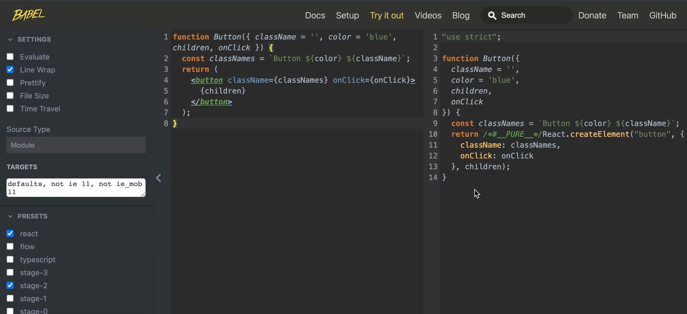

# Basic React 

vscode 단축키: 터미널 여닫기 - `control` + `

- First react project

  `npm init react-app .` : 현재 디렉토리에서 프로젝트를 만들겠다. 

  `npm run start`: 프로젝트 실행. 파일 수정하면 바로 반영해주는 것 까지 해준다. 

  `ctrl + c` : 개발모드 종료

파일을 보면, 분명 js파일인데, 막상 보면 html 파일이 있다. 이런 문법을 `jsx` 라고 부른다. 

```jsx
import logo from './logo.svg';
import './App.css';

function App() {
  return (
    <div className="App">
      <header className="App-header">
        
        <p>
          Edit <code>src/App.js</code> and save to reload.
        </p>
        <a
          className="App-link"
          href="https://reactjs.org"
          target="_blank"
          rel="noopener noreferrer"
        >
          Learn React
        </a>
      </header>
    </div>
  );
}

export default App;
```


- **리액트 개발자 도구**

  크롬 익스텐션. 리액트로 된 웹사이트인 경우 아래와 같은 메뉴가 생겨난다. 

  


# 프로젝트

#### 시작전에 참고사항:  다운받은 프로젝트 실행하기

프로젝트를 직접 생성하지 않고, 다운받아서 실행하려면 따로 설치해줘야 할 것이 있습니다. 앞에서 직접 생성했을 때는 리액트 실행에 필요한 파일들을 알아서 설치해줬었는데요. 이 파일들은 `node_modules` 라는 폴더에 담겨 있습니다. 보통 Node.js로 만든 프로젝트를 공유할 때는 `node_modules` 폴더를 제외하고 공유하게 되는데요, 용량이 많기도 하고, 다운 받은 사람이 직접 설치할 수 있기 때문입니다.

자 그럼 예를들어서 `dicegame` 이라는 프로젝트를 다운 받아서 실행해보겠습니다. 우선 다운 받은 프로젝트의 압축을 푼 다음에, VS Code에서 압축 푼 폴더를 열어주세요.


그리고 터미널에서 아래와 같이 `npm install` 을 입력합니다.


그럼 이렇게 설치가 시작되고, 터미널이 대기 상태로 돌아오면 완료된 겁니다.


VS Code 왼쪽에 있는 EXPLORER 창을 보면 `node_modules` 라는 폴더가 만들어진 거 보이시나요? 이곳에 필요한 파일들이 설치됐는데요, 이제부터는 `npm start` 명령어를 통해서 실행하시면 됩니다!


### 파일의 구조 

`index.html`: 웹브라우져에서 가장 먼저 실행되는 파일

`index.js` : `index.html` 파일이 열리고 나서 실행되는 파일. 리액트 코드들 중에서 가장 먼저 실행되는 파일. 

```js
import ReactDOM from 'react-dom/client';


const root = ReactDOM.createRoot(document.getElementById('root'));
root.render(
  <h1>안녕! 리액트!</h1>
);
```

화면을 그린다는 뜻. Argument로 html을 전달하네? 이게 `jsx`라는 문법. `Root` div 안에 `h1`태그가 들어간다. 


### JSX

자바스크립트 안에 html을 사용. 

```js
const root = ReactDOM.createRoot(document.getElementById('root'));
root.render(
  <h1>안녕! 리액트!</h1>
);
```

id 이런것도 다 추가 가능. 그런데, 완전히 다 사용할 수 있는 것은 아님. 

class같은거 그대로 사용 어려운게, js에서 이미 사용하는 이름. 그래서, `className`이라고 사용해야 함. 

또한, `label for` 이런거 할때, `for`도 사용 못함. 이벤트 핸들러의 이름도 다름. onblur, onfocus, onmousedown 이런것도, 두번째 단어 부터 camel case해야함. `onBlur`, `onFocus` , `onMouseDown`. 

하나 더 지켜야 할 규칙이 있다. 하나로 감싸지게 써야 함. 

예를 들어, 아래처럼 하면 안됨. 

```js
<p>Hi</p>
<p>Bye</p>
```

이런 경우, div로 보통 감싸면 돼. 그런데, div가 싫다면? 이렇게 `Fragment`로 감싸면 된다. 

```js
import { Fragment } from 'react';

root.render(
  <Fragment>
    <h1>주사위 게임</h1>
    <h2>안녕하세요</h2>
  </Fragment>
);

```

그런데 여기서 신기한건, Fragment불러올 필요도 없이 쓸 수 있는 방법이 있다. 그냥 빈 테그 사용하면 된다. 

```js

import ReactDOM from 'react-dom/client';


const root = ReactDOM.createRoot(document.getElementById('root'));
root.render(
  <>
    <h1>주사위 게임</h1>
    <h2>안녕하세요</h2>
  </>
);
```


### JSX에서 자바스크립트 사용하기

```js

import ReactDOM from 'react-dom/client';


const root = ReactDOM.createRoot(document.getElementById('root'));

const product = '맥북'
root.render(
  <>
    <h1>{product} 게임</h1>
    <h2>안녕하세요</h2>
  </>
);

```

중괄호 사용하면 된다. 심지어, 중괄호 안에는 Javascript로 된 표현식은 모든지 사용할 수 있다. 

태그 같은 곳에도 사용이 가능하다. 

```js

import ReactDOM from 'react-dom/client';


const root = ReactDOM.createRoot(document.getElementById('root'));

const product = 'MacBook'
const img_url =''
root.render(
  <>
    <h1> {product.toUpperCase()} 게임</h1>
    <h1> {product + " Hi"} 게임</h1>
    
    <h2>안녕하세요</h2>
  </>
);

```

그냥 다 사용 가능하다. 이벤트 핸들러 등록

```js
function handleClick(){
  alert("곧 도착합니다.")
}

root.render(
  <>
    <h1> {product.toUpperCase()} 게임</h1>
    <h1> {product + " Hi"} 게임</h1>
    <button onClick={handleClick}></button>
    <h2>안녕하세요</h2>
  </>
);
```

# JSX란?

JSX는 자바스크립트의 확장 문법인데요. 리액트로 코드를 작성할 때 HTML 문법과 비슷한 이 JSX 문법을 활용하면 훨씬 더 편리하게 화면에 나타낼 코드를 작성할 수가 있게 됩니다.

```jsx
import ReactDOM from 'react-dom';

ReactDOM.render(<h1>안녕 리액트!</h1>, document.getElementById('root'));
```

# JSX 문법

JSX는 자바스크립트로 HTML과 같은 문법을 사용할 수 있도록 만들어주는 편리한 문법이지만, 그만큼 꼭 지켜야 할 규칙들도 있습니다.

## HTML과 다른 속성명

### 1. 속성명은 카멜 케이스로 작성하기!

JSX 문법에서도 태그에 속성을 지정해 줄 수 있습니다. 단, 여러 단어가 조합된 몇몇 속성들을 사용할 때는 반드시 카멜 케이스(Camel Case)로 작성해야 합니다. 사실 여러 단어가 조합된 HTML 속성들이 많진 않지만, 예를 들면 `onclick`, `onblur`, `onfocus` 등과 같은 이벤트 속성이나, `tabindex` 같은 속성들이 있습니다. 이런 속성들은 모두 `onClick`, `onBlur`, `onFocus`, `onMouseDown`, `onMouseOver`, `tabIndex` 처럼 작성하는 것이죠!

```jsx
import ReactDOM from 'react-dom';

ReactDOM.render(
  <button onClick= ... >클릭!</button>,
  document.getElementById('root')
);
```

단, 예외적으로 HTML에서 비표준 속성을 다룰 때 활용하는 `data-*` 속성은 카멜 케이스(Camel Case)가 아니라 기존의 HTML 문법 그대로 작성하셔야 합니다.

```jsx
import ReactDOM from 'react-dom';

ReactDOM.render(
  <div>
    상태 변경: 
    <button className="btn" data-status="대기중">대기중</button>
    <button className="btn" data-status="진행중">진행중</button>
    <button className="btn" data-status="완료">완료</button>
  </div>,
  document.getElementById('root')
);
```

### 2. 자바스크립트 예약어와 같은 속성명은 사용할 수 없다!

JSX 문법도 결국은 자바스크립트 문법이기 때문에, `for`나 `class`처럼 자바스크립트의 문법에 해당하는 예약어와 똑같은 이름의 속성명은 사용할 수 없습니다. 그래서 HTML의 `for`의 경우에는 자바스크립트의 반복문 키워드 `for`와 겹치기 때문에 `htmlFor`로, HTML의 `class` 속성도 자바스크립트의 클래스 키워드 `class`와 겹치기 때문에 `className`으로 작성해 주어야 합니다.

[React 공식 문서 - 어트리뷰트의 차이](https://ko.reactjs.org/docs/dom-elements.html#differences-in-attributes)

```jsx
import ReactDOM from 'react-dom';

ReactDOM.render(
  <form>
    <label htmlFor="name">이름</label>
    <input id="name" className="name-input" type="text" />
  </form>,
  document.getElementById('root')
);
```

## 반드시 하나의 요소로 감싸기 - Fragment

JSX 문법을 활용할 때는 반드시 하나의 요소로 감싸주어야 합니다. 그래서 아래 코드처럼 여러 개의 요소를 작성하면 오류가 발생하는데요.

```jsx
import ReactDOM from 'react-dom';

ReactDOM.render(
  <p>안녕</p>
  <p>리액트!</p>,
  document.getElementById('root')
);
```

이럴 때는 아래 코드처럼 여러 태그를 감싸는 부모 태그를 만들어 하나의 요소로 만들어 주어야 합니다.

```jsx
import ReactDOM from 'react-dom';

ReactDOM.render(
  <div>
    <p>안녕</p>
    <p>리액트!</p>
  </div>,
  document.getElementById('root')
);
```

하지만 이렇게 작성한다면 때로는 꼭 필요하지 않은 부모 태그가 작성될 수 있겠죠? 그럴 땐 `Fragment`로 감싸주면 의미 없는 부모 태그를 만들지 않아도 여러 요소를 작성할 수 있습니다.

```jsx
import { Fragment } from 'react';
import ReactDOM from 'react-dom';

ReactDOM.render(
  <Fragment>
    <p>안녕</p>
    <p>리액트!</p>
  </Fragment>,
  document.getElementById('root')
);
```

참고로 `Fragment`는 아래 코드처럼 빈 태그로 감싸는 단축 문법으로 활용할 수도 있습니다.

```jsx
import ReactDOM from 'react-dom';

ReactDOM.render(
  <>
    <p>안녕</p>
    <p>리액트!</p>
  </>,
  document.getElementById('root')
);
```

## 자바스크립트 표현식 넣기

JSX 문법에서 **중괄호({})**를 활용하면 자바스크립트 표현식을 넣을 수 있습니다.

```jsx
import ReactDOM from 'react-dom';

const product = '맥북';

ReactDOM.render(
  <h1>나만의 {product} 주문하기</h1>,
  document.getElementById('root')
);
```

이런 부분들을 잘 활용하면, 아래 코드처럼 중괄호 안에서 문자열을 조합할 수도 있고 변수에 이미지 주소를 할당해서 `img` 태그의 `src` 속성값을 전달해 줄 수도 있고, 이벤트 핸들러를 좀 더 편리하게 등록할 수도 있습니다.

```jsx
import ReactDOM from 'react-dom';

const product = 'MacBook';
const model = 'Air';
const imageUrl = 'https://upload.wikimedia.org/wikipedia/commons/thumb/1/1e/MacBook_with_Retina_Display.png/500px-MacBook_with_Retina_Display.png'

function handleClick(e) {
  alert('곧 도착합니다!');
}

ReactDOM.render(
  <>
    <h1>{product + ' ' + model} 주문하기</h1>
    
    <button onClick={handleClick}>확인</button>
  </>,
  document.getElementById('root')
);
```

단, JSX 문법에서 중괄호는 자바스크립트 **표현식**을 다룰 때 활용하기 때문에, 중괄호 안에서 for, if문 등의 문장은 다룰 수 없다는 점은 꼭 기억해 주세요. 그런데도 만약 JSX 문법을 활용할 때 조건문이 꼭 필요하다면 조건 연산자를, 반복문이 꼭 필요하다면 배열의 반복 메소드를 활용해 볼 수는 있겠죠?


### 컴포넌트

실제로, html을 변수에 담아서 출력을 해보면, 객체가 출력된다. 이 객체를 **리액트 앨리먼트**라고 부른다. 이 react element를 render메소드로 보내주면 얘가 해석을 해주는 것. 

```js
const element = <h1>안녕 리액트!</h1>;
console.log(element)
```

리액트의 가장 큰 특징은, 이 리액트 앨리먼트를 리턴하게 하는 함수처럼 만들면 그걸 쓸 수 있다는 것. 

```jsx
import React from 'react';
import ReactDOM from 'react-dom/client';


function Hello(){
  return <h1>안녕 리액트!</h1>
}
const root = ReactDOM.createRoot(document.getElementById('root'));
root.render(
  <>
    <Hello />
    <Hello />
    <Hello />
  </>
);
```

이미지도 import/export해서 사용이 가능하다. 

```jsx
import diceBlue01 from './assets/dice-blue-1.svg'

function Dice(){
  return </img>
}

export default Dice
```


# 리액트 엘리먼트

JSX 문법으로 작성한 요소는 결과적으로 자바스크립트 객체가 됩니다.

```jsx
import ReactDOM from 'react-dom';

const element = <h1>안녕 리액트!</h1>;
console.log(element);
ReactDOM.render(element, document.getElementById('root'));
{$$typeof: Symbol(react.element), type: "h1", key: null, ref: null, props: {…}, …}
```

이런 객체를 리액트 엘리먼트라고 부르는데요.

이 리액트 엘리먼트를 `ReactDOM.render` 함수의 아규먼트로 전달하게 되면, 리액트가 객체 형태의 값을 해석해서 HTML 형태로 브라우저에 띄워주는 것이죠.

리액트 엘리먼트는 리액트로 화면을 그려내는데 가장 기본적인 요소입니다.

# 리액트 컴포넌트

리액트 컴포넌트는 리액트 엘리먼트를 조금 더 자유롭게 다루기 위한 하나의 문법입니다.

컴포넌트를 만드는 가장 간단한 방법은 자바스크립트의 함수를 활용하는 건데요.  아래 코드에서 JSX 문법으로 작성된 하나의 요소를 리턴하는 `Hello` 함수가 바로 하나의 컴포넌트입니다.

이렇게 요소를 컴포넌트로 작성하게 되면 다양한 장점들이 있는데, 자세한 내용은 이후의 개념들을 하나씩 배워나가면서 차차 알아보도록 합시다!

```jsx
import ReactDOM from 'react-dom';

function Hello() {
  return <h1>안녕 리액트</h1>;
}

const element = (
  <>
    <Hello />
    <Hello />
    <Hello />
  </>
);

ReactDOM.render(element, document.getElementById('root'));
```

그리고 이렇게 컴포넌트를 작성하면, 위 코드에서 `element` 변수 안의 JSX 코드에서 볼 수 있듯 컴포넌트 함수 이름을 통해 하나의 태그처럼 활용할 수가 있습니다.

이런 특성을 모듈 문법으로 활용하면 훨씬 더 독립적으로 컴포넌트 특성에 집중해서 코드를 작성할 수가 있습니다.

Dice.js

```jsx
import diceBlue01 from './assets/dice-blue-1.svg';

function Dice() {
  return ;
}

export default Dice;
```

App.js

```jsx
import Dice from './Dice';

function App() {
  return (
    <div>
      <Dice />
    </div>
  );
}

export default App;
```

한 가지 주의해야 할 부분은, 리액트 컴포넌트의 이름은 반드시 **첫 글자를 대문자**로 작성해야 한다는 것입니다. 컴포넌트 이름의 첫 글자가 소문자라면 오류가 발생하니깐 꼭 주의해 주세요!


### Prop

리액트 컴포넌트 자체에도 다양한 속성을 지정할 수 있다. 아래처럼 하면, 에러는 발생 안하는데 color라는 속성을 개발자 도구에서 어디서도 보이지 않는다. 그런데, 리액트 컴포넌트로 보면, **blue**가 보인다. 

```js
root.render(
  <>
    <App />
    <Dice color = "blue" />
  </>
);
```


이렇게 리액트 컴포넌트에 지정한 속성을 `props`라고 부른다. `property`의 줄임말. 각 속성을 `prop`이라고 부른다. 

`<Dice color = "blue" />` 이 prop이 컴포넌트 함수의 첫번째 파라미터로 전달되는 것. 

그럼 다시, `dice.js`로 가서 콘솔 찍어 보자. 

```js
import diceBlue01 from './assets/dice-blue-1.svg'

function Dice(props){
  console.log(props)
  return </img>
}

export default Dice
```


그럼 이걸 활용해서, 이미지를 바꿔보자. 

```js
import diceBlue01 from './assets/dice-blue-1.svg'
import diceRed01 from './assets/dice-red-1.svg'

function Dice(props){
  const diceImg = props.color === 'red' ? diceRed01 : diceBlue01;
  return </img>
}

export default Dice
```


### Children

리액트에는 우리가 만든 prop 이외에도 기본적으로 존재하는 prop이 있습니다. 컴포넌트의 자식들을 갖게 되는 prop. 

```js
function Button ({text}){
  return <button>{text}</button>
}

export default Button;
```

이제 App.js로 와서, 아래처럼 쓰면 버튼이 보여지겠지. 

```js
function App(){
  return (
    <div>
        <div>
          <Button text= "던지기" />
          <Button text= "처음부터" />
        </div>
        <Dice color = "red" num = {1}/>
    </div>
  )
}
```

그런데, 위처럼 단순히 보여지기만 하는 컴포넌트를 만들때는, 일반적인 `prop`보다는 `children prop`을 활용하는 것이 좋다. 아래처럼 하면 된다. 

```js
function Button ({children}){
  return <button>{children}</button>
}

export default Button;
```

버튼에서는 이렇게 해놓고, App에서는 아래처럼 버튼 태그를 열고 닫게 해놓고, 그 안에 필요한 말을 적어놓으면 된다. 

```js
import Button from "./button";
import Dice from "./dice";

function App(){
  return (
    <div>
        <div>
          <Button>던지기</Button>
          <Button>처음부터</Button>
        </div>
        <Dice color = "red" num = {1}/>
    </div>
  )
}
export default App;
```


# Props

JSX 문법에서 컴포넌트를 작성할 때 컴포넌트에도 속성을 지정할 수 있는데요. 리액트에서 이렇게 컴포넌트에 지정한 속성들을 **Props**라고 부릅니다.

**Props는 Properties의 약자**인데요. 컴포넌트에 속성을 지정해주면 **각 속성이 하나의 객체로 모여서 컴포넌트를 정의한 함수의 첫 번째 파라미터로 전달**됩니다.

App.js

```jsx
import Dice from './Dice';

function App() {
  return (
    <div>
      <Dice color="blue" />
    </div>
  );
}

export default App;
```

Dice.js

```jsx
import diceBlue01 from './assets/dice-blue-1.svg';

function Dice(props) {
  console.log(props)
  return ;
}

export default Dice;
```

위 코드들 처럼 `App` 함수에서 사용하는 `Dice` 컴포넌트에 `color`라는 속성을 `blue`로 지정해주고, `Dice` 함수 내부에서 `props`라는 파라미터를 하나 만들어 출력해보면 브라우저 콘솔에는 다음과 같은 출력 결과가 나타나게 됩니다.

```
{ color: "blue" }
```

그래서 컴포넌트를 활용할 때 속성값을 다양하게 전달하고 이 props 값을 활용하면, 똑같은 컴포넌트라도 전달된 속성값에 따라 서로 다른 모습을 그려낼 수도 있게 됩니다.

App.js

```jsx
import Dice from './Dice';

function App() {
  return (
    <div>
      <Dice color="red" num={2} />
    </div>
  );
}

export default App;
```

Dice.js

```jsx
import diceBlue01 from './assets/dice-blue-1.svg';
import diceBlue02 from './assets/dice-blue-2.svg';
// ...
import diceRed01 from './assets/dice-red-1.svg';
import diceRed02 from './assets/dice-red-2.svg';
// ...

const DICE_IMAGES = {
  blue: [diceBlue01, diceBlue02],
  red: [diceRed01, diceRed02],
};

function Dice(props) {
  const src = DICE_IMAGES[props.color][props.num - 1];
  const alt = `${props.color} ${props.num}`;
  return ;
}

export default Dice;
```

참고로, 이렇게 props가 객체 형태를 띠고 있으니 Destructuring 문법을 활용해서 조금 더 간결하게 코드를 작성할 수도 있겠죠?

```jsx
import diceBlue01 from './assets/dice-blue-1.svg';
import diceBlue02 from './assets/dice-blue-2.svg';
// ...
import diceRed01 from './assets/dice-red-1.svg';
import diceRed02 from './assets/dice-red-2.svg';
// ...

const DICE_IMAGES = {
  blue: [diceBlue01, diceBlue02],
  red: [diceRed01, diceRed02],
};

function Dice({ color = 'blue', num = 1 }) {
  const src = DICE_IMAGES[color][num - 1];
  const alt = `${color} ${num}`;
  return ;
}

export default Dice;
```

# Children

`props`에는 `children`이라는 조금 특별한 프로퍼티(prop, 프롭)가 있습니다.

JSX 문법으로 컴포넌트를 작성할 때 컴포넌트를 단일 태그가 아니라 여는 태그와 닫는 태그의 형태로 작성하면, 그 안에 작성된 코드가 바로 이 `children` 값에 담기게 됩니다.

Button.js

```jsx
function Button({ children }) {
  return <button>{children}</button>;
}

export default Button;
```

App.js

```jsx
import Button from './Button';
import Dice from './Dice';

function App() {
  return (
    <div>
      <div>
        <Button>던지기</Button>
        <Button>처음부터</Button>
      </div>
      <Dice color="red" num={2} />
    </div>
  );
}

export default App;
```

그래서 JSX 문법으로 컴포넌트를 작성할 때 어떤 정보를 전달할 때는 일반적인 `props`의 속성값을 주로 활용하고, 화면에 보여질 모습을 조금 더 직관적인 코드로 작성하고자 할 때 `children` 값을 활용할 수가 있습니다.

참고로 이 `children`을 활용하면 단순히 텍스트만 작성하는 걸 넘어서 컴포넌트 안에 컴포넌트를 작성할 수도 있고, 컴포넌트 안에 복잡한 태그들을 더 작성할 수도 있으니깐 이 값을 어떻게 활용하면 좋을지 여러분도 한번 고민해 보시면 좋을 것 같습니다!


### State

주사위 던지기 할때마다, 주사위 숫자 바뀌는거 구성할껀데,  이거 리액트 없이 하려면, 

1. html로 주사위마다 페이지 만들거나, 
2. 자바스크립트로 html의 속성을 계속 바꿔주거나. 

**리액트에서는 이게 엄청 쉬워진다.**

일단, state를 사용하려면, 임포트를 해야한다. `*import* { useState } *from* 'react'` 

useState는 일단 파라미터로 초기값을 전달받고, 그 이후로는 배열의 형태로 요소 2개를 리턴하게 된다. 

```js
const [num, setNum] = userState(1)
```

첫번째 `num`은 현재값, `setNum`은 setter함수. 

```jsx
function App(){
  const [num, setNum] = useState(1)
  const handleRollClick = () => {
    setNum(random(6));
  }
  console.log(num)
  return (
    <div>
        <div>
          <Button onClick={handleRollClick}>던지기</Button>
          <Button>처음부터</Button>
        </div>
        <Dice color = "red" num = {num}/>
    </div>
  )
}

export default App;
```

이걸 이제 `button` component 가져가서 등록해야지. 

```js
function Button ({children, onClick}){
  return <button onClick={onClick}>{children}</button>
}

export default Button;
```

이게 처음에 헷갈렸던게, 뭔가 scope이 안맞는것 같은 느낌이였으나, 랜딩될때는 어차피 같은 페이지라서 되는 듯. 

### 참조형 state

주사위에서 나오는 숫자를 계속해서 더해보자. 아래처럼 하고 싶은 거야. 

```js
App(){
  const [num, setNum] = useState(1)
  const [sum, setSum] = useState(0)
  const handleRollClick = () => {
    const nextNum = random(6)
    setNum(nextNum);
    setSum(sum + nextNum)
  }

  const handleClearClick = () => {
    setNum(1);
    setSum(0);
  }

  return (
    <div>
        <div>
          <Button onClick={handleRollClick}>던지기</Button>
          <Button onClick={handleClearClick}>처음부터</Button>
        </div>
        <div>
          <h2>나</h2>
          <Dice color = "red" num = {num}/>
          <h2>총점</h2>
          <p>
            {sum}
          </p>
        </div>
        
    </div>
  )
}

export default App;
```

여기까지는 그냥 복습이야. 

이제는 순서대로 기록해 보자. 그래서, 빈 배열을 초기값으로 받게 해놨다. 

```js
const [gameHistory, setGameHistory] = useState([])
```

그 다음에, push로 배열값 추가해 주고, `setGameHistory` 해준 것. 

```js
const handleRollClick = () => {
    const nextNum = random(6)
    setNum(nextNum);
    setSum(sum + nextNum);
    gameHistory.push(nextNum);
    setGameHistory(gameHistory);
  }
```

그러고 나서 아래서 띄웠다. 

```js
<h2>기록</h2>
          <p>
            {gameHistory.join(', ')}
        	</p>
```

그런데 사실 이거 잘못된 방법. 

왜? 

```js
  const handleRollClick = () => {
    const nextNum = random(6)
    // setNum(nextNum);
    // setSum(sum + nextNum);
    gameHistory.push(nextNum);
    setGameHistory(gameHistory);
  }
```

이렇게 두개 주석처리 했음. 그런데, setGameHistory도 같이 작동을 안한다. 

현재 어쨋든 default로 설정되어 있는 상태니깐, 계속 추가되야 하잖아. 그리고, 심지어 `nextNum` 도 계속 바뀌고 있잖아. 

**그 이유는 바로, gameHistory state가 배열이기 때문**

배열은 기본형이 아니라, 참조형이다. **gameHistory**는 배열은 그 값들 자체를 갖는 것이 아니라, 가리키고 있는 주소값을 갖고 있다. 배열에 뭔가가 추가되어도, 그 배열이 가리키고 있는 주소값은 동일하다. 요소가 추가되기 이전의 배열의 주소값과 추가된 이후의 배열의 주소값이 동일. **그것 때문에 리액트가 state가 변경되었다고 판단하지 않은 것.**

그래서, 배열이나 객체처럼 참조형 객체를 state로 사용할때는, 아예 전체를 새로 만든다고 생각해야 한다. 

예를 들어, 아래처럼 해야한다. 

```js
function App(){
  const [num, setNum] = useState(1)
  const [sum, setSum] = useState(0)

  const [gameHistory, setGameHistory] = useState([])
  const handleRollClick = () => {
    const nextNum = random(6)
    // setNum(nextNum);
    // setSum(sum + nextNum);
    setGameHistory([...gameHistory, nextNum]);
  }

  const handleClearClick = () => {
    setNum(1);
    setSum(0);
    setGameHistory([])
  }
```

 


# State

state는 리액트에서 화면을 그려내는 데 굉장히 중요한 역할을 합니다.

State라는 단어는 한국어로 '상태'라는 뜻이 있는데요. 리액트에서의 state도 그 의미가 다르지 않습니다. 상태가 바뀔 때마다 화면을 새롭게 그려내는 방식으로 동작을 하는 것이죠.

리액트에서 state를 만들고, state를 바꾸기 위해서는 일단 `useState`라는 함수를 활용해야 합니다.

```jsx
import { useState } from 'react';

// ...

  const [num, setNum] = useState(1);

// ...
```

보통 이렇게 Destructuring 문법으로 작성하는데요. `useState` 함수가 초깃값을 아규먼트로 받고 그에 따른 실행 결과로 요소 2개를 가진 배열의 형태로 리턴을 하기 때문입니다.

이때 첫 번째 요소가 바로 state이고, 두 번째 요소가 이 state를 바꾸는 setter 함수인데요.

참고로 위 코드에서도 볼 수 있듯 첫 번째 변수는 원하는 state의 이름(`num`)을 지어주고, 두 번째 변수에는 state 이름 앞에 set을 붙인 다음 카멜 케이스로 이름을 지어주는 것(`setNum`)이 일반적입니다.

state는 변수에 새로운 값을 할당하는 방식으로 변경하는 것이 아니라 이 setter 함수를 활용해야 하는데요. setter 함수는 호출할 때 전달하는 아규먼트 값으로 state 값을 변경해 줍니다.

그래서 아래 코드처럼 setter 함수를 활용해서 이벤트 핸들러를 등록해두면, 이벤트가 발생할 때마다 상태가 변하면서 화면이 새로 그려지는 것이죠!

```jsx
import { useState } from 'react';
import Button from './Button';
import Dice from './Dice';

function App() {
  const [num, setNum] = useState(1);

  const handleRollClick = () => {
    setNum(3); // num state를 3으로 변경!
  };

  const handleClearClick = () => {
    setNum(1); // num state를 1로 변경!
  };

  return (
    <div>
      <Button onClick={handleRollClick}>던지기</Button>
      <Button onClick={handleClearClick}>처음부터</Button>
      <Dice color="red" num={num} />
    </div>
  );
}

export default App;
```

# 참조형 State

자바스크립트의 자료형은 크게 기본형(Primitive type)과 참조형(Reference type)로 나눌 수 있다는 사실, 모두 알고 계시죠?

특히 참조형 값들은 조금 독특한 특성을 가지고 있어서 변수로 다룰 때도 조금 주의해야 할 부분들이 있었는데요. state를 활용할 때도 마찬가지입니다!

```jsx
// ... 

  const [gameHistory, setGameHistory] = useState([]);

  const handleRollClick = () => {
    const nextNum = random(6);
    gameHistory.push(nextNum);
    setGameHistory(gameHistory); // state가 제대로 변경되지 않는다!
  };

// ...
```

위 코드에서 볼 수 있듯 배열 값을 가진 `gameHistory`에 `push` 메소드를 이용해서 배열의 값을 변경한 다음, 변경된 배열을 setter 함수로 state를 변경하려고 하면 코드가 제대로 동작하지 않습니다.

`gameHistory` state는 배열 값 자체를 가지고 있는 게 아니라 그 배열의 주솟값을 참조하고 있는 건데요. 때문에 `push` 메소드로 배열 안에 요소를 변경했다고 하더라도 결과적으로 참조하는 배열의 주솟값은 변경된 것이 아니게 됩니다.

결과적으로 리액트 입장에서는 `gameHistory` state가 참조하는 주솟값은 여전히 똑같기 때문에 상태(state)가 바뀌었다고 판단하지 않는 것이죠!

그래서 참조형 state를 활용할 때는 반드시 새로운 참조형 값을 만들어 state를 변경해야 합니다.

가장 간단한 방법은 Spread 문법(`...`) 을 활용하는 것이겠죠?

```jsx
// ... 

  const [gameHistory, setGameHistory] = useState([]);

  const handleRollClick = () => {
    const nextNum = random(6);
    setGameHistory([...gameHistory, nextNum]); // state가 제대로 변경된다!
  };

// ...
```

이 참조형 state의 특성을 이해하지 못하면, 간혹 state가 제대로 변경되지 않는 버그가 발생했을 때 원인을 제대로 찾지 못하는 경우가 발생할 수도 있는데요.

참조형 state를 활용할 땐 반드시 새로운 참조형 값을 만들어서 state를 변경해야 한다는 점. 꼭 기억해 두세요!

**리액트 개발은 곧 컴포넌트 개발**

### 컴포넌트 재사용 하기


### 리액트가 랜더링 되는 방식

**state가 바뀔 때 랜더링은 어떻게 랜더링 되는 것일까?**

지금까지 랜더링 했던 것을 순수 자바스크립트로 구현하면 아래처럼 됬을 것. 


리액트에서는 아예 새로 랜더링 해버리는 것. 새로운 state가 발생하면, 이 부분을 통으로 다시 랜더링 하는 것. 


그런데, 이렇게 하면 문제가, `img`나 `p` 이런거는 요소가 바뀌니깐 다시 랜더링 되는게 알겠는데, `<button>`같은 것은 계속 똑같잖아. 그런데 계속 다시 랜더링 되는 것. 이런 문제를 해결하기 위해 리액트에서는 `virtual Dom` 이라는 것을 사용한다. 


기본적으로 html은 Dom트리라는 자료구조로 정의되어 있다. 


이것과 마찬가지로 react에서는 이 Dom tree를 본따서 만든 `virtual dom` 이라는 것을 활용한다. 그래서 리액트가 새로운 엘리먼트를 랜더링할때, 일단 virtual dom에 적용을 한다. 예를 들어 현재 주사위 1에서 주사위 던져서 5가 나왔다고 해보자. 


그러면 이제 앱 컴포넌트 안에 트리들을 지우고, 앱 컴포넌트를 새로 랜더링. 여기서 중요한 것은 이렇게 해놓고 dom 트리에 바로 적용하는 것이 아니다. **즉 화면을 바꿀 준비만 하고 아직 실제로 반영은 안했다.** 


이제 되게 똑똑하게 동작한다. 

state 변경 전의 virtual dom과 state 변경 후의  virtual dom을 비교한다. 


그래서, 바뀐 부분만 찾아낸다. 그리고, 바뀐 부분만 실제 DOM에 적용한다. 


**리액트가 알아서, 일감 잘 나눠서 적용한다. 변경사항들을 효율적으로 잘 처리해준다.** 효율적인 화면 처리가 가능하다. 


### 인라인 스타일 

인라인의 경우, 스타일을 객체로 지정해 주어야 한다. 아래처럼. 

```js

const style = {
  속성 : '값'
}
function Button ({children, onClick}){
  return <button style = {style} onClick={onClick}>{children}</button>
}

export default Button;
```

실제 예시

```js

const style = {
  backgroundColor : 'pink'
}
function Button ({children, onClick}){
  return <button style = {style} onClick={onClick}>{children}</button>
}

export default Button;
```

참고로, 그대로 넣어줘도 된다. 

```js
function Button ({children, onClick}){
  return <button style = {{backgroundColor : 'pink'}} onClick={onClick}>{children}</button>
}

export default Button;
```


### css 클래스 사용해보기  

`index.css` 파일 생성

```css
body {
  background-color: #191f2c;
  color: #fff
}
```

그 다음, `index.js`에서 import. 그런데, import 과정이 살짝 특이하네. 

```js
import React from 'react';
import ReactDOM from 'react-dom/client';
import App from './app'

import './index.css'

const root = ReactDOM.createRoot(document.getElementById('root'));
root.render(
  <>
    <App />
  </>
);

```


앞에서 리액트에서 이미지를 넣고 디자인을 적용하는 방법을 배워보았는데요.

사실 CSS 파일을 불러오거나 이미지 파일을 불러오는 기능은 리액트 고유의 기능이 아니라 **Create React App**이라는 프로그램이 대신 설정해 준 기능입니다. (참고: [Create React App 문서](https://create-react-app.dev/docs/adding-a-stylesheet))

이번 레슨에서는 앞에서 배웠던 여러가지 방법들을 복습해보고, 클래스네임을 좀 더 편리하게 쓰는 방법을 소개하겠습니다.


# 디자인을 적용하는 방법

## 이미지 불러오기

이미지 파일은 `import` 구문을 통해 불러오고, 불러온 이미지 주소를 `src` 속성으로 사용하면 됩니다.

```jsx
import diceImg from './assets/dice.png';

function Dice() {
  return ;
}

export default App;
```

## 인라인 스타일

리액트에서 인라인 스타일은 문자열이 아닌 **객체형**으로 사용합니다. 프로퍼티 이름은 CSS 속성 이름으로, 프로퍼티 값은 CSS 속성 값으로 쓰는데요, 이때 프로퍼티 이름은 아래의 `boarderRadius` 처럼 **대시 기호 없이 카멜 케이스로** 써야 한다는 점도 꼭 기억해두세요.

```jsx
import diceImg from './assets/dice.png';

const style = {
  borderRadius: '50%',
  width: '120px',
  height: '120px',
};

function Dice() {
  return ;
}

export default App;
```

## CSS 파일 불러오기

`import` 구문으로 파일을 불러올 수 있는데요, 이때 `from` 키워드 없이 쓰면 됩니다.

```jsx
import diceImg from './assets/dice.png';
import './Dice.css';

function Dice() {
  return ;
}

export default App;
```

## 클래스네임 사용하기

CSS 파일에 정의된 클래스명을 `className` prop에 문자열로 넣어주면 됩니다. 이때 재사용성을 위해 `className` prop을 부모 컴포넌트에서 받으면 더 좋습니다.

```jsx
import diceImg from './assets/dice.png';
import './Dice.css';

function Dice({ className = '' }) {
  const classNames = `Dice ${className}`;
  return ;
}

export default App;
```

# 편리하게 클래스네임을 쓰는 방법

앞에서는 여러 className을 템플릿 문자열로 합쳐서 사용했습니다. 몇 개 없을 때는 상관없지만, 개수가 늘어날수록 아래처럼 알아보기 힘들어진다는 문제점이 있는데요.

### 템플릿 문자열을 사용한 예

```jsx
function Button({ isPending, color, size, invert, children }) {
  const classNames = `Button ${isPending ? 'pending' : ''} ${color} ${size} ${invert ? 'invert' : ''}`;
  return <button className={classNames}>{children}</button>;
}

export default Button;
```

### 배열을 사용한 예

```jsx
function Button({ isPending, color, size, invert, children }) {
  const classNames = [
    'Button',
    isPending ? 'pending' : '',
    color,
    size,
    invert ? 'invert' : '',
  ].join('');
  return <button className={classNames}>{children}</button>;
}

export default Button;
```

위 예시 코드처럼 지저분하게 느껴지고, 매번 반복되는 코드를 작성한다는 번거로움이 있습니다. 개발자들은 이럴 때 라이브러리라는 걸 쓰는데요, 다른 개발자가 미리 만들어 놓은 코드를 이용해서 편하게 개발하는 겁니다.

클래스네임의 경우에도 편리하게 사용할 수 있는 라이브러리가 많이 있는데요, 그중에서도 이번에 소개할 라이브러리는 바로 `classnames`라는 라이브러리입니다. 아래 예시 코드를 보시면 아시겠지만, 클래스네임에만 집중할 수 있어 훨씬 읽기 편해집니다. 이렇게 적절한 라이브러리를 쓰면 개발 생산성이 굉장히 좋아지죠.

### classnames 라이브러리를 사용한 예

```jsx
import classNames from 'classnames';

function Button({ isPending, color, size, invert, children }) {
  return (
    <button
      className={classNames(
        'Button',
        isPending && 'pending',
        color,
        size,
        invert && 'invert',
      )}>
     { children }
   </button >
  );
}

export default Button;
```

`classnames` 은 NPM이라는 프로그램을 통해 설치할 수 있습니다. 터미널에서 `npm install classnames` 을 입력하고 설치한 다음에, 위 예시처럼 `import` 로 불러와서 사용하면 됩니다. NPM 저장소 사이트로 들어가면 사용 방법과 설명이 나와있으니, 아래 링크를 한 번 살펴보시고 사용해보는 것도 좋을 것 같습니다.

NPM classnames 패키지: https://www.npmjs.com/package/classnames


# Deploy

명령어 복습

## 프로젝트 생성하기

```
npm init react-app .
```

터미널에서 원하는 디렉토리에 들어가서 `npm init react-app .`를 입력하면 현재 디렉토리에 리액트 프로젝트를 생성합니다.

## 개발 모드 실행하기

```
npm start (npm run start)
```

터미널에서 `npm run start`를 입력하면 개발 모드 서버가 실행됩니다.

## 실행 중인 서버 종료하기

```
ctrl + c
```

서버가 실행 중인 터미널에서 `ctrl + c`를 입력하면 서버가 종료됩니다.

## 개발된 프로젝트 빌드하기

```
npm run build
```

터미널에서 `npm run build`를 입력하면 빌드를 시작합니다.

## 빌드한 것 로컬에서 실행하기

```
npx serve build
```

터미널에서 `npx serve build`를 입력하면 serve 프로그램을 다운 받고 build 폴더에서 서버가 실행됩니다.


`react`의 경우, `javascript`로 빌드시킨 다음에 웹서버를 통해 제공할 수 있게 해야한다. 

```js
npm run build 
```

이제 `build`라는 폴더가 생긴다. 

그 전에 서버가 잘 동작하는지 로컬환경에서 체크해야 한다. 

```
npx serve build
```

serve다운받고, build디렉토리를 실행해 보는 것. 같은 공유기로 무선인터넷 사용중이라면, `On Your Network` 로도 공유가 가능하다. 


### 리액트는 어떻게 실행될까?

사실 웹브라우져에서는 `jsx`라는 문법 자체를 사용할 수가 없다. 

[Babel](https://babeljs.io/)이라는 사이트에 들어가보면, jsx가 어떻게 js로 변환되는지 볼수 있다. 

`Try it Out`에서 해볼 수 있다. 

이 과정을 트랜스파일링 이러고 하고, 이 주체를 트랜스파일러라고 한다. 바밸이 대표적인 트랜스파일러 였던 것. 



그리고, 번들링의 과정이 있다. 

`build`폴더를 보면, 우리가 만든 구조랑 아예 다르다. 복잡한 이름으로 되어 있어. 

이건 소스코드 파일들을 압축해서 묶어놓은 것. 이렇게 묶어 놓은 것을 **번들**이라고 부른다. 그리고, 이렇게 번들을 만드는 것을 번들링이라고 한다. 


