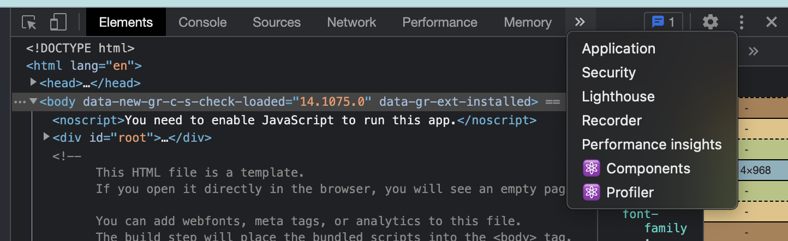

# Basic React 

vscode 단축키: 터미널 여닫기 - `control` + `

- First react project

  `npm init react-app .` : 현재 디렉토리에서 프로젝트를 만들겠다. 

  `npm run start`: 프로젝트 실행. 파일 수정하면 바로 반영해주는 것 까지 해준다. 

  `ctrl + c` : 개발모드 종료

파일을 보면, 분명 js파일인데, 막상 보면 html 파일이 있다. 이런 문법을 `jsx` 라고 부른다. 

```jsx
import logo from './logo.svg';
import './App.css';

function App() {
  return (
    <div className="App">
      <header className="App-header">
        
        <p>
          Edit <code>src/App.js</code> and save to reload.
        </p>
        <a
          className="App-link"
          href="https://reactjs.org"
          target="_blank"
          rel="noopener noreferrer"
        >
          Learn React
        </a>
      </header>
    </div>
  );
}

export default App;
```


- **리액트 개발자 도구**

  크롬 익스텐션. 리액트로 된 웹사이트인 경우 아래와 같은 메뉴가 생겨난다. 

  


# 프로젝트

#### 시작전에 참고사항:  다운받은 프로젝트 실행하기

프로젝트를 직접 생성하지 않고, 다운받아서 실행하려면 따로 설치해줘야 할 것이 있습니다. 앞에서 직접 생성했을 때는 리액트 실행에 필요한 파일들을 알아서 설치해줬었는데요. 이 파일들은 `node_modules` 라는 폴더에 담겨 있습니다. 보통 Node.js로 만든 프로젝트를 공유할 때는 `node_modules` 폴더를 제외하고 공유하게 되는데요, 용량이 많기도 하고, 다운 받은 사람이 직접 설치할 수 있기 때문입니다.

자 그럼 예를들어서 `dicegame` 이라는 프로젝트를 다운 받아서 실행해보겠습니다. 우선 다운 받은 프로젝트의 압축을 푼 다음에, VS Code에서 압축 푼 폴더를 열어주세요.


그리고 터미널에서 아래와 같이 `npm install` 을 입력합니다.


그럼 이렇게 설치가 시작되고, 터미널이 대기 상태로 돌아오면 완료된 겁니다.


VS Code 왼쪽에 있는 EXPLORER 창을 보면 `node_modules` 라는 폴더가 만들어진 거 보이시나요? 이곳에 필요한 파일들이 설치됐는데요, 이제부터는 `npm start` 명령어를 통해서 실행하시면 됩니다!


### 파일의 구조 

`index.html`: 웹브라우져에서 가장 먼저 실행되는 파일

`index.js` : `index.html` 파일이 열리고 나서 실행되는 파일. 리액트 코드들 중에서 가장 먼저 실행되는 파일. 

```js
import ReactDOM from 'react-dom/client';


const root = ReactDOM.createRoot(document.getElementById('root'));
root.render(
  <h1>안녕! 리액트!</h1>
);
```

화면을 그린다는 뜻. Argument로 html을 전달하네? 이게 `jsx`라는 문법. `Root` div 안에 `h1`태그가 들어간다. 


### JSX

자바스크립트 안에 html을 사용. 

```js
const root = ReactDOM.createRoot(document.getElementById('root'));
root.render(
  <h1>안녕! 리액트!</h1>
);
```

id 이런것도 다 추가 가능. 그런데, 완전히 다 사용할 수 있는 것은 아님. 

class같은거 그대로 사용 어려운게, js에서 이미 사용하는 이름. 그래서, `className`이라고 사용해야 함. 

또한, `label for` 이런거 할때, `for`도 사용 못함. 이벤트 핸들러의 이름도 다름. onblur, onfocus, onmousedown 이런것도, 두번째 단어 부터 camel case해야함. `onBlur`, `onFocus` , `onMouseDown`. 

하나 더 지켜야 할 규칙이 있다. 하나로 감싸지게 써야 함. 

예를 들어, 아래처럼 하면 안됨. 

```js
<p>Hi</p>
<p>Bye</p>
```

