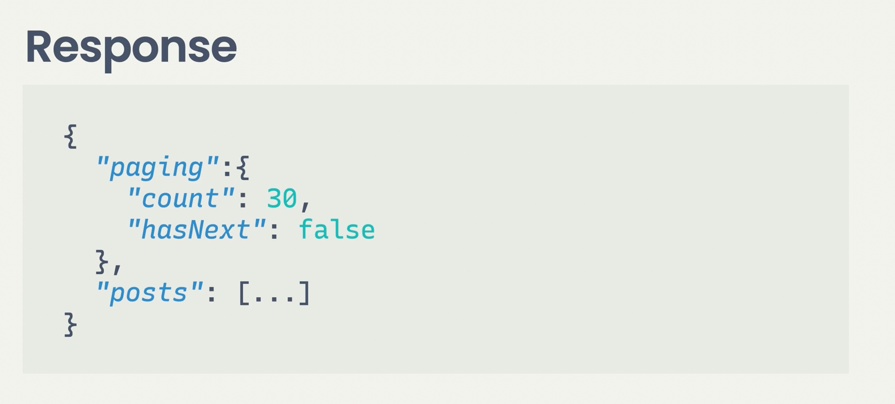
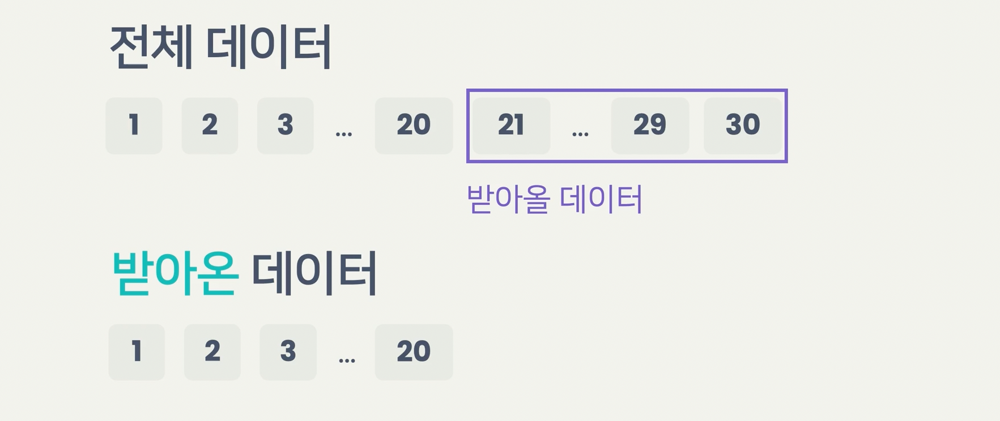

# React로 데이터 다루기

[VSCODE Shortcut](#VSCODE Shortcut)


그때 그때 상황에 따라 데이터를 다르게 그려주잖아.

서버에 리퀘스트 보내고, 받아서 활용하는 방법에 대해서 배울 것. 

그전에, 필수 사용해야 할 vscode 단축키 

**자동완성**

예를들어 `handleIconClick` 이라는 단어를 입력할 때

단어의 앞 부분인 `hand` 만 입력하거나

단어의 이니셜인 `hic` 만 입력하면 VSCode는 툴팁으로 단어를 추천해주는데요.

여기서 원하는 단어를 선택한 다음 Enter나 Tab 키를 눌러 단어를 완성할 수 있습니다.

> 또한, 단어에 대문자가 있으면, 그거 기준으로도 추천해준다. 예를들어, onClick이면, oc를 쳐보면 추천해준다. 


# VSCODE Shortcut

**단축키**

**멀티 커서 선택하기** => 이거 필수 숙지

**텍스트 커서를 단어로 옮겨 놓으면** 해당하는 변수나 함수가 하이라이팅되고,

**텍스트를 선택하면(더블클릭)** 대소문자 구분없이 같은 단어가 하이라이팅되는데요.

이 상태에서 멀티 커서 선택을 하면 여러 군데를 한 번에 수정할 수 있습니다.

| 윈도우즈         | 맥              |
| ---------------- | --------------- |
| Ctrl + Shift + L | Cmd + Shift + L |

**직접 멀티 커서 만들기**

원하는 위치에 텍스트 커서를 만들 수 있습니다.

| 윈도우즈   | 맥            |
| ---------- | ------------- |
| Alt + 클릭 | Option + 클릭 |

**찾아 바꾸기**

텍스트 커서를 원하는 변수나 함수에 옮겨놓고 찾아 바꾸기를 하면

해당 변수나 함수가 사용된 파일에서도 함께 이름이 바뀝니다.

| 윈도우즈 | 맥      |
| -------- | ------- |
| F2       | fn + F2 |

**해당하는 파일로 이동**

변수나 함수가 작성된 파일로 이동하고 싶을 때 단어 위에 마우스를 올리고 사용합니다.

| 윈도우즈    | 맥         |
| ----------- | ---------- |
| Ctrl + 클릭 | Cmd + 클릭 |

**줄 이동**`

| 윈도우즈 | 맥          |
| -------- | ----------- |
| Alt +↑↓  | Option + ↑↓ |

**줄 복사**

| 윈도우즈        | 맥                  |
| --------------- | ------------------- |
| Alt + Shift +↑↓ | Option + Shift + ↑↓ |

이 단축키들은 VSCode의 메뉴에서 **Help > Keyboard Shortcuts Reference** 를 통해서 확인할 수도 있습니다.

### 저장할 때마다 코드 정리하기. Prettier

1. 화면 왼쪽의 퍼즐 아이콘(Extensions 메뉴)에서 Prettier를 설치합니다.
2. 화면 왼쪽의 톱니바퀴 아이콘(Manage 메뉴)에서 Settings 메뉴로 들어갑니다.
3. 상단의 검색창에서 `format`을 검색한 다음 Default Formatter 를 Prettier로 설정하고 Format On Save 옵션 켭니다.


그런데 뭐 할때마다, 아래 에러가 뜬다. 무슨 의미일까? 각 child는 key를 가져야 한다? 


ReviewList안에 아래와 같이 map을 쓴 부분이 있다.  얘네가 key를 가져야 한다는 것. 

```jsx
<ul>
      {items.map(item => {
        return (
          <li>
            <ReviewListItem item={item} onDelete={onDelete} />
          </li>
        );
      })}
</ul>
```

마침 데이터에 `id`가 있어서, 그걸로 key prop을 지정하면 된다. 

```js
<li key={item.id}>
```

**이처럼, 배열을 랜더링 할때는 반드시 key를 설정해 주어야 한다.**

이게 지금 왜 그런지 아래다가 input하나 넣어보면 안다. 

input 넣어놓고서, input 랜더링 되면 거기다가 글자 친다음에 삭제 눌러보면, input에 내가 썻던 글이 엉뚱한 대로 간다. 

```jsx
return (
    <ul>
      {items.map(item => {
        return (
          <li>
            <ReviewListItem item={item} onDelete={onDelete} />
            <input />
          </li>
        );
      })}
    </ul>
  ); 
```

심지어, map에서 던져주는 두번째 요소인 index를 받아서 key로 사용해도 이 꼴이 똑같이 난다. 배열 인덱스는 배열이 바뀔때마다 새롭게 부여된다. 그래서, 데이터에 대한 고유의 값으로 사용이 불가능한 것. id값은 데이터와 상관없이 같은 데이터를 가리킨다. 

**근데, key를 지정하지 않거나 배열 index 같이 데이터를 가리키는 고유한 값으로 key를 지정하지 않으면 이상하게 됬었는데. 왜 그런걸까?** 

사과, 망고, 포도를 랜더링 하고 싶다고 해보자. 그런데, 망고가 빠진 배열로 바뀌었다. 


이게 **망고가 삭제되었다.** 이렇게 말할 수도 있는데, 다르게 말하면, **포도가 삭제되고 망고가 포도로 바뀌었다** 라고 표현될 수도 있다.  즉, 어떻게 바뀐건지 결과만 봐서는 알길이 없다. 


key를 사용하면? 요소마다 key로 고유한 값을 지정해 주면, 결과만 보고도 **망고가 삭제됬다** 라는 것을 알 수 있다. 


**즉, 배열의 변화를 정확하게 진단하려면 key를 지정해 줘야 가능하다.** 라는 사실을 기억하고 가자. 


앞에서 배열 메소드를 활용해서 렌더링을 하고, 정렬과 삭제 삭제 기능을 만들었는데요.

이번 레슨에선 이 내용들을 가볍게 정리하고 넘어가겠습니다.

[pokemon.json](https://bakey-api.codeit.kr/api/files/resource?root=static&seqId=5035&directory=pokemons.json&name=pokemons.json)

위 JSON 파일은 포켓몬 도감 151번까지의 포켓몬 데이터입니다.

각 데이터를 구분하는 값인 `id`, 포켓몬 이름을 값으로 하는 `name` 프로퍼티, 그리고  포켓몬의 속성인 `types` 프로퍼티가 있습니다.

# `map` 으로 렌더링하기

배열 메소드 `map`에서 콜백 함수의 리턴 값으로 리액트 엘리먼트를 리턴하면 되는데요.

```jsx
import items from './pokemons';

function Pokemon({ item }) {
  return (
    <div>
      No.{item.id} {item.name}
    </div>
  );
}

function App() {
  return (
    <ul>
      {items.map((item) => (
        <li key={item.id}>
          <Pokemon item={item} />
        </li>
      ))}
    </ul>
  );
}
 
export default App;
```

참고로 반드시 JSX의 중괄호 안에서 `map` 함수를 써야 하는 것은 아닙니다.

예를 들어서 아래처럼 `renderedItems` 라는 변수에 `map`의 결과를 지정해도 똑같이 렌더링 하게 됩니다. `renderedItems` 의 계산된 값이 결국 리액트 엘리먼트의 배열이기 때문이죠.

```jsx
import items from './pokemons';

function Pokemon({ item }) {
  return (
    <div>
      No.{item.id} {item.name}
    </div>
  );
}

function App() {
  const renderedItems = items.map((item) => (
    <li key={item.id}>
      <Pokemon item={item} />
    </li>
  ));

  return (
    <ul>
      {renderedItems}
    </ul>
  );
}
 
export default App;
```

# `sort` 로 정렬하기

배열 메소드의 `sort` 메소드를 사용하면 배열을 정렬할 수 있었죠?

이렇게 정렬한 배열을 렌더링 할 수 있었습니다.

아래 코드는 `id` 순서대로 / 반대로 정렬하는 예시입니다.

```jsx
import { useState } from 'react';
import items from './pokemons';

function Pokemon({ item }) {
  return (
    <div>
      No.{item.id} {item.name}
    </div>
  );
}

function App() {
  const [direction, setDirection] = useState(1);

  const handleAscClick = () => setDirection(1);

  const handleDescClick = () => setDirection(-1);

  const sortedItems = items.sort((a, b) => direction * (a.id - b.id));

  return (
    <div>
      <div>
        <button onClick={handleAscClick}>도감번호 순서대로</button>
        <button onClick={handleDescClick}>도감번호 반대로</button>
      </div>
      <ul>
        {sortedItems.map((item) => (
          <li key={item.id}>
            <Pokemon item={item} />
          </li>
        ))}
      </ul>
    </div>
  );
}

export default App;
```

# `filter` 로 삭제하기

배열 메소드 중 `filter` 와 배열형 스테이트를 활용하면

삭제 기능을 간단히 구현할 수 있었습니다.

```jsx
import { useState } from 'react';
import mockItems from './pokemons';

function Pokemon({ item, onDelete }) {
  const handleDeleteClick = () => onDelete(item.id);

  return (
    <div>
       No.{item.id} {item.name}
      <button onClick={handleDeleteClick}>삭제</button>
    </div>
  );
}

function App() {
  const [items, setItems] = useState(mockItems);

  const handleDelete = (id) => {
    const nextItems = items.filter((item) => item.id !== id);
    setItems(nextItems);
  };

  return (
    <ul>
      {items.map((item) => (
        <li key={item.id}>
          <Pokemon item={item} onDelete={handleDelete} />
        </li>
      ))}
    </ul>
  );
}

export default App;
```

# 반드시 `key` 를 내려주자

각 요소를 렌더링 할 때는 `key` Prop을 내려줘야 하는데요.

이때 가장 바깥쪽에 있는 (최상위) 태그에다가 `key` Prop을 지정하면 됩니다.

앞에서 `id` 는 각 요소를 구분할 수 있는 고유한 값이기 때문에 사용했었는데요.

반드시 `id` 일 필요는 없고 포켓몬 이름처럼(참고로 포켓몬 이름은 고유합니다)

각 데이터를 구분할 수 있는 고유한 값이면 무엇이든 `key` 로 활용해도 상관없습니다.

```jsx
import items from './pokemons';

function Pokemon({ item }) {
  return (
    <div>
      No.{item.id} {item.name}
    </div>
  );
}

function App() {
  return (
    <ul>
      {items.map((item) => (
        <li key={item.name}>
          <Pokemon item={item} />
        </li>
      ))}
    </ul>
  );
}

export default App;
`
```


# 실습할 서버를 어디서 구하나요?

이제부터 우리가 작성한 코드를 백엔드 서버에 연동하는 방법을 배워볼 겁니다.

프론트엔드만 공부했는데 서버는 어디서 어떻게 구해야 할지, 걸림돌이 될 수 있겠죠?

보통 프론트엔드 개발자들은 직접 서버를 만드는 경우보다는 백엔드 개발자들이 만들어 둔 서버를 사용하는데요.

처음 프론트엔드 개발을 배울 때는 이런 서버가 없어서 네트워크 관련 내용을 따라하기 힘든 경우도 많습니다.

그래서 이번 토픽에서는 실제 개발 상황처럼 여러분이 백엔드 서버를 연동을 할 수 있도록

코드잇에서 만든 백엔드 서버를 제공할 건데요.

저는 이 서버를 **실습 서버**라고 부르겠습니다.

이번 레슨에서는 실습 서버가 어떤 건지 소개드릴게요.

# 실습 서버 주소

우리 수업의 영상에서 사용할 실습 서버의 주소는 `https://learn.codeit.kr/api/...`로 시작합니다.

하지만 이렇게 하나의 주소를 가지고 여러 수강생들이 실습을 하면 서로 데이터가 겹치는 불편함이 있겠죠?

그래서 주소를 나눠 쓸 수 있도록 했는데요. 각 주소마다 데이터가 따로 관리되니 좀 더 편하게 실습할 수 있습니다.

여러분이 실습하실 때는 **`/api` 대신에 `/0000` ~ `/9999` 사이의 숫자 네 자리**로 사용하시면 됩니다.

예를들어서 저는 주소를 쉽게 외우기 위해서 제 전화번호 뒷자리인 **1636을** 사용하려고 하는데요.

이런 경우에는 다음과 같은 주소를 사용하면 됩니다.

- `https://learn.codeit.kr/1636/film-reviews/`
- `https://learn.codeit.kr/1636/foods/`

물론 서버를 나눠서 사용하더라도 여러 사람이 같은 번호를 고르면 서버를 함께 쓰게 됩니다. 데이터가 헷갈려서 불편하다면 이럴 때는 다른 번호를 골라서 사용하시면 됩니다.

# 여러 사람들이 동시에 사용하는 서버

실습 서버는 여러 수강생들이 함께 사용합니다.

다른 수강생이 만든 데이터가 갑자기 생기거나 내가 만든 데이터가 수정될 수 있습니다.

내가 만든 결과물이 영상에 나오는 결과물이랑 다를 수 있다는 점도 참고해주세요.

또, 이 서버는 여러 수강생이 같이 사용하는 거니까

**개인정보나 비밀번호 같은 민감한 데이터를 올리지 않도록 주의하시기 바랍니다!**

# 데이터는 하루에 한 번씩 초기화돼요!

데이터가 계속 쌓이는 걸 막기 위해서 서버 데이터는 **매일 새벽 초기화됩니다.**

자 그럼 이제 시작해볼까요?


# 리액트로 Fetch 함수 사용하기

나는 https://learn.codeit.kr/9131/film-reviews/ <- 여기로 보낸다. 


이제 페이지 로드되면, 자동으로 불러오게 할거야. 근데, 그냥 `handleLoad()` 이렇게 호출해놓으면 계속 무한루프 보낸다. 

```jsx
const handleLoad = async () => {
    const { reviews } = await getReviews();
    setItems(reviews);
  };


handleLoad()


  return (
    <div>
      <button onClick={handleNewestClick}>최신순</button>
      <button onClick={handleBestClick}>베스트순</button>

      <ReviewList items={sortedItems} onDelete={handleDelete} />
    </div>
  );
}
```

이게 왜 그럴까? 일단, `handleLoad()`실행하면, `setItems()`가 있으니깐, `App()컴포넌트를 다시 실행하게 된다. 이때, handleLoad()를 또 실행하는 것. 

리액트에서는 이런 경우에 사용하라고, `useEffect`라는 함수를 만들어 놨다. `useEffect` 를 사용하면, 맨 처음 랜더링할때만 이 함수를 사용한다. 

```jsx
 const handleLoad = async () => {
    const { reviews } = await getReviews();
    setItems(reviews);
  };

  useEffect(() => {
    handleLoad();
  }, []);

  return (
    <div>
      <button onClick={handleNewestClick}>최신순</button>
      <button onClick={handleBestClick}>베스트순</button>

      <ReviewList items={sortedItems} onDelete={handleDelete} />
    </div>
  );
}
```


`useEffect`에서는 콜백함수와 빈 배열을 넘겨줬다. 콜백함수는 useEffect가 비동기로 실행할 함수. 배열은 dependency list라는 것. 구조가 특이하다. 

콜백 실행하면, handleLoad가 실행되고, 다시 랜더링이 시작되겠지. 그러면, 다시 컴포넌트를 실행하면서 useEffect를 다시 실행하게 된다. 이때, dependency list를 앞에서 기억한 값과 비교한다. 현재는 빈배열 줬으니깐, **모든 값이 같다.** 이렇게 판단하는 것. 

즉, useEffect는 전체 랜더링 끝나면 콜백 딱 실행해준다. 그 뒤로는 dependency list를 비교하면서 한다. 그러고, 기억했던 값이랑 다른 경우에만 콜백을 실행한다. 그러면, 실제로 dependency list에 요소를 추가해 보자. 

**이런 경우는 잘 보면, order가 달라질때는, 다시 component 실행한다는 뜻.** 

```jsx
useEffect(
    () => {
      handleLoad();
    },
    [order]
  );

```


그러면, 잘 보면 적어도 order가 변할때는 계속 다시 리퀘스트를 보내고 있는 것. 

아래는 **전체 코드**. 

```jsx
import { useEffect, useState } from "react";
import { getReviews } from "../api";
import ReviewList from "./ReviewList";

function App() {
  const [items, setItems] = useState([]);
  const [order, setOrder] = useState("createdAt");

  // const sortedItems = items.sort((a, b) => b[order] - a[order]);

  const handleNewestClick = () => setOrder("createdAt");
  const handleBestClick = () => setOrder("rating");

  const handleDelete = id => {
    const nextItems = items.filter(item => item.id !== id);
    setItems(nextItems);
  };

  const handleLoad = async orderQuery => {
    const { reviews } = await getReviews(orderQuery);
    setItems(reviews);
  };

  useEffect(
    () => {
      handleLoad(order);
    },
    [order]
  );

  return (
    <div>
      <button onClick={handleNewestClick}>최신순</button>
      <button onClick={handleBestClick}>베스트순</button>

      <ReviewList items={items} onDelete={handleDelete} />
    </div>
  );
}

export default App;

```


앞에서 `useEffect` 를 사용해서 초기 데이터를 불러오고 정렬을 바꿀 때마다 데이터를 불러와봤습니다.

이번 노트에선 우리가 사용한 `useEffect` 함수를 간단하게 정리해봅시다.

# 처음 한 번만 실행하기

```tsx
useEffect(() => {
  // 실행할 코드
}, []);
```

컴포넌트가 처음 렌더링 되고 나면 리액트가 콜백 함수를 기억해뒀다가 실행합니다.

그 이후로는 콜백 함수를 실행하지 않습니다.

# 값이 바뀔 때마다 실행하기

```tsx
useEffect(() => {
  // 실행할 코드
}, [dep1, dep2, dep3, ...]);
```

컴포넌트가 처음 렌더링 되고 나면 리액트가 콜백 함수를 기억해뒀다가 실행합니다.

그 이후로 렌더링 할 때는 디펜던시 리스트에 있는 값들을 확인해서

하나라도 바뀌면  콜백 함수를 기억해뒀다가 실행합니다.

# 실험으로 확인해보기

아래 코드는  `useEffect` 함수의 동작을 간단한 실험을 해볼 수 있는 코드입니다.

디펜던시 리스트에  `[]` , `[first]`, `[first, second]` 를 넣어보면서

콘솔 출력이 어떻게 달라지는지 확인해보세요!

```tsx
import { useEffect, useState } from 'react';

function App() {
  const [first, setFirst] = useState(1);
  const [second, setSecond] = useState(1);

  const handleFirstClick = () => setFirst(first + 1);

  const handleSecondClick = () => setSecond(second + 1);

  useEffect(() => {
    console.log('렌더링 이후', first, second);
  }, []);

  console.log('렌더링', first, second);

  return (
    <div>
      <h1>
        {first}, {second}
      </h1>
      <button onClick={handleFirstClick}>First</button>
      <button onClick={handleSecondClick}>Second</button>
    </div>
  );
}

export default App;
```


# 페이지네이션

랜더링한테 필요한 데이터만 받아서 스크롤 내리거나 페이지 눌러야 가져온다. 이렇게 데이터를 나눠서 가져오는 것을 **페이지네이션** 이라고 한다. 페이지네이션에는 두 가지가 있다. 


offset 은 지금까지 받아온 데이터를 의미. 




offset기준에서는 갯수를 기준으로 데이터를 나눈다. offset기반으로 20번까지 데이터를 받아왔으면, 21번부터 30번을 받아오게 되는 것. 



그런데, 글을 보는 도중에 새로운 글이 추가되면? 21번부터 30번을 받아와야 되는데, 앞에 하나가 추가되서 20번부터 29번을 받아오게 되었다. 


삭제되면 삭제된대로 내가 원했던 데이터와 달라진다. 


이런 문제 때문에 커서 기반 페이지네이션이 있음. 


서버로 리퀘스트 보내면, 리스폰스로 데이터랑 페이지네이션 정보를 준다. 


**페이지네이션 정보를 보면, 다음 커서 값도 넘겨준다.**

그러면, 다음 리퀘스트 때 커서 정보를 같이 보내주면서 커서 데이터 이후 10개 보내줘가 된다. 

 

커서 데이터가 있으면, 중복이나 이런 문제가 사라진다. 

그런데, 커서 기반이 서버 입장에서는 만들기 까다롭고, 데이터 자주 바뀌는게 아니라면 `offset`기반도 충분하다. 

**fetch 예시**

`https://learn.codeit.kr/9131/film-reviews?offset=0&limit=6`

처음 데이터 6개를 가져온다. 

그 다음은?

`https://learn.codeit.kr/9131/film-reviews?offset=6&limit=6`

response를 잘 보면, 총 데이터 갯수(`count`)와 다음 데이터가 있는지(`hasNext`)도 말해준다. 

```js
 {
  const [items, setItems] = useState([]);
  const [order, setOrder] = useState("createdAt");
  const [offset, setOffset] = useState(0);
  const [hasNext, setHasNext] = useState(false);

  // const sortedItems = items.sort((a, b) => b[order] - a[order]);

  const handleNewestClick = () => setOrder("createdAt");
  const handleBestClick = () => setOrder("rating");

  const handleDelete = id => {
    const nextItems = items.filter(item => item.id !== id);
    setItems(nextItems);
  };

  const handleLoad = async options => {
    const { reviews, paging } = await getReviews(options);
    if (options.offset === 0) {
      setItems(reviews);
    } else {
      setItems([...items, ...reviews]);
    }
    setOffset(options.offset + reviews.length);
    setHasNext(paging.hasNext);
  };

  const handleLoadMore = async () => {
    handleLoad({ order, offset, LIMIT });
  };

  useEffect(
    () => {
      handleLoad({ order, offset: 0, limit: LIMIT });
    },
    [order]
  );

  return (
    <div>
      <button onClick={handleNewestClick}>최신순</button>
      <button onClick={handleBestClick}>베스트순</button>
      <ReviewList items={items} onDelete={handleDelete} />
      <button disabled={!hasNext} onClick={handleLoadMore}>
        더보기
      </button>
    </div>
  );
}

export default App;

```

더 불러올 데이터가 없으면, disalbed로 만들었다. 

**이거 그냥 더 불러올 데이터가 없으면 안보이게 만들어 버리자.  이렇게 하면 된다. 참고로, hasNext가 false면 그대로 false를 리턴하고 끝나게되는건데 리액트에서 false면 랜더링 하지 않는다.** 

```js
{
        hasNext && 
        <button onClick={handleLoadMore}>더보기</button>
      }
```


**조건부렌더링**

앞에서 논리 연산자 `&&` 을 사용해서 간단한 조건부 렌더링을 해봤는데요.

이번 레슨에선 리액트에서 활용할 수 있는 조건부 렌더링에 대한 꿀팁을 알려드릴게요!

# 논리 연산자 활용하기

## AND 연산자

```tsx
import { useState } from 'react';

function App() {
  const [show, setShow] = useState(false);

  const handleClick = () => setShow(!show);

  return (
    <div>
      <button onClick={handleClick}>토글</button>
      {show && <p>보인다 👀</p>}
    </div>
  );
}

export default App;
```

`show` 값이 `true` 이면 렌더링 하고, `false` 이면 렌더링 하지 않습니다.

## OR 연산자

```tsx
import { useState } from 'react';

function App() {
  const [hide, setHide] = useState(true);

  const handleClick = () => setHide(!hide);

  return (
    <div>
      <button onClick={handleClick}>토글</button>
      {hide || <p>보인다 👀</p>}
    </div>
  );
}

export default App;
```

`hide` 값이 `true` 이면 렌더링 하지 않고, `false` 이면 렌더링 합니다.

# 삼항 연산자 활용하기

```tsx
import { useState } from 'react';

function App() {
  const [toggle, setToggle] = useState(false);

  const handleClick = () => setToggle(!toggle);

  return (
    <div>
      <button onClick={handleClick}>토글</button>
      {toggle ? <p>✅</p> : <p>❎</p>}
    </div>
  );
}

export default App;
```

삼항 연산자를 사용하면 참, 거짓일 경우에 다르게 렌더링해줄 수 있습니다.

`toggle` 의 값이 참일 경우엔 '✅'을, 거짓일 경우에는 '❎'를 렌더링합니다.

# 렌더링되지 않는 값들

```tsx
function App() {
  const nullValue = null;
  const undefinedValue = undefined;
  const trueValue = true;
  const falseValue = false;
  const emptyString = '';
  const emptyArray = [];

  return (
    <div>
      <p>{nullValue}</p>
      <p>{undefinedValue}</p>
      <p>{trueValue}</p>
      <p>{falseValue}</p>
      <p>{emptyString}</p>
      <p>{emptyArray}</p>
    </div>
  );
}

export default App;
```

위 컴포넌트에서 중괄호 안에 있는 값들은 모두 아무것도 렌더링하지 않습니다.

```tsx
function App() {
  const zero = 0;
  const one = 1;

  return (
    <div>
      <p>{zero}</p>
      <p>{one}</p>
    </div>
  );
}

export default App;
```

반면에 이 값들은 각각 숫자 0과 1을 렌더링 합니다.

# 조건부 렌더링을 사용할 때 주의할 점

만약 아래와 같은 코드를 사용하면 어떤 문제가 있을까요?

```tsx
import { useState } from 'react';

function App() {
  const [num, setNum] = useState(0);

  const handleClick = () => setNum(num + 1);

  return (
    <div>
      <button onClick={handleClick}>더하기</button>
      {num && <p>num이 0 보다 크다!</p>}
    </div>
  );
}

export default App;
```

`num` 값이 0일 때는 `false` 로 계산되니까 뒤의 값을 계산하지 않기 때문에

아무것도 렌더링 하지 않는 코드 같습니다.

하지만 앞에서 살펴봤듯이 숫자 0은 0으로 렌더링 되는데요.

그래서 처음 실행했을 때 **숫자 0이 렌더링** 되고

'더하기' 버튼을 눌러서 `num` 값이 증가하면 `num이 0 보다 크다!` 가 렌더링 됩니다.

그래서 이런 경우엔 아래처럼 보다 명확한 논리식을 써주는 게 안전합니다.

**`true` 나 `false` 값은 리액트에서 렌더링 하지 않기 때문이죠!**

```tsx
import { useState } from 'react';

function App() {
  const [num, setNum] = useState(0);

  const handleClick = () => setNum(num + 1);

  return (
    <div>
      <button onClick={handleClick}>더하기</button>
      {(num > 0) && <p>num이 0 보다 크다!</p>}
    </div>
  );
}

export default App;
```

편하게 코드를 작성하다 보면 굉장히 자주 하는 실수니까 함께 알아두시면 좋을 겁니다!


# 비동기 state 만들 때 주의할 점

이거 지금 버그가 있다. 

> 속도 3g로 해놓고서, 데이터 추가 로드 한다음에 위에서 맨 마지막꺼 삭제 버튼 누르면?
>
> 갑자기 아래 데이터 추가로드가 다 된다음에 위에 삭제했던게 다시 생긴다. 

이거 왜 그런지 생각해보자. 우리는 `handleLoadMore`를 클릭했고, 이건 아래처럼, handleLoad를 실행한다. 

```jsx
  const handleLoadMore = async () => {
    handleLoad({ order, offset, LIMIT });
  };
```

그러면 얘는 `handleLoad`를 실행한다. 

```jsx
const handleLoad = async options => {
    const { reviews, paging } = await getReviews(options);
    if (options.offset === 0) {
      setItems(reviews);
    } else {
      setItems([...items, ...reviews]);
    }
    setOffset(options.offset + reviews.length);
    setHasNext(paging.hasNext);
  };

```

이 당시 딱, items가 있어. 그러고 여기서는 `getReviews`라는 비동기 함수를 실행한다. 그리고 네트워크를 보내는 동안 다른 작업이 실행된다. 그런데 우리가 이때 삭제 버튼을 누른 것. 

그러면, `handleDelete`가 실행된다. 그러면 여기서는 아이템을 하나 없애지. `items` state를 변경했음. 

```jsx
  const handleDelete = id => {
    const nextItems = items.filter(item => item.id !== id);
    setItems(nextItems);
  };

```

그러면, 이제 `getReviews`의 `response`가 도착했음. 이제 state를 변경하려고 하지 아랫줄에서. 이때 `items` state는 어떤 값일까? 

```jsx
setItems([...items, ...reviews])
```

문제는 이 함수 내에서 `items` 는 아까 삭제 되기 전의 items야. 그 상태에서 setItems를 다시 해버리니깐, 지웠던 데이터가 다시 되살아놔 버려지는 것. 이럴 때는 어떻게 하지?

```jsx
setItems((prevItems) => [...items, ...reviews]);
```

이렇게 해놓으면, 현재 시점에서의 state값을 받아와서 해준다. 이것 또한 규칙이다. 


# useState 뽀개기 

앞에서 비동기로 `useState` 를 사용할 때 주의할 점을 배웠는데요. 그때 Setter 함수의 또 다른 사용법을 배웠죠?

이번 레슨에서는 초깃값을 지정하는 또 다른 방법에 대해서 소개하고, 여태까지 배운 `useState` 사용법을 총정리해보도록 하겠습니다.

# 초깃값 지정하기

```tsx
const [state, setState] = useState(initialState);
```

`useState` 함수에 값을 전달하면 초깃값으로 지정할 수 있었습니다.

## 콜백으로 초깃값 지정하기

```tsx
const [state, setState] = useState(() => {
  // 초기값을 계산
  return initialState;
});
```

이 방법은 여기서 처음 소개하는 내용인데요, 초깃값을 계산해서 넣는 경우 이렇게 콜백을 사용하면 좋습니다.

무슨 말인지 예시 코드로 한번 살펴볼게요.

```jsx
function ReviewForm() {
  const savedValues = getSavedValues(); // ReviewForm을 렌더링할 때마다 실행됨
  const [values, setValues] = useState(savedValues);
  // ...
}
```

`getSavedValues` 라는 함수를 통해서 컴퓨터에 저장된 초깃값을 가져온다고 해봅시다.

이 코드엔 한 가지 문제점이 있는데요. `savedValues` 라는 값은 처음 렌더링 한 번만 계산하면 되는데, 매 렌더링 때마다 불필요하게 `getSavedValues` 함수를 실행해서 저장된 값을 가져온다는 거죠.

```jsx
function ReviewForm() {
  const [values, setValues] = useState(() => {
    const savedValues = getSavedValues(); // 처음 렌더링할 때만 실행됨
    return savedValues
  });
  // ...
}
```

이럴 때는 이렇게 콜백 형태로 초깃값을 지정해주면 처음 렌더링 할 때 한 번만 콜백을 실행해서 초깃값을 만들고, 그 이후로는 콜백을 실행하지 않기 때문에 `getSavedValues` 를 불필요하게 실행하지 않습니다.

단, 이때 주의할 점은 이 콜백 함수가 리턴할 때까지 리액트가 렌더링하지 않고 기다린다는 점인데요. 콜백 함수의 실행이 오래 걸릴 수록 초기 렌더링이 늦어진다는 점에 주의하세요.

# Setter 함수 사용하기

## 기본

```tsx
const [state, setState] = useState(0);

const handleAddClick = () => {
  setState(state + 1);
}
```

Setter 함수에다가 값을 전달하면, 해당하는 값으로 변경되었죠? 이때 주의할 점이 있었는데요, 배열이나 객체 같은 참조형은 반드시 새로운 값을 만들어서 전달해야 한다는 거였습니다.

**참조형 State 사용의 잘못된 예**

```tsx
const [state, setState] = useState({ count: 0 });

const handleAddClick = () => {
  state.count += 1; // 참조형 변수의 프로퍼티를 수정
  setState(state); // 참조형이기 때문에 변수의 값(레퍼런스)는 변하지 않음
}
```

**참조형 State 사용의 올바른 예**

```tsx
const [state, setState] = useState({ count: 0 });

const handleAddClick = () => {
  setState({ ...state, count: state.count + 1 }); // 새로운 객체 생성
}
```

## 콜백으로 State 변경

```jsx
setState((prevState) => {
  // 다음 State 값을 계산
  return nextState;
});
```

만약 이전 State 값을 참조하면서 State를 변경하는 경우, 비동기 함수에서 State를 변경하게 되면 최신 값이 아닌 State 값을 참조하는 문제가 있었습니다. 이럴 때는 콜백을 사용해서 처리할 수 있었는데요. 파라미터로 올바른 State 값을 가져와서 사용할 수 있습니다. 이전 State 값으로 새로운 State를 만드는 경우엔 항상 콜백 형태를 사용하는 습관을 들이면 좋겠죠?

**콜백으로 State를 변경하는 예시**

```tsx
const [count, setCount] = useState(0);

const handleAddClick = async () => {
  await addCount();
  setCount((prevCount) => prevCount + 1);
}
```


# 네트워크 로딩 처리하기

Slow 3g를 해놓고서, 지금 보면 더 보기를 눌러놓고, 이거 처리하는거 기다리는 동안 계속 더 보기를 누른거야. 이러니깐, 불필요하게 동일한 요청 계속 보내고, 심지어 동일한 데이터가 계속 추가되어 있다. 


이런거 막으려면, 더 보기 눌러야 된다. 

간단하다, `isLoading` 이라는 state 추가. 기본값 `false`로

```jsx
const [isLoading, setIsLoading] = useState(false);
```

 그 다음에, try catch넣어놓고, getReview하는 동안 `Loading`을 true로 바꿔놓는 것. 

```jsx
const handleLoad = async options => {
    let result;
    try {
      setIsLoading(true);
      result = await getReviews(options);
    } catch (error) {
      console.log(error);
      return;
    } finally {
      setIsLoading(false);
    }
    
    const { reviews, paging } = result;
  
```

그리고, 로딩 되는 동안 비활성화 해주면 끝. 

```jsx
<button disabled={isLoading} onClick={handleLoadMore}>
```


# 네트워크 에러 처리하기 

근데 리퀘스트 자체가 실패할 수도 있잖아. 아니면,  error response가 돌아올 수도 있잖아. 

그래서 에러 처리가 필요하다. 

이것도 간단하다

```jsx
  const [loadingError, setLoadingError] = useState(null);
```

```jsx
try {
      setIsLoading(true);
      setLoadingError(null);

      result = await getReviews(options);
    } catch (error) {

      setLoadingError(error);
      return;

    } finally {
      setIsLoading(false);
    }
```

그 다음 `html`에서

?. 는 optional chaning이라고 부른다. 에러 객체가 있을 때에만, message에 접근하는 것. 

```jsx
{loadingError?.message && <span>{loadingError.message}</span>}
```


# 입력폼 만들기 

```jsx
function ReviewForm() {
  const [title, setTitle] = useState("");

  const handleTitleChange = e => {
    setTitle(e.target.value);
  };
  return (
    <form>
      <input value={title} onChange={handleTitleChange} />
    </form>
  );
}

export default ReviewForm;

```

그런데 잠깐. 

html에서는 사용자가 Input을 입력할 때 마다, `onInput`이라는 이벤트가 발생했음. `onChange`는 사용자의 input입력이 끝났을 때, 발생하는 이벤트 였음. 

react에서의 `onChange`는 순수 자바스크립트에서의 `onChange`와 서로 다르게 동작한다. `onInput`처럼 사용자가 값을 입력할 때 마다, `onChange`가 발생한다. 리액트 만든 개발자들이 이 이름이 더 직관적이여서 이렇게 만들었다고 함. 


# 제어 컴포넌트

인풋의 value값을 리액트에서 지정하는 방식. 

예를 들어, 

```jsx
function MyComponent(){
	const handleChange = e => {
	const nextValue = e.target.value.toUpperCase();
	setValue(nextValue)
	};
  
  return <input value={value} onChange={handleChange}>
}

```

이렇게 하면, 인풋에 내가 무슨 값을 쳐도 계속 대문자가 나온다. 왜냐면, 지금 컴포넌트의 value에 내가 친 글자를 대문자로 바꿔서 value로 내려주기 때문. 이렇게 인풋의 값을 제어할 수 있다는 것. 


제어하지 않는 컴포넌트는 비제어 컴포넌트라고 한다. 예를 들어, 아래와 같이 하면, value값을 받아서 state로 저장하긴 하지만, 컴포넌트의 value로 사용하지는 않고 있다. 

```jsx
function MyComponent(){
	const handleChange = e => {
	const nextValue = e.target.value;
	setValue(nextValue)
	};
  
  return <input onChange={handleChange}>
}
```


앞에서 스테이트를 사용해서 입력 폼을 다루는 간단한 방법과

제어 컴포넌트, 비제어 컴포넌트에 대해서 배웠는데요.

이번 레슨에선 여행 검색을 예시로 보면서 배운 내용을 정리해봅시다!

# HTML과 다른 점

## onChange

리액트에선 순수 HTML과 다르게

**`onChange` Prop을 사용하면 입력 값이 바뀔 때마다 핸들러 함수를 실행**합니다.

`oninput` 이벤트와 같다고 생각하시면 되는데요.

리액트 개발자들은 주로 `onChange` 라는 Prop을 사용하니까, 이 내용은 꼭 기억해주세요.

## htmlFor

앞에서 잠깐 배운 내용이지만,

`<label />` 태그에서 사용하는 속성인 `for` 는 자바스크립트 반복문 키워드인 `for` 와 겹치기 때문에

리액트에서는 `htmlFor` 를 사용합니다.

# 폼을 다루는 기본적인 방법

스테이트를 만들고 `target.value` 값을 사용해서 값을 변경해 줄 수 있었습니다.

이때 `value` Prop으로 스테이트 값을 내려주고, `onChange` Prop으로 핸들러 함수를 넘겨줬는데요.

```jsx
function TripSearchForm() {
  const [location, setLocation] = useState('Seoul');
  const [checkIn, setCheckIn] = useState('2022-01-01');
  const [checkOut, setCheckOut] = useState('2022-01-02');

  const handleLocationChange = (e) => setLocation(e.target.value);

  const handleCheckInChange = (e) => setCheckIn(e.target.value);

  const handleCheckOutChange = (e) => setCheckOut(e.target.value);
    
  return (
    <form>
      <h1>검색 시작하기</h1>
      <label htmlFor="location">위치</label>
      <input id="location" name="location" value={location} placeholder="어디로 여행가세요?"
        onChange={handleLocationChange} />
      <label htmlFor="checkIn">체크인</label>
      <input id="checkIn" type="date" name="checkIn" value={checkIn} onChange={handleCheckInChange} />
      <label htmlFor="checkOut">체크아웃</label>
      <input id="checkOut" type="date" name="checkOut" value={checkOut} onChange={handleCheckOutChange} />
      <button type="submit">검색</button>
    </form>
  )
}
```

# 폼 값을 객체 하나로 처리하기

이벤트 객체의 `target.name` 과 `target.value` 값을 사용해서 값을 변경해 줄 수도 있었습니다.

이렇게하면 객체형 스테이트 하나만 가지고도 값을 처리할 수 있었죠.

```jsx
function TripSearchForm() {
  const [values, setValues] = useState({
    location: 'Seoul',
    checkIn: '2022-01-01',
    checkOut: '2022-01-02',
  })

  const handleChange = (e) => {
    const { name, value } = e.target;
    setValues((prevValues) => ({
      ...prevValues,
      [name]: value,
    }));
  }
    
  return (
    <form>
      <h1>검색 시작하기</h1>
      <label htmlFor="location">위치</label>
      <input id="location" name="location" value={values.location} placeholder="어디로 여행가세요?" onChange={handleChange} />
      <label htmlFor="checkIn">체크인</label>
      <input id="checkIn" type="date" name="checkIn" value={values.checkIn} onChange={handleChange} />
      <label htmlFor="checkOut">체크아웃</label>
      <input id="checkOut" type="date" name="checkOut" value={values.checkOut} onChange={handleChange} />
      <button type="submit">검색</button>
    </form>
  )
}
```

# 기본 submit 동작 막기

HTML 폼의 기본 동작은 `submit` 타입의 버튼을 눌렀을 때 페이지를 이동하는 건데요.

이벤트 객체의 `preventDefault` 를 사용하면 이 동작을 막을 수 있었습니다.

```jsx
const handleSubmit = (e) => {
  e.preventDefault();
  // ...
}
```

# 제어 컴포넌트

인풋 태그의 `value` 속성을 지정하고 사용하는 컴포넌트입니다.

리액트에서 인풋의 값을 제어하는 경우로 리액트에서 지정한 값과 실제 인풋 `value` 의 값이 항상 같습니다.

이렇게 하면 값을 예측하기가 쉽고 인풋에 쓰는 값을 여러 군데서 쉽게 바꿀 수 있다는 장점이 있어서 리액트에서 권장하는 방법인데요.

이때 State냐 Prop이냐는 중요하지 않고, 리액트로 `value` 를 지정한다는 것이 핵심입니다.

아래 두 경우 모두 제어 컴포넌트입니다.

## 예시 1

```jsx
function TripSearchForm() {
  const [values, setValues] = useState({
    location: 'Seoul',
    checkIn: '2022-01-01',
    checkOut: '2022-01-02',
  })

  const handleChange = (e) => {
    const { name, value } = e.target;
    setValues((prevValues) => ({
      ...prevValues,
      [name]: value,
    }));
  }
    
  return (
    <form>
      <h1>검색 시작하기</h1>
      <label htmlFor="location">위치</label>
      <input id="location" name="location" value={values.location} placeholder="어디로 여행가세요?" onChange={handleChange} />
      <label htmlFor="checkIn">체크인</label>
      <input id="checkIn" type="date" name="checkIn" value={values.checkIn} onChange={handleChange} />
      <label htmlFor="checkOut">체크아웃</label>
      <input id="checkOut" type="date" name="checkOut" value={values.checkOut} onChange={handleChange} />
      <button type="submit">검색</button>
    </form>
  )
}
```

## 예시 2

```jsx
function TripSearchForm({ values, onChange }) {
  return (
    <form>
      <h1>검색 시작하기</h1>
      <label htmlFor="location">위치</label>
      <input id="location" name="location" value={values.location} placeholder="어디로 여행가세요?" onChange={onChange} />
      <label htmlFor="checkIn">체크인</label>
      <input id="checkIn" type="date" name="checkIn" value={values.checkIn} onChange={onChange} />
      <label htmlFor="checkOut">체크아웃</label>
      <input id="checkOut" type="date" name="checkOut" value={values.checkOut} onChange={onChange} />
      <button type="submit">검색</button>
    </form>
  )
}
```

# 비제어 컴포넌트

인풋 태그의 `value` 속성을 리액트에서 지정하지 않고 사용하는 컴포넌트입니다.

```jsx
function TripSearchForm({ onSubmit }) {
  return (
    <form onSubmit={onSubmit} >
      <h1>검색 시작하기</h1>
      <label htmlFor="location">위치</label>
      <input id="location" name="location" placeholder="어디로 여행가세요?" />
      <label htmlFor="checkIn">체크인</label>
      <input id="checkIn" type="date" name="checkIn" />
      <label htmlFor="checkOut">체크아웃</label>
      <input id="checkOut" type="date" name="checkOut" />
      <button type="submit">검색</button>
    </form>
  )
}
```

참고로 위처럼 작성해도 `onSubmit` 함수에서는 폼 태그를 참조할 수 있는데요.

값들을 참조하려면 이벤트 객체의 `target` 활용해서 이렇게 할 수도 있고,

```jsx
const handleSubmit = (e) => {
  e.preventDefault();
  const form = e.target;
  const location = form['location'].value;
  const checkIn = form['checkIn'].value;
  const checkOut = form['checkOut'].value;
  // ....
}
```

폼 태그로 곧바로 `FormValue` 를 바로 만드는 것도 가능합니다.

```jsx
const handleSubmit = (e) => {
  e.preventDefault();
  const form = e.target;
  const formValue = new FormValue(form);
  // ...
}
```

만약 이렇게 제어 컴포넌트랑 비제어 컴포넌트 모두 쓸 수 있는 경우라면

**제어 컴포넌트를 사용하는 걸 추천드립니다!**

하지만 반드시 비제어 컴포넌트로 만들어야만 하는 경우가 있는데요, 대표적으로 파일을 선택하는 인풋이 그렇습니다.

이 내용은 뒤에서 직접 만들면서 자세히 살펴볼게요.


### ref prop

원하는 시점에 실제 DOM노드에 접근하고 싶을 때 사용하는 Prop. 

앞에서 DOM 노드를 참조할 때 `useRef` 함수로 Ref 객체를 만들고

이것의 `current` 라는 프로퍼티를 활용했었는데요.

이번 노트에서는 배운 내용을 사용법 위주로 정리해보겠습니다.

# Ref 객체 생성

```jsx
import { useRef } from 'react';

// ...

const ref = useRef();
```

`useRef` 함수로 Ref 객체를 만들 수 있었습니다.

# `ref` Prop 사용하기

```jsx
const ref = useRef();

// ...

<div ref={ref}> ... </div>
```

`ref` Prop에다가 앞에서 만든 Ref 객체를 내려주면 됩니다.

# Ref 객체에서 DOM 노드 참조하기

```jsx
const node = ref.current;
if (node) {
  // node 를 사용하는 코드
}
```

Ref 객체의 `current` 라는 프로퍼티를 사용하면 DOM 노드를 참조할 수 있었습니다.

`current` 값은 없을 수도 있으니까 반드시 값이 존재하는지 검사하고 사용해야 하는 점도 잊지 마세요!

# 예시: 이미지 크기 구하기

다음 코드는 `img` 노드의 크기를 `ref` 를 활용해서 출력하는 예시입니다.

`img` 노드에는 너비 값인 `width` 와 높이 값인 `height` 라는 속성이 있는데요.

Ref 객체의 `current` 로 DOM 노드를 참조해서 두 속성 값을 가져왔습니다.

```jsx
import { useRef } from 'react';

function Image({ src }) {
  const imgRef = useRef();

  const handleSizeClick = () => {
    const imgNode = imgRef.current;
    if (!imgNode) return;

    const { width, height } = imgNode;
    console.log(`${width} x ${height}`);
  };

  return (
    <div>
      
      <button onClick={handleSizeClick}>크기 구하기</button>
    </div>
  );
}
```
