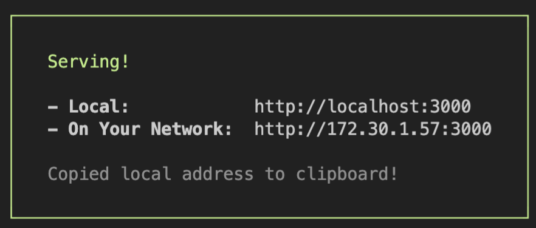
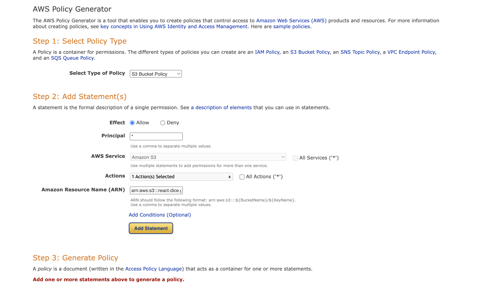

# Deploy

명령어 복습

## 프로젝트 생성하기

```
npm init react-app .
```

터미널에서 원하는 디렉토리에 들어가서 `npm init react-app .`를 입력하면 현재 디렉토리에 리액트 프로젝트를 생성합니다.

## 개발 모드 실행하기

```
npm start (npm run start)
```

터미널에서 `npm run start`를 입력하면 개발 모드 서버가 실행됩니다.

## 실행 중인 서버 종료하기

```
ctrl + c
```

서버가 실행 중인 터미널에서 `ctrl + c`를 입력하면 서버가 종료됩니다.

## 개발된 프로젝트 빌드하기

```
npm run build
```

터미널에서 `npm run build`를 입력하면 빌드를 시작합니다.

## 빌드한 것 로컬에서 실행하기

```
npx serve build
```

터미널에서 `npx serve build`를 입력하면 serve 프로그램을 다운 받고 build 폴더에서 서버가 실행됩니다.


`react`의 경우, `javascript`로 빌드시킨 다음에 웹서버를 통해 제공할 수 있게 해야한다. 

```js
npm run build 
```

이제 `build`라는 폴더가 생긴다. 

그 전에 서버가 잘 동작하는지 로컬환경에서 체크해야 한다. 

```
npx serve build
```

serve다운받고, build디렉토리를 실행해 보는 것. 같은 공유기로 무선인터넷 사용중이라면, `On Your Network` 로도 공유가 가능하다. 



**S3**

버킷만들기 - 모든 퍼블릭 엑세스 차단 해제 - 버킷만들기. 

버킷 만든 후 -> **속성 - 정적 웹사이트 호스팅**

활성화 하기. 

정책생성기 ARN의 경우는, 앞페이지에서 복사해 온 후 `/*` 를 붙이면 된다. Action은 GetObject 했음. 



이거 하면, JSON주는데 그거 복사 해서 버킷 정책 부분에 붙여넣기 하면 된다. 그 다음, build파일 안에 있는애들 싹다 끌어서 업로드 하면 된다. 그러면, 정적 웹사이트 호스팅에 이거 준다.  


이번 노트에서는 AWS S3로 배포한 사이트에 커스텀 도메인을 연결하는 방법을 배워보겠습니다.

도메인은 AWS를 통해서 구입할 수도 있고, 다른 도메인 등록 업체에서 살 수도 있는데요.

구글에서 '도메인 구매'로 검색해서 마음에 드는 업체를 골라 구입하시면 됩니다.

아직 도메인이 없는데 AWS를 통해 등록 하시려면 **1-a** 단계와 **2** 단계를 따라하시면 되고,

만약 도메인을 이미 구입하신 분들이라면, **1-b** 단계와 **2** 단계를 따라하시면 됩니다.

도메인 등록 비용과, AWS 서비스 이용료가 발생할 수 있으니 이점도 꼭 참고해주세요!

# 1-a. AWS에서 도메인 구입하기

도메인 구입은 문득 들으면 굉장히 어려워보이지만,

사실 인터넷으로 나이키 운동화를 사는 것처럼 쉽게 할 수 있습니다.

우선 AWS로 접속해서 'Route 53'을 검색해 들어갑니다.

Route 53을 사용하면 AWS로 도메인을 관리할 수 있는데요.


**도메인 > 등록된 도메인** 메뉴로 들어가면 위와 같은 화면이 나옵니다.

여기서 **도메인 등록** 버튼을 클릭합니다.


도메인 이름 선택 화면이 나오는데요.

위 예시에서는 'codeit'이라는 도메인을 검색해봤습니다.


위 예시는 [react.pizza](http://react.pizza/) 라는 도메인을 구입하는 장면입니다.

연락처 세부 정보에서 연락처를 입력하고, 안내에 따라 구매를 완료하시면 됩니다.

여기서 자세한 설명은 생략하도록 하겠습니다.


도메인을 구입하고나서 Route 53에 있는 **호스팅 영역** 메뉴로 들어가보면,

이렇게 아까 구입한 도메인이 호스팅 영역이란 걸로 생성됐을 겁니다.

Route 53에서는 호스팅 영역을 단위로 도메인을 관리하는데요.

여기서 도메인 이름을 클릭해보죠.


AWS에서 알아서 설정해놓은 값들이 잘 보이네요!

# 1-b. 다른 사이트에서 도메인을 구입한 경우

만약 다른 사이트에서 구입한 도메인을 AWS에서 관리하려면 몇 가지 설정이 필요합니다.

이번 레슨에서는 AWS를 통해서 타사 도메인을 관리하는 설정을 해 볼 겁니다.

우선 AWS로 접속해서 'Route 53'을 검색해 들어갑니다.

Route 53이란 걸 사용하면 AWS로 도메인을 관리할 수 있습니다.


**호스팅 영역** 메뉴로 들어가면 위와 같은 화면이 나옵니다.

Route 53에서는 호스팅 영역을 단위로 도메인을 관리하는데요,

**호스팅 영역 생성** 버튼을 클릭해 도메인을 위한 호스팅 영역을 만들어 보겠습니다.


위 예시에서 저는 [react.pizza](http://react.pizza/) 라는 도메인을 관리하는 호스팅 영역을 만들고 있습니다.

도메인 이름은 다른 사이트에서 구입한 도메인명을 적고,

아래의 **호스팅 영역 생성** 버튼을 눌러서 생성합니다.


그럼 이렇게 호스팅 영역이 만들어지고, 기본 값들이 설정된게 보이죠?

여기서 레코드는 도메인을 서비스할 때 참고할 정보들인데요,

여기서 **유형이 NS인 네임서버 레코드**에 주목해주세요.

그리고 도메인을 구입하신 사이트에 들어가서, '**네임서버 설정**'을 해주어야 합니다.


제가 이용하는 사이트에서는 이렇게 도메인 관리 페이지로 들어가면

**커스텀 네임서버**를 설정할 수가 있었는데요.

AWS 호스팅 영역에서 기본 값으로 생성된 레코드 중에서

**NS 유형**에 해당하는 **값/트래픽 라우팅 대상**의 값을 복사해서

커스텀 네임서버로 등록해줍니다.

자. 그럼 네임서버 설정이 잘됐는지 확인해볼까요?

[https://dnschecker.org](https://dnschecker.org/) 라는 사이트로 들어가서 확인해볼게요.


레코드 유형으로 **NS** 를 선택하고, 설정한 도메인 이름을 검색했습니다.

초록색 체크 표시랑 함께 아까 설정한 NS 레코드 값들이 잘 보이네요.

네임 서버 설정은 서비스마다 다르지만 **길면 하루 이틀 정도** 걸릴 수 있으니까,

이점도 참고해주세요.

# 2. A 레코드 등록하기

이제 Route 53의 호스팅 영역에 A 레코드를 등록해볼 겁니다.

A 레코드는 웹 브라우저가 [react.pizza](http://react.pizza/) 라는 도메인 주소로 들어왔을 때,

어떤 주소의 서버가 응답해 줄지 지정해주는 용도로 씁니다.

우리의 경우에는 도메인 주소로 들어오면, AWS S3 버킷의 웹 사이트 엔드포인트가 응답해주면 되겠죠.


앞에서 만든 호스팅 영역에서 **레코드 생성** 버튼을 클릭합니다.


위 예시에서 저는 레코드 이름을 dicegame이라고 했는데요,

[dicegame.react.pizza](http://dicegame.react.pizza/) 를 사용하려고 이렇게 만들었습니다.

이런 식으로 도메인 앞에 뭐가 더 붙은 서브 도메인으로 만드셔도 좋고,

레코드 이름을 그냥 비워두면 [react.pizza](http://react.pizza/) 처럼 최상위 주소로 A 레코드를 생성할 수 있습니다.

레코드 유형은 A로 선택할게요.

그리고 트래픽 라우팅 대상에서 별칭을 켜줍니다.

별칭은 AWS에서 제공하는 기능인데요.

우리가 만들어 놓은 S3 버킷의 엔드포인트(주소)를 직접 입력하지 않아도 되고,

AWS 안에서 별명처럼 쓸 수 있게 해줍니다.

위 예시에서 저는 처음에 버킷을 만들 때

아시아 태평양(서울)에다가 `dicegame.react.pizza` 라는 이름으로 버킷을 만들었습니다.

만약에 [react.pizza](http://react.pizza/) 라는 주소로 만들고 싶다면

**버킷 이름도 반드시 `react.pizza` 로 해줘야 한다는 것에 주의하세요.**

모두 설정하고 **레코드 생성** 버튼을 클릭하면,


호스팅 영역에 A 레코드가 생겼습니다.

실제로 잘 적용됐는지 한번 확인해볼까요?

[https://dnschecker.org](https://dnschecker.org/) 라는 사이트로 접속합니다.


여기서 A 레코드를 선택하고, 저는 아까 만든 `dicegame.react.pizza` 라는 주소를 검색했습니다.

초록색 체크 표시랑 아이피 주소가 잘 보이신다면 잘 적용된 겁니다.

그럼 이제 웹 브라우저로 접속해볼까요?


웹 브라우저에서도 잘 보입니다.
