[선택자 정리](##선택자-정리)

[CSS상속](##CSS상속)

[CSS우선순위](##CSS우선순위)

[CSS 단위](##CSS Unit)

[Display](##Display)

[Vertical Align](###vertical-align )

[세로 가운데 정렬](###세로 가운데 정렬)


## CSS Unit

CSS에는 `px`, `rem`, `em`, `%` 등 여러 단위가 있습니다. 폰트 크기 뿐만 아니라 `padding`, `margin`, `width` 등 다양한 속성들에 이 단위들을 사용할 수 있습니다.

이 단위들의 차이에 대해 알아봅시다.

- PX

  `px`는 절대적인 값입니다. 다른 요소의 값에 영향을 받지 않는다는 거죠.

  ```css
  html {
    font-size: 20px;
  }
  
  .container {
    padding-top: 40px;
    background-color: lime;
  }
  ```

- rem

  `rem` 은 상대적인 값입니다. 하지만 오직 `<html>` 태그의 `font-size`에만 영향을 받습니다.`2rem`은 `<html>` 태그의 `font-size`의 2배 크기입니다.

  ```css
  html {
    font-size: 20px;
  }
  
  .container {
    padding-top: 2rem; /* html의 font-size * 2 = 40px */
    background-color: lime;
  }
  ```

- em

  `em`도 `rem`과 마찬가지로 상대적인 값입니다. `em`은 자기 자신의 `font-size`를 기준으로 합니다.`2em`은 자기 자신의 `font-size`의 2배 크기입니다. 자기 자신의 `font-size`를 따로 정해주지 않을 경우, 상위 요소에서 상속받은 값을 기준으로 합니다.

  ```css
  html {
    font-size: 20px;
  }
  
  .container {
    /* 자동으로 html의 font-size 20px을 상속받음 */
    padding-top: 2em; /* 자신의 font-size * 2 = 40px */
    background-color: lime;
  }
  
  ```

  ```css
  html {
    font-size: 20px;
  }
  
  .container {
    font-size: 40px;
    padding-top: 2em; /* 자신의 font-size * 2 = 80px */
    background-color: lime;
  }
  
  ```

- 퍼센트 (%)

  `%` 역시 상대적인 값이겠죠? `%`는 어느 항목에서 쓰이냐에 따라 다른 기준이 적용됩니다. 예를 들어 `font-size`에서 `%`가 쓰일 경우, 상위 요소의 `font-size`에 곱해주는 방식으로 계산합니다.

  ```css
  .container {
    font-size: 20px;
    background-color: lime;
  }
  
  .text {
    font-size: 180%; /* 상위 요소인 container의 font-size * 1.8 = 36px */
    background-color: skyblue;
    margin: 0;
  }
  ```

  `%`가 `margin`이나 `padding`의 단위로 사용될 경우, 상위 요소의 `width`를 기준으로 계산됩니다.

  ```css
  .container {
    width: 200px;
    background-color: lime;
  }
  
  .text {
    padding-left: 30%; /* 상위 요소의 width * 0.3 = 60px */
  }
  ```

  재미있는 점은 `margin-top`이나 `padding-bottom` 등 세로(상하) 속성를 조절할 때에도 상위 요소의 `height`가 아닌 `width`를 기준으로 계산된다는 것입니다.

  [참고](https://webdesign.tutsplus.com/ko/tutorials/comprehensive-guide-when-to-use-em-vs-rem--cms-23984)


#### Font Size

- %로 계산할 때는, 부모 요소의 폰트 크기의 n%라는 의미. 
- 1em = 100%, 2em = 200%, 1.5em = 150%

#### text-decoration 
- underline, overline, none

#### font-weight
- 100, 200 etc. 셋팅 안된 숫자를 사용하면 기본 weight로 


#### line-height
- 
  파란 줄 사이가 실제 내용이 들어가 있는 'content area'(콘텐츠 영역)입니다.  `font-family`와 `font-size`에 따라서 'content area'가 정해지고, `line-height`는 'content area'에 영향을 주지 않습니다.

  `line-height`를 통해서는 각 줄이 실질적으로 차지하는 공간을 정해줄 수 있습니다. 예를 들어서 `99px`로 설정하면 'content area'보다 `40px`이 많기 때문에 위 아래로 `20px`의 공간이 추가로 생깁니다.

  반대로 `40px`로 설정하면 'content area'보다 `19px`이 적기 때문에 위 아래로 `-9.5px`의 공간이 줄어듭니다.

​	

## Box model 


-  padding

  - 한줄에

    ```css
    p {
      padding: 위 오른쪽 아래 왼쪽;
    }
    ```

  - 위, 아래, 왼쪽, 오른쪽이 다 같은 경우

    ```css
    p {
      border: 1px solid blue;
      padding: 50px;
    }
    ```

  - 위, 아래가 같고, 왼쪽 오른쪽이 같은 경우 

    ```css
    p {
      border: 1px solid blue;
      padding: 50px 100px;
    }
    ```

    

  


- 가운데 정렬 

  요소를 가운데 정렬하고 싶으면 왼쪽과 오른쪽 `margin` 값을 `auto`로 설정해줘야 합니다. `auto`는 말 그대로 '자동으로 계산'하라는 뜻인데요. 왼쪽과 오른쪽을 `auto`로 설정하면 자동으로 왼쪽과 오른쪽을 똑같이 함으로써 요소는 가운데 정렬이 됩니다.

  ```        css
  margin-left: auto; 
  margin-right: auto; 
  
  or 
  margin: 0 auto; 
  ```


- `min-width`, `max-width`, `min-height`, `max-height`

  내부, 화면에 맞게 늘어나지만 최대/최소를 주는 것. 

  적어도 n width여야 한다는 뜻. 

  최대 500px라는 뜻. 


- 요소를 가운데 정렬하고 싶으면 왼쪽과 오른쪽 `margin` 값을 `auto`로 설정해줘야 합니다. `auto`는 말 그대로 '자동으로 계산'하라는 뜻인데요. 왼쪽과 오른쪽을 `auto`로 설정하면 자동으로 왼쪽과 오른쪽을 똑같이 함으로써 요소는 가운데 정렬이 됩니다.


- overflow

  `width`, `height`, `max-width`, `max-height` 등을 설정하다 보면 내용물이 들어갈 공간이 부족한 경우가 있습니다.

  

  1. `visible`

     `visible` 값을 사용하면 넘쳐나는 내용물이 그대로 보입니다. 따로 설정해주지 않으면 이게 기본값입니다!

  2. `hidden`

     `hidden` 값을 사용하면 넘쳐나는 부분을 아예 숨겨줄 수도 있습니다.

  3. `scroll`

     내용물을 숨겼다가, 사용자가 스크롤을 하면 볼 수 있게 해주는 방법도 있습니다!

  4. `auto`

     `scroll`과 거의 똑같은데, 한 가지 차이점이 있습니다. `scroll`은 **항상** 스크롤바를 보여주고, `auto`는 **내용물이 넘쳐날 때만** 스크롤바를 보여줍니다.

     > 참고로 Mac OS에서는 스크롤을 할 때만 스크롤바를 보여주는 경향이 있기 때문에 `scroll`과 `auto`의 차이를 보기 힘들 수도 있습니다.


- `border`

  1. 한 줄에 끝내기

     가장 일반적인 방법은 `border` 속성으로 한 줄에 다 쓰는 것입니다. 이 방식을 사용하면 위, 아래, 왼쪽, 오른쪽 모두 같은 테두리가 생깁니다. 값을 쓰는 순서는 굵기, 스타일(실선, 점선 등), 색입니다.

     ```css
     .p1 {
       border: 2px solid #4d9fff;
     }
     ```

  2. 명확하게 나누기

     다른 방법은 `border-style`, `border-color`, `border-width` 속성을 써서 테두리의 스타일을 하나씩 지정해주는 것입니다.

     ```css
     .p1 {
       border-style: dotted;
       border-color: red;
       border-width: 5px;
     }
     ```

  3. 다채로운 테두리 

     ```css
     .p1 {
       border-top: 3px dotted #4d9fff;
       border-bottom: 2px dashed red;
       border-left: 5px solid green;
     }
     ```

  4. 테두리 없애기

     어떤 요소들(예: `<input>` 태그)은 기본적으로 테두리가 설정되어 있습니다. 이런 요소들의 테두리를 없애고 싶으면 직접 `border` 속성을 설정해주면 되는데요. 두 가지 방법이 있습니다:

     1. `border: none;`
     2. `border: 0;`

     

- 박스 꾸미는 몇가지 방법

  1. `border-radius`라는 속성을 사용하면 요소의 모서리를 둥글게 만들 수 있습니다. 더 큰 값을 쓰면 더 둥글게 되는 거죠!

     ```css
     
     .div2 {
       border: 1px solid green;
       border-radius: 30px;
     }
     
     ```

     ```css
     h1 {
       border: 1px solid green;
       border-top-left-radius: 50px; /* 왼쪽 위 */
       border-top-right-radius: 5px; /* 오른쪽 위 */
       border-bottom-right-radius: 0px; /* 오른쪽 아래 */
       border-bottom-left-radius: 20px; /* 왼쪽 아래 */
     }
     ```

  2. 그림자 `box-shadow`

     요소에 그림자를 주기 위해서는 `box-shadow` 속성을 사용하면 되는데요. 기본값은 `none`입니다. 그림자가 없다는 뜻이죠.

     ```css
     .div1 {
       background-color: #eeeeee;
       width: 400px;
       height: 300px;
       box-shadow: none;
     }
     ```

     **그림자 추가**

     - 위치 설정

       그림자의 위치만 설정해주면 그림자가 나타납니다. 가로 위치와 세로 위치를 설정해줍시다.

       ```css
       .div1 {
         background-color: #eeeeee;
         width: 400px;
         height: 300px;
         box-shadow: 40px 10px;
       }
       ```

     - 그림자 색 설정

       따로 설정해주지 않으면 그림자는 검정색입니다. 만약 다른 색으로 바꾸고 싶으면 `box-shadow`속성에 추가로 색을 써주면 됩니다.

       ```css
       .div1 {
         background-color: #eeeeee;
         width: 400px;
         height: 300px;
         box-shadow: 40px 10px #4d9fff;
       }
       ```

     - 흐림 정도(blur)

       `box-shadow` 속성에서 그림자가 얼마나 흐리게 나올지 설정해줄 수 있습니다. 가로, 세로 위치 뒤에 추가해주면 되는데요. 기본값은 `0px`입니다.

       ```css
       .div1 {
         background-color: #eeeeee;
         width: 400px;
         height: 300px;
         box-shadow: 40px 10px 10px #4d9fff;
       }
       ```

     - 그림자 크기(Spread)

       그림자가 얼마나 퍼질지도 설정할 수 있습니다. 흐림 값 이후에 써주면 됩니다.

       ```css
       .div1 {
         background-color: #eeeeee;
         width: 400px;
         height: 300px;
         box-shadow: 40px 10px 10px 20px #4d9fff;
       }
       ```

       

  3. 배경색 `background-color``

     `background-color` 속성을 사용하면 배경색을 설정할 수 있습니다. 폰트 색을 설정할 때처럼 색 이름, RGB 코드, HEX 코드 중 하나를 입력하면 됩니다.

     ```css
     h1 {
       background-color: #4d9fff;
     }
     ```

     페이지 전체의 배경색을 설정하고 싶으면 `body` 태그에 `background-color` 속성을 입혀주면 됩니다.  

     그리고 배경색을 투명하게 두고 싶으면 `transparent` 값으로 설정해주면 되는데, 따로 설정을 해주지 않으면 `transparent`가 기본값으로 설정됩니다!

     ```css
     body {
       background-color: #4d9fff;
     }
     
     h1 {
       background-color: white;
     }
     
     h2 {
       background-color: transparent
     }
     ```

  

- Box-sizing

  ```css
  width : 300px; 
  height: 200px; 
  padding : 35px; 
  border: 5px solid red; 
  ```

  나는 사실 총 width를 300px으로 만들고 싶었던 건데, 실제로 이걸 해보면 가로길이는 300+35+35+5+5 이렇게 해서 380이 되버림. 이런 경우, 

  `box-sizing: border-box;` 를 하면, 다 해서 width 300으로 맞춰줌. 

  기본 값은 content-box라서 이거는 width, border, padding, margin을 다 합쳐서 계산해야돼. 그래서 요즘은 그냥 모든 요소에 다 이거 추가해놓고 시작하는 추세

  ```css
  *{
  	box-sizing: border-box; 
  }
  ```

  


- 배경 이미지 

  - `background-repeat`

    `background-repeat`는 이미지를 반복시킬 것인지 아닐 것인지, 그리고 반복시킨다면 어떤 방식으로 반복시킬 것인지 정해주는 속성입니다. 여기에는 우리가 배운 `repeat`, `no-repeat` 외에도 다양한 옵션이 있습니다.

    ```css
    /* 반복하지 않음 */
    background-repeat: no-repeat;
    
    /* 가로 방향으로만 반복 */
    background-repeat: repeat-x;
    
    /* 세로 방향으로만 반복 */
    background-repeat: repeat-y;
    
    /* 가로와 세로 모두 반복 */
    background-repeat: repeat;
    
    /* 반복할 수 있는 만큼 반복한 뒤, 남는 공간은 이미지 간의 여백으로 배분 */
    background-repeat: space;
    
    /* 반복할 수 있는 만큼 반복한 뒤, 남는 공간은 이미지 확대를 통해 배분 */
    background-repeat: round;
    ```

  - `background-size`

    `background-size`는 배경 이미지의 사이즈를 정해주는 속성입니다.

    ```css
    /* 원래 이미지 사이즈대로 출력 */
    background-size: auto;
    
    /* 화면을 꽉 채우면서, 사진 비율을 유지 */
    background-size: cover;
    
    /* 가로, 세로 중 먼저 채워지는 쪽에 맞추어서 출력 */
    background-size: contain;
    
    /* 픽셀값 지정 (가로: 30px, 세로: 50px로 설정) */
    background-size: 30px 50px;
    
    /* 퍼센트값 지정 (가로: 부모 요소 width의 60%, 세로: 부모 요소 height의 70%로 설정) */
    background-size: 60% 70%;
    ```

  - `background-position`

    ```css
    /* 단어로 지정해주기 (가로: left, center, right, 세로: top, center, bottom) */
    /* 아래와 같은 총 9개의 조합이 가능 */
    background-position: left top;
    background-position: left center;
    background-position: left bottom;
    background-position: right top;
    background-position: right center;
    background-position: right bottom;
    background-position: center top;
    background-position: center center;
    background-position: center bottom;
    
    /* 퍼센트로 지정해주기 (가로: 전체 width의 25% 지점, 세로: 전체 height의 75% 지점 ) */
    background-position: 25% 75%;
    
    /* 픽셀로 지정하기 (가로: 가장 왼쪽 가장자리에서부터 오른쪽으로 100px 이동한 지점, 세로: 가장 상단 가장자리에서 아래로 200px 이동한 지점) */
    background-position: 100px 200px;
    ```


## 선택자-정리

- `Class`/ `Id`

  ```css
  /* 'important'라는 클래스를 갖고 있는 모든 태그 */
  .important {
    color: orange;
  }
  
  /* 'favorite'라는 아이디를 갖고 있는 태그 */
  #favorite {
    color: blue;
  }
  ```

- Children

  ```css
  /* 'div1' 클래스를 갖고 있는 요소의 자식 중 모든 <i> 태그 */
  .div1 i {
    color: orange;
  }
  ```

- Direct children

  ```css
  /* 'div1' 클래스를 갖고 있는 요소의 직속 자식 중 모든 <i> 태그 */
  .div1 > i {
    color: orange;
  }
  ```

- 복수 선택

  ```css
  /* 'two' 클래스를 가지고 있는 태그 모두와 'four' 클래스를 가지고 있는 태그 모두 선택 */
  .two, .four {
    color: orange;
  }
  ```

- 여러 조건

  ```css
  /* 'outside' 클래스를 갖고 있으면서 'one' 클래스도 갖고 있는 태그 */
  .outside.one {
    color: blue;
  }
  
  /* 'inside' 클래스를 갖고 있으면서 'two' 클래스도 갖고 있는 태그 */
  .inside.two {
    color: orange;
  }
  ```

- Pseudo-class (가상 클래스)

  ```css
  /* .div1의 자식인 <p> 태그 중 3번째 */
  .div1 p:nth-child(3) {
    color: blue;
  }
  
  /* .div1의 자식인 <p> 태그 중 첫 번째 */
  .div1 p:first-child {
    color: red;
  }
  
  /* .div1의 자식인 <p> 태그 중 마지막 */
  .div1 p:last-child {
    color: green;
  }
  
  /* .div1의 자식 중 마지막 자식이 아닌 <p> 태그 */
  .div1 p:not(:last-child) {
    font-size: 150%;
  }
  
  /* .div1의 자식 중 첫 번째 자식이 아닌 <p> 태그 */
  .div1 p:not(:first-child) {
    text-decoration: line-through;
  }
  ```

  

- 마우스 오버(Hover)

  ```css
  h1 {
    color: orange;
  }
  
  /* 마우스가 <h1> 태그에 올라갔을 때 */
  h1:hover {
    color: green;
  }
  ```

  

## CSS상속

- ```css
  <div class="div1">
    <h1>Heading 1</h1>
    <p>Paragraph bla bla bla</p>
  </div>
  ```

  `div1`의 font색을` blue`로 설정하면, 아래 `h1`과 `p`도 파란색 글자가 됨. 

  - 상속되는 속성들

    ```html
    color
    font-family
    font-size
    font-weight
    line-height
    list-style
    text-align
    visibility
    ```

    위에 있는 속성들도 항상 상속되는 건 아닙니다. 대표적인 예로 `<a>` 태그에는 `color` 속성이 상속되지 않습니다. `<a>` 태그가 억지로 상속을 받아오기 위해서는 해당 속성에 `inherit` 값을 쓰면 됩니다!

    ````css
    .div1 {
      color: green;
    }
    
    .div2 {
      color: orange;
    }
    
    .div2 a {
      color: inherit;
    }
    ````

## CSS우선순위

- 순서

  - 우선 가장 간단한 겁니다. 완전 똑같은 선택자가 나중에 또 나오면, 이전에 나온 스타일을 덮어쓰게 됩니다.

    ```css
    h1 {
      color: blue;
      text-align: center;
    }
    
    h1 {
      color: green;
    }
    ```

    

- 명시도 (Specificity)

  - 같은 요소를 가리키지만 선택자가 다르다면, '명시도(specificity)'에 따라 우선 순위가 결정됩니다.

    **명시도 계산기**

    명시도 계산 방법을 알려드리겠습니다.

    1. 인라인 스타일이 가장 우선 순위가 높습니다.
    2. 선택자에 **id**가 많을 수록 우선 순위가 높습니다.
    3. 선택자에 **class, attribute, pseudo-class**가 많을 수록 우선 순위가 높습니다.
    4. 그 다음은 그냥 요소(또는 가상 요소)가 많은 순서입니다.

    `<ul>` 태그 안에 `<li>` 태그 안에 `<a id="link">`가 있다고 가정해봅시다. `<ul>`과 `<li>`는 나중에 배울 '리스트' 태그입니다.

    

    

    첫 번째 경우에는 일반 요소가 세 개, 가상 클래스가 한 개 있어서 '명시도 점수'가 **13**입니다. 두 번째 경우에는 일반 요소가 두 개, 가상 클래스가 한 개, 그리고 id가 한 개 있어서 **112**점입니다.

    따라서 두 선택자에서 겹치는 스타일이 있는 경우, 두 번째 경우인 `ul li:first-child #link` 선택자의 스타일이 적용되는 거죠!

    ```html
    <ul>
      <li><a id="link" href="#">Link 1</a></li>
      <li><a id="link" href="#">Link 1</a></li>
      <li><a id="link" href="#">Link 1</a></li>
      <li><a id="link" href="#">Link 1</a></li>
    </ul>
    ```

    ```css
    ul li:first-child #link {
      color: green;
    }
    
    ul li:first-child a {
      color: orange;
    }
    ```

    


## Display

- display의 종류

  모든 요소는 기본적으로 정해진 display 값이 있는데요. CSS를 통해서 이를 바꿀 수 있습니다!

  ```css
  i {
    display: block; /* <i> 태그를 block으로 바꾸기 */
    background-color: green;
  }
  ```

  모든 요소는 딱 한 개의 display 값을 갖고 있습니다. 가질 수 있는 display의 종류는

  - **`inline`** : inline은 width, height를 설정할 수 없다. 그런 개념이 없고, 내부 내용물에 따라서 정해지는 것. 

    inline 요소들은 다른 요소들과 같은 줄에 머무르려고 하는 성향과, 필요한 만큼의 가로 길이만 차지하는 성향이 있습니다.

    다음 요소들은 기본 `display` 값이 `inline`입니다.

    1. `<span>`
    2. `<a>`
    3. `<b>`
    4. `<i>`
    5. ``
    6. `<button>`

  - **`block`** : block은 항상 100%를 차지하는 것은 아니고, 따로 설정이 가능하다. 

    block 요소들은 다른 요소들과 독단적인 줄에 가려고 하는 성향과, 최대한 많은 가로 길이를 차지하는 성향이 있습니다.

    다음 요소들은 기본 `display` 값이 `block`입니다.

    1. `<div>`
    2. `<h1>`, `<h2>`, `<h3>`, `<h4>`, `<h5>`, `<h6>`
    3. `<p>`
    4. `<nav>`
    5. `<ul>`
    6. `<li>`

  - `inline-block`: **inline처럼, 같은 줄에 머물면서 가로-세로 길이를 지정할 수는 없을까?** 그게 이 방법. 

    Block 요소에게는 가로 길이와 세로 길이를 직접 설정해줄 수 있지만, inline 요소는 자동으로 설정이 됩니다. Inline 요소에게는 가로, 세로 길이의 개념이 딱히 없는 셈이죠.

    만약 inline 요소처럼 다른 요소들과 같은 줄에 머무르면서 block 요소처럼 가로, 세로 길이도 설정해주고 싶으면 어떻게 해야 할까요? 바로 그 둘을 섞어놓은 `inline-block`을 사용하면 됩니다!

    ```css
    i {
      display: inline-block;
      width: 200px;
      height: 200px;
      background-color: green;
    }
    ```

    inline, inline-block은 텍스트처럼 다룰 수 있음. 엄청 큰 글자라고 생각하고 스타일링이 가능함. ex) `text-align`

    

  - `flex`

  - `list-item`

  - `none`

  등 여러 가지가 있는데, 대부분의 요소들은 `inline`과 `block` 중 한 가지입니다.

  


### 다양한 링크

- a태그로 바꾸면 됨. 


## Baseline 

- 기본적으로 텍스트는 baseline에 맞춰져 있다. 

  

​		텍스트의 베이스라인끼리 맞춰져 있다. 

​		이미지는 밑부분이 베이스라인 이라서, 그 두 베이스라인이 맞춰져 있다. 

​		아래 경우를 보자.  **Inline block**인데, 그 가장 **마지막 요소**의 베이스라인과 **alex**의 베이스라인이 맞춰져 있는 상태. 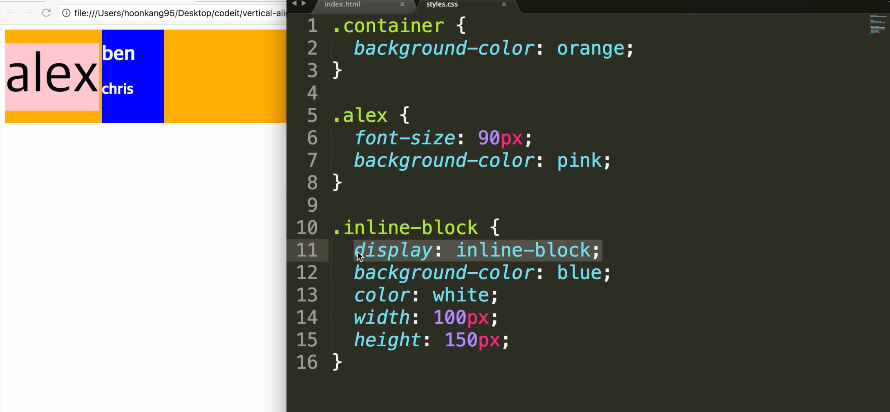

예외도 있음. 

1. 위 html에서 중간에 글씨 h1, h2를 지웠음. 그러니깐, inline block의 맨 밑이 baseline으로 설정된다. 거기와 alex의 베이스라인이 맞춰진 것. 

   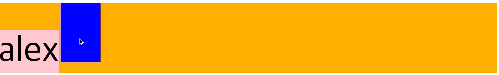

2. 이번에는 inline block의 세로 길이를 작게 줄였음. 박스는 작아졌지만, alex와 chris가 맞춰짐. 

   

   그런데, 이 ben, chris박스를 `Overflow:scroll` 해놓으면? hidden인 경우도 마찬가지로, 박스의 하단이 베이스라인으로 설정된다. 

   


### vertical-align : 부모요소의 x의 가운데에 맞춰진다. 

-  아래 세가지 각각 서로 다른 span에 들어 있고, 제각각 마음대로 배치되어있는 것처럼 보임. 그러나, 각 베이스라인이 맞춰져 있는 것. 이게 바로, `vertical-align`속성이 `baseline`으로 기본값으로 맞춰져 있기 때문. 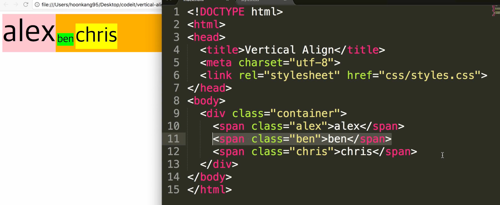

- 특정 엘리먼트의 vertical-align을 top으로 하면, 해당 요소의 가장 윗부분이 형제들 중 제일 높은 쪽으로 맞춰짐.  

  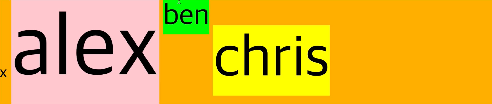

- alex에 `vertical-align : top`으로 하면? 

  alex박스의 윗부분이 알렉스 제외한 가장 높은 요소의 탑에 맞춰지는 것. 현재 알렉스 제외하고, 가장 높은 애는 Chris.  

  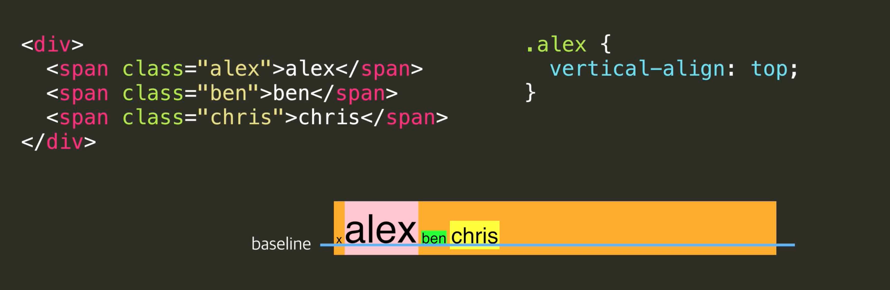

  그 두개를 맞추려다 보니, chris의 윗부분이 올라와서 alex의 위가 됨. 

  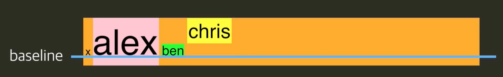

  근데 현재, x, ben, chris는 `vertical align`을 설정해주지 않았음. 

  그래서, x와 ben은 chris의 baseline에 맞추기 위해서 위로 같이 올라옴. 

  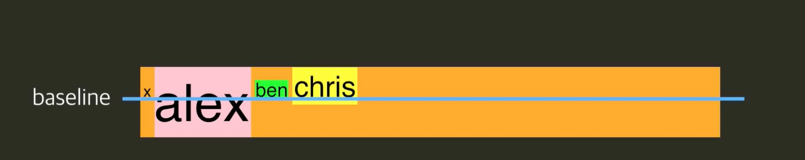

  근데 직관적으로, 알렉스의 위가 크리스의 베이스라인이랑 맞춰지려면, alex가 내려와도 되잖아. 근데 그러면, 세로의 길이가 늘어나버림. 

  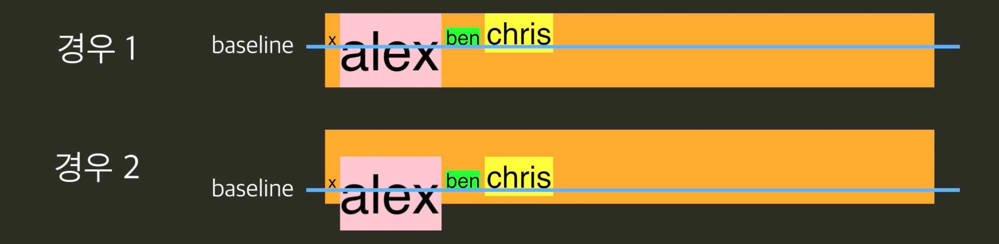

  즉, 베이스라인은 

  **`baseline은 vertical-align의 조건들을 충족시키면서 줄의 높이를 최소화시키는 곳에 위치한다.`**


- 이번에는 ben한테, `vertical-align: middle`을 했음. 정말 ben이 아주 살짝 밑으로 내려간 상태가 되었음. 

  부모테그의 가운데와, ben의 가운데가 맞춰진 것. 

  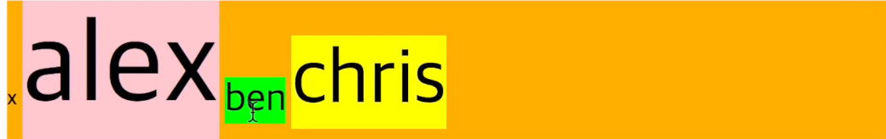

  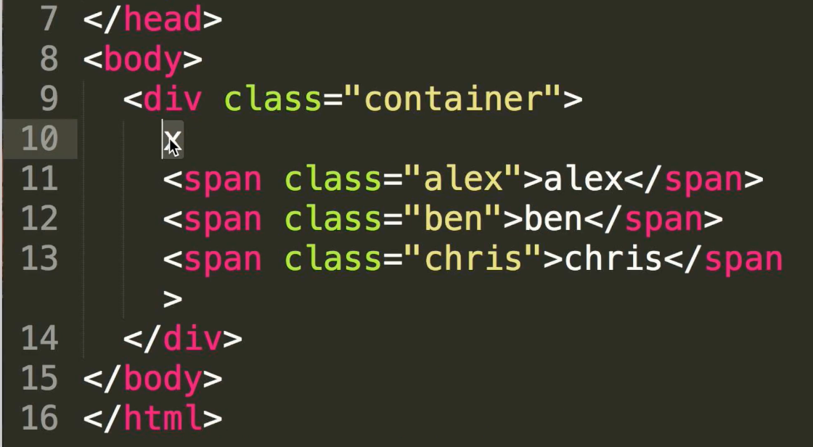

  Chris에 vertical-align : middle 해도 마찬가지. Alex는 따로 설정을 안했기때문에, 부모테그의 x와  baseline이 맞춰져 있는 것. 

  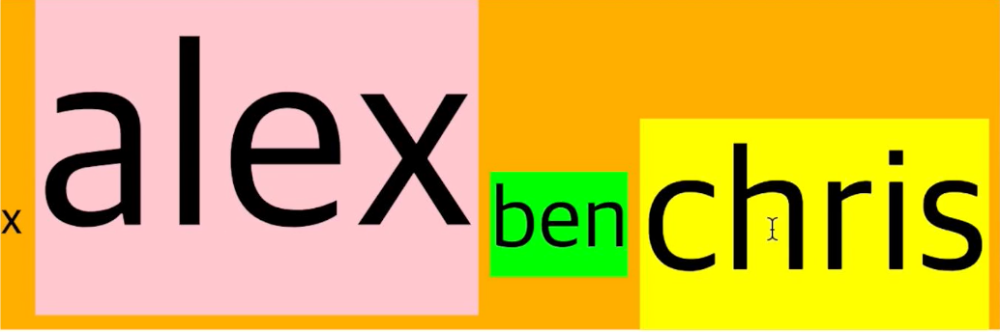

  Alex에도 `vertical-align : middle` 먹였더니, 이제 x를 기준으로 다 가운데로 맞춰짐. 위에서, 맞추려다보니, height 늘어났던 것도 줄어듬. 

  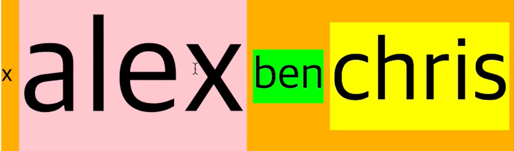


### 세로 가운데 정렬

**가로 가운데 정렬**

세로 가운데 정렬을 알아보기 전에, 간단하게 가로 가운데 정렬을 알아봅시다.   어떤 요소를 가로로 가운데 정렬하려면 어떻게 해야 할까요? 간단합니다.

**inline 요소**

`inline` 또는 `inline-block` 요소면 부모 태그에 `text-align: center;`를 써주면 됩니다.

**block 요소**

`block` 요소면 `margin-left: auto;`, `margin-right: auto;`를 써주면 되죠?


**세로 가운데 정렬**

그렇다면 세로로 가운데 정렬하려면 어떻게 해야 할까요? 저도 이것 때문에 짜증난 적이 많은데요! 사실 CSS에서 모든 걸 한 번에 딱 가운데 정렬을 시키는 방법이 없기 때문에, 저희가 지금까지 배운 다양한 지식을 섞어서 해야 합니다.

몇 가지 방법을 봅시다.

**가짜 요소 더하기**

`vertical-align: middle;`을 하면 해결될까요? 우선 `vertical-align` 속성은 인라인 또는 인라인 블록 요소에 적용되기 때문에 `.info`를 인라인 블록으로 바꾸겠습니다. 그리고 `vertical-align: middle;`을 설정해주면...?

```css
// HTML

<div class="container">
  x
  <div class="info">
    <h1>Hello!</h1>
    <p>My name is young.</p>
  </div>
</div>


// CSS
.container {
  width: 300px;
  height: 400px;
  background-color: gray;
  text-align: center;
}

.info {
  background-color: lime;
  display: inline-block;
  vertical-align: middle;
}
```

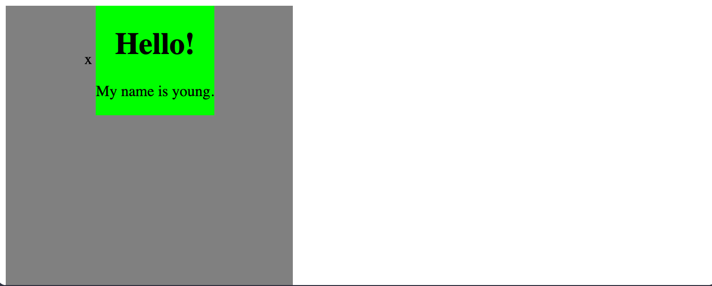

`.info` 요소를 완전 가운데로 오게 하려면 우선 소문자 'x'가 가운데로 와야 합니다. 방법이 하나 있습니다. 세로 길이가 `100%`인 요소를 만들고, 그 요소에도 `vertical-align: middle;`을 하는 거죠!

```
<div class="container">
  x
  <div class="helper"></div>
  <div class="info">
    <h1>Hello!</h1>
    <p>My name is young.</p>
  </div>
</div>


.container {
  width: 300px;
  height: 400px;
  background-color: gray;
  text-align: center;
}

.helper {
  display: inline-block;
  height: 100%;
  vertical-align: middle;
  
  /* 설명을 위해서 */
  width: 10px;
  background-color: red;
}

.info {
  background-color: lime;
  display: inline-block;
  vertical-align: middle;
}
```

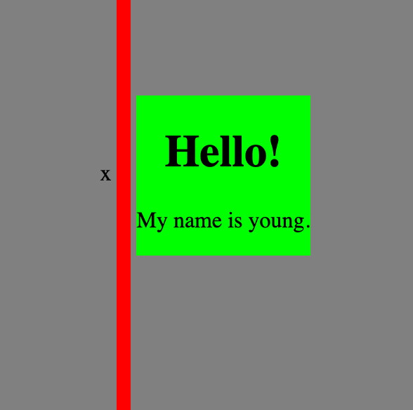

이제 거의 다 되었습니다. 여기서 소문자 'x'를 지우고, `.helper` 요소의 가로 길이를 없애면 되겠죠?

```
<div class="container">
  <div class="helper"></div>
  <div class="info">
    <h1>Hello!</h1>
    <p>My name is young.</p>
  </div>
</div>


.container {
  width: 300px;
  height: 400px;
  background-color: gray;
  text-align: center;
}

.helper {
  display: inline-block;
  height: 100%;
  vertical-align: middle;
}

.info {
  background-color: lime;
  display: inline-block;
  vertical-align: middle;
}
```

근데 아직도 문제가 조금 있습니다. `.info`의 가로 길이가 `100%`라면 어떻게 되는지 봅시다.

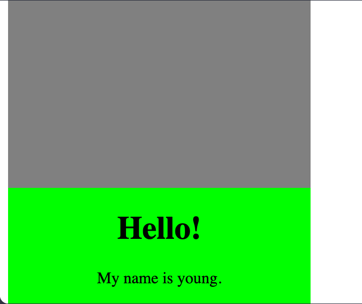

갑자기 이상한 곳에 위치되네요. 사실 `.helper` 와 `.info` 요소 사이에 띄어쓰기가 한 칸 있어서, 가로 길이 `100%`인 `.info` 요소는 자리 부족으로 다음 줄로 가버립니다!

이 문제를 해결하기 위해서는 두 가지 방법이 있습니다.

우선 **띄어쓰기를 없애는 방법:**

```
<div class="container">
  <!-- 스페이스 없애기 -->
  <div class="helper"></div><div class="info">
    <h1>Hello!</h1>
    <p>My name is young.</p>
  </div>
</div>

```

**띄어쓰기 공간 만큼의 마이너스 여백을 주는 방법:**

```css
.info {
  background-color: lime;
  display: inline-block;
  vertical-align: middle;
  width: 100%;

  /* 이 경우 띄어쓰기는 5~7px 정도였습니다! */
  margin-left: -7px;
}
```

**주의 사항:**

어떤 요소에 `height: 100%;`를 설정하기 위해서는 부모의 `height`가 설정되어 있어야 합니다. 위 경우에는 `.helper`의 부모인 `.container`에 `height`가 설정되어 있었기 때문에 가능했던 것이죠.

**`line-height`로 해결**

`.info`를 인라인 블록으로 설정해주면, `line-height` 속성을 활용해볼 수도 있습니다. 부모인 `.container`에 `height`와 동일한 `line-height`를 줘보세요.

`line-height` 속성은 자식들에게 상속되기 때문에 `.info`에는 `line-height: normal;`을 꼭 써주셔야 합니다!

```css
.container {
  width: 300px;
  height: 400px;
  background-color: gray;
  text-align: center;
  line-height: 400px;
}

.info {
  background-color: lime;
  display: inline-block;
  line-height: normal;
  vertical-align: middle;
}
```

**다른 방식?**

위의 방법들 말고도 세로 가운데 정렬을 하는 다양한 방식들이 있습니다. 포지셔닝을 이용할 수도 있고, 최근에 나온 [flexbox](https://www.w3schools.com/css/css3_flexbox.asp)를 이용할 수도 있습니다. 위의 방식으로는 해결되지 않는 상황들도 있을 수 있기 때문에, 다양한 방식들을 연구하는 걸 추천드립니다!